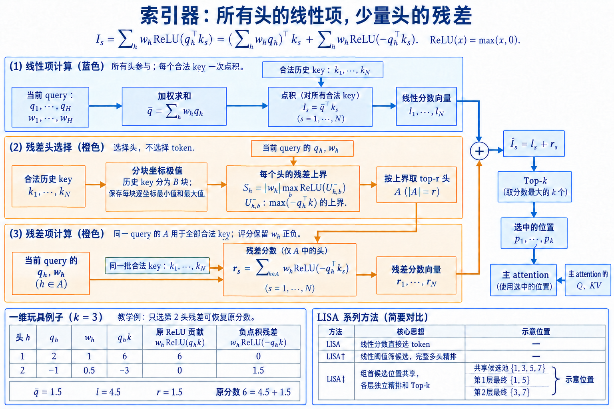

# MISA、LISA 与 ResMiSA：当索引器成为新瓶颈

DSA 把昂贵的主 attention 改成 token 级 top-k 以后，问题没有消失，只是向前移动了一步：索引器仍要为每个 query 扫描全部历史 token。上下文继续增长时，低维全扫、head 聚合和 top-k 会接过主 attention 的位置，成为新的最长路径。HISA、MISA、LISA 与 ResMiSA 都在处理这件事，但它们删掉的循环不同。

这里恰好撞上了两个同名缩写。2026 年 7 月的 **Linear-Indexed Sparse Attention** 把线性 attention 状态与 indexer 引导的 softmax sparse attention 并联，下面记作「并联 LISA」；MISA-2/ResMiSA 所比较的 **Linear Indexer Sparse Attention** 则利用共享 indexer key，把多个 ReLU heads 的公共线性项合成一次点积，下面记作「索引器 LISA」。前者增加一条长程状态通道，后者只改候选分数的计算方式，二者不能混成同一个算法。

先固定 DSA 分数。设 $H_I$ 个 indexer heads 共享历史 key $k_s^I$，当前 query 产生 $q_{t,h}^I$ 与权重 $w_{t,h}$：

$$
I_{t,s}=\sum_{h=1}^{H_I} w_{t,h}\operatorname{ReLU}((q_{t,h}^I)^\top k_s^I).
$$

历史长度为 $N$ 时，每个 query 要做 $NH_I$ 次低维点积。主 Sparse MLA 只读取 $k$ 个位置，索引器却仍然扫描 $N$ 个位置；这就是后续工作的共同起点。

## 2. 减少索引扫描的几条路线

### 2.1. HISA、MISA 与并联 LISA 改了哪一段

HISA: 先筛块, 再按原式精排 token。
HISA 将 DSA 的平坦全量扫描改为两阶段层次搜索. 历史 $K^I$ 先按块聚合成代表, query 对块代表打分并保留少量候选块; 随后只在这些块内部计算原 DSA indexer 上式, 最终仍输出 token 级 top-k. Sparse MLA 接口和候选数不变, 因而 HISA 是 indexer 的免训练替换.

设块大小为 $b$, 块数 $N=\lceil n/b\rceil$, 粗选保留 $r$ 个块. 平坦 DSA 每个 query 打分 $n$ 个 token; HISA 粗筛约比较 $N$ 个代表, 精排约比较 $rb$ 个 token. 忽略 head 维, 成本从 $O(n)$ 变成 $O(n/b+rb)$. $b$ 太小会让粗筛接近全量, 太大则每个候选块带入更多无关 token. $r$ 决定 coarse recall, 最终 top-k 无法找回被整块剪掉的 token.

HISA 的关键评测是对原 DSA 候选的集合保真. 论文报告直接替换 DeepSeek-V3.2 和 GLM-5 的 indexer, 无需微调; 摘要给出 kernel 在 32K 达到 2 倍、128K 达到 4 倍的结果, 并报告选择集合平均 IoU 超过 99%. 这证明层次筛选能高度复现 DSA selector, 并不证明 DSA 自身与稠密教师完全一致.

MISA: 少算 indexer heads。
MISA 观察到 DSA 的多个 indexer heads 最终共同产生一套候选, 对每个 query 全部激活可能冗余. 它把 $H^I$ 个 heads 视为专家池, 轻量 router 根据块池化的 indexer keys 为当前 query 选择 $h\ll H^I$ 个 active heads, 只有这些 heads 扫描 token 并贡献上式. 路由器的输入规模由少量块代表控制, 避免自己成为另一套 token 级扫描.

若原 indexer 有 $H^I=64$, 每个 query 只激活 $h=8$, token 打分主体减少到八分之一, 再加 router. MISA 官方摘要报告, 只激活 8 个 heads 时, 在 DeepSeek-V3.2 与 GLM-5 上分别以 8 倍和 4 倍更少的 indexer heads 匹配原 DSA 的 LongBench 质量, H200 上 TileLang kernel约有 3.82 倍加速. 实际加速低于 head 数缩减, 因为 router、内存和 top-k 没有同比消失.

MISA 还给出 hierarchical variant: routed pass 先保留放大的候选集, 再用原 DSA 全 indexer 对候选精排. 这相当于「稀疏 heads 粗召回 + 完整 heads 局部精排」. 它与 HISA 都采用两阶段搜索, 第一阶段削减的对象不同: MISA减少参与扫描的heads, HISA先缩小token区域.

并联 LISA: 线性状态与稀疏检索并联。
LISA 的目标不只是让 DSA indexer 更快. 它在原模型中并联线性 attention 与 indexer 引导的 sparse self-attention, 再由 gate 融合. 线性分支以 $O(n)$ 状态提供全局长程记忆, sparse 分支从全上下文选 top-$M$ token 做精确 softmax attention. 若 selector 漏掉广泛分布的小权重信息, 线性分支仍可能保留聚合信号.

训练分两阶段. 第一阶段引入线性 attention, 配合滑动窗口 sparse attention, 通过冻结教师的知识蒸馏逼近 full self-attention. 第二阶段用 indexer 替换固定窗口, 以 per-head KL 对齐教师 attention pattern. 与 DSA 先预热共享 selector 再全模稀疏适配相比, LISA 明确保留两条并行信息通道, 并把对齐细化到 head.

论文在 DeepSeek distilled Qwen 系列上报告 16K 上下文约 50% 推理加速, 推理类评测平均提升 5.6%. 这里的质量变化包含架构迁移与训练, 不能归因于 indexer 单独更准. LISA 的线性状态、sparse KV、indexer K 和 gate 都有运行状态, cache构成也比纯 DSA 更复杂.

### 2.2. 内核、共享与失效边界

跨头与跨层共享是两件事。
DSA 在一个 layer 内用多个 indexer heads 产生共享 token 集合, 这是跨头聚合. MISA 让每个 query 只激活其中少量 heads, 仍在同层完成. 跨层共享则让相邻 layers 复用 $S_t$ 或某种 indexer 表示, 省去重复扫描. 前者减少上式求和中的 head 数, 后者减少执行上式的 layer 数.

复用跨层 top-k 的风险是 attention 偏好随深度变化. 浅层可能偏局部词法, 深层偏语义实体; 同一候选集合不能保证覆盖两者. 可用教师测量相邻层候选 IoU, 按相似区间设共享组, 并在组首完整重建. 若只共享 $K^I$ 而每层保留独立 $Q^I$ 和 top-k, 省的是 key 投影/cache, 不是全扫描.

跨头和跨层共享都要写清共享对象: 参数、indexer K、query heads、分数还是整数 top-k. 共享分数仍需每层 top-k; 共享 top-k 直接跳过 selector; 共享 KV 只省存储或投影. 把这些统称「共享索引」会无法核算质量和性能.

kernel 边界从 selector 延伸到 Sparse MLA。
高效链路应尽量融合 indexer score、causal mask 与 top-k, 避免写回 $n^2$ 分数. top-k 输出随后进入 Sparse MLA kernel, 按不连续地址加载 latent KV. selector 和 attention 若完全分离, 整数索引要写回 HBM 再读入; 若融合, kernel 又要同时处理低维检索与高维 attention, 寄存器和调度更复杂.

训练路径比推理多 backward 和 score recompute. cuDNN DSA 文档列出 sparse attention backward、indexer forward/top-k、稀疏与稠密 score recompute、indexer backward 等独立操作. 这反映一个现实: 前向选择少量 token 不等于反向也自然稀疏. 对齐损失需要哪些未选分数、梯度怎样回到 $Q^I,K^I,W^I$, 都必须由训练 kernel定义.

element-wise gather 的 HBM 合并程度取决于候选排序. 按分数 top-k 返回的索引是无序或按分数排列, 按位置重排后读取更连续, 但主 softmax 不关心位置顺序. kernel 可将候选按物理页和 offset 排序, 同时保留去重与 causal 有效长度. 索引整理时间应计入 selector, 不能只计 QK 打分.

数值、量化和失效诊断。
FP8 indexer 的误差主要表现为排序变化. 对相差很大的分数, 量化不影响 top-k; 对 cutoff 附近密集分数, 微小误差会替换候选. 因此应测 top-k cutoff margin: 第 $k$ 名与第 $k+1$ 名的差越小, 选择越不稳定. MISA 的少 head 路由和 HISA 的粗筛又会叠加离散边界, 可以通过扩大第一阶段候选后精排缓解.

最危险的失败是稳定漏掉罕见关键 token. 平均 recall 和 LongBench 均分可能保持良好, 唯一约束、代码定义或多跳中间证据却持续缺席. 测试应控制证据距离、出现次数、相似干扰和所需证据数, 并记录最差 query 的概率质量覆盖. Needle 热图检查单证据位置, 不能替代多证据聚合.

性能失效则常见于短序列、top-k 过大、候选地址太散和 indexer K 带宽过高. 诊断应拆分 indexer GEMM、top-k、索引整理、Sparse MLA gather/attention 和其他层时间. 若 indexer 已成为主耗时, HISA/MISA 类改造有意义; 若 Sparse MLA gather 更慢, 再压 indexer不会改变瓶颈.

一套可复算的评测表。
算法层记录教师 top-$m$ recall、概率质量覆盖、与基线 DSA 的 IoU、cutoff margin、每 query 候选数. 执行层记录 indexer 读取字节、top-k 时间、物理 KV gather 字节、kernel 时间与峰值工作区. 任务层记录困惑度、远程检索、多证据推理、代码与目标业务. 三层必须使用相同模型权重和上下文长度.

Prefill 与 Decode 分开: Prefill 报每层整段 indexer 和 Sparse MLA 时间; Decode 报不同 cache 长度的单 token 延迟以及 batch 扩展. 量化实验同时给出 indexer K dtype、scale 粒度与 top-k 重合. 跨层共享实验注明每几层刷新、共享哪种状态, 不能只写一个总体加速.

**selector 要在固定候选预算内召回主 attention 需要的位置, 同时让后续 kernel以更少字节完成精确计算.** DSA 建立可训练基线, HISA 缩小 token 搜索域, MISA 缩小 head 搜索域, LISA 增加一条线性全局通道. 它们最终都要通过同一张质量—索引—访存表接受检验.

### 2.3. Selector 预算、数值路径与端到端验收

selector 的预算怎样分配。
固定 $k=2048$ 便于 kernel 预分配和批处理, 却隐含每个 query 需要相同预算. 实际 attention 熵随层、head 与位置变化. 一些 query 的教师分布集中在几十个 token, 另一些需要汇总许多段落. 自适应 $k_t$ 可以按教师熵、indexer cutoff margin 或累计分数质量决定, 但变长候选会让工作调度和内存规划更难.

设 indexer softmax 为 $r_{t,s}$, 可以选最小集合满足累计质量阈值 $\tau$:

$$
k_t=\min\left\{m:\sum_{s\in\operatorname{TopM}(r_{t,:},m)}r_{t,s}\ge\tau\right\}.
$$

上式在 indexer 分布校准良好时有意义. 若分布过尖, 很小 $k_t$ 也会满足阈值, 但主 attention 未必同样集中. 若分布过平, $k_t$ 会逼近上下文长度. 训练时可以校准温度, 部署时仍要限制 $k_{min}\le k_t\le k_{max}$. 固定容量 kernel通常将 $k_t$ padding 到少数档位, 而不是支持每行任意长度.

预算也可按 layer 分配. 浅层局部性强时用较小 $k$, 中层实体聚合增大, 深层再根据实测收紧. 总关系预算 $K_{total}=\sum_lk_l$ 固定时, 可以用每层增量质量决定分配. 逐层独立最大化 recall 不是全局最优, 因为前层漏掉的信息会改变后层 hidden state, 教师分布也随之变化.

HISA 的两级预算包含候选块数 $r$ 与最终 token 数 $k$. 粗筛必须让 $rb\ge k$, 通常还要明显大于 $k$ 才给精排留余量. MISA 的预算包含 active heads $h$、粗候选 $k'$ 与最终 $k$. 减少 $h$ 后若直接取最终 top-k, 速度高而召回受限; 先取 $k'>k$ 再用全 heads 精排, 会在候选读取与重算之间取得中间点.

从公式到 FP8 缓存的数值路径。
上式省略了实现中的缩放. 低精度点积需要控制 $q^I$、$k^I$ 与 head 权重的尺度, 否则 ReLU 前的大量值溢出或全部落在零侧. 常见路径是对 indexer key 分块量化, 保存 FP8 数据和每块 scale; query 在寄存器中转换到计算类型, 点积使用更高精度累积, 再乘 $w^I$ 并沿 head 维求和.

设真实 key 为 $k$，量化值为 $\hat k=\operatorname{round}(k/a)$，scale 为 $a$。重构误差 $e=a\hat k-k$ 使点积变化 $q^Te$，其绝对值不超过 $\|q\|_2\|e\|_2$。ReLU 是 1-Lipschitz，多个 head 聚合后的误差需要按权重绝对值累加。若位置 $s$ 的 key 误差满足 $\|e_s\|_2\le\epsilon$，可用统一分数误差界

$$
E=\epsilon\sum_h|w_{t,h}|\,\|q_{t,h}^I\|_2.
$$

设原始第 $k$ 名与第 $k+1$ 名的分数差为 $m>0$。**$2E<m$ 才足以保证 top-k 集合不变**：边界内位置最多下降 $E$，边界外位置最多上升 $E$。它保证集合，不保证集合内部的完整排序；原始边界并列时也不能用这个正 margin 条件。这里仅计 key 量化误差，query、权重与累积运算误差要另行加入。scale 粒度因此既影响连续数值误差，也影响离散选择的稳定性；更细分组同时增加元数据和反量化成本。

ReLU 会放大量化对符号的影响. 一个真实小负值被量化成小正值后开始贡献, 小正值变成负值后贡献直接归零. 对接近零的点积, 相对误差很大, 但这类项若远离 top-k cutoff 未必影响选择. 数值测试应重点采样 cutoff 附近候选, 而非对全部 $n^2$ 分数平均.

权重 $w^I_{t,j}$ 可以为正或按实现经过缩放. 如果允许负权, 多 head 求和后 indexer 分数不再是简单的非负相似度累加; top-k kernel仍只比较最终标量. 融合 kernel必须保持 head reduce 的累积顺序和精度. 参考实现与优化实现输出集合不一致时, 先比较 cutoff margin, 再判断是容许的数值替换还是缩放错误.

分布式执行和通信。
在 tensor parallel 下, 主 attention heads 分散在设备, 但 DSA 的 token 集合应为 query token 共享. 若每张卡只用本地 head 的教师或 indexer部分独立 top-k, 各卡会得到不同 $\mathcal S_t$, 失去 latent KV 跨 heads 共享的优势. 一种路径是跨卡 reduce indexer head贡献, 再统一 top-k; 另一种是复制完整轻量 indexer, 让每卡独立得到相同结果.

reduce 的对象若是长度 $n$ 的分数行, Decode 每步需要一次跨卡通信, Prefill 则是大规模分数张量. 复制 indexer 增加参数和 $K^I$ cache, 但避免分数通信. 因为 indexer本身相对主模型小, 复制常更直接; 具体取决于 $H^I,d^I$、并行规模和显存. 配置必须保证随机性、量化 scale 与 causal 长度一致, 否则各卡 top-k 会分叉.

序列并行把历史 token 分到不同设备. 每张卡先计算本地 top-k 及分数, 再做全局 merge-top-k, 通信量约为每卡传 $k$ 个 `(score,index)` 而非传全部分数. 这是可扩展的分层选择, 但最终 Sparse MLA 可能要远程读取被选 latent KV. 将候选 KV all-to-all 到 query 所在设备, 或把 query发送到 KV 所在设备计算局部部分, 都会引入不规则通信.

候选热点还会造成链路不均衡. 很多 query 选择同一远端页时, 广播或复制可能划算; 候选分散时按需 gather 更省容量. 性能报告应包含本地/远程候选比例、每设备发送字节和最长链路, 只给单卡 indexer kernel不足以说明集群服务收益.

训练梯度为什么需要重计算。
top-k 对未选位置的离散集合没有常规梯度. DSA 通过独立 KL 教师训练 indexer, 不依赖语言模型 loss 穿过 selector. 但上式的稠密预热需要全行学生分布, 上式的稀疏阶段至少需要选中位置的 indexer logits. 为节省激活, 前向可只保存整数位置和必要统计, 反向时重算对应 $q^I,k^I,w^I$ 分数.

对上式, 令 $z_{t,s,j}=(q^I_{t,j})^Tk^I_s$, 活跃指示为 $m_{t,s,j}=1[z_{t,s,j}>0]$. 若上游对 $I_{t,s}$ 的梯度为 $g_{t,s}$, 则:

$$
\frac{\partial\mathcal L}{\partial q^I_{t,j}}
=\sum_sg_{t,s}w^I_{t,j}m_{t,s,j}k^I_s,
$$

$$
\frac{\partial\mathcal L}{\partial k^I_s}
=\sum_{t,j}g_{t,s}w^I_{t,j}m_{t,s,j}q^I_{t,j}.
$$

权重本身也有梯度：

$$
\frac{\partial\mathcal L}{\partial w^I_{t,j}}
=\sum_s g_{t,s}\operatorname{ReLU}(z_{t,s,j}).
$$

这三式分别给出 query、共享 key 与 head 权重的梯度。若预热使用全行 KL，求和范围是全部 causal $s$；稀疏阶段只在 $\mathcal S_t$ 重算时，范围相应缩小。ReLU 在零点取导数 0，与这里的 $1[z>0]$ 一致；重算时也需恢复这个 mask。

主模型的语言模型梯度只经过 Sparse MLA 的选中边. 未选 token 不从当前 query 获得直接 attention 梯度, 但仍可通过别的 query、局部关系、残差和 MLP 更新. 继续训练 943.7B token 的作用之一, 就是让模型在长期稀疏梯度图上重新分配信息路径. 用短暂微调替代大规模适配时, 质量边界应单独验证.

DSA 与 NSA 的选择粒度。
Native Sparse Attention(NSA)将压缩、选择与局部分支组合为原生训练架构, selection 以块为主要单位. DSA 的 selector输出 element-wise token位置, 再让 Sparse MLA读取精确 token. token 级候选更容易逼近稠密 attention 的离散峰值, 也会产生更随机的地址. block 级候选读取连续, 但一个命中 token会带入整块.

比较两者不能停在「token 更准」或「block 更快」. 需要固定物理 KV 字节: DSA 的 $k$ 个 token 可能分布在 $k$ 个 cache line或 page, NSA 的若干块虽然逻辑 token 更多, 实际事务更少. 还要固定训练条件: NSA 从结构内原生训练, DSA 从 V3.1-Terminus 继续训练并用教师对齐. 两者的质量来自不同适配过程.

从 indexer 角度, NSA 的压缩分支可以直接提供块级选择信号, DSA 另建 Lightning Indexer. DSA 的 indexer key cache是额外状态, 换来与主 MLA 解耦的低维 token打分. HISA 又把 block coarse filter加回 DSA selector前端, 说明 token 与 block 并非互斥路线: block适合缩小搜索域, token适合最终精排.

端到端验收顺序。
第一步验证数学正确性. 在 $n\le32$ 的小张量上显式计算上式, 加 causal mask, 用稳定排序得到 top-k, 再与融合 kernel比较分数和索引. 测例覆盖并列分数、序列开头 $t<k$、padding、FP8 cutoff 和多个 batch. top-k 并列时索引顺序可能不同, 应先确认候选值等价.

第二步验证 Sparse MLA 对固定候选的输出. 用同一 $S$ 分别运行朴素 gather attention 与优化 kernel, 检查 logits、行最大值、softmax 分母和输出. 这一步不把 selector近似混入 kernel误差. 第三步才比较 DSA 与稠密 MLA, 记录 recall、概率质量和 hidden state差异.

第四步评测 HISA/MISA 替换. 以原 DSA top-k 为教师, 分别画 recall—索引时间曲线. HISA改变 token搜索域, MISA改变 active heads, 两者预算轴不同, 应换算为实际 indexer MACs与读字节. 层次精排变体还要把第二遍读取算入成本.

算子测试通过后运行端到端任务和服务. 任务覆盖短上下文、长检索、多证据、代码与长推理; 服务覆盖 Prefill/Decode、batch、PD 分离和多卡. 只有 selector质量、Sparse MLA正确性和系统延迟同时通过, 才能把理论 $O(nk)$ 视为落地收益.

一次 Decode 的逐项成本。
取上下文长度 $t=131072$, indexer heads $H^I=64$, head 维 $d^I=32$, 最终 $k=2048$. 忽略 ReLU 和 reduce, 原 DSA indexer点积数量约为 $tH^Id^I=268435456$ 次乘加. Sparse MLA 主计算只访问上下文的 $2048/131072=1.5625\%$. 这个比例描述主 attention 候选, 不代表整层只剩 1.5625% 时间, 因为 indexer仍扫描全部历史.

若 MISA 每个 query激活 8 个 indexer heads, token打分主体变为约 $33554432$ 次乘加, 理论减少八分之七. router还要读取块池化 key 并选择 heads, top-k 与 Sparse MLA保持不变. 官方 H200 kernel约 3.82 倍而非 8 倍, 正符合 Amdahl 限制: 没缩减的 top-k、访存和固定开销决定上限.

若 HISA 使用块大小 $b=64$, 粗筛需要比较 $2048$ 个块代表. 假设保留 $r=128$ 块, 精排 token数为 $8192$, 是全历史的 $6.25\%$. 若这 8192 个候选覆盖原 DSA top-k 的 99%以上, selector点积显著减少. 但粗筛代表的构造、读取和块 top-k仍要计入. $r$ 降到 32 时精排恰好只有 2048 token, 几乎没有容错空间, 任一错误块都会直接损害最终 recall.

再看 cache 字节. 若 $K^I$ 以 FP8 保存, 每 token 的 indexer key主体约 $d^I=32$ 字节, 131072 token约 4 MiB, 未含 scale和对齐. 单步全扫描可进入较高 cache层级, batch增加后仍会争夺带宽. 主 latent KV若每 token更宽, 只读取 2048 项可显著省带宽. 因此 DSA 的收益来自「便宜表示全扫 + 昂贵表示少读」, HISA/MISA继续压缩前半段.

LISA 的并联状态怎样核算。
LISA 线性分支通常维护可递推状态, sparse分支维护历史 KV与 indexer K. 对生成位置 $t$, 线性分支输出 $o_t^{lin}$, sparse分支输出 $o_t^{sp}$, gate $g_t$ 融合:

$$
o_t=g_t\odot o_t^{sp}+(1-g_t)\odot o_t^{lin}.
$$

$g_t$ 可以是标量、通道向量或按 head门控, 具体 shape 影响参数和融合成本. 上式说明 sparse漏选并不等于信息完全消失, 线性状态仍对全部历史作压缩聚合. 同时, 线性状态无法保留任意 token的精确内容, 唯一字符串复制仍更依赖 sparse候选.

Stage 1先让线性分支与滑动窗口配合逼近教师, 使模型在没有动态 selector时建立稳定长程通道. Stage 2再把固定窗口换成 indexer选择, per-head KL让不同 attention heads分别对齐. 这种顺序减少同时引入线性状态和离散路由的优化难度, 代价是两阶段迁移与更多状态.

KV Cache对比必须把线性状态和 sparse cache一起算. 如果 LISA仍保留全历史 sparse KV供 indexer选择, 它降低计算而未必降低容量; 若再做 cache压缩, 需要说明被删除 token是否仍被线性状态概括. 论文报告的 16K推理加速来自完整系统, 不能用上式单独推导显存比例.

量化时两分支敏感性不同. 线性状态误差会递推积累, indexer K误差影响离散 top-k, sparse KV误差影响被选 token的精排和值. 三种误差应分开做消融. 用同一 bit宽统一量化虽然实现简单, 未必是最佳分配.

selector 训练中的偏差与方差。
KL 教师来自当前主 attention, 其分布随模型更新. 预热阶段主模型冻结, 教师稳定; 稀疏阶段主模型变化, selector追逐移动目标. indexer输入 detach 避免语言模型梯度直接改变 selector, 却没有消除教师非平稳. 较小 indexer学习率更新慢, 较大又可能追逐 mini-batch噪声.

跨 head求和降低单 head噪声, 也引入聚合偏差. 假设两个主 heads分别只关注位置 $a$ 与 $b$, 聚合教师给二者各一半质量. $k=1$ 时 selector必然只能满足一个, KL的最优解也无法同时召回. 增大 $k$、按 head分组候选或 per-head监督可以降低偏差, 会增加主 attention读取或 selector输出复杂度.

top-k训练还有暴露偏差. 上式只在当前 selector已选集合内对齐, 未选但教师高分的位置无法直接进入学生 softmax集合. 稠密预热先把 selector带到合理区域, 是避免这一问题的关键. 后续可偶尔扩大候选、加入探索位置或使用层次粗召回, 但这些做法会改变训练成本, 需要明确实验支持.

batch中的长序列提供大量 query, 梯度样本数大, 相邻 query又高度相关. 统计有效样本量小于 token数量. 数据应覆盖不同文体、语言、代码和证据结构, 否则 selector会对训练域形成稳定偏好. 部署域迁移时, 先看 recall与 cutoff margin, 再判断是否需要继续对齐.

负载、尾延迟与可观测性。
固定 $k$ 让每个 query 的逻辑候选数相同, 物理工作量仍会变化. 候选可能集中在少数连续 cache pages, 也可能散布到 $k$ 个不同页面. 前者能合并事务和复用 L2, 后者需要大量 gather. profiler应记录唯一 page数、连续段数和每页命中次数, 单看 $k$ 无法解释 Sparse MLA时延.

batch内不同请求的上下文长度也影响 top-k. 较短行只需在 `min(k,t)` 个位置中选择, 较长行完整扫描. 若 kernel按最长行对齐, padding分数和无效比较会拖慢整批. cuDNN 接口中的 `seq_lens` 允许逐行限制, 调度器仍要避免把极长请求与大量短请求放进同一低效形状.

线上监控不宜保存用户的完整索引分数, 可以聚合每层 top-k距离分布、cutoff margin、候选页数、indexer时间与 Sparse MLA时间. 质量影子流量可在极低比例运行稠密教师, 计算概率质量覆盖; 正常流量只记录不含内容的统计量. 一旦某类请求的 margin下降或候选更分散, 可以判断问题来自选择不稳定还是访存退化.

尾延迟还受 top-k算法的数据分布影响. 大量相同分数、NaN 或异常 scale 会触发不稳定排序或额外处理. kernel入口应检查有效长度和 scale有限性, 训练阶段监控 indexer logits范围、ReLU零比例与 head权重分布. 一个 head长期零贡献可能是可裁剪冗余, 也可能是训练坍缩, 需要结合教师 recall判断.

哪些结论不能从 DSA 推出。
DSA 在 DeepSeek-V3.2 的质量结果不能直接证明任意模型都能通过短微调迁移到 token-sparse attention. 官方路径使用特定 MLA表示、128K数据、2.1B token预热和943.7B token稀疏训练. 基座、数据与训练预算改变后, selector对齐和主模型适应程度也会改变.

同样, 2048 是该模型稀疏训练的明确预算, 不是跨模型常数. head维度、上下文长度、任务中的证据密度和 kernel tile变化后, 合理预算都可能变化. 复现应从质量—时延曲线选点, 不能只复制配置数字.

对更短序列, `min(k,t)` 会使早期 query接近稠密; 对更长序列, 固定 $k$ 的保留比例持续下降. 因此长度外推既考验 indexer排序, 也考验固定候选容量能否承载更多潜在证据.

indexer为 $O(n^2)$ 也不表示 DSA 没有价值. 低维、共享 key、FP8 和融合 top-k 让平方项常数远小于主 MLA, 在报告硬件与长度上仍有端到端收益. 同样, 主 attention成为 $O(nk)$ 也不表示整体线性, 因为 indexer、MLP、通信和cache管理仍在.

HISA 的高 IoU与 MISA 的高重合说明它们接近 DSA selector, 不能代替对稠密教师和任务的验证. LISA 的任务提升包含线性分支与蒸馏, 不能证明任何 Lightning Indexer都会提高推理能力. 每个数字都要保留模型、长度、硬件和训练口径.

复现报告还应保存 selector 配置与模型权重的绑定关系. Indexer 参数、主模型继续训练步数、候选预算和 kernel版本中任一项改变, 原有 recall与延迟曲线都可能失效. 只保存最终权重而缺少稀疏训练阶段和候选配置, 无法判断另一个实现是否走了相同计算图.

## 3. 索引器 LISA、ResMiSA 与跨层共享的准确关系

### 3.1. 共享 key 让线性项精确合并

上式中所有 indexer query heads 共用同一个 key $k_s^I$. 利用恒等式

$$
\operatorname{ReLU}(x)=x+\operatorname{ReLU}(-x),
$$

原始 score 可以分成线性项与非线性修正:

$$
I_{t,s}=
\underbrace{\left(\sum_{j=1}^{H_I}w_{t,j}q_{t,j}^I\right)^{\top}k_s^I}_{\ell_{t,s}}
+
\underbrace{\sum_{j=1}^{H_I}w_{t,j}
\operatorname{ReLU}\left(-(q_{t,j}^I)^{\top}k_s^I\right)}_{c_{t,s}}.
$$

定义融合 query

$$
g_t=\sum_{j=1}^{H_I}w_{t,j}q_{t,j}^I,\qquad
\ell_{t,s}=g_t^{\top}k_s^I.
$$

上式的合并是精确代数变换, 条件包括所有 heads 使用同一 key 向量、head 维一致、权重可以并入 query, 且点积外没有各 head 独有的非线性操作. 精确合并只覆盖 $\ell$; 原始 ReLU 在逐 head 点积之后执行, 所以 $c$ 仍依赖各 head. 把 $g_t$ 与 key 做一次点积并不能精确重建完整上式.

取两个一维 heads 做手算. 令 $q_1=2,w_1=1,q_2=-1,w_2=0.5,k=3$. 原始 score 为 $1\times\operatorname{ReLU}(6)+0.5\times\operatorname{ReLU}(-3)=6$. 融合 query 为 $g=2-0.5=1.5$, 线性项 $\ell=gk=4.5$. 非线性修正为 $1\times\operatorname{ReLU}(-6)+0.5\times\operatorname{ReLU}(3)=1.5$, 两项相加才回到 $6$. LISA 直接使用 $4.5$, ResMiSA 若选择第二个 residual head 就恢复该例的完整 score.

$w_j$ 还可能为负数. 上式的代数分解仍成立, residual correction 此时也可能为负, 它会降低某个 token 的总 score. 路由 residual heads 时可以用 $|w_j|$ 估计遗漏幅度, 真正写回 score 时必须保留 $w_j$ 的符号. 把 residual 一律当成正向加分会改变 token 排序.

Head fusion 的通信收益取决于张量并行布局. 若 $64$ 个 indexer query heads 分在 $8$ 张卡上, 每张卡先求局部 $g_t^{(p)}$, 再 all-reduce 一个 $D_I$ 维融合 query, 随后每张卡扫描自己持有的 key 分片. 另一种布局让各卡产生长度 $N$ 的局部 score 后再归约, 通信量随历史增长. LISA 的代数形式允许前一种实现, 但 key 是否复制、top-k 如何全局合并仍由并行方案决定.

LISA 直接按 $\ell_{t,s}$ 选最终 token，计算从 $O(NH_ID_I)$ 降为 $O(H_ID_I+ND_I)$。LISA† 用线性 score 的阈值筛选构造候选，再在候选内运行全部 heads 的原始分数。$M$ 是目标候选数，实际池大小 $M_t$ 随 query 变化，并非固定的 top-$M$。论文以采样和直方图估计阈值，再恢复候选数到 $[\min(k,N_t),\min(C,N_t)]$；实验为 $M=8192,C=16384$，短历史可全部入池。LISA‡ 将组首构造的候选位置池按层组共享，组内每层使用自己的 query、key 与 head weights 精排，最终 positions 可以不同。**LISA 合并 head 维的线性点积，LISA‡ 再减少 layer 维的重复全历史筛选。**具体阈值与恢复过程见[官方论文 §3.2–3.3](https://github.com/MuLabPKU/TransArch/blob/main/LISA/lisa.pdf)。

### 3.2. MISA-2 保留线性共享项并路由稀疏残差

MISA 把完整的正 ReLU head response 当作专家, 每个 query 只激活少量 indexer heads. 未选 head 的线性贡献与非线性贡献一起消失. MISA-2 的论文名称是 ResMiSA, 它从上式出发, 让所有 heads 的线性项汇成一个始终执行的 shared expert, 再选择 $r$ 个 residual heads 补充非线性修正:

$$
\widehat I_{t,s}=g_t^{\top}k_s^I+
\sum_{j\in A_t}w_{t,j}
\operatorname{ReLU}\left(-(q_{t,j}^I)^{\top}k_s^I\right),
\qquad |A_t|=r.
$$

每个 key 需要 $1+r$ 次点积. $r=H_I$ 时恢复完整 score; $r=0$ 时退化到 LISA 的纯线性 score. ResMiSA 用合法 key 区间内的坐标极值构造 residual 上界, 再选出潜在修正最大的 heads. 它保留所有 heads 经 shared linear path 到 score 的直接梯度, 被路由掉的 residual 仍会改变局部梯度, 因而不能称为与完整 DSA 梯度等价.

设一个 block 内第 $d$ 维 key 范围为 $[k_d^{\min},k_d^{\max}]$, $q^+=\max(q,0)$, $q^-=\max(-q,0)$. 对 block 内任意 key, 负点积的上界可以写成

$$
-q^\top k\le
-(q^+)^\top k^{\min}+(q^-)^\top k^{\max}=U^-.
$$

于是 residual 幅度由 $|w|\operatorname{ReLU}(U^-)$ 控制. 每个 head 对所有合法 blocks 取最大上界, 再选 $r$ 个最大者. 坐标 box 可能组合出实际 token 中不存在的极端向量, 所以上界可以偏松; 它的作用是避免 block mean 把少量强 residual 抵消掉, 并不保证所选 heads 使真实排序误差最小.

这个路由还有一个明确的最优化对象。令 $S_{t,h}=|w_{t,h}|\max_b\operatorname{ReLU}(U^-_{t,b,h})$，其中只取与当前 query 合法历史相交的 blocks。对任意合法位置 $s$，遗漏项满足

$$
|I_{t,s}-\widehat I_{t,s}|
\le\sum_{h\notin A_t}|w_{t,h}|\operatorname{ReLU}(-q_{t,h}^{\top}k_s)
\le\sum_{h\notin A_t}S_{t,h}.
$$

第一步是三角不等式，第二步使用每个 head 的合法 key 上界。预算 $|A_t|=r$ 固定时，选择最大的 $r$ 个 $S_{t,h}$，正好使右端的遗漏上界最小：总和固定，保留项之和越大，遗漏项越小。**严格保证的是这个可分上界的最小化，实际分数误差、top-k 召回和任务质量仍需实验。** 上界对整个合法区间成立，所以同一个 query 的 residual head 集合服务该区间的全部 key，而不是每个 key 重新路由。推导对应[ResMiSA 官方论文 §4.2 式 (9)–(11)](https://github.com/MuLabPKU/TransArch/blob/main/MISA-2/resmisa.pdf)。

举一个二维 block. $q=(1,-2)$, 第一维 key 范围 $[-1,3]$, 第二维范围 $[0,4]$. $q^+=(1,0),q^-=(0,2)$, 上式得到 $U^-=1+8=9$. 若实际 block 只有 $(-1,0)$ 与 $(3,4)$, 两个负点积分别为 $1$ 与 $5$, 上界 $9$ 没有被取到. 它仍能确认该 head 可能产生明显 residual, 代价是有时会把预算分给一个保守上界较大的 head.

Legal interval 对这个上界很重要. Prefill 中每个 query 的因果终点不同, Decode batch 中每个请求长度也不同. 用整页 extrema 时, 页内位于未来或属于其他请求的 key 不能参与 routing. 可以对边界页做 mask, 完整合法页复用预计算 extrema; 这样既保留安全边界, 又避免每个 query 重新归约所有 key.

ResMiSA 的默认实验用 $1$ 个 shared expert 加 $7$ 个 residual experts 代替 DeepSeek-V3.2 的 $64$ 个 scoring heads, 并把 LiteTopK 融进 score 扫描与候选过滤. 这个结果描述 head 级 indexer 压缩, 没有自动获得跨层共享. 若再叠加 IndexCache 或 LISA‡, 需要重新测 layer drift 与 residual head routing 的联合误差. 锚点层先因 residual 截断漏掉 token, 后续层共享 candidates 时无法将它补回.

LISA、LISA†、LISA‡ 与 ResMiSA 可以用保留项快速区分:

| 方法 | 全历史扫描 | 保留的 score | 跨层复用 | 组内最终选择 |
| --- | --- | --- | --- | --- |
| LISA | 每层一次 | 共享线性项 $\ell$ | 无 | 线性 score 直接 top-k |
| LISA† | 每层一次 | $\ell$ 粗筛, 完整 $I$ 精排 | 无 | 完整 score 在候选内 top-k |
| LISA‡ | 每组一次 | $\ell$ 建池, 各层完整 $I$ 精排 | 共享候选池 | 每层可以不同 |
| ResMiSA | 每层一次 | $\ell$ 加稀疏 residual | 无 | 近似 score 直接 top-k |
| IndexCache | 仅 Full 层 | Full 层完整 indexer | 共享最终 indices | 组内相同 |

表中的「每层」与「每组」只描述 full-context candidate scan. top-k、阈值估计、残差路由和候选精排仍有额外 kernel. 论文速度需要保留模型、长度、并发、硬件和 baseline, 不能由点积比例直接替换.

一组数字看清 head 与 layer 两条轴。
取 $H_I=64,D_I=128,N=131072$，最终 $k=2048$，假设本次实际池大小 $M_t=8192$，层组大小 $G=4$。以下用 $M=M_t$ 简记这次手算的池大小，不把论文目标值当成每个 query 的实际值。原始 DSA 每个 query 为全部 key 执行 $NH_I=8,388,608$ 次长度 $128$ 的点积。LISA 先融合 $64$ 个 query vectors，再执行 $N=131,072$ 次点积，主扫描点积数约为 DSA 的 $1/64$。

ResMiSA 取 $r=7$, 每个 key 执行 $8$ 次点积, 共 $1,048,576$ 次, 是原始数目的 $1/8$. 它还要为每个 query 构造 shared query、计算 residual routing 并执行 top-k. LISA† 的线性全扫为 $N$, 候选内完整精排为 $MH_I=524,288$, 合计 $655,360$ 次, 约为原始点积数的 $7.81\%$. 这组数字说明 LISA† 虽然只用一次全历史点积, $M\times H_I$ 的精排仍是固定项.

LISA‡ 把线性全扫摊到四层, 平均每层点积数近似为

$$
C_{\text{LISA}\ddagger}
=\frac{N}{G}+MH_I
=557,056,
$$

约为原始 DSA 的 $6.64\%$。这里统计长度 $D_I$ 的 query-key 点积，不把融合 query 的 $H_I D_I$ 次加权累加混入点积次数；融合与 top-k 成本仍需另计。从 $G=1$ 增到 $4$ 只减少第一项，候选精排 $MH_I$ 没有下降。当 $M$ 很大时，继续拉长层组的边际收益会迅速变小。IndexCache 复用最终 indices，Shared 层连 $MH_I$ 也省掉，相应地失去逐层修正 token 集合的机会。

再算 indexer key 的常驻容量. 每 token 一份 $128$ 维 FP8 key 约为 $128$ bytes, $128$K token 对应单层约 $16$ MiB. 若 $32$ 层各存一份, 逻辑容量约 $512$ MiB; 原生结构每四层共享一份 key 时约 $128$ MiB. 仅复用最终 indices 的运行时未必释放 Shared 层原有 key allocation, IndexCache 官方实现强调无需额外显存, 不能据此推导常驻 key 自动缩成四分之一. 是否跳过 key 投影、写入与页面分配, 要以模型结构和 allocator 实测为准.

Decode 的 final indices 本身较小: $k=2048$、int32 时每请求每组为 $8$ KiB, batch $256$ 约为 $2$ MiB. 它的主要价值通常是省掉重复 score 与 top-k, 而非压缩这几兆字节. Prefill 同时存在大量 query rows, indices 与候选池才会形成明显的临时显存压力.

### 3.3. Head、layer 与 token 三条压缩轴

图注：共享线性项与稀疏残差的数据流，结合 [LISA 官方论文 Figure 1（PDF 第 3 页）](https://github.com/MuLabPKU/TransArch/blob/main/LISA/lisa.pdf) 与 [ResMiSA 官方论文 Figure 1（PDF 第 2 页）](https://github.com/MuLabPKU/TransArch/blob/main/MISA-2/resmisa.pdf)绘制。图中省略固定 query 的时间下标与 indexer 上标，$\bar q$ 对应正文的 $g_t$，$l_s,r_s$ 分别对应线性项与保留的残差项。每块的 $U^-_{h,b}$ 约束该块合法 key 的负点积。顶部是精确分解，右侧 $\widehat I_s$ 只保留选定残差头，通常为近似分数。下方数值与跨层位置均为教学示例；同一候选池可以得到不同的最终 token 集合。[查看原尺寸](images/indexer-shared-residual-v6.png)。

Head、layer 与 token 三条压缩轴怎样组合。
原始多头 indexer 对每层、每个 query、每个历史 token 计算 $H_I$ 次 $D_I$ 维点积. 三条轴分别是 head 数 $H_I$、层数 $L$ 和历史长度 $N$. LISA/ResMiSA 压 head 轴, IndexCache/LISA‡ 压 layer 轴, candidate screening 压后续精排的 token 轴. 组合收益只有在相应循环真的被删除时成立.

设每组 $G$ 层, shared linear scan 每组一次, 每层在 $M$ 个候选上计算 $r$ 个 residual heads, 粗略点积量为

$$
C_{group}=ND_I+GM(1+r)D_I.
$$

摊到每层是

$$
\bar C=\frac{ND_I}{G}+M(1+r)D_I.
$$

相对原始 $NH_ID_I$ 的比例为

$$
\eta=\frac{1}{GH_I}+\frac{M(1+r)}{NH_I}.
$$

第一项随组长下降, 第二项不随 $G$ 变化. 当 $G$ 很大时, 精排成为下限;当 $M$ 接近 $N$, 跨层 full scan 的节省被候选内计算吞回. 这个式子适合在实验前筛掉明显不划算的配置.

若直接复用 final indices, Shared 层的 selector 主项近似为零, 每组只有锚点的 $NH_ID_I$ 或其 head 压缩版本. 可是主 Sparse Attention 仍在每层执行, 其成本与最终 $k$、KV 维度相关. 当 selector 原本只占全层很小比例, 再大的 index reuse 也受 Amdahl 定律限制. 报告要给 selector 在端到端中的占比.

内存也有三轴. indexer key 常驻为 $LND_Ib$;按组共享降为 $LND_Ib/G$;低秩基底将 $D_I$ 换成 $r_I$ 并增加每层 adapter;量化降低 $b$. 三项可近似相乘, 前提是实现只保存压缩后的共享基底, 没有为兼容 kernel 继续物化每层完整 key. 临时候选和主 KV 另算.

与共享专家和低秩适配的联系。
MoE 的 shared expert 通常对所有 token 执行, routed experts 只处理选中 token. ResMiSA 的 shared linear term 对所有 key 执行, residual heads 只选少量专家. 两者形式相似: 共同路径承载基础函数, 稀疏路径补充条件性残差. 区别在于 MoE 专家直接生成 hidden 表示, indexer 专家生成位置 score;后者错误会离散地改变主 attention 候选.

设完整层函数为

$$
f_l(x)=f_c(x)+\Delta_l(x).
$$

若 $f_c$ 在多层共享, $\Delta_l$ 用低秩 adapter 表示, 这是参数共享;若只在运行时复用 $f_c(x)$ 的结果, 还要求各层输入适合共用同一次计算. 参数共享允许输入各自通过函数, 结果共享固定了某次输入的输出. LoRA 式低秩参数化解决的是权重差异, 不能自动授权跨层缓存 activations.

对 indexer key, 可以令共享投影为 $W_c^K$, 层 adapter 为 $A_lB_l$, 得到

$$
K_l=X_l(W_c^K+A_lB_l).
$$

即使 adapter 低秩, $X_l$ 随层变化, 每层仍要生成自己的 keys. 若进一步共享 $X_aW_c^K$ 的历史 cache, 要处理 $X_l-X_a$ 引起的输入差异. 参数低秩与激活共享是两个近似来源.

另一种分解直接作用于层堆叠后的 keys. 将 $K_l$ 分成共享缓存 $K_c$ 与层特有低秩修正 $U_lV_l^\top$, score 为

$$
Q_lK_l^\top=Q_lK_c^\top+(Q_lV_l)U_l^\top.
$$

共享 $K_c$ 节省缓存副本，但每层的 $Q_l$ 不同，$Q_lK_c^\top$ 仍需逐层扫描；不能把共享 key 直接算成共享分数。低秩修正项可以降低第二项的点积维度，$U_l$ 仍有 token 轴，需要每层保存 $N\times r$ 状态。当 $r\ll D_I$ 时容量减少，没有降为单份。只有另外共享或近似 query/候选结果，才可能跳过某些层的全历史扫描。

共享专家训练还要防止 residual 闲置. 共同路径足以降低大部分 loss 时, 层特有 adapter 或 residual heads 梯度较弱, 模型可能学成高度同质的层;这有利于共享指标, 也可能降低深度分工. 对 residual 做消融、看其输出范数和任务分桶贡献, 才能确认它承担了层特有功能.

Attention 权重共享何时可以精确合并。
如果组内层使用同一候选、同一 logits 和同一 softmax, weights 可以复用. 同一 logits 要求 query-key 双线性形式相同, 或层差异能变换后保持点积. 假设 $Q_l=Q_aR_l$、$K_l=K_aR_l^{-\top}$, 则

$$
Q_lK_l^\top=Q_aR_lR_l^{-1}K_a^\top=Q_aK_a^\top.
$$

这给出一种精确不变变换：$R_l$ 必须可逆，query 与 key 使用互逆坐标变换。这里的 $Q,K$ 是实际参与打分的向量；若是在 RoPE 或归一化之前定义该关系，后续操作还必须保持点积相等。实际层间 hidden 更新、位置处理与 bias 很少严格满足这些条件，从头训练可以在共享约束下学习近似。

若 logits 只差每个 query 的常数 $c_t$, softmax 仍完全相同:

$$
\operatorname{softmax}(z+c_t\mathbf1)=\operatorname{softmax}(z).
$$

若差一个正尺度 $\tau_l$, 概率温度会改变, 排序相同但 weights 不同. 这再次说明 top-k overlap 高不代表概率可复用. 候选集合只依赖排序, attention 输出依赖概率幅度与 values.

共享 weights、保留层特有 V 时, 每层仍需从主 KV gather values并做加权和;只省 score 与 softmax. 共享加权输出则要求 V 也相同, 之后各层至多用输出 adapter. 此时多个 attention 层逐渐接近重复读取同一 memory, 层的独立性主要落在 query 之前与输出之后的变换.

误差可以用概率距离约束. 若候选内 values 满足 $\|v_s\|\le V_{max}$, 两层概率差的 $L_1$ 范数为 $\|p_l-p_a\|_1$, 则使用共享 weights 引起的输出差满足

$$
\left\|\sum_s(p_{l,s}-p_{a,s})v_s\right\|
\le V_{max}\|p_l-p_a\|_1.
$$

这是较松上界, 能把概率漂移与输出误差联系起来. values 层间也变化时还要加表示误差项. 只测 KL 或 cosine 不够, 至少要确认它们与最终输出差和任务质量相关.

低秩并不自动保持 top-k。
低秩近似通常优化 Frobenius norm:

$$
\min_{\operatorname{rank}(\widehat K)\le r}
\|K-\widehat K\|_F.
$$

这个目标平均所有 token 和维度. top-k 由每个 query 的投影误差 $q(K-\widehat K)^\top$ 决定. 若误差集中在少数 token, Frobenius norm 很小也可能改变这些 token 的排名. 反之, 较大误差若发生在远离边界的低分 token, 集合保持不变.

对单位范数 query, 单 token score 误差满足

$$
|q^\top(k_s-\widehat k_s)|
\le\|k_s-\widehat k_s\|_2.
$$

若所有 token 重构误差的最大值小于 margin 一半, top-k 稳定. SVD 给的是整体能量最优, 不直接控制最大行误差. 可以对边界附近或高杠杆 token 加权训练, 让低秩空间优先保留排序所需方向.

共享层基底时, 低秩维度 $r$ 和组长 $G$ 相互作用. 长组包含更多不同层表示, 需要更大 $r$ 才能维持相同重构;固定 $r$ 时组长增加会提高残差. 因而「四层共享」「秩 32」不是独立超参数, 应联合画 Pareto 曲线.

量化又在低秩误差上叠加扰动. 低秩投影先压缩再量化, scale 由压缩分布决定;每层 adapter 可能放大量化噪声. margin 小的 query最敏感. 测试顺序应先用高精度验证低秩, 再开启量化, 避免两个误差源同时出现后无法归因.

## 4. 怎样选择路线

若瓶颈来自历史 token 太多，且重要位置在连续片段内聚集，HISA 的块级粗筛最直接；若 token 分散但不同 query 只需要少数匹配子空间，MISA 的 head 路由更合适。LISA 把多个 ReLU head 拆成共享线性项，适合公共部分占主导的情形；ResMiSA 再用少量 residual heads 修正符号翻转和非线性误差。

四种路线都不能只用 indexer kernel 倍数验收。至少同时报告最终候选与原 DSA 的集合重合、教师概率质量覆盖、主任务结果、indexer 时间、top-k 时间和主 KV gather。高重合只说明复现了 DSA，不能证明 DSA 已经复现稠密 attention；单个 kernel 变快，也不等于端到端同倍加速。

当多个近似叠加时，先测误差交集。块粗筛漏掉的 token 不会被 residual head 找回，被 MISA 路由掉的 head 也无法修正候选池外的位置。最稳妥的实现保留扩大候选、启用更多 heads 或回到原 DSA 的档位，用 cutoff margin 和任务类型决定是否触发。

## 5. 参考资料

- [DeepSeek-V3.2](https://arxiv.org/abs/2512.02556)
- [HISA](https://arxiv.org/abs/2603.28458)
- [MISA](https://arxiv.org/abs/2605.07363)
- [LISA: Linear-Indexed Sparse Attention](https://arxiv.org/abs/2607.19358)
- [MuLabPKU TransArch](https://github.com/MuLabPKU/TransArch)
- [LISA: Head-Fused Linear Indexing 官方论文](https://github.com/MuLabPKU/TransArch/blob/main/LISA/lisa.pdf)
- [ResMiSA 官方论文](https://github.com/MuLabPKU/TransArch/blob/main/MISA-2/resmisa.pdf)
