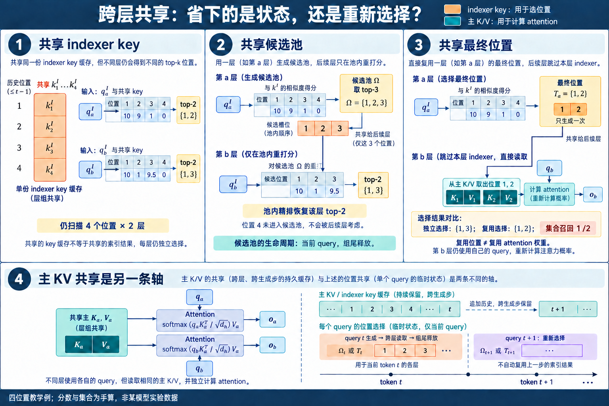

# 跨层共享: KV、候选池与索引

长上下文 attention 的费用并不全在主 attention. 一层动态稀疏 attention 往往要保存主 KV, 再保存一份低维 indexer key, 用当前 query 扫过全部可见历史, 做 top-k, 完成选择后从主 KV 中读取少量 token. 如果几十层各做一遍, 主 attention 已经稀疏, indexer 的全历史扫描仍会按层重复. **跨层共享删去这些重复项, 共享对象可以是 KV、indexer key、候选池或最终 token indices.** 四者的数学条件、生命周期与质量风险差别很大.

2026 年的工作把这条路线推进得很快. IndexCache 直接让一组层复用锚点层的最终 top-k; LISA‡ 只共享较宽的候选池, 每层仍用自己的完整 indexer score 精排; CLSA 把共享 routing 放进 YOCO 式 KV-sharing cross-decoder; DeepSeek V4.1 Flash 的 CSA2 则用 Full、Reindex、Reuse 三类层管理主 KV、indexer key 与 positions. 同期出现的 LISA 和 MISA-2/ResMiSA 主要压缩单层内部的多头 indexer 计算, 其中只有 LISA‡ 进一步跨层共享候选池. 这些名字挨得很近, 数据流却不能互换.

跨层共享可以沿三个问题拆开: **共享什么、何时刷新、谁拥有状态**. [CSA、HCA 与 CSA2](./2.3.1-CSA-HCA-CSA2与CED.md)给出 DeepSeek V4 系列的具体结构, [HySparse 与 HySparse2](./2.3.2-HySparse与HySparse2.md)涉及 full attention oracle、KV Reuse 与两段 decoder. 统一记号还能继续回答更一般的问题: 哪些状态可以精确合并, 哪些复用依赖近似, 质量下降究竟来自层间表示漂移、候选截断, 还是缓存版本错误.

## 1. 四种共享对象对应四种状态承诺

### 1.1. 主 KV 共享改变 attention 的输入空间

普通 decoder 第 $l$ 层从自己的输入 $X_l$ 生成

$$
Q_l=X_lW_l^Q,\qquad K_l=X_lW_l^K,\qquad V_l=X_lW_l^V. \tag{1}
$$

历史长度为 $n$, KV heads 数为 $H_{kv}$, head 维为 $d_h$, 元素占 $b_e$ bytes 时, $L$ 个 attention 层的逻辑 cache 为

$$
M_{KV}=2LnH_{kv}d_hb_e. \tag{2}
$$

令一组层 $G_r$ 共用锚点层 $a_r$ 产生的 $K_{a_r},V_{a_r}$, 组内第 $l$ 层仍生成自己的 query:

$$
O_l=\operatorname{softmax}
\left(\frac{Q_lK_{a_r}^{\top}}{\sqrt{d_h}}+B_l\right)V_{a_r},
\qquad l\in G_r. \tag{3}
$$

式 (3)把 cache 份数从层数 $L$ 改成组数 $R$, 代价是组内各层失去独立的 K/V 表示. $Q_l$ 必须与共享 K 位于可比较的空间, 输出也要能使用共享 V. 从头训练的模型可以共同学习这些投影; 对已有 checkpoint 直接换掉 K/V 来源, $Q_lK_{a_r}^{\top}$ 的分布、位置项和 Value 语义都可能改变. YOCO 选择原生的 self-decoder/cross-decoder 结构解决这件事: self-decoder 建立一份全局 KV, 后续 cross-decoder 用 cross-attention 读取, 状态从设计之初就只有一个生产者.

KV 共享还需要区分全局与局部通路. 一组层可以共享全局 KV, 同时让每层从 $X_l$ 生成自己的 sliding-window K/V. 此时长历史状态按组计, 最近窗口状态仍按层计. 只报「共享倍数」会漏掉局部 cache、量化 scale、page padding 和 workspace; 式 (2)只负责逻辑主 KV, 物理显存要从运行时分配量核对.

已有层的 KV 若希望经过线性变换后复用, 可以写出更细的充分条件. 假设独立层原本有 $K_l=K_aA_l$ 与 $V_l=V_aB_l$, 其中 $A_l,B_l$ 不随 token 改变. 点积分数满足

$$
Q_lK_l^\top=Q_lA_l^\top K_a^\top
=(Q_lA_l^\top)K_a^\top. \tag{4}
$$

把 $A_l^\top$ 吸收到该层 query adapter 后, score 可以继续使用共享 $K_a$. 若 $B_l$ 可吸收到 attention 后的输出投影, Value 路径也能复用 $V_a$. 这个条件说明「同一份 cache」不要求各层 query 完全相同, 但要求层间差异能被固定、低成本的变换承接. LayerNorm、token-dependent gate 或非线性 K/V 变化通常无法这样移项, 原生训练便要直接适应共享空间.

位置项需要单独核对. RoPE 作用在 Q/K 后, 两层若使用相同位置与旋转基, 式 (4)仍有机会成立; 每层使用不同缩放或部分维度旋转时, adapter 还要与这些旋转可交换. ALiBi 一类加性 bias 不存进 K, 可以由组内各层保留自己的 $B_l$. 量化也会破坏严格等价: 锚点 K 先量化再供多层读取, 与每层在线性变换后分别量化得到的舍入结果不同.

共享还会把多条直接读取路径的梯度汇到同一个生产者. 独立 KV 时, 各层 attention 读取自己的 K/V 投影;最终训练损失仍会沿残差流和层间计算反传到上游层. 共享后, 组内各层读取同一锚点 K/V, 这些读取路径对锚点张量的梯度相加, 再传入锚点投影. **同一 K/V 张量有了多个直接消费者**, 因此训练中可以少保存若干 K/V 副本, 单份锚点张量却要供多层使用. 保留激活或在反向时重算的策略决定实际显存峰值. Gradient checkpoint、pipeline stage 边界和张量释放顺序需要按层组重新排, 否则共享 cache 省下的容量会被延长的激活生命周期抵消.

### 1.2. Indexer key、候选池与最终 indices 是三件事

DSA 一类细粒度索引器用 $H_I$ 个 query heads 和一份共享 indexer key 给历史位置 $s$ 打分. 对第 $l$ 层位置 $t$, 写成

$$
I_{t,s}^{(l)}=
\sum_{j=1}^{H_I}w_{t,j}^{(l)}
\operatorname{ReLU}
\left((q_{t,j}^{I,(l)})^{\top}k_s^{I,(l)}\right). \tag{5}
$$

共享 **indexer key** 时, 多层读取同一份 $k_s^I$, 每层仍可生成自己的 $q_{t,j}^I$、计算式 (5)并得到不同 top-k. 这会减少历史低维 key 的副本, 全历史扫描次数仍然存在. 共享 **候选池** 时, 锚点层先产生 $M$ 个候选位置 $\Omega_{t,r}$, 组内各层只在 $\Omega_{t,r}$ 中执行自己的式 (5), 因而保留层级精排. 共享 **最终 indices** 时, 组内层直接读取同一组 $k$ 个位置, 连精排也一并跳过.

三种强度可以写成集合关系. 令第 $l$ 层独立运行时的最终集合为

$$
T_t^{(l)}=\operatorname{TopK}_{s\in V_t}
\left(I_{t,s}^{(l)},k\right), \tag{6}
$$

$V_t$ 是当前 query 的合法可见位置. 最终 indices 复用要求组内层接受 $T_t^{(a_r)}$; 候选池共享则要求 $T_t^{(l)}$ 的重要位置尽量包含在 $\Omega_{t,r}$ 中, 然后每层重新选出

$$
\widehat T_t^{(l)}=
\operatorname{TopK}_{s\in\Omega_{t,r}}
\left(I_{t,s}^{(l)},k\right). \tag{7}
$$

只要 $T_t^{(l)}\subseteq\Omega_{t,r}$, 且池内使用同一分数和一致的并列分数裁决规则, 式 (7)就能恢复该层独立 top-k, 即使组内各层的最终集合完全不同. 最终 indices 复用的条件更严格, 需要 $T_t^{(l)}$ 与锚点集合足够接近. 这也是 LISA‡ 与 IndexCache 的关键差别: 前者共享较宽的候选池并逐层精排, 后者共享已经截断到 $k$ 的结果.

候选还要规定有序性与重复语义. Sliding window、sink token 和动态 top-k 可能选中同一位置. 若 kernel 要求 indices 升序, top-k 结果需去重、排序并补足预算; 若 kernel按 score 顺序读取, 排序方式又会影响连续访存. 一组层复用候选时应共享逻辑 token ids, 每层的 score、最终排序和 Sparse MLA 权重仍各自计算. 把锚点层的 attention probabilities 一起复用, 就已经从 index reuse 变成 attention-weight sharing.

临时索引的容量也可能很大. Prefill query chunk 含 $Q=8192$ 行, 每行最终 $k=2048$ 个 int32 positions, 一层结果为 $8192\times2048\times4=64$ MiB. 四层各存一份是 $256$ MiB; 按组复用一份降回 $64$ MiB. 若共享的是 $M=8192$ 的候选池, 同样 shape 会达到 $256$ MiB. 实现通常缩小 query chunk、边生成边消费或压缩 position dtype, 不能把 candidate pool 当作可以忽略的小元数据.

共享粒度决定状态能活多久。
主 KV 从 Prefill 建立后保留到请求结束或相应 token 被窗口淘汰. Indexer key 若供后续 Decode 重新扫描, 生命周期同样覆盖整个请求. 候选池与最终 indices 通常对应当前 query 或一个 Prefill query chunk, 组尾层消费完成后即可释放. 把这些张量都叫作 cache, 会把常驻容量与临时 workspace 混在一起.

一个层组的状态可以登记为

$$
S_r=(P_r^{KV},P_r^{I},P_r^{\Omega},P_r^{T},v_r,n_r), \tag{8}
$$

其中四个指针分别指向主 KV、indexer key、候选池和最终 indices, $v_r$ 是版本, $n_r$ 是有效长度. 主 KV 与 indexer key 常按 token 追加; 候选池和 indices 按 query 重写. Full 层创建或刷新状态, Reindex 层读取共享 key 或候选池后改写自己的 $P_r^T$, Reuse 层只消费已有 positions. 状态机必须标明哪些字段可写, 否则 Reuse 层一次原地 top-k 就可能污染后续消费者.

Prefix cache 还要把模型配置纳入 key. 两个请求前缀 token 相同, 共享层表、候选预算或 indexer 权重不同, 缓存状态仍不能混用. Speculative decoding 回滚时, 常驻 KV 和 indexer key 截断到接受长度; 对被拒 query 生成的候选池、indices 和版本号全部作废. 请求迁移到另一 worker 时也应整体迁移式 (8), 只搬主 KV 会让新 worker 使用旧地址空间里的 positions.

同一个前缀在不同后续 query 下会得到不同 indexer 选择, 所以 prefix cache 通常复用 K/V 与 indexer key, 不复用上一轮 top-k. Prefill 的历史 query indices 已经消费完毕, Decode 第一个 query 仍需按自己的 hidden state 重新生成. Candidate 或 final indices 的复用还要求 query、可见区间和位置 offset 全部一致.

Continuous batching 会让组内 consumer 到达时间不一致. 一个请求可能在第 $l$ 层取消, 另一个仍要继续消费同一 batch buffer. 引用计数应落到 request-row 或 page 级, 不能以整个 batch 是否结束作为释放条件. 动态重排 batch rows 后, candidate tensor 的第一维映射也要更新; token positions 正确但 request row 对错, 输出仍会静默污染.

权重共享与结果共享是两条独立轴。

图1. 固定同一个 query 的四位置教学例：共享 indexer key 后，各层仍独立打分；较宽候选池允许后层恢复自己的 top-2；最终 indices 复用省掉重新选择，但可能漏掉后层需要的位置。下方把主 KV 的跨步常驻与候选的当前 query 生命周期分开。分数和集合为本文手算；最终 indices 共享的具体方法见 [IndexCache](https://arxiv.org/abs/2603.12201)。[查看原尺寸](../images/cross-layer-state-selection-v4.png)。

前面三类索引共享讨论的是运行时张量, 还要与参数共享分开. 两层可以使用同一组 indexer 参数 $W^Q_I,W^K_I$, 输入 hidden state 不同, 仍产生不同 query、key、score 和 top-k. 也可以参数完全独立, 运行时直接复用锚点层 final indices. 前者减少参数并施加共同映射, 后者减少执行, 数学约束没有包含关系.

令共享 indexer 参数的两层输入为 $X_a$ 与 $X_l$, 则

$$
Q_a=X_aW_I^Q,\quad Q_l=X_lW_I^Q,
\qquad
K_a=X_aW_I^K,\quad K_l=X_lW_I^K.
$$

$W_I$ 相同不推出 $Q_a=Q_l$ 或 $K_a=K_l$. 只有 hidden states 在投影相关子空间内接近, score 才可能接近. 反过来, 两层即使使用不同参数, 也可能在某批样本上得到高度重合的 top-k. 参数关系是结构先验, 集合重合是数据分布上的结果.

attention weight 共享又比 indices 共享更强. 给定相同候选集合 $T$, 第 $l$ 层在候选内的概率为

$$
p_{t,s}^{(l)}=
\frac{\exp z_{t,s}^{(l)}}
{\sum_{u\in T}\exp z_{t,u}^{(l)}},\qquad s\in T.
$$

共享 indices 只固定 $T$, 每层仍计算自己的 logits $z^{(l)}$ 与概率 $p^{(l)}$. 共享 attention weights 则直接令 $p^{(l)}=p^{(a)}$, 删除每层重新打分与 softmax 的自由度. 即使 top-k 集合完全相同, 组内层也可能对集合内 token 使用很不一样的权重, 所以集合重合不能作为权重共享的充分证据.

Value 共享还引入另一维. 同一组 weights 作用于各层独立 $V_l$ 时, 输出为 $pV_l$;同一组 shared V 配各层独立 weights 时, 输出为 $p_lV_a$;两者都共享时才是完全复用 attention read. 候选、概率和 Value 分别决定「读哪些位置」「每个位置占多少」「从位置取出什么」. 文章或实现只写 shared attention, 必须继续指出共享到了哪一层.

共享对象的充分条件按强弱排列。
最终 indices 精确复用需要组内层的 top-k 集合一致. 候选池精确复用只需要每层独立 top-k 包含在池内. indexer key 共享若追求原模型等价, 需要每层 key 能由共享 key 通过可吸收变换得到. 主 KV 共享还要求 attention score 与 Value 输出都能在共享空间中表达. 条件逐渐涉及更多数据流, 不能由一个 overlap 数字同时验证.

将这些条件写成事件更清楚. 设 $E_T$ 为 $T_l=T_a$, $E_\Omega$ 为 $T_l\subseteq\Omega_a$, $E_K$ 为存在低成本映射使 $K_l=K_aA_l$, $E_V$ 为存在可吸收映射使 $V_l=V_aB_l$. $E_T$ 推出锚点 final indices 可精确服务该层; $E_\Omega$ 推出候选内精排可恢复独立集合; $E_K$ 与 $E_V$ 共同提供 KV 共享的代数入口. 四个事件彼此并不等价.

候选池大小 $M=N$ 时, $E_\Omega$ 恒成立, 跨层共享也失去筛选收益. final budget $k=N$ 时, $E_T$ 恒成立, attention 已退化为全历史. 因而高覆盖率要与压缩比同时报告. 用巨大候选池得到 100% recall, 没有说明路由器在有效预算下成立.

近似共享则需要误差目标. 可以约束集合 recall、attention mass、输出向量误差、logit 差异或任务 loss. 前三个逐渐接近主 attention 输出, 后两个包含后续网络补偿. 一个方案集合 recall 较低但漏掉的概率质量极小, 输出误差可能仍小;另一个 recall 很高却漏掉唯一关键 token, 任务失败. 评价指标必须与共享强度匹配.

生命周期决定共享是否真的省容量。
参数共享在模型加载时省权重, 与序列长度无关. 主 KV 和 indexer key 是每请求、每历史 token 的常驻状态, 共享份数会改变长上下文容量斜率. 候选池和 final indices 是当前 query/chunk 的临时状态, 共享主要降低重复计算与 workspace 峰值. attention probabilities 通常在 kernel 内短暂存在, 共享它们可能要求将原本不落 HBM 的中间量显式保存, 反而增加流量.

设每层 indexer key 每 token 为 $d_Ib_I$ bytes, 层组大小为 $G$, 历史长度为 $N$. 每层独立时一组容量为 $GNd_Ib_I$;原生共享一份 key 后为 $Nd_Ib_I$. 若只是 Shared 层跳过 scan, 但仍为它们生成和保存 key, 常驻容量保持前者. 计算复用与状态复用必须分别验证.

Prefill 候选池有 $Q$ 个 query rows, 每行 $M$ 个 int32 位置, 容量为 $4QM$ bytes. 一组共享一份能把临时池从 $G$ 份降为一份, 但各层精排后的 final indices 仍可能各有 $4Qk$ bytes. 若边生成边消费, 峰值由同时存活的 query tiles 决定, 不等于整段 $Q$. 生命周期分析比静态 shape 相加更接近真实显存.

Decode 每步每请求只有一行 positions. $k=2048$ 时为 8 KiB, 共享 final indices 的容量收益很小;省掉 $G-1$ 次全历史 score 与 top-k 才是主项. 若为了跨层复用把 positions 保存得更久, 它会跨越若干层但不跨 token step. 下一 token 的 query 已变化, 旧 positions 除非另有跨时间复用机制, 不能继续使用.

权重共享可能增加激活寿命. 同一参数被多个层调用, 训练反向要累积来自所有调用点的梯度;若 activation checkpoint 策略不变, 共享参数本身不要求保存更多输入, 计算图仍有多次调用. 主 KV 共享则让生产者输出存活到组尾, 其生命周期长于独立层中一次 attention 调用. 省下的副本与延长的单份状态要一起算峰值.

## 2. 层间表示为什么会漂移

### 2.1. Top-k 重合来自经验测量

相邻层经常关注相似 token, IndexCache 在 DSA 层间观察到较高的 top-k overlap, 并据此把层分为 Full 与 Shared. Full 层正常运行 indexer, Shared 层复用最近锚点的最终 indices. 这种方法在已有模型上可以直接部署, 但 overlap 是模型、样本、层位置和候选预算共同决定的统计量. 平均 overlap 高, 仍可能有一小批检索或代码样本需要组尾层重新选择证据.

集合重合可以用 Jaccard 或 recall 表示:

$$
J_{a,l}=\frac{|T_t^{(a)}\cap T_t^{(l)}|}
{|T_t^{(a)}\cup T_t^{(l)}|},\qquad
R_{a\rightarrow l}=\frac{|T_t^{(a)}\cap T_t^{(l)}|}{|T_t^{(l)}|}. \tag{9}
$$

两个 top-k 集合大小相等时, recall 更容易解释锚点漏了多少层 $l$ 的候选. 它仍把每个 token 视为等权. 一个被漏掉的 token 若承载唯一答案, 影响会超过几十个低权重位置. 因而还要计算 attention-mass recall, 用该层稠密或高预算 attention 概率给 token 加权, 并按组内距离 $l-a$ 分桶.

IndexCache 的 training-free 方案用校准集上的语言模型 loss 搜索需要保留的 Full 层, training-aware 方案让一个保留的 indexer 同时拟合它服务的多层教师. 设组内教师分布为 $p_t^{(l)}$, 锚点 indexer 分布为 $q_t^{(a)}$, 一种多层蒸馏目标为

$$
\mathcal L_{group}=
\frac{1}{|G_r|}\sum_{l\in G_r}\sum_t
D_{KL}\left(p_t^{(l)}\Vert q_t^{(a)}\right). \tag{10}
$$

式 (10)让锚点覆盖整组共同需要的位置, 而非只追随自己所在层. 教师平均也会平滑仅在单层突出的尖峰; 组大小增大时, 候选预算与教师聚合方式要一起消融.

式 (10)还可以解释「平均教师」的准确含义. 因为学生 $q_t^{(a)}$ 对组内每项相同, 对参数 $\theta$ 求梯度后, 多个 $D_{KL}(p^{(l)}\Vert q_\theta)$ 的平均等价于用概率均值 $\bar p=|G_r|^{-1}\sum_lp^{(l)}$ 监督同一个学生. 平均的是归一化后的教师概率, 直接平均 logits 会得到另一种目标. 各层合法 mask 不一致时, 还要先限制到共同合法区间或逐层计算, padding 位置不能进入概率均值.

Top-k 训练目标又比全分布 KL 更关注排序边界. 一个 token 在某层排第 $k-1$, 在另一层排第 $k+1$, 概率差很小, 硬集合却发生变化. 可以同时加入候选覆盖损失, 或让锚点产生大于 $k$ 的池供各层精排. Teacher 的并集可能超过预算, 训练便要在共同 token 与单层尖峰之间分配容量.

Training-free greedy search也存在层间交互. 单独删除第 6 层 indexer损失很小, 单独删除第 7 层也很小, 两层同时复用第 5 层时可能放大误差. 搜索每次都要在当前 pattern 上重新评估候选删除, 不能把单层 loss 增量预先排序后一次删完. 校准集过短或缺少检索样本时, 得到的 pattern 也会偏向局部语言建模.

### 2.2. Query、key 与任务阶段都在变

层间漂移有三处来源. 第一处是 hidden state 沿深度更新, $q_{t,j}^{I,(l)}$ 与 $k_s^{I,(l)}$ 都会变. 浅层可能强调词形、邻近和局部搭配, 中层聚合实体与段落, 深层再按当前答案状态检索证据. 第二处是 query-dependent 权重 $w_{t,j}^{(l)}$ 改变各 indexer head 的贡献. 第三处是同一生成过程也会换任务阶段: 读取问题、形成计划、计算中间量与输出答案需要的历史不同.

用 score 向量 $I_t^{(l)}\in\mathbb R^{|V_t|}$ 表示整段历史的索引分数, 可以把层间变化拆成尺度、方向和排序三项. Pearson correlation 对整体仿射变化较稳定, cosine similarity 观察方向, rank correlation 与 top-k overlap更接近最终选择. 对每层分数先做归一化再平均会丢掉尖峰幅度; 直接平均又可能让高方差层主导. 实验记录需要保存原始分数统计、最终集合与 attention mass, 三者一起才能解释共享是否安全.

位置编码也会进入漂移. 某些 indexer key 已包含位置旋转或量化 scale, 共享后必须保证组内 query 使用匹配的位置约定. Packed Prefill 还包含每个请求自己的可见区间. 候选生成必须在 $V_t$ 内完成, 先跨 batch 扫分再用 mask 清理会让非法 token 影响阈值、top-k tie 或 residual routing.

一个四位置例子能看到「相关性很高」与「top-k 足够」之间的差距. 锚点层 score 为 $(10,9,1,0)$, 后续层变成 $(10,1,9.5,0)$. 两个向量的主趋势相近, top-2 集合却从 $\{1,2\}$ 变成 $\{1,3\}$, recall 只有 $1/2$. 锚点若先保留 top-3 候选 $\{1,2,3\}$, 后续层重新打分便能恢复 $\{1,3\}$. 这正是候选池共享比最终 indices 复用多出的适应空间.

分数尺度变化也会影响固定阈值 candidate screening. 锚点层方差较大时, 根据抽样 histogram 估出的阈值可能只留下少量尖峰; 组尾层分布更平, 同一个池未必覆盖它需要的中等分 token. LISA‡ 在锚点层构池后不再使用统一 score, 但池的组成已经受锚点尺度控制. 每组应记录实际 candidate count、阈值、组尾覆盖与恢复触发次数.

Head 级漂移还可能被聚合值隐藏. 层 $l$ 的平均 attention mass 覆盖很高, 某个负责代码标识符或数字复制的 head 却持续漏选. 对 downstream attention heads 分别统计 oracle mass, 再汇总最差分位数, 能发现少数专门化 head 的退化. Indexer heads 与 downstream attention heads 是两组对象, 不能用前者的路由使用率代替后者的证据覆盖.

候选池把不可恢复误差推迟了一步。
最终 indices 复用一旦漏掉第 $l$ 层需要的位置, 主 attention 没有补救入口. 候选池共享把截断预算从 $k$ 扩到 $M$, 组内各层可以各选自己的 $k$. 对每层定义候选覆盖

$$
C_t^{(l)}=
\frac{|T_t^{(l)}\cap\Omega_{t,r}|}{|T_t^{(l)}|}. \tag{11}
$$

$C=1$ 表示池内精排可以恢复独立 top-k; $C<1$ 的缺口无法由精排修复. 增大 $M$ 会提高覆盖, 也会让每层的原始多头 scorer 处理更多 token. 跨层候选池的核心权衡由 $G=|G_r|$、$M$ 与最终 $k$ 三个数共同决定, 单独调长层组会把候选变旧, 单独扩大池会逐渐吃回计算收益.

手算一个四层组. 假设每层独立 top-k 为 $k=2048$, 锚点候选池 $M=8192$. 第 1 层的独立集合全部在候选池内, 第 4 层有 $1800$ 个位置仍在池内, 则组尾集合 recall 为 $1800/2048\approx87.9\%$. 如果漏掉的 $248$ 个位置只占该层稠密 attention 质量的 $2\%$, 对输出的影响可能较小; 如果其中一个位置承载随机字符串唯一匹配, 集合平均值就会掩盖失败. RULER、needle retrieval、代码符号跳转与多轮 observation 应分开统计.

刷新层的选择也可以非均匀. 早期层变化快时使用短组, 中段稳定时拉长, 深层任务切换明显时再次缩短. 固定每四层刷新便于 kernel 和状态表实现, 校准搜索得到的 F/S pattern 更贴近已有 checkpoint. 前者适合原生训练, 后者适合训练后转换; 两者都要在目标长度与任务分布上重新校准.

候选池大小可以随组内最差覆盖调节. 设锚点按 score 取前 $M$, 逐层测式 (11), 选择使 $\min_{l\in G_r}C_t^{(l)}$ 达到阈值的最小 $M$. 固定 $M$ 便于 kernel 编译与内存规划, 动态 $M$ 能按 query 难度省算, 也会造成 batch 内负载不均. 工程上可以只提供少数离散档位, 例如 $4096/8192/16384$, 再按抽样 margin 选择.

跨 token 复用与跨层复用还会相乘. Decode 的相邻 query 往往选中相似历史, 但新 token 可能立刻改变当前任务. 若同一 candidate pool 同时跨 $G$ 层、跨 $S$ 个 Decode steps 复用, 最坏陈旧距离增加到两个维度. 消融应保持一个维度刷新、只拉长另一个, 再测联合配置; 否则无法确认误差来自深度还是时间.

跨层共享依赖怎样的统计假设。
复用锚点集合隐含一个条件分布假设: 给定当前样本和 query, 组内层的重要位置变化足够小. 它比「相邻层 hidden state 接近」更具体, 因为 top-k 只关心排序边界. 两层 score 可以有较大欧氏差异, 若变化主要是统一缩放或只发生在远离边界的位置, top-k 仍相同;score 整体很接近, 第 $k$ 与第 $k+1$ 名间隔很小时也可能换位.

设锚点 score 为 $z^{(a)}$, 层 $l$ 为

$$
z^{(l)}=z^{(a)}+\delta^{(l)}.
$$

锚点第 $k$ 与第 $k+1$ 名的 margin 为

$$
m_a=z_{(k)}^{(a)}-z_{(k+1)}^{(a)}.
$$

若所有位置扰动满足 $\|\delta^{(l)}\|_\infty<m_a/2$, 则 top-k 集合不会变化. 证明很直接: 任一集合内分数最多下降 $m_a/2$, 集合外分数最多上升 $m_a/2$, 两者仍不交叉. 这是充分条件, 并非必要条件;它把表示漂移与排序稳定性通过 margin 联系起来.

真实分布中 $m_a$ 随 token、head、层和任务变化. 平均 margin 大不能保护低分位 query. 可以统计比值

$$
\rho_{a,l}=\frac{2\|\delta^{(l)}\|_\infty}{m_a},\qquad m_a>0.
$$

$m_a>0$ 且 $\rho<1$ 时, query 得到集合稳定保证; $\rho\ge1$ 只表示保证失效, 不代表集合必然变化。$m_a=0$ 时边界存在并列分数, 任意小扰动都可能改变集合, 要固定 tie-break 规则并单独统计。实现若用 $m_a+\epsilon$ 避免除零, 该比值只能作为诊断量;严格保证仍检查 $2\|\delta\|_\infty<m_a$。对低 margin query 刷新 indexer或扩大候选池, 比固定每 $G$ 层刷新更适应样本难度. 动态策略会带来变长工作和分支调度, 仍需看成本.

候选池共享把 margin 条件放宽. 锚点保留前 $M>k$ 个位置, 组内层独立 top-k 不越过锚点第 $M$ 名边界即可恢复. 对锚点 top-k 内最弱位置与第 $M+1$ 名之间定义更大的保护带. $M$ 增大通常提高稳定概率, 精排成本按 $M$ 增长. 这正是候选池的统计意义: 用更宽排序缓冲吸收层间扰动.

校准集估计的是未来数据分布上的概率. 若训练/校准以普通文本为主, 代码符号、长数字、agent observation 或罕见多跳样本可能有不同 margin 和漂移. 层组 pattern 本身可以固定, 仍要在各类任务上分别测稳定率. 只报告总体均值会让高频简单 token 掩盖低频关键 query.

表示漂移可以拆成共享子空间与层特有残差。
把层 $l$ 的 indexer key 写成

$$
K_l=K_cA_l+E_l,
$$

$K_c$ 是跨层共享基底, $A_l$ 是层适配, $E_l$ 是无法由共享子空间解释的残差. 若 $K_c\in\mathbb{R}^{N\times r}$ 且 $r\ll d_I$, 常驻历史可保存低秩基底, 层适配不随 token 增长. $E_l$ 若仍按 token 保存, 容量收益取决于其维度或稀疏性;完全丢掉 $E_l$ 则产生近似误差.

query 可以吸收 $A_l$:

$$
Q_lK_l^\top=(Q_lA_l^\top)K_c^\top+Q_lE_l^\top.
$$

第一项复用同一份历史 key 基底, 各层的 $Q_lA_l^\top$ 不同, 仍要各自打分扫描;第二项是层特有残差。要省掉重复扫描, 还需要共享候选或索引结果等额外机制。这与 LISA/ResMiSA 的「共享线性项加稀疏残差」在结构上相似, 轴却不同: LISA 沿 indexer heads 合并, 这里沿 layers 分解. 两者可以同时存在, 会形成共享层基底、融合 head query 和少量层/head residual 的多轴近似.

低秩成立需要层间 keys 落在共同子空间附近. 可以把若干层的 key 矩阵沿特征维拼接做 SVD, 观察前 $r$ 个奇异值解释的能量;能量高只说明均方重构误差小, top-k 稳定仍受 query 方向和排序 margin 影响. 一个低能量残差若恰好与某个 query 对齐, 可能改变关键 token 排名.

共享专家也可用同一视角理解. 设每层路由器包含共同函数 $f_c$ 与少量层特有专家 $f_l$, score 为 $f_c(x)+f_l(x)$. 共同函数承载跨层稳定统计, 层专家修正深度特有需求. 与 MoE 不同, 这里专家输出是路由 score 或候选修正, 其错误会改变后续主 attention 的输入集合. 专家负载均衡不能代替候选覆盖.

若层特有残差只在少数 token 上显著, 可以先用共享项全扫, 再在候选或异常位置计算残差. 若残差在所有位置都小但密集, 低秩 adapter 更合适. 若残差大且无结构, 强行共享会丢失层级表达, 缩短组长或恢复独立 indexer更直接. 残差的秩、稀疏性和与 top-k 边界的相关性共同决定方案.

一次漏选如何沿层组累积。
锚点漏掉位置 $s$ 后, Reuse 层无法读取对应 value. 第 $l$ 层输出误差进入残差流, 改变 $X_{l+1}$, 进而改变下一层 query 与独立情况下的候选需求. 所以组内层并非在固定输入上各自承受同一集合误差;前层误差会改变后层表示, 造成闭环漂移.

写成扰动递推. 独立模型层为 $x_{l+1}=F_l(x_l,T_l)$, 共享模型为 $\hat x_{l+1}=F_l(\hat x_l,T_a)$. 令 $e_l=\hat x_l-x_l$, 一阶近似为

$$
e_{l+1}\approx J_{x,l}e_l+e_{T,l},
$$

$J_{x,l}$ 是层对输入的 Jacobian, $e_{T,l}$ 是用锚点集合替换独立集合造成的直接误差. 展开到组尾得到

$$
e_{b}\approx
\sum_{l=a}^{b-1}
J_{x,b-1}\cdots J_{x,l+1}e_{T,l}.
$$

各层误差可能衰减、抵消或放大. 平均每层输出误差小, 不能保证组尾小;只测组尾任务 loss, 又难以定位首次偏离层. 逐层保存 hidden cosine、范数差、候选覆盖和 logits 差, 能把直接漏选与传播放大分开.

候选池逐层精排减少 $e_{T,l}$, 因为每层仍可在池内适应当前 $\hat x_l$. final indices 复用固定 $T_a$, 误差自由度更小. 但逐层精排使用的是已经受前层近似影响的 query, 与独立参考 $x_l$ 产生的集合仍可能不同. oracle replay应分别用参考 hidden 与近似 hidden 计算候选, 才能区分集合约束和表示传播.

训练 aware 共享允许后续层适应这种闭环. 模型可以调整表示, 让共享集合包含组内共同有用的 token, 或让残差流补偿遗漏. 因而转换已有 checkpoint 的误差分析与原生训练模型不同. 前者测结构替换造成的偏移, 后者测共享约束下可达到的最优点. 同样 overlap 不应被直接外推到两种训练方式.

刷新间隔是偏差与方差的共同控制量。
组长 $G=1$ 没有跨层陈旧, 计算最高;增大 $G$ 减少刷新次数, 锚点要覆盖更多深度需求. 从统计角度看, 短组的锚点只服务相近层, 目标分布较窄;长组聚合更多教师, 共同 indexer 的目标更平滑, 层特有尖峰更容易被平均掉. 候选预算固定时, 长组的偏差上升.

训练样本有限时, 每层独立 indexer也有估计方差. 共享参数或多层蒸馏能汇集监督, 可能提升泛化, 不能把所有共享效果都解释为算力交换. 若独立 indexer过拟合, 适度共享甚至可能改善质量. 这要通过固定计算、只共享参数但不复用运行时结果的对照来验证.

非均匀组长可依据层间变化选择. 定义相邻层漂移 $d_l=E[1-R_{l\rightarrow l+1}]$ 或基于 score 的距离, 在累计漂移超过阈值时刷新. 这会在表示快速变化区域形成短组, 稳定区形成长组. 漂移不一定满足可加性, 累计指标仍是启发式;直接验证候选覆盖更可靠.

输入自适应刷新则依据当前 query 的 margin、锚点置信度或低成本探针. 它把固定 pattern变成动态计算图, 最坏成本可能接近独立 indexer. 服务容量规划需同时给平均和高分位刷新次数. 若困难请求恰好在高并发时集中, 平均收益无法保证尾延迟.

## 3. Head 共享与跨层共享是两条轴

LISA 与 ResMiSA 压缩单层 indexer 的 head 维，IndexCache、LISA‡ 与 CSA2 压缩逐层重复的扫描或候选。两条轴可以组合，误差也会叠加。Head 侧的代数拆分、MISA-2 关系和算例集中在 [MISA、LISA 与 ResMiSA](../2.2-细粒度索引/2.2.2-MISA-LISA-ResMiSA.md)。

## 4. 训练、推理与失效模式怎样一起验收

### 4.1. Prefill 与 Decode 的收益来自不同路径

Prefill 一次处理许多 queries. 第 $t$ 个 query 的合法历史长度约为 $t$, 单层原始 indexer 总点积数随 $\sum_{t=1}^{n}tH_I$ 增长, 即 $O(n^2H_I)$. Head fusion 去掉 $H_I$ 因子, layer sharing 再按组摊薄 full-context scan. 高效实现还要把 score 生成、阈值比较、candidate compaction 与 top-k 尽量融合, 否则中间 score tensor 的写回会占用大量带宽.

Decode 每步只有一个新 query, 却要扫描长度 $n$ 的历史. 最终 indices 复用可以让 Shared 层跳过整次 scan; 候选池共享让每组只做一次长度 $n$ 的 scan, 各层再处理固定 $M$. 请求并发上升后, 不同序列长度、不同合法区间和 page layout 会影响 batching. 理论点积下降若换来大量小 kernel、候选 gather 和同步, TPOT 不会按同样比例下降.

YOCO 与 CLSA 还改变 Prefill 依赖图. Self-decoder 建立共享 memory 后, cross-decoder 对 prompt token 的某些计算可以提前结束; Decode 再由各 cross-decoder 层读取同一 KV 和 routing. 这类收益超出普通层组 index reuse, 因为主 KV 生产者和 decoder 分段也发生了变化. CSA2 的 Full/Reindex/Reuse、HySparse2 的 self/cross decoder bridging 同样要分别画出 Prefill 与 Decode 数据流, 不能只用一个「共享」标签概括.

性能报告至少分开记录 indexer score、candidate compaction、top-k、主 KV gather、Sparse MLA 和通信. TTFT 测长输入短输出, TPOT 测固定 prefix 后持续 Decode, 吞吐再测 continuous batching. LISA 论文报告的是单请求 offline TTFT 与 indexer kernel; ResMiSA 把 LiteTopK 纳入实现; IndexCache 同时报告 Prefill 与 Decode. 比较数字时需要对齐硬件、模型、上下文、量化和候选预算.

Prefill 的累计量还能用一个小例子核对. 设 chunk 内有 $Q=4096$ 个 queries, 每行平均看到 $N=65536$ 个 keys, $H_I=64,D_I=128$. 独立 DSA 的点积乘加规模与 $QNH_ID_I$ 成正比; LISA 将主扫描改为 $QND_I$, 理论上删掉 head 因子. 四层共享候选池后, 长扫描只做一次, 另外三层各处理 $QM H_ID_I$. 当 $M=8192$ 时, 精排项相当于每行再扫八分之一历史、但保留全部 heads. 这说明 $N/M$ 越大, 跨层建池越容易覆盖候选精排的固定费用.

Decode 的内存流量常比 FLOPs 更关键. 一次 full-context indexer scan 要读 $N\times D_I$ 个 key 元素; FP8 每元素 1 byte、$N=2^{20}$、$D_I=128$ 时为 $128$ MiB, 不含量化 scale 与对齐。32 层独立读取为 $4$ GiB/生成 token, 还没有计入主 KV gather. 每四层共享一次 full scan 可把这一项降到约 $1$ GiB, 但候选精排仍会读取候选 key. 真实带宽还受 page locality、L2 命中和并发请求交错影响.

多机或多卡环境要把 collective 放进时间线. Indexer keys 按序列切分时, 各 rank 先算局部 top-k, 再合并为全局 top-k; 候选池跨层共享可以复用合并结果. Keys 按 head 或 hidden 维切分时, score 需要归约. Full 层计算结束后若立刻广播 indices, Reuse 层能够异步准备主 KV gather; 广播落在关键路径上时, 很小的 int32 tensor 也可能受启动延迟限制.

## 5. 参考资料

- [DeepSeek-V4 Technical Report](https://arxiv.org/abs/2606.19348)
- [DeepSeek-V4.1-Flash Technical Report](https://arxiv.org/abs/2609.19969)
- [HySparse2](https://arxiv.org/abs/2609.26368)
- [MISA](https://arxiv.org/abs/2605.07363)
- [LISA: Linear-Indexed Sparse Attention](https://arxiv.org/abs/2607.19358)
