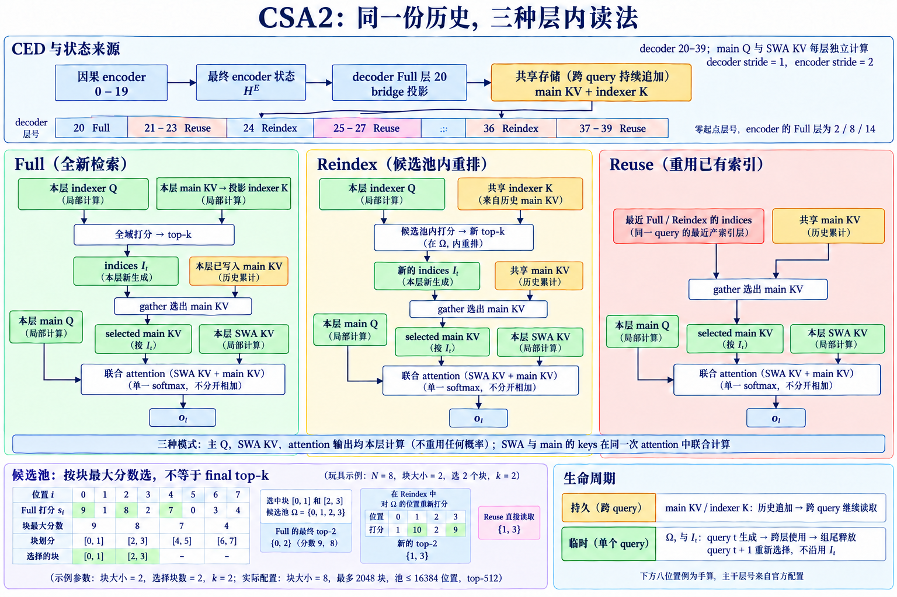

# CSA、HCA 与 CSA2: 压缩序列上的稀疏检索和跨层复用

DeepSeek V4 将长上下文 attention 的两个成本同时改写：先沿 token 轴压缩 KV，再让部分层只访问压缩序列中的少量位置。官方名称 **Compressed Sparse Attention（CSA）** 指「压缩后再稀疏选择」，**Heavily Compressed Attention（HCA）** 指「更强压缩后对全部压缩项做 attention」。下文中的 CSA 均指 DeepSeek V4 技术报告里的 Compressed Sparse Attention，与 Calibrated Sparse Attention、Consensus Sparse Attention 等同名缩写无关。 V4.1 Flash 进一步引入 **CSA2**. 每个 attention layer 静态标为 Full、Reindex 或 Reuse, 在层间共享 main KV、indexer K 与 top-k indices. decoder 中的 Hierarchical Sparse Indexer 还把后续索引限制在首个 Full layer 产生的候选池内. 这使「稀疏」从单层 selector 问题变成层组状态机: 哪一层产生完整缓存, 哪一层刷新索引, 哪一层只复用已有选择, 都由层类型决定. 公开技术报告、模型卡与代码给出了层模式、压缩率、缓存格式和张量 shape。生产 kernel 的 tile、流水线与集群调度尚无完整实现数据，相关性能只采用官方已经披露的测量结果。

## 1. V4 为什么先压缩 token 轴

### 1.1. 压缩发生在哪个维度

设原序列长度为 $n$, hidden states 为 $X\in\mathbb{R}^{B\times n\times d}$. 压缩率 $m$ 将连续或学习聚合后的 $m$ 个 token变成一个 compressed entry, 压缩序列长度为 $n_c=\lceil n/m\rceil$. compressed K/V 可写成 $K_c,V_c\in\mathbb{R}^{B\times H_{kv}\times n_c\times d_h}$. DeepSeek V4 官方配置和 Transformers 文档给出 CSA 默认 $m=4$, HCA 默认重压缩率 $m'=128$. 在 1M token 时, CSA 的压缩序列约 250K entries, HCA 约 7813 entries. 压缩先把候选空间缩短, CSA 再在 $n_c$ 中做动态 top-k; HCA 则可以读取整个更短序列. 压缩不是简单 KV 量化. 量化降低每个元素的 bit 数, token压缩减少时间轴上的 entry 数. 两者可以叠加. 压缩 entry代表一段 token, selector命中它时读取的是聚合状态, 不再是原始块内每个 token的独立 KV. 因而压缩率直接决定细粒度信息损失与 cache容量.

### 1.2. CSA 的 indexer 和主 attention

CSA 延续 DSA 的检索结构, 但 indexer与主 attention都作用在压缩序列上. 对当前 query $q_t$, indexer为每个 compressed key $k^I_r$ 生成代理分数 $I_{t,r}$, selector返回 $k$ 个 compressed positions. 主 attention再对这些 positions的完整 compressed KV计算精确 softmax. 若不计压缩生成, indexer从扫描 $n$ 个 token降为扫描 $n/m$. 主 attention从访问原序列的 $k$ 个 token变为访问 $k$ 个 compressed entries. 这里的 $k$ 与原 token预算不能直接比较, 因为一个 entry汇总 $m$ 个 token的信息. 质量由压缩器能否保留块内关键细节决定, 性能由 $n/m$、top-k与 entry宽度共同决定. CSA 的输入输出 shape 与普通 attention兼容: 输入仍为每个 token的 query, 输出仍为 $B\times n\times H_q\times d_h$. 历史轴变短, query轴在 Prefill仍有 $n$ 行. 因此逻辑关系约为 $O(nk)$, indexer若平坦扫描则约为 $O(nn_c)$, 即 $O(n^2/m)$.

这里的 $m$ 表示压缩步长与序列长度缩减比例，不能直接当作每个 entry 的源 token 数。V4 的 CSA 在步长 $m$ 下聚合 $2m$ 个原 KV，相邻 entries 的源区间重叠；CSA2 去掉这一重叠与压缩器中的绝对位置 embedding，步长 $m$ 的每个 entry 只对应非重叠区间。覆盖范围、输出条数和最近滑窗是三个不同量。[V4.1 报告 §2.3](https://arxiv.org/pdf/2609.19969)。

HCA 为什么不需要 sparse selector。

HCA 将 token轴压缩到约 $n/m'$, $m'$ 远大于 CSA 的 $m$. 当 compressed sequence已经足够短, 对全部 HCA entries做 attention可避免 indexer和top-k. 1M token在 $m'=128$ 下只有约7813个压缩项, 每个 query全读仍比原始百万历史短两个数量级. HCA 提供密集覆盖的全局摘要, CSA 提供较细粒度的动态检索. 两者交错能减轻单一路线的缺陷: HCA不会漏掉 compressed entries, 但每个 entry信息粗; CSA entry更细, 却可能被 selector漏选. V4-Pro 的公开结构为61层, 前两层 HCA, 后续层在 CSA与HCA间交替, 末尾 MTP block使用滑动窗口. 具体变体应以对应模型配置为准. **CSA 与 HCA 的分工是「稀疏地读较细压缩」和「完整地读重压缩」.** 它们都已经丢掉原 token级 KV, 不能把 HCA称为原序列 full attention, 也不能把 CSA等同于 V3.2 的 token-level DSA.

## 2. 层排布怎样改变 cache 与信息流

### 2.1. 交错层不是独立重复的模块

若每层都独立产生 compressed KV, 缓存仍随层数 $L$ 线性增长, 只是每层沿 token轴更短. V4 的混合层让不同压缩率承担不同信息路径, 层间 residual继续传递 token级 hidden state. attention读取压缩历史, 输出写回每个 query位置, 所以下一层仍处理长度 $n$ 的 hidden states. 这一区别常被误写成「序列永久缩短」. 实际缩短的是被读取的 K/V历史轴, query和残差流没有缩成 $n/m$. Prefill 的 Q投影与MLP仍按 $n$ token执行. attention FLOPS和 KV cache下降不会同比降低整模 FLOPS. 交错频率决定远程细节多久由 CSA刷新. 连续 HCA层只能访问重压缩全局状态, 细粒度恢复依赖后续 CSA. 连续 CSA层都有更细的候选, 但 indexer和cache更贵. 层排布因此同时是质量预算与系统预算.

### 2.2. Prefill 的压缩与索引顺序

Prefill拿到整段 $X$. 每个压缩模块先沿时间轴构造 entries, 写出 compressed main KV和可能独立的 indexer K. CSA indexer随后对 query rows和 compressed keys打分, top-k生成整数索引, sparse kernel读取选中 entries. HCA直接对全部重压缩 entries运行 attention. 压缩器必须服从 causal约束. query $t$ 不能读取包含未来 token的 compressed entry. 尾部未满组的 entry要带有效长度或只聚合可见前缀. 若同一压缩块内 query和key时间交叠, kernel需对边界块施加细粒度 causal处理, 不能把完整块都视为过去. Prefill 的代理分数若物化为 $n\times n_c$, 1M上下文仍很大. 高效实现需要分块生成索引或层次筛选. 官方公开描述确认动态选择与优化 kernel, 但未把所有中间工作区和融合策略完全公开. 评测时应测峰值工作区, 不能只按最终 cache估算.

Decode 的追加状态。
Decode每步产生一个新 hidden state. 压缩 entry通常在积累足够 token后完成, 未满组需要暂存聚合状态. 新 query读取历史 compressed cache; CSA还读取 indexer K并生成top-k. HCA读取全部重压缩cache. 单步主关系分别约为 $k$ 和 $t/m'$. 压缩引入更新延迟. 最近不足 $m$ 或 $m'$ 个 token若尚未形成稳定entry, 需要局部分支、未压缩tail或可更新entry保留. 公开报告中的实际机制应以官方实现为准; 如果模型卡未说明尾块处理, 不能自行假定均值池化或延后一整个块. Decode 带宽构成包含 main compressed KV、indexer K、整数 top-k 和最近状态。CSA 的 indexer 仍可能比 sparse main attention 读取更多 entries；CSA2 继续压缩跨层重复索引与缓存。

## 3. CSA2 的 Full、Reindex 与 Reuse

### 3.1. 三种层模式各自持有什么

V4.1 Flash 官方模型卡说明, CSA2为每个 attention layer指定三种静态模式之一. **Full Mode** 建立层组的权威状态, 计算并缓存 main KV与indexer K, 同时生成top-k候选池或索引. **Reindex Mode** 复用共享的main KV与indexer K, 但用当前层query重新计算或刷新top-k. **Reuse Mode** 同时复用共享KV和已有top-k indices, 省掉本层indexer. 三种模式的输出仍回到各自层的 residual stream。层参数与 query 保持独立，跨层传递的状态包括历史表示和选择结果。Reindex 允许当前层 query 改变候选，Reuse 则依赖层间重要位置的稳定性。 可以把一个层组写成状态 $(K^{main},K^{idx},S)$. Full更新三者; Reindex保留前两者并更新 $S$; Reuse全部只读. 这种明确状态比模糊的「跨层KV共享」更容易核算: Full付投影、cache和索引, Reindex付索引, Reuse只付Sparse Attention.

### 3.2. Hierarchical Sparse Indexer 限制深层搜索域

三种模式都在当前层生成 main Q 与 SWA KV。Full 还从 main KV 投影 indexer K，Reindex 生成自己的 indexer Q，Reuse 不运行 indexer。decoder 第一个 Full 层先对全部合法位置打分，同一份分数既选出本层 top-512，也给每个八位置块取最大值，再选最多 2048 个块，得到最多 16384 个候选位置。后续 Reindex 只在这些位置重新打分；候选池并非先对块做均值池化再运行另一套 scorer。[官方报告 §2.3.1–2.3.2](https://arxiv.org/pdf/2609.19969)。

按[官方配置](https://huggingface.co/deepseek-ai/DeepSeek-V4.1-Flash/blob/main/config.json)展开零起点层号：

| 主干层号 | 模式 | 全局 KV 来源 | 压缩步长 |
|---|---|---|---|
| 0–1 | 仅 SWA | 无全局分支 | 无 |
| 2、8、14 | Full | 本层生成 | 2 |
| 3–7、9–13、15–19 | Reuse | 各组的 2、8、14 | 2 |
| 20 | Full | 最终 encoder 状态经 bridge 投影 | 1 |
| 24、28、32、36 | Reindex | 层 20 | 1 |
| 21–23、25–27、29–31、33–35、37–39 | Reuse | 层 20，indices 取最近 Full/Reindex | 1 |

40 层主干共 2 层纯 SWA、4 层 Full、4 层 Reindex、30 层 Reuse。decoder 的步长为 1，不再合并多个历史位置；encoder 的压缩步长为 2。模型配置中额外的三个步长项属于 draft 模块，不计入这 40 层。

decoder中的 Hierarchical Sparse Indexer让首个Full layer从全历史生成候选池 $C_t$, 后续Reindex layers只在 $C_t$ 内打分. 若全历史 compressed长度为 $n_c$, 候选池为 $c\ll n_c$, 深层indexer成本由 $O(n_c)$ 降为 $O(c)$, 不再随完整上下文同速增长. Reindex在候选池内选最终top-k:

$$
S_t^{(l)}=\operatorname{TopK}\{I_{t,r}^{(l)}:r\in C_t\},k. \tag{1}
$$

Reuse layer直接令 $S_t^{(l)}=S_t^{(l_0)}$. 候选池召回是新的上限: Full若漏掉位置, 后续任何Reindex都无法恢复. 因而 $|C_t|$ 应大于最终 $k$, 用更多一次性候选换深层多次省算. 这一结构与HISA相似之处是粗召回加局部精排, 区别在候选池还跨层共享. 评测要分别报告 Full候选池对原索引的recall、Reindex后的top-k重合和Reuse层质量, 不能只给最终任务分.

KV 字节与 FP4。
V4.1 Flash 将 CSA2跨层复用与 FP4 main KV cache组合. 官方模型卡给出的格式为 E2M1 main KV, 每16 channels一个E4M3 scale, 全局KV cache为每token 890 bytes, 约为V4 Flash的四分之一. API官方说明还给出 HBM为上一代四分之一、SSD存储为八分之一的产品口径. 890 bytes包含官方定义的全局cache口径, 不应拿它除以单层head维反推未公开的层数组合. indexer K、局部状态、scale和对齐是否计入某个具体统计, 要按报告表格口径. 量化降低main KV字节, top-k索引仍是整数, indexer K可能使用另一精度. FP4误差发生在被选主KV的精确attention中; indexer量化误差发生在候选排序. 两者分别影响值重构与集合选择. Reuse会把一次top-k误差传播到多层, 所以CSA2对索引稳定性的要求高于每层独立重算.

## 4. 训练迁移与质量边界

### 4.1. 压缩器需要学会保留什么

压缩entry要同时服务未来不同query. 若只优化平均语言模型loss, 高频局部结构可能主导, 罕见实体在128倍压缩中消失. HCA依赖全量重压缩覆盖, CSA依赖较细压缩加selector. 训练必须让两条路径在交错层中形成互补. 从已有模型迁移时, 新增压缩器、共享KV和层模式会同时改变attention分布. 仅蒸馏单层输出不能保证长序列递推稳定. 应分阶段验证短上下文等价、长上下文召回和Decode累计误差. DeepSeek官方报告给出的训练方案属于模型整体, 不能缩成一个可直接套用的后处理.

### 4.2. Reuse 的失效不是平均相似度低

相邻层top-k平均IoU很高, 仍可能稳定漏掉某层新增的关键位置. Reuse组越长, 偏好漂移越可能积累. 代码、表格和多跳任务中, 某个深层head可能突然需要此前低分的定义; 已锁定的候选池无法响应. 诊断应按layer和query测对独立Reindex教师的recall, 特别关注组尾. 若误差随层深单调增加, 缩短Reuse组或插入Reindex. 若候选池已经漏选, 需要扩大Full候选或增加Full频率. 两种修复作用在不同层级.

token压缩与block选择的双重边界。
CSA先把原token合并为entry, 再选entry. 原始关键token可能在压缩时已被稀释, 即使对应entry被top-k选中也无法完整恢复. 另一方面, selector可能漏掉保存良好的entry. 质量评测应将「压缩重构」和「索引召回」分开消融. 压缩率越大, cache和indexer越便宜, 单entry承载信息越多. top-k越大, selector召回越高, mainattention越贵. Full/Reindex频率越高,层间适应更好, cache与索引成本更高. 三组参数共同形成性能面, 不能分别取各自最激进值.

## 5. 工程验收

### 5.1. shape、地址与性能拆分

实现需要记录每种层模式的main KV来源、indexer K来源、候选来源和压缩位置映射. 对batch、head、query position与compressed position逐项检查causal边界. Full到Reuse的共享引用必须在请求结束、prefix复用和分页迁移时保持生命周期一致. 小张量测试可显式构造压缩映射, 固定候选后比较Sparse Attention与朴素实现. Reindex应只改变整数索引, 不重写共享KV; Reuse应既不生成indexer分数也不改变索引. 模式切换若产生隐式复制, cache字节会偏离设计.

性能拆分。
Prefill分别测压缩、Full index、Reindex、Reuse attention、HCA attention和其他层. Decode测每步cache读字节、candidate pool大小、top-k与Sparse Attention. 端到端TTFT和TPOT还受MoE、MLP、通信与调度影响, attention倍数不会原样转化. 物理指标包含compressed entries数、候选池、最终top-k、唯一cache pages和量化scale字节. 若Sparse Attention的候选分散, gather可能比连续HCA更慢. 若Full layer过少,质量下降; 这两种问题不能用同一个「稀疏率」解释.

来源与版本。
DeepSeek V4、V4 Flash、V4.1 Flash结构不同. V4.1官方模型卡明确使用CSA2和三类层模式, 旧模型名在API中可能路由到新模型, 不能据API别名判断本地权重架构. 复现时固定具体checkpoint、config和报告版本. 公开模型代码与 Transformers 实现给出配置字段和 shape，官方技术报告给出设计与训练口径。生产 kernel、集群 cache 分层和服务调度没有公开实现数据，相应性能不进入结构结论。跨层共享的复现记录聚焦共享状态、刷新层和缓存口径。

一个层组的成本明细。
取原长度 $n=131072$, CSA压缩率 $m=4$, 得到 $n_c=32768$. 假设Full层建立候选池 $c=4096$, Reindex最终取 $k=1024$. 平坦indexer每个query比较32768个entries; 层次Reindex只比较4096个, 打分数量降为八分之一. Sparse Attention读取1024个compressed entries, 相当于原序列位置数的 $0.78125\%$, 但每个entry包含四token聚合信息. 若层组由1个Full、2个Reindex、5个Reuse组成, 平坦方案需要8次全压缩序列索引. CSA2只在Full做一次全域候选, 两个Reindex各扫4096候选, 五个Reuse不打分. 比较量从 $8\times32768=262144$ 降为 $32768+2\times4096=40960$. 主Sparse Attention仍执行8次, 整层组不会获得同倍加速. 若每层独立main KV为 $M$, indexer K为 $J$, 独立8层需 $8(M+J)$. 层组共享后接近 $M+J$ 加indices与query临时量. FP4再降低main KV元素字节. 这里没有计算residual、MLP与MoE状态, 只代表attention cache. candidate pool若为每个Prefill query物化4096个32位indices, 131072 queries约需2GiB. 实现必须流式生成、分块处理或压缩表示. 官方资料未给出生产工作区时, 不能只按最终top-k的1024整数估算峰值.

正确性与退化测试。
构造三层小模型, 第一层Full, 第二层Reindex, 第三层Reuse. 固定共享 $K^{main},V^{main},K^{idx}$, 让第二层query不同. Reindex应产生不同indices但读取相同KV; Reuse应与来源层indices逐项一致, 即便自己的query若独立索引会选别处. 将candidate pool设为全部compressed positions, Hierarchical Reindex应退化为平坦indexer. 将最终 $k$ 设为pool大小, Sparse Attention应退化为对pool的dense attention. 两个退化测试能区分pool剪枝、top-k与attention kernel错误. 量化测试先固定indices比较FP4与高精度main KV输出, 再固定main KV比较量化indexer造成的indices变化. 一次同时量化两套状态, 无法区分值误差和召回误差. Reuse组还要检查误差是否随层位置累积.

分布式布局。
main KV跨层共享后, tensor parallel各rank持有的cache分片应与所有Reuse layers的query head映射一致. 若不同层使用不同head partition, 共享会引入all-to-all或复制. 静态layer modes有利于提前规划地址和通信组. candidate pool和top-k indices比KV小, 可以复制到各rank, 也可按query heads分片. Full层若把indexer heads分到多个rank, 需要全局top-k或复制完整轻量indexer. 选择取决于indexer宽度与显存. pipeline parallel若把一个层组切到不同stage, 共享KV就要跨stage传输. 部署通常应让Full及其Reindex/Reuse组共置. 因而layer pattern不仅决定质量, 也约束并行切分边界.

与V3.2 DSA的区别。
V3.2 DSA保存token级MLA latent KV和独立indexer K, 每层selector从全部历史token取2048. V4 CSA先把token轴压缩4倍, 再在compressed entries上选择. 选择单位、cache内容和训练结构都改变, CSA不是DSA后面简单加pooling. HCA没有DSA式top-k, 它完整读取128倍重压缩序列. HCA误差来自压缩而不来自候选漏选; CSA两类误差都有. V4交替两种层, 让重压缩全覆盖与较细稀疏检索互补. CSA2将单层CSA变成层组协议. Reuse不运行selector, Reindex只在Full候选池搜索. V4.1 Flash不能用统一 $O(nk)$ 描述每层, 必须按三种模式核算.

三轴消融。
增大压缩率减少cache和indexer长度, 可能损害块内细节. 缩小candidate pool减少深层索引, 可能限制层间偏好. 增加Reuse减少刷新, 可能让候选陈旧. 三者作用不同, 消融应一次改变一轴. 质量轴含长检索、多证据、代码引用和多轮agent; 缓存轴含main KV、indexer K、scale、indices与工作区; 算力轴含压缩投影、Full index、Reindex、Sparse/HCA attention. 只用最终KV bytes无法判断TTFT. prefix cache也受益于较小层组状态, 但cache key必须编码checkpoint、层模式和量化格式. API中的旧模型名可能路由新模型, 不能把服务别名当成缓存兼容依据.

Prefill 与 Decode 的逐项成本。
Prefill中, 压缩器先把一段原始token映射成较短entries. 这一步通常是规则批量计算, 可以与投影融合, 但仍需读入整段hidden states. Full层随后在完整压缩序列上建立候选池; Reindex层只在候选池内用当前query重排; Reuse层直接读取既有positions. 主attention每层仍要执行, 因为query、输出和残差属于当前层. 所以Reuse省掉的是选择器, 不是整层attention.

Decode每步只新增一个原始token, 压缩entry却可能跨越多个token. 在一个压缩组尚未填满时, 实现必须定义部分entry如何更新、什么时候固化以及因果query能看到哪些成员. 如果直接覆写已被其他请求或prefix共享的entry, 会破坏cache不可变性. 安全实现通常把未完成组作为请求私有尾部状态, 组满后再并入可共享页. 官方没有披露的具体布局应留作实现选择. Full层的全域索引读取量随压缩历史增长, Reindex读取候选池, Reuse只读取最终top-k对应的main KV. 因而每token成本不是一个统一常数. 设三类层数分别为 $L_F,L_R,L_U$, 压缩长度为 $n_c$, 候选池为 $c$, 最终预算为 $k$, 忽略head维度时索引比较量近似

$$
C_{idx}\propto L_Fn_c+L_Rc,
$$

主attention读取量近似 $(L_F+L_R+L_U)k$. 如果Full层本身采用不同attention路径, 还要单列其主计算, 不能把索引比较量当作完整attention FLOPs. 这组公式适合检查量级, 不替代模型报告中的实际层模式. 批处理会进一步改变成本分布。不同请求的历史长度不同，Full 索引与 Reuse gather 形成不同 shape；padding 到最长请求会提高 kernel 规则性，也会吞掉部分稀疏收益。continuous batching 可按模式和长度分桶，同时避免把共享组拆成过多小 kernel。单请求 microbenchmark 与在线吞吐都需要报告。

训练迁移的分阶段方法。
若研究目标是从已有dense或DSA checkpoint探索CSA, 最稳妥的实验不是一次替换全部层. 第一阶段只加入压缩表示, 让HCA式全覆盖路径学习在压缩轴上保留信息; 第二阶段加入稀疏selector, 以原attention分布或输出作为蒸馏目标; 第三阶段才扩大层组并开启Reindex、Reuse. 每阶段都保留未压缩teacher, 才能判断误差由压缩、选择还是跨层陈旧造成.

压缩器训练目标不能只优化token重构. attention需要保留的是后续query可检索的信息, 其中包含少见实体、远距离代码符号和多证据关系. 可同时使用输出蒸馏、attention mass覆盖与语言建模损失, 但权重属于实验超参数. V4与V4.1 Flash的公开结果说明其原生结构可以训练, 并不公开保证上述迁移流程或任意初始化可复现同等性能. 开启FP4应放在结构稳定之后. 先以高精度确认Full候选池、Reindex排序和Reuse语义, 再分别量化main KV与indexer状态. selector分数靠近top-k边界时, 很小的量化扰动也会替换候选; main KV量化则在候选不变时改变attention输出. 两者需要不同校准集与容差.

故障注入与线上可观测性。
跨层共享容易产生结果合理但状态错误的静默故障. 可以有意把Reuse层indices错位一个token、交换两个层组的KV页、延迟一次partial entry提交, 检查断言与监控是否能发现. 必要元数据至少包括请求ID、来源Full层、压缩位置范围、有效长度、dtype与量化scale版本. 线上指标应按层模式聚合索引时延、候选页数、cache命中、组尾候选稳定度和数值异常. 只观察总token/s时, Reindex退化成全域搜索或Reuse意外重算都可能被其他阶段波动遮蔽. 对固定canary prompt定期比对高精度参考logits, 能及早发现cache生命周期和kernel版本问题.

异常回退也要保持语义完整. 若层次化索引器失败, 可以扩大候选池或切换平坦索引; 若共享页校验失败, 应重建整个层组状态, 而不是只重算当前层. 回退到更密集路径会增加显存和时延, 调度器必须预留容量并限制同时回退的请求数. 发布前还应做跨长度与跨batch回归. 在压缩边界前后分别选择序列长度, 覆盖空候选、候选不足、完整压缩组和未完成尾组; 再让不同长度请求共享一个batch, 检查padding位置不会进入top-k. 对每个案例保存Full、Reindex与Reuse的来源映射, 升级kernel或量化格式后逐项比较. 这些测试虽不直接提高基准分数, 却决定层组状态在长期服务中是否可靠.

### 5.2. CED 与 CSA2 如何拼成一张计算图

图1. 结合 [DeepSeek-V4.1-Flash v1 Figure 4、Figure 5](https://arxiv.org/pdf/2609.19969)展开三种层模式：main Q 与 SWA KV 都由本层计算，main KV、indexer K 与 indices 分别按模式生成或复用。下方八位置例是本文手算，区分按块筛出的候选池与逐位置 top-k；层号与实际预算取自官方配置。候选池只服务当前 query，历史 KV 则继续保留。[查看原尺寸](./images/ced-csa2-state-flow-v3.png)。

CED 的生产者与消费者。
DeepSeek-V4.1-Flash 于 2026 年 9 月 10 日正式发布。官方技术报告中的 **CED** 展开为 **Causal Encoder-Decoder**：40 层主干分成 20 层因果编码器与 20 层解码器。编码器先处理输入历史，解码器的全局 KV 由编码器 hidden states 经过层专属投影构造。这里的 encoder 仍是因果网络，不会让位置 $t$ 偷看未来 token。 设编码器输出为 $H^E$，解码器第 $l$ 层用于全局 attention 的状态写成

$$
K_l^D=H^E W_{K,l}^{bridge},\qquad
V_l^D=H^E W_{V,l}^{bridge}. \tag{21}
$$

式 (21)中的 $l$ 仅指产生全局 KV 的 Full 层，它从最终 encoder 状态 $H^E$ 投影主 KV；Reindex 与 Reuse 直接读取其结果，不各自执行 bridge 投影。三种模式仍生成自己的 main Q 与 sliding-window KV。CED 决定全局 KV 的输入来源，CSA2 决定这些 KV 与索引结果如何跨层读取。

## 6. 状态复用、训练目标与验证边界

### 6.1. Full、Reindex、Reuse 的状态与成本

Full、Reindex、Reuse 的状态机。
一个 CSA2 层组可以把状态写成

$$
\mathcal S_g=(K_g^{main},V_g^{main},K_g^{idx},P_g,I_g), \tag{22}
$$

$P_g$ 是全域粗筛得到的候选池，$I_g$ 是最终 top-k indices。Full 层更新整组状态；Reindex 层保留 main KV、indexer K 与候选池 $P_g$，使用当前层 query 在池内生成新的 $I_l$；Reuse 层连 $I_l$ 也沿用已有结果。 这三种模式的差别可以落到读写集合：

| 模式 | main KV | indexer K | 候选池 | 最终 indices | 当前 query 重新打分 |
|---|---|---|---|---|---|
| Full | 新建 | 新建 | 新建 | 新建 | 全域 |
| Reindex | 复用 | 复用 | 复用 | 更新 | 池内 |
| Reuse | 复用 | 复用 | 复用 | 复用 | 无 |

层类型是模型配置的一部分，运行时不能依据当前负载随意把 Reindex 改成 Reuse。当前层 query 已变化，跳过重索引等于改变邻接图；反过来，把 Reuse 临时升级为 Reindex 会增加计算，也未必符合训练时数据流。

层次化索引为何能摆脱全历史扫描。
若 compressed sequence 有 $n_c$ 个 entries，普通 indexer 每个 Reindex 层都扫描 $n_c$。层次化索引先由组首 Full 层建立大小为 $r$ 的候选池，后续 Reindex 只在 $r$ 中选 $k$：

$$
C_{group}\approx n_c d_I+L_Rr d_I+L_Akd_A, \tag{23}
$$

$L_R$ 是 Reindex 层数，$L_A$ 是组内执行 sparse attention 的层数。第一项只在组首承担，第二项随组内刷新次数增长，第三项是真正读取 selected KV 的主 attention。 取 $n_c=32768,r=4096,k=512$，一组含 1 Full、2 Reindex、5 Reuse。全域打分次数从 $8\times32768=262144$ 降到 $32768+2\times4096=40960$，为原来的 15.625%。主 attention 仍执行 8 次、每次读取 512 个 entries，因此 selector 的 6.4 倍缩减不会原样成为整组 6.4 倍加速。 候选池也引入两级召回。Full 粗筛若漏掉目标 entry，后续 Reindex 再准确也无法恢复；池内 recall 很高，只能证明精排没有继续丢失。评测同时保存 pool recall@$r$、final recall@$k$ 与组尾输出差，才能区分粗筛和复用误差。

### 6.2. 技术继承与持久状态

CSA、HCA、CSA2 与 CED 的继承关系。
V4 的 CSA 先以 $m=4$ 左右的压缩粒度形成较细 entries，再在这些 entries 上动态 top-k。HCA 采用约 $m'=128$ 的强压缩，对全部 entries 做 attention，没有 top-k 漏选。两者交错时，HCA 提供粗粒度全覆盖，CSA 恢复可查询的细节。 CSA2 继承了压缩序列与稀疏检索的基本思路，新增 main KV、indexer K 与 indices 的跨层复用，并让 Full/Reindex/Reuse 静态排布。CED 再把 decoder 全局 KV 的来源上移到 causal encoder hidden states。四个名称对应四个层次：CSA 是细压缩加稀疏选择，HCA 是重压缩全覆盖，CSA2 是跨层状态协议，CED 是前后段计算图。 从 V4 到 V4.1-Flash 的变化不能压成「top-k 更小」或「KV 量化更低」。序列压缩、候选层次化、跨层复用、encoder-decoder 桥接和 MXFP4 共同作用，任一单项的消融都不能代表完整系统。

Prefill、Decode 与持久状态。
Prefill 时，causal encoder 为整段 prompt 产生 $H^E$ 和可桥接状态；CSA2 的 Full 层建立组状态，Reindex 在候选池内刷新，Reuse 直接消费。Decode 时每个新 token 仍穿过完整生成路径，新增 encoder/decoder 状态按配置追加，因而「prefill 路径缩短」不等于每个 decode step 只运行半个模型。 主 KV、indexer K 与量化 scale 随历史增长，可以服务后续 query；候选池与 final indices 是当前 query 的跨层临时状态，组尾消费后释放，下一 query 重新选择。未完成压缩组属于尚在更新的尾部状态。官方部署将 global KV 持久保存，SWA 最近窗口另行管理，缺失时通过 bounded replay 重建。恢复前缀后为新 query 生成候选，不沿用上一 query 的 indices。

一套跨层验收。
正确性从单组开始：Full 生成 $\mathcal S_g$，Reindex 与逐层独立 indexer 比较候选，Reuse 与固定 indices 参考比较输出。随后跨 CED 边界，检查 bridge projection 的层号、RoPE 位置、量化 scale 与 causal mask。序列长度取压缩步长和 page size 的前后一项，覆盖未满组。 质量按组首、Reindex 后和组尾测 dense mass、候选 Jaccard 与 hidden-state 差异。组尾下降、组首正常，说明陈旧 indices 或共享 KV 逐层累积；候选一致而输出漂移，继续检查 FP4 重构、bridge projection 和 online softmax。 系统指标拆成 encoder prefill、bridge projection、Full index、Reindex、Reuse attention、HCA/CSA attention、SSD/HBM 搬运。模型卡给出的 890 bytes/token 是特定格式和结构的总口径，复现应从配置逐项重算，不能用单个数字替代自己的 cache layout。

一个 1M 上下文的状态量。
取原序列 $n=1{,}048{,}576$，CSA 压缩率 $m=4$，compressed sequence 为 262144 entries；HCA 压缩率 $m'=128$，只有 8192 entries。若 CSA 最终 top-k 为 512，它读取 compressed sequence 的 0.195%；HCA 全读 8192 entries，为原 token 数的 0.781%。两个百分比不能直接比较质量，因为一个 CSA entry 汇总 4 token，一个 HCA entry 汇总 128 token。 假设一个 CSA2 group 有 1 Full、2 Reindex、5 Reuse，Full 建 16384-entry pool，Reindex 在池内选 512。Full 的 indexer 全扫 262144 entries；两个 Reindex 共比较 32768 entries；五个 Reuse 不再打分。平坦的逐层索引需要 $8\times262144=2{,}097{,}152$ 次 entry 比较，CSA2 为 294912 次，比较量约降到 14.06%。 主 attention 仍要为 8 层各读 512 个 main KV entries，共 4096 次 entry 读取。若 main KV 每 entry 的压缩表示为 $b$ 字节，理想主读取为 $4096b$；indexer K 的全扫与池内扫另按维度 $b_I$ 计为 $294912b_I$。当 $b_I$ 很小，主 KV 可能主导；当 top-k kernel 或 pool 访问分散，selector 仍可能成为关键路径。 再加入 CED 后，prompt history 的 decoder global KV 由 encoder hidden states 经过层专属 bridge 得到。一次性批量投影会增加 prefill 尾部计算和写入；按需生成能降低初始 TTFT 的 cache 写入，却把工作推到首轮 decode。两种部署的总 FLOPs可能接近，TTFT 与首 token TPOT 分布不同，基准要标明 materialization 时点。

Reindex 的价值怎样单独测。
将一个训练好的 Reindex layer 分别替换成 Reuse 和 Full-domain reindex。Reuse 给出完全省掉打分后的质量下界，full-domain 给出候选池没有粗筛瓶颈时的质量上界，原 Reindex 位于两者之间。记录三者 final top-k Jaccard、dense mass、输出差和耗时。 若 pool Reindex 与 full-domain 的差异集中在少数远程证据，增大 pool $r$ 或改变 Full 粗筛训练更有效；若两者候选近似、Reuse 明显退化，当前层 query 的重打分不可省。若三者质量接近，层组可能允许更多 Reuse，但修改静态模式后仍需继续训练验证，推理时临时切换会偏离训练图。 量化消融把 indexer K、main KV 分开恢复到 BF16。候选集合变化说明 indexer 量化影响排序；候选不变而输出改善说明 main KV 重构误差主导。Reuse 会重复使用一次量化后的 indices，Full/Reindex 会产生新的边界翻转，误差统计也应按模式分桶。

与 HySparse2 的同坐标比较。
CSA2 由学习型 indexer 产生候选，Full 建全域 pool，Reindex 用当前 query 刷新，Reuse 沿用已有 indices。HySparse2 的内层候选来自 full attention oracle，随后由 sparse layers 复用。前者用低维代理换掉周期性原序列 full scan，后者用 full layer 的真实 attention 换掉代理误差。 两者都采用前后段结构降低 prompt 重复工作。CED 的 decoder global KV 来自 causal encoder hidden states，并与 CSA2 层组协议结合；HySparse2 的 KV Bridging 只围绕 full layers，cross-decoder 内继续使用 oracle 与 KV Reuse。比较 TTFT 时要同时列出前段层数、bridge 投影、full 层比例和 selector 成本。 候选粒度也不同。CSA/HCA 工作在压缩 entries 上，一个 entry 已汇总多个原 token；HySparse2 强调 token-level selection，并把 recent window 合入同一集合。相同的 $k=512$ 或 $1024$ 对应的信息容量、物理 pages 和质量边界完全不同。统一比较时换算原 token 覆盖、entry 字节与实际 HBM 事务。 最终可用一张三轴表定位：选择信号是 proxy 还是 oracle，共享范围是层组还是 decoder 段，主 attention 读取压缩 entry、block 还是 token。方法名放在三轴交点之后，结构差异才不会被「跨层 KV 复用」这个总称抹平。

这三轴也直接对应评测字段：候选召回、共享状态字节，以及每层实际读取的物理条目数。 层组刷新间隔与候选池容量也需要一并记录。

共享状态的版本与失效。

**Prefix Cache 不能只校验 token 前缀。**

普通 prefix cache 常以 token IDs、模型权重与位置配置构造键. CSA2 还要保证层组状态来自同一套 Full/Reindex/Reuse排布、相同压缩步长、候选池容量和量化格式. 两个服务实例即使加载同名权重, 一个改变了 pool大小或 indexer kernel的 tie-break, 复用不匹配的 global KV 会改变后续打分. 因此缓存元数据至少包含模型 revision、稀疏配置哈希、层组编号、压缩 entry计数和 index格式版本. 持久保存 main KV、indexer K 与量化元数据时要保持长度一致。候选池与 final indices 随当前 query 产生和消费，不作为跨 query 的 prefix cache。读取端发现状态长度不一致时先恢复历史状态，再重新生成当前 query 的候选。

**Speculative Decode 会产生分支状态。**

草稿模型一次提出多个 token后, 目标模型验证其中一部分. 被拒绝的 token可能已经进入未满压缩组、更新 indexer K或触发新的 Full pool. 回滚必须覆盖这些派生状态. 只回退主 KV长度, 保留后来生成的压缩摘要或候选池, 下一步 selector会看到不属于当前序列的内容. 一种实现是为未确认 token维护临时尾部, 接受后再合并到持久状态. 另一种实现给每项状态附逻辑长度, 回滚时统一截断. Full层建立的 pool如果依赖被拒绝 token, 即使索引本身只指向更早位置, query状态已经改变, 仍需失效并重算. 共享层越多, 一次错误状态传播的范围越大.

**位置编码与压缩坐标。**

压缩 entry代表一组原 token, 主 attention仍需要明确它在 RoPE或其他位置编码中的坐标. 取组首、组尾、中心或学习到的位置, 会改变长距离相位. CED bridge若从 encoder hidden state生成 decoder K, 还要确认使用 encoder位置、decoder消费层的位置变换, 还是已经在 hidden state中吸收的位置关系. Cache迁移时必须保存逻辑原 token区间, 不能只保存 entry顺序. 左截断、sliding window或文档打包会让 entry编号与绝对位置脱钩. 若 main KV已经旋转而 indexer K未旋转, 两者的位置元数据也可能不同. 验收用同一内容放在不同绝对 offset, 比较 Full层候选、Reindex结果与 bridge输出, 能暴露位置被错误重置的问题.

**层组刷新间隔是一条质量—成本曲线。**

设组长为 $G$, 其中一个 Full、$R$ 个 Reindex, 其余为 Reuse. Selector比较量近似为:

$$
C_{sel}(G,R)=n_cd_I+Rrd_I. \tag{24}
$$

增大 $G$ 会让一次 Full状态服务更多层, 单层平均成本下降; 若 $R$ 不同步增加, indices陈旧时间变长. 增大 $R$ 能用当前 query修正排序, 仍受 Full候选池限制. 候选池 $r$ 增大提高粗召回, 同时增加每次 Reindex成本和状态字节. 实验应固定总层数, 扫描 $(G,R,r,k)$ 并报告组首与组尾的概率质量覆盖. 组尾退化随深度单调扩大, 通常指向共享时间过长; 各位置都缺同一批远程 entry, 更可能是 pool太小; pool recall高而 final recall低, 则要检查 Reindex容量或 indexer表达. 这比只给一个默认层表更能说明设计为何成立.

系统侧同时记录每组 Full峰值时间、Reindex分位数、Reuse主 attention时间和状态容量. Full层形成周期性延迟尖峰时, 平均吞吐仍可能很好, 单请求TPOT尾延迟却出现规律抖动. 调度器可以错开不同请求的 Full层, 但不能改变模型内部层顺序; 只能通过请求批次组合平滑设备负载. 层表调整还会改变训练梯度路径. Reuse层增多以后, indexer参数收到更新的层数减少, 共享 main KV承担更长的跨层责任. 因而从已有 checkpoint修改 $G$ 或 $R$, 需要继续训练并重新观察各层梯度、候选覆盖和 loss曲线. 单纯在推理配置里延长复用间隔, 得到的是另一个计算图, 不能用原层表的质量结果替它背书. 实际部署也要保留这组训练配置.

## 7. 参考资料

- [DeepSeek V4 Technical Report](https://arxiv.org/abs/2606.19348)
- [DeepSeek V4 官方模型文档](https://huggingface.co/docs/transformers/model_doc/deepseek_v4)
- [DeepSeek V4.1 Flash Technical Report](https://arxiv.org/abs/2609.19969)
- [DeepSeek V4.1 Flash 官方模型卡](https://huggingface.co/deepseek-ai/DeepSeek-V4.1-Flash)
- [DeepSeek 官方发布说明](https://api-docs.deepseek.com/news/news260910/)
