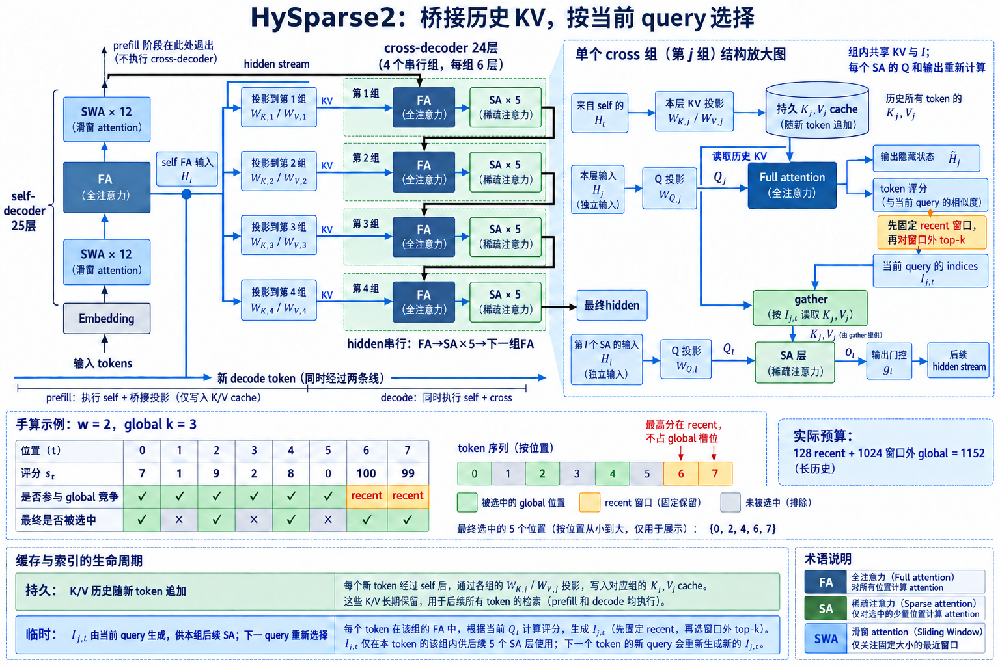

# HySparse 与 HySparse2: Oracle 索引、KV Reuse 和两级共享

[HySparse](https://arxiv.org/abs/2602.03560)从一个直接观察出发: full attention已经计算出真实attention分布, 它可以为后续稀疏层提供重要位置, 无需另训代理indexer. 一个hybrid block由一层full attention和随后 $N$ 层sparse attention组成. full层输出block-level importance与top-k blocks; 后续sparse层复用这些indices和full层KV, 同时保留一条独立SWA分支处理局部信息. [HySparse2](https://arxiv.org/abs/2609.26368)在内层KV Reuse外增加外层KV Bridging. 模型采用YOCO式self-decoder与cross-decoder: self-decoder使用hybrid SWA, cross-decoder使用hybrid sparse attention, cross-decoder的full层KV由self-decoder full层hidden states构造. Prefill因此可在self-decoder后结束, 跳过全部cross-decoder layers. 内层又将HySparse的block选择改成token选择, 去掉独立SWA分支, 改为把recent sliding window强制并入sparse候选. 两代方法的「共享」有明确层次. HySparse在同一个hybrid block内共享indices与global KV; HySparse2还跨decoder桥接full-layer hidden states和KV构造. 前者主要减少每层cache副本, 后者同时减少Prefill执行深度. 如果不区分内外两级, 很容易把cache容量下降误写成所有attention计算都同比下降.

## 1. HySparse 的 oracle 从哪里来

### 1.1. full layer 输出block importance

设full layer对query $t$ 的softmax权重为 $a_{t,s}$. 将key轴按大小 $B$ 分块, 第 $i$ 块位置集合为 $\mathcal B_i$. HySparse定义block score:

$$
S_t^i=\max_{s\in\mathcal B_i}a_{t,s}. \tag{1}
$$

再选top-$k/B$ blocks, 默认 $k=1024,B=64$, 即每个query选16个blocks. 对GQA, 同一query group内用group-wise maximum聚合scores, 让共享KV的heads使用相同indices. 这减少索引元数据并适配block sparse kernel. 式 (1)不是代理模型预测. score来自full attention已经计算的QK和softmax, 所以论文称full layer为oracle. 「oracle」只相对额外selector而言: 它准确反映该full layer自己的attention, 不保证后续sparse layers偏好完全相同. 方法依赖相邻层salient tokens稳定.

### 1.2. FlashAttention 怎样暴露score

标准FlashAttention不物化 $n\times n$ 权重. 它按tile计算logits, 维护行最大值 $m_t$ 和指数和 $\ell_t$. HySparse修改kernel, 保存每个key tile的row maximum, 再用全行统计缩放为block score. 输出 $S\in\mathbb{R}^{n\times\lceil n/B\rceil}$, 远小于token级矩阵. 这仍有工作区. 1M token且 $B=64$ 时, 每个query有15625个block scores; 对整段Prefill直接物化依旧很大. 论文算法说明block scores随full attention产生, 实际超长实现需要分块top-k、精度控制或工作区管理. 报告没有给出所有生产kernel细节时, 不能把「negligible overhead」外推到任意长度和硬件. block maximum偏爱块内一次强响应. 它适合召回唯一峰值, 对许多中等权重累积不敏感. 若用sum会偏向包含大量普通token的块. HySparse选择max并通过训练让后续层适应, 不是一个对所有任务都最优的无参数定理.

indices 如何跨层复用。
full layer为每个query产生block indices $\mathcal I_t$. 随后 $N$ 个sparse layers都使用同一 $\mathcal I_t$, 不再各自运行selector. 对第 $l$ 个sparse layer:

$$
(\tilde K,\tilde V)=\operatorname{Gather}(K^{full},V^{full},\mathcal I_t), \tag{2}
$$

$$
o_t^{sp,l}=\operatorname{Attn}(q_t^l,\tilde K,\tilde V). \tag{3}
$$

$q_t^l$ 来自当前层，被读 KV 来自前面的 full layer。各层保留自己的 query 与 attention output，只共享候选和历史 KV。当前层 query 会在候选内重新计算精确权重，因此可以改变候选内部排序，但无法访问集合外位置。

## 2. 内层 KV Reuse 与局部分支

### 2.1. global KV 为什么能共享

普通Transformer每层为全部历史保存独立KV, cache约随层数 $L$ 增长. HySparse只为hybrid block的full layer保存全长global KV; 后续sparse layers读取它, 不保存自己的全长KV. 若一组为1 full+N sparse, global KV副本数约降为原来的 $1/(N+1)$. 80B MoE实验有49层, full:sparse为1:11且第49层为full, 共5层full attention, 因而全长KV层数从49降到5, 接近10倍. 这是结构容量比, 还要加sparse layers的local SWA cache、indices与元数据. 论文表述为近10倍, 不应写成精确9.8倍端到端显存. 共享KV要求sparse layer学习使用上游表示. $q_t^l$ 与 $K^{full}$ 来自不同层, 参数需在预训练中共同适配. 这不是把已有模型某些layer cache指针改成同一地址就能保持行为的推理插件.

### 2.2. 为什么保留独立 SWA cache

每个HySparse sparse layer还有window $w=128$ 的SWA branch, 使用自己的 $K'^l,V'^l$. global sparse分支访问oracle blocks, local分支访问最近128个token. 两个输出经独立sigmoid gates相加:

$$
o_t^l=\tilde g_t^l\odot o_t^{sp,l}+g_t'^l\odot o_t^{swa,l}. \tag{4}
$$

论文消融发现独立SWA cache对表达力重要. full layer共享KV为global retrieval优化, 未必保存当前sparse layer需要的局部特征. 若local也复用同一KV, 容量更小, 质量下降. 因而HySparse的KV Reuse只覆盖global sparse branch. local cache容量约为每个sparse layer $w$ entries, 不随总上下文增长. 长度很大时相对开销小, 层数多时仍要核算. 两分支候选可能重叠, 但它们各自softmax再门控, 并非合成一个候选集合做统一softmax.

Prefill 与 Decode。
Prefill中full layer执行稠密FlashAttention并同时产生block scores, 付出平方计算. 后续N层只计算1024个global tokens对应的blocks加128 local window. full层比例越低,总体attention成本越接近稀疏层; full层仍是周期性平方锚点. Decode中full layer每步扫描全部历史KV并更新oracle indices; 后续sparse layers读取选中global blocks和各自local window. indices可立即供同一层组后续层使用. 随生成推进,每个新query重新产生indices, 不把早期query的选择永久固定. KV Reuse显著降低cache容量, 不消除full layer的全历史带宽. 1:11布局中每12层有一次full scan. Sparse layers的global gather为block连续地址, 比token随机gather更友好, 仍需按indices加载多个分散blocks.

## 3. HySparse2 的外层 KV Bridging

### 3.1. self-decoder 与 cross-decoder

HySparse2采用YOCO式两段decoder. self-decoder先处理输入并建立可共享状态, 使用hybrid SWA结构; cross-decoder随后读取由self-decoder提供的历史memory, 使用hybrid sparse attention. 外层桥接只围绕full-attention layers建立对应关系. 设 self-decoder 某个 full layer 的输入 hidden states 为 $H_f^S$，即进入该层 attention 之前的表示。 cross-decoder对应full layer的KV可由投影构造:

$$
K_f^C=H_f^SW_{K,f}^C,\qquad V_f^C=H_f^SW_{V,f}^C. \tag{5}
$$

式 (5)中的 K/V 投影属于 cross-decoder 的消费层；即使多个消费层读取同一份 self 输入，各自的投影仍能形成不同 KV。该 cross full layer 的 query 则从自己的当前输入产生。桥接共享的是来源表示，并没有把两个 decoder 的 query 也合并。[论文 §3.2 的式 (1)](https://arxiv.org/html/2609.26368v1#S3.SS2)明确区分了这两个输入。

### 3.2. Prefill 为什么可以早退

传统decoder Prefill必须依次执行全部层, 因为每层KV来自该层hidden states. KV Bridging打破这一依赖: self-decoder完成后, cross-decoder需要的历史full KV可批量从桥接hidden states构造. 因而prompt Prefill主干可在self-decoder结束, 不执行cross-decoder layers的token-by-token变换. 「跳过cross-decoder Prefill」不等于不生成它的KV. bridge投影和cache写入仍有成本, 只是省掉cross-decoder的attention、MLP与层间残差计算. 对长prompt, 这能同时降低TTFT计算; 对短prompt, 投影与系统开销占比更高. Decode仍要运行cross-decoder生成输出token. self-decoder处理新token并更新桥接状态, cross-decoderquery读取共享cache. 非对称负载契合agent场景: 长observation Prefill频繁, 每次action较短.

外层和内层怎样叠加。
外层KV Bridging决定cross-decoder full KV从哪里来; 内层KV Reuse决定一个full layer的KV供多少sparse layers共享. 两级结合后, 全部cross-decoder KV cache都可追溯到self-decoder full hidden states, sparse layers无需独立全长cache. cache容量不能只数cross-decoder. self-decoder hybrid SWA保留自己的状态, bridge full caches、cross-decoder indices、recent window与量化scale都占空间. HySparse2论文在80B-A3B模型上报告相对HySparse和Hybrid SWA降低Prefill计算与KV存储, 具体数字应按论文表格的序列长度、dtype和层数引用. 两级共享增加生命周期依赖. prefix cache命中时要同时恢复self-decoder状态与桥接KV; speculative分支发生分叉时, bridge状态也要按分支隔离. 论文未公开的服务策略不应自行补写.

## 4. 从 block 选择到 token 选择

### 4.1. HySparse2 为什么细化粒度

HySparse默认选16个64-token blocks, 总计1024 tokens. 一个关键token会带入63个邻居, 对连续访存有利, 也浪费预算. HySparse2改为token-level sparsity, 能把1024个槽位分配给分散的重要位置, 提升长文检索精度. token选择产生更不规则的gather. index存储从block IDs变成token positions, 主kernel需要按随机地址读KV. 如果cache分页, 物理事务数可能接近候选token数. 因此token级算法收益是否兑现取决于排序、page聚合和专用kernel.

### 4.2. recent window 如何并入候选

HySparse每个sparse layer有独立SWA branch和独立local KV. HySparse2删除这条分支, 改为强制recent window token进入sparse selection. 候选可写成:

$$
\mathcal W_t=\{\max(1,t-w+1),\ldots,t\},\qquad
\mathcal S_t=\mathcal W_t\cup\operatorname{TopK}_{j\in\{1,\ldots,t\}\setminus\mathcal W_t}(R_{t,j},k_g). \tag{6}
$$

随后在并集上做一次 sparse attention。**先保留最近窗口，再从窗口外选择 global top-k**，两部分互不重叠；历史足够长时共有 $k_g+w$ 个位置，短序列最多选择已有的 $t$ 个位置。local 与 global 共享同一次 softmax，与 HySparse 式 (4)的双分支门控不同。删除独立 SWA cache 节省每个 sparse layer 的 local KV，也改变局部表示的来源。HySparse2 通过强制 recent tokens 和训练适配补偿。[论文 §3.3](https://arxiv.org/html/2609.26368v1#S3.SS3)给出了这一选择顺序。

选择来源与刷新。
HySparse 的 indices 来自前一 full layer 的真实 attention block scores，在层组内复用。HySparse2 改用 full layer 的真实 attention scores 做 token top-k，后续 sparse layers 复用该层 KV 与当前 query 的 indices。每个新 query 都重新产生选择；持久历史 KV 可以跨生成步追加，上一 query 的 indices 不能直接充当新 query 的选择。

## 5. 训练、性能与失败边界

### 5.1. 原生预训练、缓存成本与失效边界

HySparse在7B dense模型使用1:3 full:sparse, 训练1T token、长度8192, 随后用200B token扩到32768; 80B-A3B MoE使用1:11, 训练500B token、长度32768. 两条分支、共享KV和oracle indices都在训练中存在. 因此结果说明这种结构可以原生训练, 不说明能无损改造任意checkpoint. KV来源跨层改变后, query投影和residual必须适应. HySparse2又加入decoder分段与bridge, 迁移难度更高.

缓存字节怎样核算。
普通GQA cache每token每层字节约为 $2H_{kv}d_hb_e$, $b_e$为每元素字节. HySparse全长global cache只在full层保存, sparse层另有 $w$ 长local cache. 总量近似:

$$
M\approx2B_{seq}H_{kv}d_hb_e\left(L_f n+L_sw w\right)+M_{idx}. \tag{7}
$$

$L_f$是full层数, $L_{sw}$是带独立SWA cache的sparse层数. HySparse2删除第二项对应的独立分支, 外层bridge又减少cross-decoder独立来源. 实际还要加page padding、scale与状态.

失效边界。
跨层saliency稳定是HySparse的核心假设. 后续层若需要oracle未选块, 只能通过local branch或下一full layer恢复. Full间隔越长, 错误持续层数越多. HySparse2 token选择更细, 仍受oracle来源和跨层稳定性限制. KV sharing的另一边界是表示错配. 上游full KV为自身query训练, 下游sparse query来自不同层. 共享组太长时, 表示空间可能偏离. gate可以降低不合适分支贡献, 无法生成候选外信息. Prefill早退依赖bridge能从self-decoder状态构造足够的cross-decoder memory. 对需要深层逐token加工的prompt信息, bridge压缩可能成为瓶颈. 长observation短action的agent负载最契合; 长输出时cross-decoder Decode计算仍逐token支付.

工程验收。
先固定hybrid block, 检查full score输出、top-k blocks、共享KV指针、SWA独立cache和gate. 再固定HySparse2两段decoder, 验证bridge生成cache与完整Prefill参考的差异. token候选去重、recent window和causal边界分别测试. 性能拆成full attention+score、top-k、sparse gather、SWA/union attention、bridge投影和cross-decoder跳过量. Decode记录每层组cache读字节和page数. 质量按layer测oracle recall、组尾误差、多证据与多轮agent任务. **HySparse用full层的真实attention换掉代理indexer, HySparse2再用两级KV共享换掉重复Prefill和cache.** 节省来自更少的状态副本与更少的执行层, 代价是层间表示和saliency必须稳定. 这条边界比单个top-k数字更重要.

用一个 block oracle 例子核对语义。
设历史只有8个token, block size为2, 某个query在full layer得到的注意力权重依次为

$$
(0.04,0.06,0.30,0.05,0.08,0.12,0.20,0.15).
$$

若block score取块内最大值, 四个块的分数是 $(0.06,0.30,0.12,0.20)$. top-2选择第二和第四块, 最终实际计算token 3、4、7、8, 覆盖的原始注意力质量为0.70. 这个例子说明oracle并不直接选择四个最大权重token: token 3会把同块的token 4一起带入, token 7也会带入token 8. 连续读取因此更规则, 预算却会消耗在同块邻居上. 如果把聚合规则换成块内求和, 四个分数变成 $(0.10,0.35,0.20,0.35)$, top-2在第二与第四块上仍不变. 但当一个块包含多个中等权重位置时, max与sum可能产生不同排序. HySparse公开设计使用从full attention中得到的block importance, 工程复现必须固定归约规则、GQA组间归约规则和并列分数的稳定排序, 不能只写「按块top-k」.

再把recent window设为最近两个token. 在HySparse中, global分支仍计算选中的第二、第四块, SWA分支独立计算token 7、8, 两个分支各自归一化后由门控融合. 第四块虽然重复出现, 也不能简单从一个分支删掉, 因为两条分支的softmax分母和输出投影语义不同. 在HySparse2中, recent token与global token先做集合并与去重, 再进行一次统一attention. 两代模型即使候选位置相同, 数学结果也不相同.

跨层误差应按组尾测量。
共享组第一层产生的indices通常对紧邻层最准确. 随着hidden states经过attention、MLP和残差更新, 下游query的偏好可能逐层漂移. 因此只报告整网平均recall会掩盖组尾退化. 更有效的测量是对组内相对位置 $r=1,2,\ldots,N$ 分桶, 计算复用候选相对于各层独立稠密attention top-k的召回率, 再同时记录候选外注意力质量:

$$
\epsilon_{l,t}=1-\sum_{j\in\mathcal S_{g,t}}A^{(l)}_{t,j}.
$$

$\epsilon_{l,t}$比单纯位置recall更接近输出误差: 漏掉一个低权重位置影响很小, 漏掉一个高权重位置影响很大. 测试集还应分别包含needle retrieval、长代码依赖、多轮对话和agent observation, 因为这些任务的注意力分布并不相同. 若组尾误差快速上升, 可缩短full间隔、扩大候选预算或对特定层单独刷新, 但每一种修复都会归还一部分计算或cache成本. 门控值也能作为诊断信号. 当global分支在组尾持续被压低而local分支权重上升, 可能说明复用indices或共享KV与当前层不匹配, 也可能只是当前任务更依赖局部信息. 因此要联合观察gate、候选外质量和任务正确率; 单个门控阈值无法区分这两种情况.

Prefill早退的依赖图与限制。
普通decoder的依赖链是「第 $l$ 层hidden states -> 第 $l$ 层KV -> 第 $l+1$ 层hidden states」, 所以prompt必须穿过全部层. HySparse2把依赖改成「self-decoder full hidden states -> bridge projection -> cross-decoder共享KV」. 当请求仍处于Prefill阶段时, cross-decoder无需为每个prompt token形成最终输出hidden states; 它以后在Decode阶段只需要访问已经桥接好的历史memory. 这项节省不能写成「后半网络永远不运行」. 每个新生成token仍要经过self-decoder与cross-decoder, cross-decoder的稀疏attention和MLP仍然存在. 因而收益随输入输出比变化: 长输入、短输出时, 被跳过的大量prompt层计算占主导; 短输入、长输出时, 逐token Decode重新成为总成本中心. 评测至少要报告 prompt length、output length、TTFT和每输出token时延, 单一端到端吞吐无法说明早退来自哪里.

服务系统还要把桥接状态纳入prefix cache键、请求分叉和回收协议. 共享前缀命中时, 仅恢复普通token ID不足以继续生成; 对应self-decoder状态、bridge生成的KV、位置编码状态和量化scale必须一致. speculative decoding回滚多个草稿token时也必须同步截断这些状态. 论文结构并不自动给出这些运行时策略, 实现者需要用逐token参考执行验证状态机.

token级稀疏的物理成本。
从block变成token后, 算术预算可以保持1024个候选, 但内存事务通常不会保持不变. 64-token block选择最多访问16段连续KV; 1024个离散token最坏可触及1024个page或cache line. 实际成本取决于候选是否排序、KV page大小、head布局、量化分组以及多个query能否复用同一批位置. 因此token-level sparsity的正确比较单位不只是selected tokens, 还包括unique pages、有效载荷字节与实际读取字节之比.

一种实现路径是先对 token indices 排序，按 page 聚合后加载，attention 输出再按逻辑位置应用因果掩码。排序与重排本身有成本，Decode 每步只有少量 query 时尤其敏感。另一种路径是在候选生成阶段鼓励局部聚集，以少量召回损失换更低事务数。两种实现分别测量 pages/query、DRAM bytes 和 TPOT；HySparse2 论文没有把其中一种规定为统一 kernel 路径。 量化还会改变成本核算. 若KV按固定通道组共享scale, 读取一个token可能必须一并加载相邻scale元数据; 若按page量化, 随机token会反复访问page header. 报告「KV元素字节」时应同时列出scale、zero point、索引和padding. 否则算法层的cache缩减比例无法对应设备侧显存占用.

训练规模能证明什么。
HySparse的7B实验经历8192长度的大规模预训练与32768长度继续训练, 80B-A3B实验则直接覆盖长上下文训练. 这些结果支持的结论是: oracle选择、KV Reuse与独立SWA分支可以共同进入原生训练并维持规模化优化. 它们不证明任意现有稠密checkpoint都能通过替换attention层获得同等质量, 也不证明更长上下文无需额外位置与数据适配.

迁移实验应把初始化策略拆开. query与输出投影可以从原模型复制, 上游full KV投影能否直接服务多个下游层则要通过蒸馏或继续训练适配; gate可从偏向局部分支或均衡值起步, 两者具有不同稳定性. HySparse2的self/cross分段更改了残差计算图, 仅复制同序号参数并不能保证函数接近. 如果没有官方转换脚本和对照结果, 应把它视为新架构训练问题. 最终验收要同时保留稠密teacher. 在固定prompt上比较logits、注意力质量与长任务正确率, 再逐步开启KV共享、indices复用、SWA合并、token选择和Prefill早退. 一次性打开所有开关即使出现退化, 也无法定位是表示共享、候选错误还是运行时状态问题.

与CSA2的结构差异。
HySparse2与CSA2都使用跨层共享, 但共享边界不同. CSA2在同一decoder的层组内共享主KV、索引器K和top-k结果, Full/Reindex/Reuse三种模式控制何时刷新索引与何时沿用候选. HySparse先以full attention本身充当oracle, 后续稀疏层复用该full层KV与indices; HySparse2再用self/cross decoder桥接减少Prefill执行和KV来源. 两者的候选粒度也不同. HySparse以64-token block换连续访存, HySparse2公开强调token级选择并把recent window并入统一集合. CSA2的层次化索引器先缩小候选池再做精排, 目标是避免对全历史执行昂贵选择. 因此不能把它们统一简化为「每若干层算一次top-k」: oracle来源、共享状态、刷新模式、局部分支和Prefill计算图均不同.

选型时可以问三个问题. 第一, 是否愿意让full attention层周期性承担平方扫描并提供真实saliency; 第二, 是否需要长prompt在decoder中途早退; 第三, 硬件更适合连续block还是离散token gather. 答案分别决定HySparse的full间隔、HySparse2的桥接价值以及候选粒度的物理收益. 若缺少目标硬件profile与原生训练资源, 只比较论文中的理论稀疏率不足以作出工程判断.

在线调度与回退。
HySparse的full层会周期性产生比sparse层更高的计算与带宽峰值. 若多个请求在相同decode step同时进入full层, 设备负载可能出现规则尖峰. continuous batching可以按当前层模式重排microbatch, 但不能改变单个请求的网络顺序. 调度器需要在吞吐、等待时间和cache驻留之间权衡, 并单独记录full与sparse层的队列时间. block indices跨层复用时应携带来源full层、query position、有效历史长度和GQA组标识. prefix cache命中后, 新请求只能复用前缀范围内已验证的indices; 新增长度仍需由当前full query刷新. speculative decoding发生回滚时, oracle结果、SWA尾部与共享KV有效长度必须一起截断. 只回滚token计数会让后续sparse层读到未来位置.

HySparse2多出self/cross边界. 请求迁移到另一设备时, 不能仅传传统逐层KV, 还要传self-decoder状态、bridge产生的共享memory、token候选和recent window. 这些状态应拥有统一版本号. 若任何组件缺失, 安全回退是从可验证前缀重新Prefill, 而不是拼接不同版本的cache. 质量回退可以缩短full间隔、扩大global预算或临时执行更密集attention. 三者分别增加全域扫描、gather和主attention成本. 系统应在上线前测出每种回退的显存峰值, 否则大量异常请求同时进入dense路径会造成容量雪崩. 公开论文没有规定生产回退协议, 这些属于部署时必须自行验证的边界.

监控还应把算法与物理指标配对: oracle覆盖质量对应选中blocks或tokens, 跨层漂移对应组内位置, 稀疏预算对应unique pages与实际读取字节, Prefill早退对应跳过的cross层数和TTFT. 只有这种配对才能区分模型退化、索引错误和kernel效率不足. 回归集合还要覆盖block边界与recent window边界. 序列长度取63、64、65等邻近值, 能暴露末块padding和因果掩码错误; window刚好与global block相交时, 可验证HySparse双分支是否保持独立语义, HySparse2并集是否正确去重. 多个GQA query heads共享一组KV heads时, 还需确认block importance的组间归约与候选广播一致. 这些边界错误往往只影响少数位置, 但会在长生成中逐步放大.

长序列压力测试应逐级提高并发, 观察共享cache是否真正降低每请求驻留量, 同时核对候选页数量没有随碎片化异常增长. 质量、显存和时延三者必须来自同一个checkpoint与同一组请求, 避免把不同配置的最佳数字拼接成不可复现的结论.

### 5.2. 从 YOCO 到 HySparse2 的两级共享

*图 1：结合 [HySparse2 v1 Figure 2 与式 (1)](https://arxiv.org/pdf/2609.26368v1)展开两级共享。左侧蓝线从 self full 层输入分出，经过各消费层的独立 K/V 投影；黑线表示 FA→SA×5→下一组 FA 的串行 hidden stream。右侧 gather 读取持久 KV，indices 则由当前 query 产生，各 SA 层重新计算自己的 Q 与输出。下方八位置表是本文手算，位置从 0 编号；128 recent 与 1024 窗口外 global 是论文实验预算。主干图省略 MLP 与残差细节。 [查看原尺寸](./images/hysparse2-two-level-sharing-v4.png)。*

YOCO 提供了哪一块积木。
YOCO 在 2024 年提出 self-decoder 与 cross-decoder：前段通过高效 self-attention 形成全局 KV，后段用 cross-attention 反复读取，因此历史 cache 不随后段层数重复增长。它还指出 prefill 可以在 self-decoder 后结束，因为 cross-decoder 不需要为 prompt 的每个位置继续生成会被缓存的独立 self-attention KV。 HySparse2 沿用生产者—消费者的两段式依赖，但外层 **KV Bridging 只桥接 full-attention layers**。self-decoder 采用 hybrid SWA，cross-decoder 采用 hybrid sparse attention；cross-decoder 的 full-layer KV 由 self-decoder 对应 full-layer hidden states 构造。桥接关系可以写成

$$
(K_j^{cross},V_j^{cross})=\Phi_j(H_{b(j)}^{self}), \tag{25}
$$

$b(j)$ 指定 cross full layer 对应的 self full layer，$H_{b(j)}^{self}$ 指该 self 层的输入表示，$\Phi_j$ 是消费层专属投影。一个 self full layer 可以服务多个 cross full layers，数据来源共享，消费者仍保留自己的投影空间。 YOCO、CED 与 HySparse2 都使用两段式状态复用，具体边界并不相同。YOCO 给出通用 decoder-decoder 结构；DeepSeek-V4.1-Flash 的 CED 与 CSA2、压缩 KV 和 Reindex/Reuse 配合；HySparse2 在外层桥接 full layers，内层继续使用 full-attention oracle 与 KV Reuse。

外层桥接与内层复用各省什么。
外层 KV Bridging 减少 cross-decoder 为长 prompt 重复执行和缓存的工作。内层 KV Reuse 则发生在一个 full+sparse 层组：full layer 产生真实 attention saliency、global KV 和 indices，后续 sparse layers 直接使用。两级状态写成

$$
\mathcal B=(H^{self}_{full},K^{bridge},V^{bridge}),\qquad
\mathcal R_g=(K_g^{full},V_g^{full},I_g). \tag{26}
$$

$\mathcal B$ 的生命周期跨越 self/cross 边界，$\mathcal R_g$ 只服务某个 hybrid group。更新、迁移和回滚必须分别知道两级版本，再由同一 prefix hash 把它们绑定起来。 内层共享本身无法让 prefill 跳过 cross-decoder，因为普通 HySparse 的 sparse layer 输出仍是下一层输入。外层桥接重写了依赖：cross full KV 由 self hidden states 直接构造，prompt 历史不必先穿过整个 cross-decoder 才拥有可供 decode 使用的 cache。prefill 节点与 decode 节点可以据此分工。

HySparse 到 HySparse2 的三处结构变化。
第一处是 block 到 token。HySparse 选择 16 个 64-token blocks，共 1024 token 槽位；关键 token 会带入整块邻居。HySparse2 使用 token-level sparsity，将槽位分配给分散证据。算法预算更精准，物理执行则需要处理排序、page 聚合和随机 gather。 第二处是局部通路。HySparse 的 sparse layer 同时拥有 global sparse branch 与独立 SWA branch，两条分支各自 softmax，再由 gate 融合；SWA KV 每层独立保存。HySparse2 取消独立 SWA branch，把 recent window 强制加入统一 sparse candidate set：

$$
S_t=\mathcal W_t\cup S_t^{oracle},\qquad S_t^{oracle}\subseteq\{1,\ldots,t\}\setminus\mathcal W_t. \tag{27}
$$

合并后只进行一次 attention，recent token 与远程 token 共享分母。它减少独立 local KV 与级联依赖，也改变了数学语义，因此不能把一代 checkpoint 的 SWA branch 直接删除后称为二代结构。 第三处是 self/cross decoder。HySparse 在单一 decoder 内周期性插入 full layers，所有层参与 prompt prefill；HySparse2 增加外层 bridge，使 cross-decoder 的历史 KV 从 self-decoder hidden states 获得。三处变化分别作用于候选粒度、局部缓存和计算图。

MiMo-V3 与发布时间边界。
HySparse 论文于 2026 年 2 月 3 日公开；HySparse2 于 2026 年 9 月 22 日公开。MiMo 官方论文目录提供 HySparse 系列材料，HySparse2 的公开叙述面向长程、多轮 agent 负载，并以 80B-A3B MoE 研究模型验证两级共享。关于 MiMo-V3 采用 HySparse2 的表述，应绑定官方模型发布或技术报告；论文团队与架构方向一致，可以确认技术来源，未发布模型的最终层数、训练配置和服务实现不能从研究论文自动推出。 时点也解释了两条路线为何看起来相似。DeepSeek-V4.1-Flash 于 2026 年 9 月 10 日发布，HySparse2 论文在 9 月 22 日公开；两者都吸收 YOCO 式前后段复用，并分别发展出 CSA2/CED 与 KV Bridging/KV Reuse。相近公开时间只能说明研究趋势汇合，不能据此推断一方复制另一方。

两级 cache 的字节统计。
假设模型共 49 层，self-decoder 25 层、cross-decoder 24 层，全模型有 5 个 full layers。普通逐层 GQA 每 token cache 单位记为 49。HySparse 只让 5 个 full layers 保存 global KV，另有 44 个 sparse layers 的短 SWA cache；忽略窗口长度差异时，全局项约降到 $5/49$。 HySparse2 的 outer bridge 让 cross full caches 从 self hidden states 构造，inner reuse 让 sparse layers 不新增 global KV，独立 SWA branch 又被取消。缓存统计应包含 self-decoder 状态、bridge full KV、token indices、recent candidates、量化 scale 和 page padding，不能只数 5 份 global KV。 取上下文 $n=1{,}048{,}576$、recent window $w=128$、token budget $k=1024$。每个 sparse layer 在历史足够长时读取 1024 个窗口外位置和 128 个 recent 位置，共 1152 个，约为全历史的 0.1099%。若按 16-token 页统计，最近窗口对齐时占 8 页；1024 个全局位置最分散时各占一页，合计最多 1032 页。全部候选集中且对齐时只需 72 页。同样的候选数，物理访问范围仍有很大差异。

Prefill 早退与 decode 补算。
Prefill 早退并没有删除 cross-decoder 参数，也没有让生成只使用 self-decoder。prompt 历史在 self-decoder 形成可桥接状态；decode 新 token 仍要经过 cross-decoder，query 从 cross hidden states 产生，并读取桥接的历史 KV。部署应分别报告 TTFT 与 TPOT，前者受 early exit 影响更大。 若 cross full KV 采用按需投影，首次 decode 可能承担 bridge materialization；若在 prefill 末尾批量投影，则 TTFT 包含这部分成本但首 token 更稳定。论文级 FLOPs、服务端计时边界和 cache 落盘策略要使用同一选择，否则「prefill 少一半」与实测 TTFT 对不上。

失败模式与对照实验。
外层失败表现为 bridge hidden states 缺少某类远程细节，所有消费它的 cross layers同时受影响。内层失败表现为 full oracle 在层组开头合理，随后 query 语义变化使 indices 陈旧。token gather 失败则质量正常、物理页数和 TPOT 异常。三者分别用 bridge oracle、组尾 recall 与 pages-per-query 定位。 对照实验包含：完整 HySparse2；关闭 outer bridge、让 cross-decoder完整 prefill；保留 bridge但每层独立 global KV；token selection 改回 64-token block；forced recent 改成独立 SWA branch。每项同时记录质量、prefill FLOPs、TTFT、KV bytes、TPOT 与物理 pages，才能知道收益来自计算图、cache 还是候选粒度。 正确性测试覆盖 bridge 层映射、一个 self full layer服务多个 cross full layers、recent 与窗口外 oracle 候选的互斥、尾页、GQA/MQA 候选共享和跨设备迁移。恢复会话时，self state、bridge projections、inner indices 与 recent window 任一版本不一致，都应触发重新 prefill，而非拼接继续生成。

一次两级版本更新。
设 self-decoder 的第一个 full layer 产生状态版本 $B_7$，三个 cross full layers 分别通过 $\Phi_1,\Phi_2,\Phi_3$ 构造 KV。内层第一个 cross full layer又产生 oracle indices $I_{7,1}$，供随后 5 个 sparse layers 使用。服务端保存的依赖可写成

$$
B_7\rightarrow\{K_1^c,K_2^c,K_3^c\},\qquad
(K_1^c,I_{7,1})\rightarrow\{L_2^s,\ldots,L_6^s\}. \tag{28}
$$

模型热更新后，bridge projection 从 $\Phi_1^{v1}$ 变为 $\Phi_1^{v2}$，旧 $K_1^c$ 已失效；由它产生的 indices 也不能继续复用。只比较 prefix token hash 会错误命中旧 cache，因此 cache key 还需包含模型权重版本、bridge 版本、候选规则与量化格式。 多轮 agent 会在旧 prefix 后追加 observation。self-decoder 先增量更新自己的状态；bridge full KV 是否能只追加新位置，取决于 $\Phi_j$ 是否逐 token 投影且不依赖未来窗口。inner oracle 则在新的 full query 到来时刷新，recent window 随位置滑动。append、fork 和 rollback 都要同时作用于 outer 与 inner 两层状态。

Prefill 计算量的拆分例子。
假设 49 层模型按 25 层 self-decoder、24 层 cross-decoder 划分。普通全路径 prefill 每个 prompt token 经过 49 层；HySparse2 early exit 让 prompt 主干只经过前 25 层，层数项约为 $25/49=51.0\%$。这不是端到端 TTFT 恰好减半，因为 self/cross 层算力不同，bridge projection、MoE、通信和 cache 写入仍然存在。 将总 prefill 时间写成

$$
T_{pre}=T_{self}+T_{bridge}+T_{cache}+T_{comm}+T_{fixed}. \tag{29}
$$

HySparse 的对照则包含 $T_{self}+T_{cross}$，但内层 KV Reuse 已减少某些 attention 成本。对比时按算子记录，而非仅按层数乘平均值。长 prompt 下 attention 与 KV 写入占比上升，early exit 收益更明显；短 prompt 下固定调度与 MoE 可能主导。

token 级选择的质量—物理成本曲线。
保持总预算 1024 token，构造三种候选：完全聚集在 16 个连续 64-token blocks；均匀分布在 64 个 pages；分散到 1024 个 pages。算法读取 token 数相同，物理事务、页表项和 top-k indices 长度差异很大。记录证据 recall、pages/query、L2 hit 与 TPOT，得到质量—分散度曲线。 block 版本再以 16 个 64-token blocks 作为对照。若 token selector 的质量只提升少量，却让 pages/query 增长数十倍，目标硬件可能无法兑现算术收益；若 agent 证据本来就碎片化，block 带入大量无关 token，token 路线的召回与字节都可能占优。结论依赖数据分布，平均 top-k 数不能代替候选空间结构。 forced recent window 在选择全局候选之前就已固定。1024 个全局位置从窗口外选出，最近 128 个位置不会挤占这 1024 个槽位；长序列的总预算是 1152。比较不同实现时，必须统一这一预算口径。

一张继承关系表。
| 结构 | 历史生产者 | 选择信号 | 跨层共享 | 局部通路 | Prefill 路径 |
|---|---|---|---|---|---|
| YOCO | self-decoder | 结构决定 | 全局 KV 供 cross-decoder | self-decoder 高效 attention | self 后可结束 |
| HySparse | 周期性 full layer | full attention oracle | 组内 KV 与 block indices | 独立 SWA branch | 全部层执行 |
| HySparse2 | self full layers | full attention oracle | Bridging + 组内 Reuse | forced recent tokens | self 后可结束 |
| CSA2 + CED | causal encoder / Full mode | 层次化 indexer | main KV、indexer K、indices | 独立配置的局部状态 | encoder 后桥接 |

这张表揭示了 HySparse2 对两条前序路线的组合：它接收 YOCO 的两段生产—消费关系，也保留 HySparse 的 full oracle 与组内复用；token 级候选和 forced recent 又修改了一代的 block+SWA 数据流。MiMo-V3 若由官方报告确认采用该结构，具体模型配置仍应落回层数、head、预算与 bridge mapping，研究架构名称本身不足以补齐部署参数。

## 6. Oracle 表示、误差传播与路线比较

### 6.1. Oracle 分数、候选提取与表示能力

Oracle 路线的工程含义。
**Oracle 并不要求保存完整 attention 矩阵。**

Full layer已经逐 tile计算 QK、softmax与 AV. 若只是为了给后续层生成 block或 token重要性, 可以在在线 softmax过程中同步维护摘要, 无需把 $n\times n$ 概率写回 HBM. Block oracle可对每个 query block、key block累计概率质量或最大值; token oracle则需要更细的逐位置候选, 控制数据明显更大. 以块概率质量为例, 对 query行 $i$、key块 $b$ 定义:

$$
u_{i,b}=\sum_{j\in b}\alpha_{ij}. \tag{30}
$$

FlashAttention在 tile内已经得到局部指数与全局归一化统计, 可以把 tile贡献缩放到最终分母后累加 $u_{i,b}$. 若只取 top blocks, 局部累计后还要跨 tile合并. 这条辅助路径增加 reduce、候选缓冲和写入; 「来自 Full attention」表示它没有代理排序误差, 不表示提取索引零成本. Token oracle更接近对每行 attention概率做 top-k. 若把概率逐项写出再选择, 会失去 FlashAttention避免平方中间量的优势. 融合 top-k需要在 tile流过时保留候选, 大 $k$ 会产生寄存器与共享内存压力. 工程实现也可以先按块保留宽候选, 再在候选块里做 token精排; 这又成为两级选择, 需要分别测块召回和 token召回.

**Oracle 的语义随聚合方式变化。**

一个 Full layer包含多个 query heads与许多 query位置. 后续 sparse layer若共享同一批历史 token, oracle必须把这些维度聚合. 对 head取最大值能保留专用 head峰值, 求和偏向多 head共同关注的位置; 对 query block求最大值照顾任意一个 query, 平均值偏向整块稳定热点. 不同聚合规则都来自真实 Full attention, 候选含义仍然不同. HySparse组内后续层的 query已经变化. Oracle描述的是 Full layer当时的注意力, 不是后续层的真实 top-k. 跨层共享误差由两部分组成: 聚合把 Full layer多维分布压成候选, 层间变化又让该候选逐渐陈旧. 评测可以先比较 Full层聚合候选对自身各 head的覆盖, 再比较对组内第 1、2、3个 sparse layer稠密教师的覆盖, 两步能区分聚合误差与时间漂移.

**Full 层比例影响吞吐波形。**

周期性 Full layer让平均计算下降, 单层延迟并不均匀. 请求执行到 Full layer时要计算完整 attention、生成 oracle并刷新共享状态; 后续 sparse layers较轻. 多请求 continuous batching若恰好在同一层同步推进, Full开销会形成周期峰值. Pipeline parallel还可能让持有 Full层的 stage成为瓶颈. 部署配置应按 stage累计 Full与sparse工作量, 而非只让每个 stage拥有相同层数. 调度器能把处于不同模型层的 microbatches交错时, 可平滑部分峰值; 常规逐层批处理则无法任意错开. 报告平均TPOT之外, 还要看层级 profiler和高分位, 否则周期峰值会被平均值隐藏. Full比例降低会减少oracle刷新和全局KV份数, 组尾候选也更陈旧. 增加比例提高质量并增加计算与cache. 因而层间隔应与组尾recall、KV bytes和stage时间共同扫描. 只比较两个总参数量相同的模型, 无法解释收益来自Full层数量还是其他训练差异.

**多轮会话的 fork 与 rollback。**

Agent服务经常从同一前缀分叉多个候选轨迹. Outer self状态、bridge KV和inner indices都可以在分叉点前共享, 分叉后必须各自追加. 若使用copy-on-write页, 候选索引里的逻辑位置保持不变, 物理页映射随分支变化; kernel必须在每个请求自己的block table下解释位置. 回滚到较早turn时, recent window、未满压缩组和最新oracle一起截断. Oracle候选即使只引用回滚点前的位置, 也可能由回滚后query生成, 仍然失效. 安全规则是按oracle生成时的逻辑query长度设版本, 当前长度小于该版本就丢弃并等下一Full层重建. Prefix共享还要区分只读历史与可变会话状态. 多个分支可以引用同一bridge KV页, 不能共同修改量化scale或增量摘要. 页成为只读后再共享, 当前尾页各分支独占. 这与普通Paged KV原则相同, HySparse2多了oracle和两级bridge依赖, 元数据也要遵循相同引用计数.

**逐层验收比最终生成对比更有效。**

固定一个短序列, 让Full层显式输出oracle, 再分别运行稠密参考与组内稀疏路径. 每层保存候选集合、概率质量覆盖、hidden-state余弦和最大绝对误差. 若误差在第一个sparse layer突增, 检查聚合、recent合并与去重; 若逐层缓慢扩大, 检查indices陈旧和共享KV表达; 若跨bridge边界立即出现, 检查投影、位置与量化. 最终生成token可能因argmax margin大而暂时一致, 也可能因很小的logit变化立即分叉. 它适合端到端回归, 不适合定位. 层级记录只在离线测试保存, 线上则聚合候选页数、oracle年龄、组尾覆盖抽样和各模式时间, 避免记录用户内容.

Oracle 分数究竟提供了什么。
**Oracle 只对产生它的那一层精确。**

Full layer 已经计算了自己的 query-key logits 与 softmax，因此从这张注意力图提取重要位置时，没有代理 indexer 的拟合误差。这里的“oracle”有严格边界：它准确描述 Full layer 当前 heads 的注意力分布，却不知道后续 sparse layer 的 query 会如何变化。后续层复用 indices 的依据是层间重要位置具有统计稳定性，而非数学恒等。 设 Full layer 的聚合分数为 $s_j^{(0)}$，第 $l$ 个 sparse layer 若独立运行 full attention，其教师分数为 $s_j^{(l)}$。共享集合 $S^{(0)}$ 对第 $l$ 层的概率质量覆盖为

$$
M_l=\sum_{j\in S^{(0)}}p_j^{(l)}. \tag{9}
$$

$M_0$ 很高是 top-k 构造的直接结果，$M_l$ 才决定 oracle 能否跨层使用。随着层距增加，residual stream 改写 query，Full 层的高分块可能逐渐失去相关性。实验要按组内位置画 $M_l$，不能只报告 Full 层自身召回。 Oracle 还有教师偏差。Attention 权重高表示当前层大量读取某位置，不保证该读取对最终预测具有因果作用；某些 sink tokens 会持续获得高权重，却不承载任务证据。训练能够让模型适应这种选择，但“来自真实 attention”仍不等于“来自真实任务重要性”。对候选做屏蔽干预、观察目标 logit，才能区分相关性与作用。

**Block max 的召回偏好。**

HySparse 将一个 block 内的 token attention 取最大值。若块中存在单个尖锐峰值，max 能让整块进入候选，适合 needle、实体和代码定义。若证据由许多中等权重 token 共同组成，单个最大值不突出，块可能落后于包含偶然尖峰的干扰块。Max 聚合优化的是“块里有没有一个很强位置”，并不衡量块的总贡献。 考虑两个 64-token blocks。A 中一个 token 权重为0.04，其余接近0；B 中16个 token各为0.01，总质量0.16。Max score让A以0.04排在B的0.01之前，尽管B的总概率质量更高。若任务要复制单个 token，A可能更有价值；若任务依赖段落语义，B更重要。选择聚合与信息形态存在匹配关系。

可以同时保存 max 与 sum 的低维统计，再由小函数组合；也可以取 top-r token质量，兼顾尖峰和分布。额外统计会增加 FlashAttention tile 的归约状态与写出带宽。HySparse 选择 max 的价值在于简单、可从 tile 最大值自然导出，并与 block sparse kernel 对齐；它不是所有任务下唯一合理的 oracle。

**Softmax 后分数与 logit 分数。**

Softmax 权重受整行归一化影响。相同局部 logit 在短上下文可能占据较高概率，长度增长、干扰项增加后概率下降。直接使用 logits 排序时，行内 top-k 次序与 softmax一致；跨heads或跨query聚合时，尺度与温度不同又会影响组合。HySparse从实际attention统计中得到分数，天然继承主层的归一化口径。

对GQA head group取最大值，能保护任一 query head 的强需求，但也会让一个高方差 head 支配整个组。平均值更平滑，却可能淹没专门负责远程检索的 head。应按 head 统计覆盖，检查共享 block集合是否长期服务少数尖锐heads，并让其他heads只能在不相关候选中重排。 量化或近似 softmax还会在 block cutoff 附近改变顺序。由于indices在多个后续层复用，一次边界翻转会传播整个hybrid block。测试既要比较block score数值，也要看第 $k/B$ 名与下一名的margin；margin很小时，精度变化比平均误差更重要。

从 FlashAttention 提取候选。
**在线 softmax 中的 block 统计。**

FlashAttention按query tile与key tile流式计算。对一行query，它维护当前最大logit $m$、归一化和 $\ell$ 与输出累积量。处理新tile时先更新 $m$，再按 $e^{m_{old}-m_{new}}$ 重标定旧累积。若要输出最终softmax意义下的block max，tile统计同样要经过最终行最大值与分母校准。 设block $b$ 的最大logit为 $u_b=\max_{j\in b}z_j$，整行softmax分母为 $Z=\sum_j e^{z_j}$. 对应block max probability为

$$
s_b=\frac{e^{u_b}}{Z}. \tag{10}
$$

同一query行内按 $s_b$ 排序与按 $u_b$ 排序完全一致，因此若indices只在行内选择，可以跳过除以 $Z$。跨heads聚合概率时则未必，因为每个head有自己的 $Z_h$。实现必须与论文的group聚合口径一致。

**不能物化完整 block-score 矩阵。**

长度 $n$、块长 $B$ 时，score矩阵有约 $n^2/B$ 个元素。$n=1{,}048{,}576$、$B=64$ 时，每个query对应16384个blocks，全矩阵超过170亿项。即使用FP16也无法作为普通中间张量长期保存。候选提取必须tile化、分批top-k或只为当前Decode query保留一行。 Prefill可以在处理每个key tile时更新局部top-k，随后归并各tile候选。若block与FlashAttention key tile对齐，block max无需额外读取logits；不对齐时要跨tile合并同一block统计。局部top-k大小至少覆盖最终block数，否则某tile内部提前裁剪可能丢掉全局候选。

分层归并的临时空间约随query tile数与局部候选数增长，远小于完整矩阵，仍要计入峰值显存。Full layer已经是周期性重计算点，如果候选提取迫使attention输出落盘再二次扫描，所谓“免费oracle”就不成立。融合程度要由profile确认。

**Top-k 与主输出的同步。**

Full attention输出和oracle indices来自同一次计算，两者必须对应相同mask、RoPE、head grouping与精度。若为候选另跑一遍简化QK，任何配置差异都会让indices不再代表实际Full输出。最可靠接口是在Full kernel完成一行时同时提交attention output和block候选。 异步流水可能让indices生成滞后。后续sparse层只有拿到当前query的集合才能执行，候选归并会成为层间依赖。把top-k放在CPU或单独小kernel可能增加launch与同步；融合过深又增加register和shared memory压力。算法只规定数据依赖，最优切分依硬件而定。

确定性同样重要。相同block分数并列时，不同归并顺序可能返回不同indices。训练重算、tensor parallel和prefix cache恢复都需要一致tie规则，通常以block ID作为次关键字。否则候选抖动会表现成难以复现的数值噪声。

Block 选择的表示能力。
**连续读取为何对硬件友好。**

选择一个64-token block后，KV地址连续，GPU可以合并内存事务，并用规则tile完成QK与PV。Token-level top-k的1024个位置可能散落到1024个pages，逻辑FLOPs相同，物理延迟却更高。Block稀疏牺牲部分候选精度，换取规整读取与kernel利用率。 有效利用率可定义为选中token中真正位于token级教师top-k的比例。若16个blocks只各含一个重要token，1024个读取中只有16个有效，算法利用率1.56%；但连续kernel仍可能比随机读取1024个token更快。质量利用率与硬件利用率方向可能相反，比较时两者都要给出。 候选blocks若相邻，还能合并成更长连续段，进一步减少地址元数据。若分散，block ID虽少，页面事务仍多。记录唯一page数、连续段数与平均段长，比单纯报告16 blocks更能解释延迟。

**块边界会制造不连续性。**

两个相邻重要token若恰好跨block边界，会占用两个候选blocks；同样两个token落在同一block只占一个。将序列整体平移一位，理论内容不变，选择预算却可能变化。这种相位敏感性在固定分块方法中无法彻底消除。 重叠blocks、交错两套分区或让边界对齐文档结构可以缓解。重叠会重复KV与计算；双分区增加oracle统计；语义边界长度不规则，kernel规整性下降。更简单的训练增强是随机改变packing offset，让模型见过不同相位，但它只能提高鲁棒性，不能消除容量差异。 测试应把单点证据放在块首、块中与块尾，把双证据放在同块和跨块，并保持其他内容一致。若跨边界质量显著下降，增加block预算可能有效；若任何位置都失败，问题更可能在跨层oracle或共享KV。

**Block size 的三方权衡。**

减小 $B$ 提高选择粒度，block score数量与indices开销增加，连续kernel tile也更小。增大 $B$ 降低元数据、提高连续读取，却带入更多无关token。固定总token预算 $k$ 时，选中block数为 $k/B$，更小B还需要更大的top-k归并。 Full layer候选提取成本约与 $n/B$ 个block统计相关，Sparse Attention实际QK仍处理k个token。B主要改变oracle元数据和有效候选构成，不直接改变固定k下的理论主attention FLOPs。物理吞吐则会随tile形状变化。 合理B应在目标硬件上扫描，并同时报告任务质量、候选有效率、top-k时间和Sparse kernel时间。论文默认64是具体模型与kernel的选择，不能视为跨硬件常数。

双分支为何比简单并集更有表达力。
**两次 softmax 表示两种归一化空间。**

HySparse的global sparse branch与local SWA branch各自softmax，再经sigmoid gate相加。Global分支的概率只在选中blocks内归一化，local分支只在最近窗口内归一化。即使同一token同时出现于两边，它会以两套key/value表示和两种分母贡献。 若把两组候选简单并集后做一次softmax，global高logit可能压低全部local权重，反之亦然。双分支门控让模型分别计算“从远程候选取什么”和“从局部上下文取什么”，再决定通道强度。它增加投影、cache与融合成本，也保留了层自己的局部表达。 式 (4)的sigmoid gates不要求两者和为1，因此输出可以同时放大或同时抑制。若改用二元softmax gate，强制竞争会改变表达。复现时必须确认gate形式、维度和初始化，不能把所有混合attention都写成凸组合。

**独立 local KV 补偿共享 global KV。**

Sparse layer的query来自当前层，而global KV来自上游Full层。共享历史表示节省cache，却可能缺少当前层刚形成的局部特征。独立SWA KV由当前层输入投影，保留最近token的层特异表示，给每层一条更新鲜的读路径。 这种设计把长期与短期记忆采用不同生命周期：global KV每个hybrid block写一次并服务多层，local KV每层写入但只保存窗口。长期容量随Full层数和序列增长，短期容量随Sparse层数与固定窗口增长。长上下文下后者相对较小，却对表达力重要。 消融local分支后质量下降，不能简单归因于少了128个token，因为同时失去了独立投影和单独归一化。可做三步对照：并入recent tokens但仍读共享KV；为recent tokens保留独立KV却统一softmax；完整双分支。三者才能拆出地址、表示与门控的贡献。

**Gate 如何暴露分工。**

按层、位置和任务统计gate能观察模型是否形成预期分工。普通续写可能local gate较高，远程问答在答案位置global gate升高；代码闭括号依赖局部，跨文件定义依赖global。只看全局平均会把这些条件行为抹平。 Gate饱和也可能是警报。某层global gate长期接近0，说明共享候选或KV没有被使用；长期接近1而local gate低，独立SWA成本可能没有转化为能力。对 $o=g o_{branch}$，分支输出的梯度乘以 $g$，而 sigmoid 门控参数的梯度还包含 $g(1-g)$。因此 $g$ 接近 0 会压低该分支梯度；$g$ 接近 1 主要让门控自身难以更新，并不会自动压低另一条独立门控分支的梯度。初始化与正则是否需要调整，应结合梯度统计和任务消融判断。 候选漏选时，local分支只能救回窗口内信息。远程关键位置不在oracle blocks，gate再高也无效。把gate当成selector容错器会夸大它的能力；它解决的是通道组合，不扩展global候选集合。
