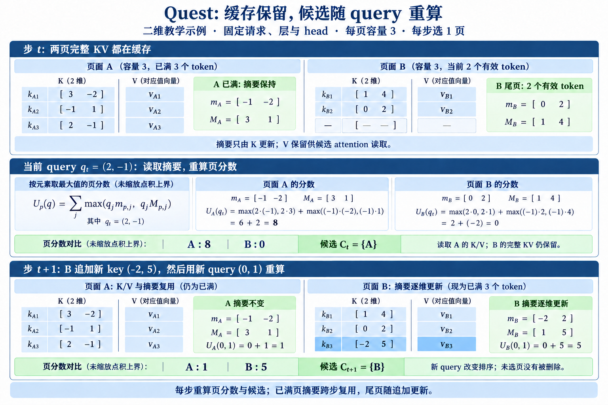

# KV 读取与驱逐

长上下文 Decode 中，QK 点积数量之外，每生成一个 token 都要重新读取历史 KV，这部分流量常常成为主要瓶颈。围绕这项成本形成了两条看似相近、风险完全不同的路线。读取选择保留完整 cache，只为当前 query 加载部分页或 token；缓存驱逐则让一部分 KV 永久离开可访问状态。前者主要压缩每步流量，后者同时压缩容量和流量。把二者都叫“KV 稀疏”会掩盖最重要的差别：漏选能否在下一步恢复。

设完整历史有 $n$ 个位置，每页含 $P$ 个 token，当前步选择 $k$ 页。选中页均已填满时, 读取覆盖 $kP$ 个位置;尾页未满时只计算有效位置，完整 KV 容量仍为 $n$；驱逐方法若只保留 $m$ 个位置，则容量上界变成 $m$，之后任何 query 都无法访问其余 $n-m$ 个位置。选择预算、页大小和保留槽数分别控制不同对象，评测时不能拿读取比例替代容量压缩率。

## 1. 按需读取: 完整状态仍然存在

读取选择先为 KV 建立低成本摘要，用当前 query 给摘要打分并选出候选页，随后加载页内原始 K/V, 在候选有效token内计算QK、softmax与AV. softmax的分母只覆盖候选集合, 整体输出仍是完整attention的近似.摘要必须比读取完整 KV 便宜，否则选择过程已经支付了原成本。页是自然的系统粒度：地址连续，可以与分页 KV cache、DMA 和块状 kernel 对接；代价是候选页内未必每个 token 都有用。

Quest 为每页 key 维护逐维最小值和最大值。给定 query 后，每一维按 query 符号选择能让点积最大的边界，从而得到页内任意 key 点积的上界。按上界选择 top-$k$ 页，再对候选中的原始 K/V计算attention.上界不会低估该页最大点积，但 top-$k$ 上界并不保证完整 softmax 的概率质量全部保留：包围盒可能很松，让实际无关页获得高上界，也可能因预算有限丢掉多个中等分数页的累计质量。

这种路线每一步都能重新选择，因此某页在当前 token 未被读取，不妨碍后续 query 再访问。完整 cache 仍然随上下文增长，显存容量问题没有消失。若把冷页放到更慢层级，选择器还要承担预取时机和迁移延迟；若所有 KV 都留在 HBM，收益主要来自减少单步读取字节。分页布局、GQA 共享和 batch 中不同请求的页表长度会影响最终 kernel 效率。

> 图 1: Quest 的两步教学示例展示页摘要复用、尾页追加和候选变化; 方法依据 [Quest v2](https://arxiv.org/abs/2406.10774v2) Figure 5 与 Algorithm 1, 数值为二维手算, 使用未缩放点积上界. [查看原尺寸](../images/quest-cache-state-v2.png).

图 1 解析:

- 第一步 query 为 $(2,-1)$, A、B 两页的上界分别为 8、0, 因而读取 A. B 的原始 K/V 仍在缓存中.
- 下一步 B 追加 key $(-2,5)$ 及对应 value, 更新逐维 min/max. 新 query 为 $(0,1)$, 两页上界变为 1、5, 候选转为 B. 即使不追加新 key, 新 query 下 B 的旧上界 4 也高于 A 的 1, 因而这次排序变化不能全部归因于追加.
- 已满的 A 页复用摘要, 当前 query 的页分数与候选仍需重算. 这里固定请求、层和 head, 没有表示跨层共享.

## 2. 永久驱逐: 在状态生命周期上做决定

驱逐路线给 cache 一个固定或分段预算。新 KV 到来时，系统选择保留哪些旧状态，并回收其余槽位。最近窗口通常单独保留，因为刚出现的 token 尚未积累足够统计；窗口外再按历史重要度选择。H2O 使用累计 attention 识别反复被访问的 heavy hitters, 并把它们与最近 token 共同留在 cache 中. 当前输入的K/V先进入临时候选并参与本步attention, 然后更新分数与窗口, 驱逐后的保留集合交给下一步. 固定容量约束针对步间保留状态;当步临时候选可多出一个位置.

累计 attention 是对过去访问的经验估计。它适合稳定反复出现的锚点，却可能错过“此前从未被需要、很久以后突然关键”的 token。驱逐一旦发生，后续 query 无法重新评价原始 KV，除非系统另有外存回载或文本重算机制。因而容量收益伴随不可恢复风险，评测必须覆盖延迟依赖、主题切换和一次性远程证据，而不能只看局部困惑度。

驱逐还涉及位置语义。物理槽被复用后，逻辑 token 位置、RoPE 相位、页表和累计分数要一起更新；只回收 K/V 数组而保留错误元数据，会产生难以察觉的注意力错位。多层是否独立驱逐、GQA heads 是否共享保留集合、beam 或并行采样如何复制状态，也会改变实际容量。

> 图 2: H2O 的单层单 head 教学示例展示容量 6 下从临时候选 7 项到下一步缓存 6 项的变化; 方法依据 [H2O NeurIPS 2023](https://proceedings.neurips.cc/paper_files/paper/2023/file/6ceefa7b15572587b78ecfcebb2827f8-Paper-Conference.pdf) Figure 3 及[官方缓存更新实现](https://github.com/FMInference/H2O/blob/main/h2o_hf/utils_real_drop/modify_llama.py), 数值为手算示例. [查看原尺寸](../images/h2o-eviction-state-v2.png).

图 2 解析:

- 第 11 步先追加当前位置的 K/V, 临时候选包含 7 项. 本步 attention 权重之和为 1, 当步输出使用这 7 项的 value.
- recent 窗口保护位置 9、10、11. 位置 8 离开窗口, 与位置 1、3、5 一起竞争; 更新后累计分数 0.38 最低, 因而被驱逐.
- 下一步只携带位置 1、3、5、9、10、11. 位置 8 的 K/V 与累计分数一起删除, 其余位置保留原始编号;后续 query 无法像 Quest 那样把位置 8 重新选回.

## 3. 两条路线怎样组合

| 比较对象 | Quest读取选择 | H2O缓存驱逐 |
|---|---|---|
| 步间保存什么 | 完整KV及页摘要 | heavy与recent的保留KV及累计分数 |
| 当前步如何选 | 当前query读取摘要, 重算页上界与Top-K | 在临时候选上计算attention, 更新累计分数后淘汰 |
| 未选位置的下一步 | KV仍在, 可重新进入候选 | 被驱逐KV已删除, 无法直接重新访问 |
| 主要压缩对象 | 候选读取字节与attention计算 | 步间保留容量及相应读取 |

**读取预算决定当前访问, 保留预算决定未来还能访问什么.** 页摘要和累计分数都来自KV的访问过程, 保存的却是不同时间尺度的信息. Quest根据新query重算排序, H2O利用过去的访问累积决定状态去留;组合时这两份状态仍要各自维护.

读取选择与驱逐可以串联：先用容量策略保留一个较大的工作集，再从工作集中为每个 query 选择少量页。这样总容量由保留集上界决定，每步流量由读取预算决定。组合并不会自动得到两者优点，因为第一级误删的信息第二级无法找回；两级索引还会叠加维护成本。正确的误差分解应先测驱逐后的 oracle 读取，再测真实读取选择，从而区分状态缺失和索引漏召回。

它们也可以与动态 attention 路由共享索引器。某层的候选 token 若能跨层复用，可以降低重复检索；表示随深度漂移时，复用候选会积累偏差。页级摘要若按物理 cache 建立，驱逐和页迁移必须同步更新摘要版本。状态所有权、刷新时机和失效协议是组合设计的一部分，不是实现细节。

## 4. 质量与系统分别测量

读取选择至少报告候选页数、实际 token 数、候选 recall、保留 attention mass、索引时间、KV 读取字节与 TPOT。驱逐至少报告峰值 cache、保留窗口、驱逐命中率、后续重新需要已删 token 的比例以及长依赖任务质量。组合路线还要报告每级 oracle：完整 KV 加 oracle 候选、驱逐后加 oracle 候选、最终真实系统。三条结果之间的差距能定位损失发生在哪一层。

服务侧要固定 batch、序列长度分布、KV 精度、页大小和硬件。只在单请求上测随机页读取，可能低估并发下页表合并与缓存命中；只报平均延迟，又会掩盖少数请求因大量跨页候选出现的尾延迟。容量与带宽必须分别画曲线，才能看出方法是在延后 OOM，还是在相同容量下提高生成吞吐。

选择与驱逐还要在多轮生成中持续更新。首个生成 token 的 query 来自 Prompt 末尾，后续 query 已混入模型刚生成的内容；候选分布会随回答展开而变化。只测第一步容易高估复用同一候选表的可行性。连续记录几十到几百个 Decode 步骤，才能看见页集合的周转、摘要更新成本与驱逐错误是否累积。

[Quest 页级选择](./3.1.1-Quest页级选择.md)完整推导 min/max 上界、页预算和物理读取，[H2O 缓存驱逐](./3.1.2-H2O缓存驱逐.md)分析 heavy hitter 统计、最近窗口与固定槽位。阅读两篇时始终保留一个判断：当前方法只是这一步没有读某段历史，还是已经让这段历史永远消失。这个问题决定了可恢复性，也决定了实验应该怎样设计。

## 5. 查询变化为何重要

同一段历史对相邻 query 的价值可能稳定，也可能突然改变。代码补全常在局部变量与远程定义之间切换，长对话会在当前话题和很早的约束之间跳转。读取选择每步重新评分，可以响应这种变化；驱逐统计依赖过去，天然存在滞后。测试集若让所有后续 query 反复询问同一主题，会偏向 heavy hitter；若只出现一次突发远程查询，又会偏向完整保留。两类序列都应出现，才能看清状态策略。

页大小提供一个明确权衡。页面越大，摘要与页表越小、读取越连续，页内浪费越多；页面越小，筛选更精确，元数据和随机访问增加。应在固定总长度与相同硬件上扫描页面大小，并记录每个候选页的有效 token 比例。最优点通常随 batch、head dimension 和存储层级改变，不宜写成算法常数。

驱逐预算也不必只有一个池。最近窗口、长期 heavy hitters、任务指定锚点和可回收区可以分槽管理，但每增加一个池都减少其余部分的自由度。公平实验要把总槽数固定，并与统一 top-score 保留、纯窗口和随机保留比较。若分池方案更稳，可以进一步检查收益来自哪种依赖，而不是把所有提升笼统归因于“混合缓存”。
