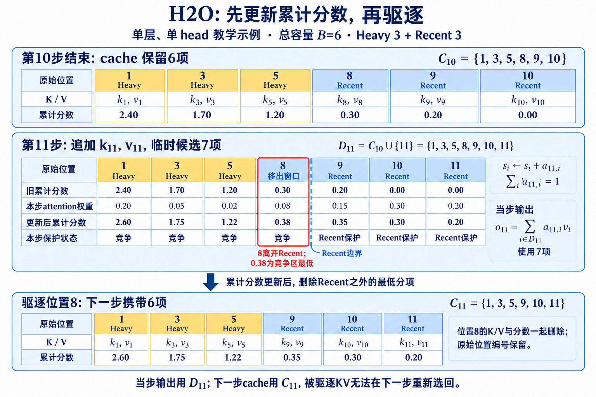

# H2O: 用累计注意力保留Heavy Hitters

Decode每生成一个token, 每层都会新增一组K/V. 对层数 $L$, KV head数 $H_{kv}$, head维度 $D$, 元素字节数 $b$, 单请求长度 $N$ 的裸KV容量为

$$
M_{KV}=2L H_{kv}DNb.
$$

前面的2来自K和V. batch变大后再乘请求数. H2O处理的就是这项随长度线性增长的状态: 每层只保留固定数量的位置, 新KV进入时驱逐一个旧位置, 同时尽量保住后续生成还会反复读取的token. 论文观察到attention质量集中在少量位置, 并把这些位置称为「Heavy Hitters」, 简写为H2. 只看最近窗口会丢掉远距高频位置; 只看累计高分又会让新token来不及积累. **H2O把固定容量拆成长期累计与最近窗口两部分。** 这个组合看着简单, 真正需要理解的是分数来自哪里、驱逐发生在何时、删掉以后计算图怎样变化.

## 1. 从完整KV到固定容量状态

### 1.1. 完整Decode保存了什么

设第 $t$ 步query为 $q_t$, cache中的key和value为 $k_i,v_i$, $i\le t$. 单head attention为

$$
a_{t,i}=\frac{\exp(q_t^\top k_i/\sqrt D)}{\sum_{j\le t}\exp(q_t^\top k_j/\sqrt D)},
\qquad
o_t=\sum_{i\le t}a_{t,i}v_i.
$$

完整cache保存所有 $(k_i,v_i)$. 历史query不需要保存, 因为下一步只用新query与全部历史keys计算分数, 再加权values. KV cache降低了重复投影成本, 却把每一步读取量变成 $O(t)$. 长Decode下, 显存容量限制batch, HBM读取又限制单步时延. H2O给每层每个评分单元一个容量 $B$. 评分单元可以是attention head, 也可以按KV head聚合一组query heads. 第 $t$ 步驱逐后留下的集合记为 $C_t$, 满足 $|C_t|\le B$. 当前输入位置的KV先追加为临时候选 $D_t=C_{t-1}\cup\{t\}$, attention在 $D_t$上归一化; 驱逐随后决定下一步携带哪些状态:

$$
\widehat a_{t,i}
=\frac{\exp(q_t^\top k_i/\sqrt D)}{\sum_{j\in D_t}\exp(q_t^\top k_j/\sqrt D)},
\qquad i\in D_t.
$$

删除位置会改变softmax分母, 留下位置的权重随之重新归一化. 因此驱逐不是把完整attention中若干小项置零这么简单. 一次删除会影响当前输出, 当前输出又影响下一token和后续所有query.

### 1.2. Heavy hitter怎样定义

论文先用完整attention分析稀疏性. 对每一行, 大部分位置的权重很小, 少量位置获得主要质量. 它用行最大值的1%作为分析阈值时, 在OPT与WikiText-103实验中观察到超过95%的attention entries落在阈值以下. 这项统计说明权重分布稀疏, 还没有回答哪些位置应该跨步保留. 跨步保留依赖累计贡献. 对仍在cache的位置 $i$, 局部分数写为

$$
s_i^{(t)}=\sum_{u=i}^{t} \widehat a_{u,i}.
$$

位置 $i$从自身所在的因果attention行开始可见. 累计式中, 未进入当步 $D_u$ 的位置按权重0处理; 驱逐后不再为它累加. 每一步把当前attention权重加到已有分数上. 分数高说明该位置已经多次参与输出, 它是在线可计算量. 与之对应的oracle可以统计未来所有query对位置 $i$的权重, 但真实生成时未来query尚未出现, 只能用于事后分析. 累计分数有明显年龄偏置. 若位置 $i$和 $j$每一步平均获得相同权重, 更早出现的 $i$拥有更多累加次数. 这个偏置不全是缺点: 长期稳定被访问的位置正是H2O想保存的对象. 当任务在很久以后才第一次引用某个早期细节时, 年龄不会帮助它, 因为过去权重一直低.

两份预算各自补什么。
把总容量写成 $B=B_h+B_r$, $B_h$留给heavy hitters, $B_r$留给recent tokens. 论文系统实验采用均分策略, 20%总cache预算意味着heavy-hitter与recent各占约10%的完整长度, 不是额外再加20% heavy hitters. recent区域 $R_t$包含最近的 $B_r$ 个位置. 这些位置暂不参与低分淘汰. 更早的候选集合按累计分数选择 $B_h$ 个, 记为 $H_t$. 最终

$$
C_t=H_t\cup R_t,
\qquad |C_t|\le B.
$$

recent区域给新token一个观察期. 新位置刚出现时累计分数接近0, 如果立刻和老heavy hitters竞争, 几乎必然被淘汰. 它在最近窗口内接受后续query的attention; 离开窗口时, 已积累足够分数的位置才有机会进入 $H_t$. 只留recent相当于滑动窗口, 远距高分位置会被时间推进删除. 只留heavy hitters会压制新信息. 论文Table 9比较了两种单边策略, 只保留一侧时不同任务下降约2.85%到22.75%, 说明两部分承担的功能不能互换.

## 2. 一步驱逐怎样执行

### 2.1. 更新顺序

在第 $t$ 步开始前, cache中有 $C_{t-1}$. 新token的KV追加后形成候选 $C_{t-1}\cup\{t\}$. query在当前候选上计算attention, 得到各位置权重. 系统更新累计分数, recent窗口向前移动; 若容量超限, 从recent之外删除累计分数最低的位置. 更新顺序影响结果. 若先驱逐再计算当前attention, 新query无法给即将删除的位置末次贡献; 若先算attention再驱逐, 当前输出仍使用容量超限后的临时候选. H2O Algorithm 1的在线形式每一步最多驱逐一个位置, 与每步新增一个KV相配. 实现必须固定顺序, reference和kernel采用同一语义. 可把状态写成三组数组: `keys[B,D]`、`values[B,D]`、`score[B]`, 外加原始位置和recent标志. 追加后若没有空槽, 选中victim槽位原地覆盖可以避免整体搬移. 但逻辑顺序不再等于物理顺序, RoPE位置、因果mask和输出调试都必须使用原始位置元数据.

### 2.2. 一个容量为6的手算

设总容量 $B=6$, 其中 $B_h=3,B_r=3$. 第10步结束后保存旧位置 $[1,3,5]$作为heavy hitters, 分数分别为 $[2.4,1.7,1.2]$; recent保存 $[8,9,10]$, 分数为 $[0.3,0.2,0]$. 第11步加入位置11, attention在7个候选上的权重依次为

$$
[0.20,0.05,0.02,0.08,0.15,0.30,0.20].
$$

累加后分数变成

$$
[2.60,1.75,1.22,0.38,0.35,0.30,0.20].
$$

recent窗口更新为 $[9,10,11]$. 位置8离开recent, 与旧的 $[1,3,5]$竞争3个heavy-hitter槽. 四者分数为位置1的2.60、位置3的1.75、位置5的1.22、位置8的0.38, 因而删除位置8. 新cache是 $[1,3,5,9,10,11]$. 下一步若位置8才第一次变得关键, 它已经无法被注意. 这正是在线驱逐的不可逆性. 若位置5随后长期不再被访问, 它仍可能凭1.22的历史累计值占据槽位许多步. 累计和稳定, 也会产生“早期高分残留”. 可以改用衰减分数缓解残留, 但那已经改变H2O规则, 需要重新验证质量.

> 图 1: 总容量6, heavy与recent各3项的教学手算. 金色表示长期保留区, 蓝色表示最近窗口, 红框表示移出最近窗口后被驱逐的位置8. 机制参照 [H2O NeurIPS 2023 Figure 3 与 Algorithm 1](https://proceedings.neurips.cc/paper_files/paper/2023/file/6ceefa7b15572587b78ecfcebb2827f8-Paper-Conference.pdf);当前步先计算attention再返回裁剪cache的顺序对应[官方真实驱逐实现](https://github.com/FMInference/H2O/blob/main/h2o_hf/utils_real_drop/modify_llama.py). 数字沿用上面的教学示例, 不代表实验结果. [查看原尺寸图片](../images/h2o-eviction-state-v2.png).

图 1 解析:

- 位置8原来受recent保护, 窗口向前移动后才参与竞争. 即使它本步的0.08权重大于位置5的0.02, 累计分数0.38仍低于位置5的1.22, 因而被删除. 淘汰比较的是更新后的累计分数.
- **当前输出使用7项临候选, 下一步携带6项保留状态.** 红框位置的value仍参与本步 $o_{11}$, 随后它的K、V与累计分数一起退出cache;下一步query已经无法再读取它. 表中1、3、5等编号是原始位置, 不是连续物理槽号.
- 分数0.35、0.30、0.20对应的9、10、11虽然低于位置8, 本步仍受recent保护. 新位置11在自身attention行获得0.20, 进入窗口时已开始累计, 无需等待下一步才有分数.

多head与GQA。
MHA中每个query head拥有自己的K/V, 可以独立维护分数和保留集合. 这样最贴合各head的attention模式, 代价是索引数量多、每head物理布局不同. 如果把所有heads的分数求和后共用一套位置, cache更规则, 少数专用head的重要位置可能被平均掉. GQA中多个query heads共享一个KV head. 物理K/V只有一份, 最终驱逐必须对共享KV作出一致决定. 可先把组内query heads对同一位置的权重求和或取最大, 再更新KV head级分数. 求和偏向被多个heads共同使用的位置, 取最大更愿意保护单个专用head. 论文早于今天大量GQA部署, 复现到GQA模型时要公开聚合定义. batch中的请求不能共享驱逐集合. 即使共享同一prefix, 后续query不同, attention累计分数会分叉. Prefix cache在分叉前可以共享只读pages; 一旦任一请求驱逐或覆盖槽位, 需要copy-on-write或独立页表. 否则一个请求会删除另一个请求仍需访问的KV.

理论目标与直觉边界。
**动态子模问题。** H2O把KV选择写成动态子模优化. 对保留集合 $S$, 目标函数度量这些位置对attention输出的累计贡献. 子模性描述边际收益递减: 已经保留许多有用位置后, 再加入一个位置的额外收益不会变大. 在容量约束下, 贪心选择通常能得到常数近似保证. 论文Theorem 4.4在给定假设下给出与 $(1-\alpha)(1-1/e)$相关的保证, 其中 $\alpha$描述动态近似或局部评分与目标之间的误差. $1-1/e$来自经典单调子模最大化的贪心界. 这项结果说明局部在线评分在结构假设成立时不会任意差, 没有保证任意模型、任意序列上保持原输出.

理论目标和语言模型质量之间还有一层距离. 保住attention质量不等于保住任务答案; 很小的权重也可能携带唯一证据. 另一方面, 删除位置后softmax重新归一化, 未来query本身也随生成token改变. 理论分析需要对这种动态过程作假设, 实际错误会沿自回归序列累积. **为什么频繁共现会形成H2。** 论文把heavy hitters与token共现联系起来. 某些分隔符、主题实体、指令片段或结构位置会被许多后续token反复注意, 累计分数自然集中. 这和网页访问中的热门对象相似之处只在统计形式: 少数位置获得多数访问质量. 具体语言功能仍需通过head、层和上下文分析, 不能把高累计分数直接解释成语义重要性.

attention sink也会累积高分. 序列开头位置可能因softmax行为吸收多余概率, 即使其value贡献有限. H2O会把这类位置识别为heavy hitters并保留, 从输出稳定性看可能有益; 从“内容相关性”解释则容易出错. StreamingLLM直接固定保留开头sink, H2O通过实际attention统计留下它们. **三类失效样本。** 第一类是延迟首次引用. 早期放入一串随机ID, 中间经过大量无关生成, 很晚才要求复述. ID在被询问前可能没有attention质量, 离开recent后容易被删. 第二类是阶段切换. 前半段反复使用的实体积累高分, 后半段任务突然转向另一组早期信息, 老heavy hitters继续占槽.

第三类是分数与value影响不一致. attention权重高只表示读取得多, 输出影响还取决于value方向以及后续投影. 某位置权重不大, 却可能沿关键方向改变logit. 仅按 $a_{t,i}$累计无法识别这种少量高影响事件. 更复杂的value-aware评分会增加计算, 也会改变理论目标.

## 3. 从算法走到真实cache

### 3.1. 分数并不免费

朴素attention会显式形成 $a_{t,i}$, 对列累加只需一次reduce. FlashAttention一类kernel在片上分块计算logits、softmax统计和AV, 通常不把完整attention weights写到HBM. H2O若在kernel外读取权重, 就要额外物化一个随上下文增长的向量; 若在kernel内归约分数, 需要修改forward kernel并处理多个query heads对KV head的归并. Decode每步query少, attention受带宽限制. 新增一次分数读改写、victim选择和索引更新, 可能在中短上下文占据明显比例. 长上下文下缩短KV读取才逐渐覆盖固定开销. 性能曲线应扫描长度, 找到相对完整cache的交叉点. 累计分数本身占用较小. 若每层每个保留位置存FP32分数, 相对bf16 K/V增加约 $4/(4D)=1/D$ 的裸容量, $D=128$时不到1%. top-k工作区、head级索引、原始位置和页表会额外增加. 真正难点通常是写分数和重排KV, 不是分数数组容量.

### 3.2. Page粒度的矛盾

PagedAttention按固定页管理KV. H2O逐token删除, 一页中只要还有一个保留token, 物理页就不能回收. 若保留位置分散, 逻辑上只剩20% token, 却可能仍占大部分pages. 对每层、每head使用不同集合还会破坏页共享和连续读取. 解决办法之一是按page评分并驱逐整页. 令页 $P$ 的分数为页内token分数之和、最大值或top-$m$之和. 求和偏向长页和分散小权重, 最大值会让一个热点保护整页. 页越大, 内部浪费越多; 页越小, 页表和调度开销越大. 这是算法粒度与分配粒度的共同参数. 另一种办法是压实. 每隔若干步把保留token重新打包成连续pages, 更新映射. 对单层搬移字节近似为 $2BH_{kv}Db$, 所有层再乘 $L$. 压实间隔短, 搬移频繁; 间隔长, 空洞继续占显存. 压实还要和异步batch调度同步, 避免kernel读取正在移动的page.

位置编码与原始位置。
删除中间KV后, 其余位置仍来自原序列. 对RoPE, key通常已经按原位置旋转, query也按当前原始时间步旋转; 保持原位置即可维持相对相位. 若为了固定窗口把cache重新编号, 必须保存未旋转key并重新应用位置, 或明确采用position rolling. 直接修改位置编号而不重算key会产生不一致. ALiBi依赖query与key位置差, 需要保留原始position IDs计算bias. 绝对位置embedding已经在hidden state中注入, KV搬移不应再次添加. cache槽号只表示物理地址, 不能替代语义位置. 手算正确但长序列质量异常时, 第一项检查就是position IDs是否随压实被错误改写.

Beam search与speculative decoding。
Beam search中多个beam从同一前缀分叉. 分叉后的attention分数不同, heavy-hitter集合随之不同. 共享前缀KV仍可只读共享, 分数和驱逐元数据需要beam独立; beam重排时两者必须一起重排. 只重排KV页表而漏掉score数组, 下一步会按另一个beam的历史删除位置. Speculative decoding会暂时追加一批draft tokens, 验证后可能回滚. 每个临时query已经给旧位置增加attention分数, 若拒绝后只截断KV而不回滚分数, 未被接受的路径会永久影响heavy hitters. 实现可为验证段保存score增量并在回滚时减去, 或延迟到token确认后再提交分数与驱逐. 后者需要临时容量容纳验证段.

## 4. 实验数字与相邻方法

### 4.1. 质量对照

论文在OPT、LLaMA和GPT-NeoX上覆盖语言建模、zero-shot任务、摘要和长生成. [会议版Table 1](https://proceedings.neurips.cc/paper_files/paper/2023/file/6ceefa7b15572587b78ecfcebb2827f8-Paper-Conference.pdf)中, PiQA的Full、Local、H2O分别为80.09、57.94、79.22; COPA对应81.00、56.00、85.00. 这组数字显示recent-only在该设置下降明显, 加入heavy hitters后接近完整cache. Table 2的OPT-30B、20%总cache预算实验中, COPA完整cache为85.00; Local without H2为48.00, Local with H2为84.00. 这里“with H2”指把预算的一部分交给heavy hitters, 并非在20%窗口之外再保留完整高分集合. 预算口径若读错, 会低估实际KV数量. 摘要任务也展示出同样趋势. 论文报告LLaMA-13B在XSUM、LLaMA-7B在CNN-DM上, local策略即使保留60% cache仍会明显退化, H2O用20%预算保持接近完整cache. 摘要需要回看prompt不同位置, recent窗口很难独立完成. 这些结果不能简化成“20%适用于所有模型”. 层、head、任务和生成长度都会改变attention集中程度. 固定比例意味着绝对槽位随输入长度变化; 固定槽位则让比例随长度下降. 部署需要明确采用哪一种容量定义.

### 4.2. 吞吐与时延

摘要中的最高吞吐提升分别相对DeepSpeed Zero-Inference、Hugging Face Accelerate和FlexGen达到29倍、29倍与3倍, 来自OPT-6.7B和OPT-30B等特定系统配置. 大倍数的重要背景是压缩KV后可以使用更大batch或避免offload, 不是单条请求attention算子直接快29倍. Table 3在T4、输入512加生成512、OPT-30B设置中, Accelerate吞吐约0.6 samples/s, H2O约18.83. Table 4的XSUM、OPT-6.7B上, FlexGen约10.80, H2O约30.40. 两组分别对应摘要中约29倍和3倍的量级, 系统基线不同. Table 5在A100、输入2048加生成2048、OPT-6.7B同batch对照中, 延迟从99.5秒降到53.5秒, 吞吐从494.1升到918.9 tokens/s, 对应约1.9倍. 同一表中更大batch时FlexGen出现OOM而H2O仍能运行, 说明容量释放会改变可用batch上限. 数字复现需要固定模型、输入与生成长度、batch、dtype、offload、硬件和基线版本. 若只引用最高倍数, 很容易把“从OOM或重度offload恢复”误写成纯kernel加速. 单请求时延、固定batch吞吐和最大batch吞吐应分三列报告.

与量化和StreamingLLM组合。
H2O选择保留哪些token, KV量化减少每个保留token的字节数, 两者作用轴不同. 论文Table 6展示与4-bit量化组合. 若原始KV每元素16 bit, 20%位置再用4 bit, 裸数据相对完整bf16可降到约5%; scale、zero point、分组和对齐会让真实比例更高. 论文附加实验还把H2O与StreamingLLM思路组合, 在PG-19上测试到4M token. 组合的含义是固定保留sink或流式局部结构, 再以heavy-hitter策略管理其他位置. 这不能把模型的精确检索窗口自动扩展到4M; 长流式困惑度稳定与任意位置事实召回是两项能力.

与相邻方法放在同一坐标。
**StreamingLLM。** StreamingLLM保留少量开头sink和最近窗口, 选择集合只由位置决定. 它无需读取attention分数, cache更新规则固定, 适合持续流式生成. 窗口外普通内容被永久删除, 远距事实不会因曾经高attention而留下. H2O的recent部分与滑动窗口相似, 另外用累计分数动态保留远距位置. 若heavy hitters恰好包含开头sink, 两者保留集合会部分重合, 机制仍不同. 一个依赖固定位置, 一个依赖历史attention统计. **Scissorhands。** Scissorhands提出importance persistence hypothesis: 当前重要的token往后仍倾向重要. 它在固定预算下维护pivotal tokens, 并以概率方式保留重要位置. H2O使用累计attention分数和动态子模表述, recent与heavy-hitter预算划分更直接. 两者都依赖过去预测未来. 评测时应加入阶段切换与延迟引用, 观察持久性何时失效. 只用局部语言建模平均困惑度, 容易掩盖少数不可恢复的远距错误.

**SnapKV。** SnapKV在prompt末端取observation window, 用这些queries对prompt位置的attention投票, 经一维pooling后按head保留成簇位置. 评分主要发生在Prefill结束, 随后压缩prompt cache. 官方实现默认观察窗32、总容量2048、pooling kernel 5, 实际参数可调整. H2O逐步更新, 对长Decode中新出现的heavy hitters有适应能力; SnapKV无需每个Decode step维护累计统计, 适合prompt很长、生成相对短的情形. 若把SnapKV扩展到生成期重新评分, 更新频率、分数累计和recent保护都要重新定义. **Quest。** Quest不删除KV. 它为每个page维护key各维min/max, 用当前query计算页得分上界, 只读取Top-K候选页, 在候选有效token内计算QK、softmax与AV; 候选内重新归一化使整体输出成为稠密attention的近似. 候选页当步未入选, 下一步仍可重新被选中. H2O删掉位置后, 后续query无法恢复.

因此两者的内存与带宽收益不同. H2O能降低物理KV容量, 前提是驱逐能释放page; Quest主要降低每步读取和attention计算, 完整cache容量仍随长度增长. 可以先用H2O控制容量, 再在剩余cache上用Quest筛页, 但误差会叠加: 第一层删除决定信息是否存在, 第二层选择决定当步是否读取.

## 5. 复现、实现与上线

### 5.1. 小 shape 正确性与状态生命周期

先用单层、单head、容量6到16的FP64参考实现. 每一步保存完整候选、attention权重、累计分数、recent集合、victim和输出. GPU实现逐项对比, 不只比较最终logits. 并列分数需要固定规则, 例如分数相同时优先保留较新或较小原始位置; 否则不同top-k实现会产生不同序列. 构造四组样本: 均匀attention检查年龄偏置, 单一远距热点检查heavy-hitter保留, 热点突然切换检查残留, 延迟首次引用检查不可恢复删除. 再加入GQA, 让组内heads偏好不同位置, 验证聚合规则和共享KV一致.

状态生命周期。
cache元数据至少包含原始position ID、物理page与offset、累计分数、recent边界和有效长度. Prefix共享、beam复制、speculative回滚、请求取消和page回收都要同时更新这些字段. 任何一个字段落后, 模型可能继续运行却读取错误KV. 驱逐日志不必保存所有attention, 但应能采样记录victim位置、分数、年龄、所在层/head和当步边界margin. margin是最低保留分与最高删除分之差. margin长期接近0说明集合对低精度与并列规则敏感, 同一请求可能因kernel归约顺序改变而分叉.

性能拆解。
固定同一模型与请求分布, 依次测完整cache、只做逻辑mask、真实token驱逐、page驱逐和带压实的实现. 逻辑mask只验证质量, 不会释放内存; token驱逐若未减少pages, 容量收益也可能很小. 每项记录attention kernel、分数更新、victim选择、page管理和复制耗时. 显存分成模型权重、有效KV、page内部碎片、score与indices、排序workspace和运行时保留区. 吞吐分别报告固定batch和最大可用batch. H2O的主要系统收益之一就是提高可容纳batch, 这项收益不能混进单请求kernel速度.

质量回归。
预算从完整cache逐步降到40%、20%、10%和5%, prompt长度与生成长度独立扫描. 任务至少覆盖摘要、检索、代码、对话约束和长推理. 对每项同时记录答案质量、生成长度、困惑度或logit差异以及驱逐统计. 压缩导致生成更长时, KV变小不一定降低总推理成本. 对照组包括recent-only、heavy-only、sink+recent、随机驱逐和完整cache. recent-only显示远距内容损失, heavy-only显示新token冷启动, sink+recent区分内容heavy hitters与固定sink, 随机策略给出无信息选择的下界. 所有方法使用相同总槽位和相同page粒度.

**H2O最有价值的地方, 是把KV管理从“保留最近多少”推进到“根据真实访问历史分配固定容量”.** 它同时留下两个明确代价: attention统计必须进入kernel或产生额外流量, 被删状态无法恢复. 只有当逻辑驱逐真正释放物理显存、质量曲线覆盖目标任务时, 固定容量才会转化为部署收益.

把公式落实为可运行的数据结构。
**每层状态与更新复杂度。** 设batch为 $B_s$, KV head数为 $H_{kv}$, 每个head缓存容量为 $C$, head维度为 $D$. 连续槽位实现保存

$$
K,V\in\mathbb{R}^{B_s\times H_{kv}\times C\times D},
\quad
S\in\mathbb{R}^{B_s\times H_{kv}\times C},
\quad
P\in\mathbb{Z}^{B_s\times H_{kv}\times C},
$$

其中 $S$是累计分数, $P$是原始position IDs. 另有一个布尔mask标记槽位是否属于recent区域. 每步attention读取 $C$ 个KV, 分数更新为 $O(C)$, 从eligible位置找最小分数也为 $O(C)$; 使用top-k或分段选择不会改变读取全部分数的事实. 当 $C$只有几百或几千时, 一次reduce-min通常比KV attention小, 但batch、层数和heads都会放大这项成本. 如果所有query heads独立维护集合, 分数shape会变成 $B_s\times H_q\times C$, KV却可能在GQA组内共享. 同一KV位置出现多个“保留/删除”决定, 物理状态无法同时满足. 因此GQA实现应在写回前把组内分数归约为 $S_{kv}$. 假设每组有 $G=H_q/H_{kv}$ 个query heads, 可用

$$
\Delta S_{g,i}=\sum_{h=gG}^{(g+1)G-1}a_{h,i}
$$

累加. 每个query head的softmax权重总和均为1, 分布较平不使它拥有更多总质量. 求和更偏向多个heads共同分配权重的位置, 仍不保证各head的语义贡献可比. 实际部署可同时记录sum与max版本的集合重合率, 再用任务质量选择聚合方式. victim槽被新KV覆盖时, 必须一起覆盖K、V、score和position. 标准因果attention允许当前输入位置访问自身K/V. 新位置的累计分数包含当步自身attention权重; 本文第11步示例中就是0.20. [官方真实驱逐实现](https://github.com/FMInference/H2O/blob/main/h2o_hf/utils_real_drop/modify_llama.py)先拼接当前K/V, 计算softmax并更新累计分数, 再返回裁剪后的cache; 当步AV仍使用裁剪前的value张量. 当前输入位置11的输出用于预测位置12, 要区分输入位置与新采样出的下一token.

**不排序也能维护两份预算。** 每一步完整排序 $C$ 个分数没有必要. recent集合由原始位置或环形队列确定; heavy-hitter集合只需在recent外找到最低分victim. 可维护一个小顶堆, 但每步所有保留位置的分数都会增加, 堆键发生批量变化, 更新成本仍然存在. GPU上更常见的做法是并行reduce-min, 因为连续扫描简单, 也避免复杂指针结构. 分数并列需要稳定规则. 例如优先驱逐原始位置更老的token, 会让recent之外的低分区域继续偏向新位置; 优先驱逐较新的token, 则强化历史驻留. 按物理槽编号决胜会让结果依赖压实与page分配, 相同文本在不同batch布局下可能生成不同答案. 原始position ID是更可复现的tie-break key.

若一次Prefill后cache超出容量很多, 不能简单重复“删当前最低分”而不更新目标. Prefill中各query的完整attention已经可用于累计列分数, 可以一次选出recent与top-$B_h$. 流式Prefill则在每个chunk后驱逐, 后续prompt queries永远看不到已删位置. 两者只有在特殊条件下才等价. 复现实验应说明Prefill是完整计算后裁剪, 还是从输入阶段已经受固定cache限制.

**量化后的分数与KV。** KV量化改变被保留向量的数值, 进而改变未来attention权重和累计分数. 即使驱逐策略参数不变, 量化版与bf16版的保留集合也会逐步分叉. 对照实验应区分两种设置: 第一种固定bf16路径产生的indices, 只测KV量化误差; 第二种让量化attention自行更新分数, 测量量化误差如何继续改变后续驱逐.

score本身也可用FP16或定点数保存. 长生成中累计值可能不断增大, FP16在大值附近无法表示很小增量, 新attention权重加上去被舍入为0. 把所有分数除以同一正数只保持当前排序, 后续若继续加入未缩放attention增量, 新贡献相对历史就会变大. 保持原累计规则需要保存统一尺度, 让旧分数与后续增量一起换算; recent和heavy也必须使用同一尺度. 若采用指数衰减, 排序语义从历史总访问量变为近期加权访问量, 已经属于另一种策略. 量化元数据也受驱逐影响. per-page scale随页内容决定时, 删除并压实token可能要求重新量化整页; per-token scale搬移更简单, 元数据更多. 若只复制量化值却遗漏scale, 读取结果仍是有限数, 错误不会立即触发异常. cache页的校验信息应同时覆盖K/V数据、scale、position和score映射.

### 5.2. 预算、错误与端到端容量

所有层用同一比例的代价。
浅层attention常偏局部或形式结构, 深层可能承担实体聚合与任务相关检索. 每层固定20%预算实现简单, 不一定是相同质量损失. 可在完整模型上统计各层attention集中度: 将权重按位置降序, 计算达到90%或95%累计质量需要多少token. 所需数量小的层可以使用更低预算, 分布平的层需要更多槽位. 层间预算受到总显存约束. 设第 $l$ 层容量为 $C_l$, 总槽位预算为 $C_{tot}=\sum_l C_l$. 可以用小规模校准集测量减少一个槽位带来的loss增量, 再把槽位分给边际损失最大的层. 这种非均匀分配不会改变单层H2O更新规则, 会让kernel的行长不再一致, 调度与page池更复杂.

head间也有差异. 某些heads形成明显sink或稀疏热点, 另一些heads权重较平. per-head容量能提高质量, 却产生ragged读取和更多索引. GQA模型更适合按KV head或KV组分配, 因为同组共享物理向量. 最终选择要同时看质量覆盖和unique pages, 不能只根据attention稀疏率.

动态预算与服务约束。
固定比例预算随prompt长度增长, 无法给显存硬上界; 固定槽位预算可以预测单请求容量, 但超长序列的保留比例持续下降. 服务系统通常需要固定槽位或少数容量档位, 才能提前准入batch. 例如为短、中、长请求分配512、1024、2048槽, 比每个请求任意容量更便于组成kernel批次.

动态扩容可以利用空闲显存: 请求少时暂不驱逐, 并发上升后再压缩. 这会产生新的稳定性问题. 同一请求在不同系统负载下看到的历史不同, 结果不可复现; 突然收紧容量还可能一次删除大量KV并产生延迟峰值. 如果采用弹性预算, 应把预算变化作为显式调度事件记录, 并限制每步最大驱逐量. 请求优先级也会影响预算. 交互式短请求重视首token与尾延迟, 长批处理重视总吞吐. 一个共享page池可以为高优先级请求保留更高KV预算, 代价是其他请求更激进压缩. 质量SLA必须跟预算档位绑定, 不能只给整套服务一个平均压缩率.

错误分析要追到被删位置。
**从答案错误回放cache。** 发现长上下文答案错误后, 先用完整cache生成同一路径的teacher logits. 对压缩路径的每一步, 记录完整attention在已删位置上的总质量

$$
m_t^{drop}=\sum_{i\notin D_t}a^{full}_{t,i}.
$$

$m_t^{drop}$高说明当前query需要已删信息; 低但logit差异大, 可能是少量value方向影响、位置处理错误或更早生成分叉. 再找到被删位置仍在cache的时刻, 查看当时分数、recent状态与cutoff margin, 就能判断是预算不足、累计规则滞后还是实现错误. Teacher forcing和自由生成要分开. Teacher forcing让完整与压缩模型读取相同token序列, 可以定位cache近似本身. 自由生成一旦某步token不同, 后续queries和分数都会变化, 反映真实用户结果却难以归因. 两组结果一起报告, 能看出小logit误差是否被自回归放大. **三个容易误判的指标。** 第一个是平均attention质量覆盖. 0.98的均值可能由大量简单token拉高, 唯一需要远距证据的query只有0.2. 应报告P1、P5和按任务位置切片. 第二个是平均保留寿命. sink与标点长期驻留会抬高均值, 需要按token类别或事后贡献分组.

第三个是逻辑压缩率. 保留20% token不等于减少80%显存, page碎片、不同head集合和压实workspace都会缩小收益. 同理, HBM读取也可能因地址离散高于有效载荷. 质量指标以token集合计算, 系统指标以物理page和事务计算, 两套口径都要保留. **Canary与安全回退。** 线上可以为少量请求并行运行较高预算canary, 比较logit KL、输出一致率和被删质量估计. 当margin持续过小、生成进入代码块或结构化输出、用户显式要求引用早期内容时, 提升预算比继续沿用低容量更稳. 已经删除的KV无法在原请求中重建, 除非重新Prefill原文; 回退必须发生在风险显现前, 或接受重新计算成本.

系统也可保存被驱逐token的原文位置, 但原文不足以恢复某层KV, 因为KV依赖该位置的hidden state和此前上下文. 把文本重新投影一次得不到原来的中间层表示. 真正恢复需要从足够早的checkpoint重新执行模型, 这说明驱逐日志适合诊断, 不构成廉价的召回层.

一个端到端容量例子。
**从模型参数算到请求数。** 考虑32层、32个KV heads、head维度128的MHA模型, KV使用bf16. 每个token的cache为

$$
2\times32\times32\times128\times2=524288\ \text{bytes}=512\ \text{KiB}.
$$

单条16K序列约占8 GiB KV, 还未计page碎片与运行时workspace. 若H2O把总容量固定为20%, 裸KV约1.6 GiB. 在剩余显存允许的前提下, 理论上可以容纳约5倍请求; 实际倍数会受模型权重、激活、CUDA Graph与页预留限制, 不会等于 $1/0.2$. 换成32层、8个KV heads的GQA模型, 单token KV降为128 KiB, 16K序列约2 GiB, 20%后约0.4 GiB. H2O的相对比例相同, 每条请求释放的绝对字节只有前一个模型的四分之一. 如果服务瓶颈已经从KV容量转到权重或计算, 增大batch的收益也会更小.

**Page碎片怎样吃掉收益。** 假设page size为16 tokens, 20%预算应保留3277个token, 至少需要205个满页. 若token级heavy hitters均匀散布在原来的1024页中, 不压实时每页都有保留项, 物理占用可能几乎不降. 若按页选择205页, 可以释放约80%页面, 却会把每个热点周围15个邻居一起保留, 语义预算从3277个精选token变成205个粗粒度区域.

周期压实介于两者之间. 每128个Decode steps压实一次, 中间最多积累128个待回收槽; 对32层MHA例子, 搬移完整20% cache约1.6 GiB, 复制本身就是明显延迟. 可以逐层异步压实或只移动发生碎片的pages, 但必须等待相关attention kernel完成. 这组算术说明H2O落地的核心不只在victim分数, 还在如何把分散的逻辑保留集合变成可回收、可连续读取的物理布局. 服务验收最终应同时给出三条曲线: 保留比例到任务质量, 保留比例到物理显存, 保留比例到每token时延. 第一条检验评分, 第二条检验allocator与压实, 第三条检验kernel和调度. 只有三条曲线在目标区间同时改善, 20%这样的配置才具有实际含义. 同一配置还要重复多次运行, 检查并列排序与低精度归约是否造成输出漂移.

## 6. 误差传播、数据结构与上线边界

### 6.1. 累计分数、删除误差与容量上限

累计分数的统计性质。
**年龄偏置与富者愈富.** 位置i在时刻t的分数可写成 $s_i=T_i\bar a_i$, 其中 $T_i$ 是存活步数, $\bar a_i$ 是平均attention质量. 更早的位置即使每步只得到很小权重, 也能靠更长累积时间胜过新信息. 这有利于稳定热点, 也会让早期偶然高分长期占槽. Recent窗口只给新token有限观察期. 离开recent时, 它的累计量必须超过heavy集合的最低门槛. 随生成推进, 老heavy分数继续增长, 晋级门槛可能越来越高, cache逐渐冻结. 记录槽位年龄、最低heavy分数和recent晋级率, 能直接看到冻结是否发生. 指数衰减、滑动累计和平均权重可以减轻年龄偏置, 也会削弱真正长期依赖. 它们属于不同策略, 不能拿H2O论文结果直接背书. 原始累计和的价值正是简单、稳定、无需额外时间参数. **在线分数受到自身驱逐反馈.**

完整attention在全部历史上归一化, H2O只能在保留集合上得到 $\widehat a$. 删除低质量位置后, 剩余权重被重新放大, 随后又以放大值更新累计分数. 已保留位置更容易继续留下, 被删位置永远失去回归机会. 若保留集合覆盖完整概率质量 $M_t$, 理想化地看, 集合内权重会乘约 $1/M_t$. $M_t=0.9$时变化有限, $M_t=0.5$时几乎翻倍. 离线用完整attention累计的oracle分数因此比线上H2O拥有更多信息, 两者应分别报告. 这种反馈还会经过自回归输出. 当前hidden state变化可能改变下一token, 下一query与完整模型分叉, 驱逐轨迹随之继续变化. Teacher forcing下logit接近不保证自由生成长期稳定. **多层与多头不能随意合并.**

浅层可能偏局部词法, 深层负责实体检索; 同一位置只在部分层重要. 每层独立集合最贴合计算, 跨层共享indices虽简化元数据, 会牺牲层特异需求. 即使共享indices, 各层KV内容不同, 也不会自动减少KV副本. GQA中多个query heads共享物理KV, 驱逐决定必须一致. 求和聚合优化组内总质量, 可能牺牲专用head; 取最大保护任何单head峰值, 容易让噪声head占槽. 应报告平均与最差head覆盖, 并用独立head集合的并集作为质量上界. 分数尺度也随head和层不同. 直接求和可能由尖锐分布主导; 归一化后聚合改变含义. 复现必须固定定义, 不能只写“按head聚合”. **驱逐为何比稀疏读取更激进.**

删除后失去重新发现机会。
DSA、NSA等方法通常保存完整可选历史, 当前query少读一部分; H2O直接删除未保留KV. 某位置未来突然重要时, selector仍可重新找到完整cache中的它, H2O已经无法计算其分数. 这是cache eviction与sparse attention的根本边界. 重复主题、稳定实体和attention sink具有时间相关性, 过去访问能预测未来; 延迟首次引用、任务转场和反事实追问不满足该假设. H2O效果依赖负载中的访问稳定性, 不能从平均attention稀疏直接推出. 若业务必须支持任意后发追问, 可把被驱逐KV迁移到CPU/SSD并允许检索召回. 这会变成冷热分层cache, 容量和延迟模型都改变. 纯H2O没有冷层回退.

错误沿生成序列传播。
驱逐改变softmax分母和输出. Greedy decoding中, 小误差只要跨过top-1边界就产生不同token; 后续query、score和victim全部分叉. Sampling本身有随机性, 需要固定随机数并比较分布, 不能把任意文本差别都算作驱逐错误. 评测至少包含固定teacher tokens的perplexity与KL、任务答案、长自由生成和agent轨迹. 前两项定位局部近似, 后两项观察累计分叉. 只测短选择题容易低估长期影响. 失败样本还要记录证据何时被删. 若答案错误时证据仍在cache, 问题可能来自重归一化或模型本身; 若很早被删, 才能归因到评分和预算.

摘要与删除是两条路线。
H2O对保留位置保持原始精确KV, 对其他位置完全删除. 压缩memory则均匀保留全历史粗信息. 前者是选择性无损加选择性遗忘, 后者是全局有损. 可以在驱逐前把位置合并到摘要, 形成“heavy+recent+compressed background”. 它能缓解延迟引用, 无法保证数字和原句, 还要求模型学会读取新通路. 组合结构接近NSA或混合记忆, 需要重新训练与验证. 把量化、跨层共享再叠加也一样: 三者分别压缩位置数、元素bit和层副本, 加速可叠加, 误差也会叠加. 消融必须逐轴恢复. **Heavy 与 Recent 的预算几何.**

五五分不是普适定律。
固定B下, 增大 $B_h$ 保存更多长期热点, 缩短新信息观察期; 增大 $B_r$ 适应快速变化, 减少长期地址. 稳定长篇与多轮工具对话的合理比例可能完全不同. 动态比例可依据heavy尾部margin、recent分数增长和主题切换调整. 变长分区增加slot管理和kernel形状, 训练中未见过的策略也可能改变行为. 实际系统可先在少数离散档位间切换. 固定system prompt或sink还要从预算扣除. 若另行保留又声称总cache为B, 口径会虚增. 一张表应列固定、heavy、recent各自槽数.

观察期与晋级门槛。
设最低heavy分数为h, 新位置在recent中平均每步得到u, 粗略晋级条件为 $B_ru>h$. 当h随时间增长, 后来的位置越来越难进入. 这解释了长期生成中cache冻结. 主题切换时, 新实体即使每步较重要, 仍需若干步追平旧累计量. 这段适应延迟会影响任务. 多阶段对话应测旧主题淘汰时间与新主题晋级率, 不只看最终准确率. 衰减能降低h, 周期重置更激进; 二者都可能丢全局指令. 分时间尺度的多个桶是一种折中, 已超出两池H2O.

长度外推触及容量上限。
序列从8K增到128K而B固定, 保留比例下降16倍. 若heavy hitter数量近似常数, 质量可保持; 若独立实体与约束随长度增长, 固定容量必然饱和. 定义覆盖阈值所需最小容量 $B_\tau(t)$. 单needle可能近似常数, 多文档汇总更接近随证据数增长. 应画质量—容量—长度曲线, 不把某个20%结果外推到任意长度. 多证据全覆盖比逐项召回严格. 每项召回0.95, 八项独立同时覆盖约0.66. 任务级cache coverage应单独报告.

Attention 权重与真实影响。
**高权重不总等于高价值.** 输出贡献为 $a_{t,i}v_i$. 权重高而value与其他位置冗余, 删除影响可能小; 权重低但value沿关键logit方向独特, 仍可能决定答案. H2O只累计非负权重, 是低成本代理. 用 $a\|v\|$、输出差或梯度影响可更接近因果作用, 计算和状态更贵, 理论目标也变化. H2O的可执行性来自直接复用attention, 不需要再跑影响估计. 分析时可对高分位置做屏蔽, 观察目标logit与hidden state. 这能识别attention sink和真正内容热点, 但离线干预不属于线上算法. **重复信息会浪费槽位.** 多个位置含同一事实时, 可能都因反复访问成为heavy hitters, 占据多个槽; 也可能权重分摊后每个都不高, 末尾全部被删. 逐位置累计不知道内容冗余.

语义聚类后每组保留代表能提高多样性, 需额外相似度与代表更新. Token ID去重不足, 同一词在不同上下文含义不同. 在线低成本去重本身是独立研究问题. 子模目标描述边际收益递减, 实际局部分数近似未必显式实现语义去重. 不应由理论标签直接推断cache多样性. **Sink 是稳定器还是容量占用.** 序列开头常吸收attention质量, H2O自然保留. 删除sink可能让softmax质量重新分配并损害稳定, 即使其文本语义不重要. 从功能看, 它可能是必要锚点. StreamingLLM显式固定sink与window, H2O用累计统计发现热点. 可固定少量sink, 剩余heavy槽服务内容, 但需保持总预算一致. Sink行为按层和head变化. 统一固定数量实现简单, 可能过度保留. 每层干预与分数分布能帮助定标. **物理 Cache 与状态生命周期.**

### 6.2. 槽位、原始位置与批处理状态

槽位、原始位置与压实。
固定B槽可原地覆盖victim, KV数组保持紧凑. 槽号不再等于token位置, 必须保存原始position供RoPE、mask和调试. 覆盖时K、V、position、score与量化scale要原子式更新. 若先在Paged KV中逻辑删除, 分散heavy hitters可能仍占据几乎所有pages, 物理显存没有按token比例下降. 压实搬移KV并更新页表才能释放页面, 复制成本又会产生延迟. 按页驱逐容易回收, 会带入热点周围邻居. Token级语义精度与page级物理效率形成明确交换, 与block sparse类似.

Prefix 与分叉。
相同prefix在分叉前可共享KV和scores. 后续query不同后, attention累计量立即分叉, score与victim都需copy-on-write. 只复制KV页而共享score会让请求互相影响. 会话恢复要保存heavy/recent边界、scores、positions和更新步数. 仅从保留KV无法恢复历史累计分数. 重新跑prefix可重建, 失去快速恢复价值. Speculative decode回滚必须恢复被覆盖的victim KV; 原地覆盖若没有日志, 拒绝草稿后无法找回旧状态. 可将未确认步写入临时buffer, 接受后提交.

Batch 与 GQA Kernel。
Batch内每个请求有独立有效槽数、scores和victim. 固定 `[batch,kv_heads,B,dim]` 布局便于dense kernel, 短请求有padding浪费. 按长度分桶提高效率. GQA组先归约query-head权重再更新KV-head score. Victim选择是请求×KV-head上的批量min归约. 小batch时launch与同步可能超过算术, 应与attention融合或批处理. 调度器移动请求batch行时要搬完整状态. Prefix命中和请求结束造成碎片, allocator指标应纳入系统验收. **数值精度与分数维护.**

Score 值得保留 FP32。
长期累计大量小权重时, FP16在大分数上可能无法表示增量, 老heavy停止细微更新. Score每槽一个标量, 保持FP32的容量代价远小于KV. 低精度attention仍会给score输入误差. 更关键的是cutoff附近排序翻转. 应比较victim序列、cache集合和任务结果, 不只比较score MSE. 并列分数使用固定位置tie-break, 保证多GPU与重算一致. 不稳定排序会让同一输入得到不同生成轨迹.

KV 量化会双重影响。
量化K改变attention权重和victim, 量化V改变输出与未来query. 两条路径共同反馈. 测试先固定victim序列比较KV误差, 再启用动态驱逐观察集合翻转. Recent与heavy可用不同精度. Recent写频繁且决定晋级, 高精度有利于评估; heavy驻留久、反复读取, 低bit节省大但误差长期存在. 需要在总字节固定下比较. Scale必须随slot覆盖同步更新. 陈旧scale配新KV会产生异常, 容易被误判为驱逐策略失败.

重标定不能偷偷改变算法。
极长生成中score增大, FP32范围够但相对精度下降. 所有竞争分数减去共同常数保持排序, 后续增量也保持差值; 乘缩放因子会改变新旧贡献比, 等效衰减. 若为数值稳定定期平移, recent和heavy必须同样处理, prefix状态保存基准. 任何衰减或裁剪都应作为算法变体单独报告.
