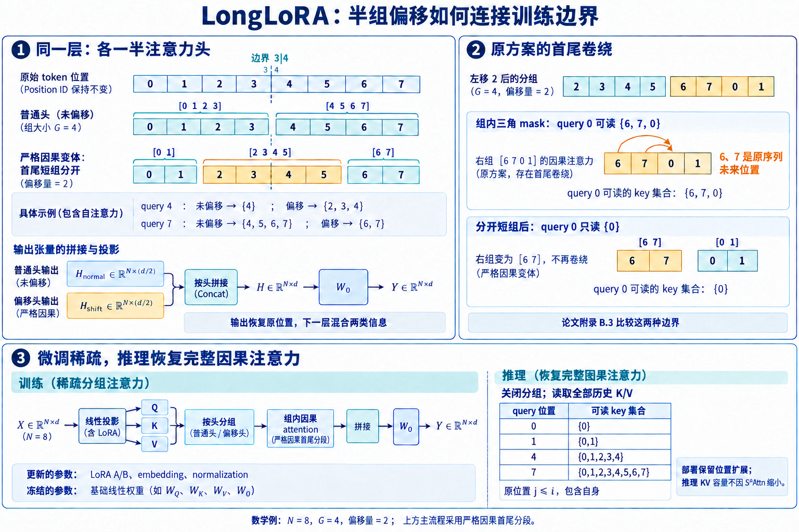

# LongLoRA: 用S²-Attn完成长上下文微调

上下文从4K扩到32K, attention配对约增加64倍. LoRA能减少可训练参数、梯度与优化器状态, attention仍然遍历整张因果矩阵. LongLoRA同时处理这两项成本: 微调阶段使用**S²-Attn** (Shifted Sparse Attention), 把序列切成规则局部组; 参数侧采用LoRA, 同时训练embedding与normalization. 微调结束后关闭S²-Attn, 以原模型的full attention推理.

S²-Attn没有selector、top-k或候选索引. 一半heads沿原边界分组, 另一半heads平移半个组再分组, 让固定边界两侧的token仍能相互传递信息. 规则分组可以复用FlashAttention, forward与backward都只计算组内连接. 训练成本因此下降, 部署时的full-attention计算与KV容量不会随之下降.

## 1. S²-Attn的计算图

图1. 以 $N=8,G=4$ 展开两类 heads 的可见位置。左侧采用分开首尾短组的严格因果变体，右侧保留原方案的卷绕组作对照；下方显示微调后恢复完整因果 attention。结合 [LongLoRA v2 Figure 2、Figure 3 与附录 B.3](https://arxiv.org/pdf/2309.12307v2)绘制教学例，分组长度与位置集合均为本文手算。 [查看原尺寸](../images/longlora-shift-boundary-v3.png)。

分组把平方项改成什么。
输入 $X\in\mathbb{R}^{B\times N\times d}$ 投影为 $Q,K,V\in\mathbb{R}^{B\times H\times N\times D}$. full attention的QK与AV主体近似为

$$F_{full}\approx4BHN^2D.$$

把序列分成 $M=N/G$ 个长度为 $G$ 的组, 每组独立执行因果attention. 总配对数由 $N^2$变为 $MG^2=NG$:

$$F_{group}\approx4BHNGD,\qquad\frac{F_{group}}{F_{full}}\approx\frac{G}{N}.$$

group size ratio取 $1/4$ 时, $G=N/4$, attention主体约为full的四分之一. MLP、QKV投影、通信和数据加载没有同步缩小, 端到端step time不会直接提升4倍. FlashAttention减少中间读写, 仍需执行所有允许的QK与AV乘加; S²-Attn进一步删除组外配对.

普通分组会产生永久边界. 取 $N=8,G=4$, 两组为 $[0,1,2,3]$和 $[4,5,6,7]$. 位置3与4相邻, 却永远不在同一组. 每层都用相同边界时, MLP逐位置计算, 也无法把第一组状态送入第二组.

半数heads平移半组。
将 $H$ 个heads分成两半. 前一半按原边界分组; 后一半沿token轴平移 $G/2$, 再按长度 $G$分组. 对8-token例子, 平移heads的中间组覆盖原位置 $[2,3,4,5]$, 原边界3/4由此获得直接连接. attention结束后对平移heads执行逆shift, 所有输出回到原token位置.

对原位置4, 未平移heads只能访问第二组中不晚于4的位置, 即位置4; 平移heads在因果mask下能访问2、3、4. 两批heads拼接后进入输出投影, 下一层Q/K/V投影可混合两种拓扑携带的信息. 平移不增加单head的组长, 计算量仍为 $O(NG)$.

循环移位会把序列首尾放进同一物理组。例如 $N=8,G=4$，左移两位后的最后一组为 $[6,7,0,1]$；组内三角 mask 会允许原位置 0 读取 6、7，违背原序列因果顺序。保持原位置因果性的实现应分开短首组、短尾组，或额外屏蔽卷绕边。尾组 padding 同样不能进入 softmax。 [论文 v2 附录 B.3](https://arxiv.org/html/2309.12307v2#A2.SS3)专门比较了首尾同组与分开短组的变体：full、原方案、分开首尾的 Variant 2 在 8K PG19 上的困惑度分别为 8.02、8.04、8.03。原方案的训练边与严格因果变体不同，推理则统一恢复标准因果 full attention。

[作者实现](https://github.com/JIA-Lab-research/LongLoRA/blob/b5c6809515d47ef4be34bd86b2074d540a1b897a/llama_attn_replace.py)的 `forward_flashattn` 没有直接 roll，而是把 heads 拆成两半，用错开半组的累计序列长度划分首尾短段与中间完整组。`forward_noflashattn` 则对后一半 heads 执行 roll，重复组内三角 mask。这两条路径的边界处理不同。复算原位置邻接集合时，必须同时检查每个组的起止位置和因果方向，不能只检查张量 shape。

Reshape如何复用普通kernel。
以布局 $[B,N,H,D]$为例, shift后reshape为 $[B,M,G,H,D]$, 再把组维并入batch, 得到 $[BM,G,H,D]$. FlashAttention看到 $BM$ 条长度为 $G$ 的普通因果序列. 输出再恢复为 $[B,N,H,D]$, 平移heads逆shift后进入 $W_O$.

这条路径没有CSR、block table或动态排序. 组长固定时, kernel shape规则, load连续. 若 $N$不能被 $G$整除, 先padding到完整组, attention mask屏蔽无效位置, loss mask再屏蔽输出. 只在loss处忽略padding不够, 无效K/V仍会污染有效token.

官方实现根据query length与 `group_size_ratio` 计算绝对组长. 相同比例在8K和32K上分别产生2K和8K组. 复现配置必须同时记录比例和实际组长, 否则attention算术与单层感受范围都无法复算.

论文附录直接比较了组长比例。在8K目标长度上，full、$1/2$、$1/4$、$1/6$、$1/8$ 的PG19验证困惑度依次为8.02、8.04、8.04、8.10、8.16；16K时依次为7.82、7.84、7.86、7.94、7.98。作者据此采用 $1/4$ 作为默认值。这个结果没有给出“越小越好”的单调关系：从 $1/4$ 继续缩小虽然减少配对，却开始损伤质量。工程上可先用这五档复刻趋势，再围绕显存拐点细调，而不是只跑一个比例。

索引实现还要处理head数和组长的整除条件。设 $h_s=H/2$，平移部分可写为 $Q[:,h_s:,:,:]$ 沿序列轴左移 $G/2$；奇数head或奇数组长无法原样二分。最安全的配置是在启动时显式断言 $H\bmod2=0$、$G\bmod2=0$、$N\bmod G=0$。确实需要支持尾组时，应先padding再平移，同时把有效长度带进mask，不能让框架的隐式reshape决定尾部语义。

多层传播的范围。
S²-Attn恢复相邻组连通, 没有恢复单层任意远距直连. 信息跨越多个组需要沿层传播. 每层的输出投影混合平移与未平移heads, 后续层再在两类分组内传递, 可达范围随深度扩大.

可达不等于容易学习. 多跳路径会经历normalization、残差与MLP, 唯一远距证据可能被中间表示削弱. 组越小, 计算越省, 所需传播跳数越多. 因此group ratio必须与模型深度、证据距离和任务共同消融.

Full attention允许query直接比较远距候选, S²-Attn训练阶段只见局部负例. 推理恢复full图后, softmax分母出现大量组外keys, 训练中显著的logit可能被稀释. 周期性full-attention评测可以直接测量这种图差异.

把索引写开更容易看到传播范围. 未平移head中, 位置 $i$ 所属组为 $b(i)=\lfloor i/G\rfloor$, 可见key满足 $b(j)=b(i)$ 且 $j\le i$. 平移head先令 $i'=i-G/2$, 再按 $b'(i)=\lfloor i'/G\rfloor$ 分组; 有效key满足 $b'(j)=b'(i)$、$j\le i$, 同时排除shift后卷绕产生的位置. 两类邻接集合的并集覆盖原组内部与相邻边界.

若忽略序列首尾, 单层传播最多跨过约一个半组. 第 $l$ 层的可达集合由上一层所有邻居的集合取并集. 粗略上界随层数线性扩大到 $O(lG)$, 但不同heads经 $W_O$ 和下一层投影后才能交换信息. 这项上界只描述图连通, 不表示梯度或语义信号能无损跨越同样距离.

可以用布尔邻接矩阵验证. 为每类heads构造 $A^{(0)},A^{(1)}\in\{0,1\}^{N\times N}$, 将因果与分组条件写入. 一层有效邻接为二者并集; $l$ 层可达关系由布尔矩阵幂得到. 对 $N=16,G=4$ 画出每层可达比例, 能直接比较普通分组、S²与full attention.

这里还可以把“跨层传播”算得更具体。设 $R_l(i)$ 是第 $l$ 层位置 $i$ 能间接接收的原始位置集合，初始为 $R_0(i)=\{i\}$。第 $l+1$ 层先取该位置在两种head划分下的可见query集合，再把这些位置上一层的可达集合做并集：

$$
R_{l+1}(i)=\bigcup_{j\in \mathcal N_0(i)\cup\mathcal N_1(i)}R_l(j).
$$

这个递推式适合直接写成十几行测试代码。普通分组的 $R_l(i)$ 无论叠多少层都留在原组；S²-Attn会逐层越过相邻边界。因果模型还有方向限制：靠后的query可以吸收更早组的信息，靠前位置不会得到未来信息。于是“$l$ 层大致覆盖 $lG$”只能当作内部位置的量级估计，序列开头、结尾以及未满尾组都要单独计算。

传播路径长度也会影响学习难度。full attention里，相距 $d$ 的两个位置只需一次attention交互；S²-Attn中，同一对位置可能要经过若干层的head混合、残差和MLP。图论上的可达性只是必要条件。复现实验若只放一枚容易复制的passkey，模型可能依赖局部模式就给出正确答案；更稳妥的测试会改变证据距离、插入相似干扰项，并要求组合两个以上远距离证据。随着证据跨过的组数增加，准确率曲线能反映多跳传播是否真的学成。

把索引完全展开后，未平移head中query $i$ 的候选下界是 $G\lfloor i/G\rfloor$，上界是 $i$。平移head令 $s=G/2$，忽略首尾卷绕后，下界变为 $s+G\lfloor(i-s)/G\rfloor$，上界仍为 $i$。于是两类head的可见集合可以写成

$$
\mathcal N_0(i)=\{j:G\lfloor i/G\rfloor\le j\le i\},
$$

$$
\mathcal N_1(i)=\{j:s+G\lfloor(i-s)/G\rfloor\le j\le i\}.
$$

例如 $N=16,G=4,s=2$，query 4在未平移head中只能看4，在平移head中能看2、3、4；query 7分别看到4至7和6至7。query 8又通过平移组看到6、7、8。边界两侧因此交替连通。首尾处不能直接套无限序列公式：实际代码用roll时，卷入的索引必须被mask排除；使用切片再拼接时，则要为短首组和短尾组保留各自长度。

这个显式公式还能生成测试oracle。先按原始position ID枚举允许的 $(i,j)$，再构造dense mask运行一个小型attention；另一边执行官方式shift、reshape、组内attention和inverse shift。两边的输出与Q/K/V梯度应在数值容差内一致。这样测试的是索引语义，不依赖某个FlashAttention版本。升级PyTorch、FlashAttention或并行框架后都可重复运行，避免性能kernel更新悄悄改变边界。

复杂度也可从候选数求和得到。忽略因果三角的常数，对每个head共有 $M=N/G$ 个组，每组约 $G(G+1)/2$ 个有效配对，因此单类head约为 $M G(G+1)/2\approx NG/2$。两类head各占一半，配对总量仍约为 $HNG/2$；full causal attention约为 $HN^2/2$，比例趋近 $G/N$。shift只是置换索引，没有引入额外QK或AV乘加，真正的额外成本来自roll/重排、mask和可能的跨设备交换。

### 1.1. Mask、位置与分布式边界

因果mask与样本packing。
长训练常把多个文档pack成一条序列. causal mask只禁止看未来, 后一个文档仍能看前一个文档. 若数据定义要求样本隔离, attention还需document mask. 原分组和平移分组使用同一文档ID约束, 否则shift后原本分开的样本可能进入同组.

测试可把两个文档边界放在组内、原组边界和平移边界. 修改前一文档内容, 后一文档hidden states应保持不变. 这比只看训练loss更容易发现跨样本泄漏. Packed sequence还要报告有效token比例, 大量padding会让step看似更快.

Dropout与activation checkpointing重算必须复现同一shift、mask和随机状态. 如果恢复训练后长度日程回到初值, 动态计算的 $G$会变化, 模型突然面对另一张图. checkpoint需保存训练长度、group ratio、position配置和数据采样器状态.

RoPE使用原始位置。
Shift只改变张量排列, token的语义位置没有变化。RoPE读取原序列position ID。每组从0重新编号会让模型只训练 $0\ldots G-1$ 范围，并错误改变跨组相对相位。序列末端的有效token对应 $N-1$，与其物理分组无关。

上下文扩展仍需位置插值、频率缩放或其他RoPE方案. S²-Attn决定可见边, 位置方案决定Q/K旋转, 两条轴不能混在一个消融中. 推理恢复full attention后继续使用训练时的位置方案.

如果RoPE在shift之前应用, K/Q已携带原位置相位, 后续重排只搬张量. 若实现先shift再调用位置模块, position IDs必须同步重排. 只移动hidden states、不移动position IDs会在边界处产生错误相位.

LongLoRA延长上下文时还采用位置插值一类的RoPE扩展。设预训练长度为 $L_0$、目标长度为 $L_1$，最朴素的位置插值把目标位置 $p$ 映射为 $pL_0/L_1$ 后再计算旋转角。S²-Attn的组内索引 $0\ldots G-1$ 不能替代这个全局位置；位置4即使被平移到某个组的第0项，它的旋转相位仍对应全局位置4经过缩放后的值。把组内offset误作position ID，短组上的loss可能正常，切回full attention后相对距离却全部变形。

验证RoPE路径可以选一对跨组token，分别在shift前后导出旋转后的Q/K，逆重排后逐元素比较。再改变group ratio而保持全局position IDs不变，旋转结果应完全一致，变化只应来自可见边集合。若结果随组长变化，说明位置模块错误地读取了物理布局。

Sequence Parallel通信。
序列按rank切分时, 原分组可与设备边界对齐. 平移heads需要相邻rank交换半组token, 否则rank边界重新成为永久断点. 实现可交换边界halo, 或先all-to-all重排再执行组内attention. 两种方式都要把通信计入训练成本.

若每个rank只在本地序列内roll, 单卡与多卡图不同. 小shape测试可以把同一序列分别用单卡和两卡模拟, 比较可见集合、输出与梯度. 质量差只在多卡出现时, 先检查跨rank平移, 不应直接调整学习率.

Tensor Parallel按heads切分时, 每个rank宜获得数量接近的平移与未平移heads. 把两类heads完全分开虽可在输出投影处合并, shift、mask和通信负载会不对称. Head数不能被TP与2同时整除时, 需要明确各rank分配.

通信估算要先注明交换的张量阶段。若各rank已经持有本地Q/K/V，平移head需要从相邻rank取得宽度 $s=G/2$ 的边界；仅交换K/V时，单边裸载荷约为

$$
V_{KV}=2B\cdot\frac{H}{2}\cdot sD\cdot b,
$$

其中 $b$ 是每元素字节数。若为方便重排而交换Q/K/V，则前面的2改为3。反向还要传回相应梯度，实际链路字节至少再乘一次方向因子。通信库的对齐、分桶与协议开销没有包含在公式里，所以profile值通常更高。

组边界与rank边界对齐时，每个rank只需和相邻设备交换halo；不对齐时，一个组可能横跨多个rank，简单的点对点交换不够，需要all-to-all或重新规划sequence partition。选择group ratio时应同时检查 $G$、每rank本地token数和并行度的最大公约关系。理论配对数相同的两种配置，可能因一个对齐、一个跨越多rank而出现完全不同的吞吐。

延迟可近似写为 $T_{comm}\approx n_m\alpha+V/\beta$，$\alpha$ 是每条消息启动延迟，$\beta$ 是有效带宽。小halo可能由启动延迟主导，大halo由带宽主导。把多个层的边界交换与计算重叠能够隐藏一部分时间，但前提是依赖关系允许；端到端报告仍应给出未隐藏的等待比例，不能只列理论字节。

反向传播确实保持稀疏。
S²-Attn backward只对组内Q/K/V连接求梯度. shift和reshape的反向只是把梯度搬回原head与token. 组外QK项从未计算, 也不保存稠密mask. 这与在完整矩阵上填负无穷不同, 后者算子若仍执行所有tiles, 训练计算不会下降.

验证时使用FP64小shape, 以显式稠密mask为参考, 比较forward、Q/K/V梯度与参数梯度. 长度取1、3、4、5、7、8覆盖未满组和边界. 再加入padding、document IDs与不同head切分.

训练报告分别列forward、backward和通信时间. LoRA减少参数梯度, hidden-state activation仍随 $NLd$增长. 长度扩展后, MLP activation可能成为显存主体, attention稀疏并不消除这项线性成本.

以bf16保存一层Q/K/V为例, 裸activation约为 $3BNHD\times2$ 字节, attention输出再占 $BNHD\times2$ 字节. FlashAttention保存每行log-sum-exp等统计量, 不保存完整概率矩阵. S²把kernel工作序列从 $N$改为 $G$, Q/K/V本身仍覆盖全部 $N$ 个token, 所以activation不会按 $G/N$ 等比例下降.

Sequence Parallel若交换半组边界, 每层每次方向的裸通信量近似为 $B(H/2)(G/2)D\times2$ 字节, Q、K、V是否都交换取决于布局. 前向与反向还要乘通信次数. 当 $G=N/4$ 且模型hidden很大时, halo交换可能抵消一部分attention节省; profile应同时记录链路字节与等待时间.

梯度累积不降低单个micro-batch的长序列activation, 只减少同步频率. Gradient checkpointing可不保存部分层输入, backward重算对应层; 因此吞吐表需注明是否重算, 否则两种S²配置的显存与step time不可直接比较.

若把训练显存拆成权重、梯度、优化器状态和activation四部分，S²-Attn主要压缩attention内部随配对数增长的临时量与反向计算，LoRA主要压缩参数侧状态。两者节省的对象不同。以AdamW和bf16权重为例，每个可训练参数通常还对应bf16梯度以及两个fp32动量，是否保留fp32主权重要看训练框架。冻结主干后，这些状态只为LoRA、embedding与norm分配；hidden states、Q/K/V和MLP中间量仍随token数近似线性增长。实际峰值可以写成

$$
M_{peak}\approx M_{weight}+M_{trainable}+L_aM_{act}(N)+M_{workspace}(G)+M_{comm},
$$

其中 $L_a$ 是未被checkpoint丢弃的层数。这个表达式没有假装给出跨框架通用常数，却能指导profile：如果缩小 $G$ 后峰值几乎不变，瓶颈多半已转到线性activation、参数分片或通信缓冲区。

FlashAttention兼容性来自规则化shape。每个组被并进batch维后，kernel处理的是长度 $G$ 的普通因果序列；它不需要读取稀疏索引，也不需要在tile内部跳跃。不过“调用了FlashAttention”还不足以证明节省成立。若代码先构造 $N\times N$ dense mask，再把组外位置填成负无穷，显存和FLOPs仍接近full attention。profile应看到实际kernel的序列长度为 $G$、批量为 $BM$，而不是长度仍为 $N$ 的掩码attention。

### 1.2. LongLoRA为何不只训练LoRA

低秩增量节省哪些状态。
LoRA将冻结矩阵 $W$改为

$$W'=W+\frac{\alpha}{r}BA,$$

其中 $A\in\mathbb{R}^{r\times d_{in}}$, $B\in\mathbb{R}^{d_{out}\times r}$, $r$远小于原维度. 训练保存A/B梯度与优化器状态, 主权重保持冻结. 它减少参数侧显存与通信, 不改变attention的token配对.

Target modules决定适配能力. Q/K调整检索几何, V/O调整搬运内容与head混合, MLP影响逐token变换. 只说LoRA rank不足以复现, 还需列出挂载层、alpha、dropout、各参数组学习率与weight decay.

LongLoRA在LoRA之外训练embedding与normalization. 导出checkpoint时这两类权重必须一并保存. 若发布物只有adapter矩阵, 加载到base model后会漏掉已经学习的长度适配.

论文表2给出了这项设计最直接的数字。目标长度32K、Llama2-7B、S²-Attn和相同数据设置下，全量微调的PG19验证困惑度为8.08；只训练普通LoRA时，rank从8一路增加到256，结果仍在11.44到11.98之间。固定rank 8后，只加入可训练norm得到10.49，只加入embedding得到8.29，同时训练二者得到8.12，已经接近全量微调。这个消融否定了“把rank继续放大就能补回长上下文适配”的简单解释。

数字也提示embedding和norm的作用并不对称：单独解冻embedding带来的改善远大于单独解冻norm，但二者合用仍优于只解冻embedding。论文报告Llama2-7B中embedding少于总参数的2%，normalization不超过0.004%；比例很小不等于状态可以忽略，尤其embedding矩阵还会带来较大的梯度和优化器状态。复现时应同时记录可训练参数量与实际显存，避免用“LoRA参数占比”代替完整成本。

Embedding与normalization的作用。
长序列改变attention聚合范围、残差流统计与位置分布. normalization scale贯穿每层, embedding参与每个输入位置. 解冻它们给模型一组参数量较小但覆盖全网的调整通道. 这是论文消融支持的训练选择, 不表示任何LoRA任务都必须如此.

Embedding在大词表模型中仍可能很大. 解冻后梯度与Adam状态明显增加, 参数效率要按实际可训练参数与字节报告. Norm通常不做weight decay; embedding是否衰减应与训练配置一致.

LoRA、embedding、norm适合使用独立optimizer groups. 新增低秩参数与预训练参数的合理学习率可能不同. 训练日志分别记录梯度范数与相对更新量, 能发现embedding被过大学习率破坏或LoRA几乎不动.

参数消融怎样拆开。
最小参数消融包含仅LoRA、LoRA+embedding、LoRA+norm、完整组合与全参数微调. 所有组保持位置方案、S²-Attn、数据与训练token一致. 长任务和短任务同时评测, 防止长能力来自遗忘原能力.

拓扑消融另行比较full attention、普通局部分组和S²-Attn. 普通分组与S²使用同一组长, 二者差异对应shift; full与S²差异对应训练稀疏近似. 把参数与拓扑同时更换会无法归因.

恢复训练时optimizer state覆盖全部可训练组. 只恢复LoRA动量会让embedding与norm隐式重启. 学习率scheduler的step也要一致, 尤其长长度阶段通常较短, 一次重启足以改变最终结果.

官方仓库的保存流程印证了三类参数需要分别处理。低秩训练结束后，脚本从训练checkpoint提取 `embed,norm` 为 `trainable_params.bin`；评估目录同时需要这个文件、`adapter_model.bin` 和 `adapter_config.json`。合并脚本还要读取base model与训练时的context size。少带任一部分都可能成功加载，却得到残缺模型，因此验收不能停在“权重文件存在”，还要检查这些张量确实覆盖了预期embedding和全部norm层。

可以在训练前后各导出一份参数摘要：参数名、shape、dtype、`requires_grad`、初始校验和、最终校验和。LoRA矩阵、embedding与norm必须发生变化，冻结主干则应保持不变。这个检查尤其适合发现DeepSpeed分片保存造成的漏项，也能避免合并脚本把更新写入错误模块。

长数据教的能力不同。
连续长文本训练语言模型在远位置分布上的预测, 长指令数据训练从长prompt抽取证据并遵循任务. LongLoRA使用长文本适配, 也发布LongAlpaca长指令数据. 困惑度改善不自动推出长问答与摘要能力.

数据应按长度分桶报告样本数与token数. 最大长度100K可能只占很小比例; 平均优化step见到的距离由分布决定. 还要记录答案证据距离、多证据数量与样本packing方式.

重复网页、模板与拼接错误在长样本中会占大量token. 模型可依赖局部重复降低loss, 没有学习远距关系. 去重、文档边界和证据位置是训练数据质量的一部分.

论文的训练数据也不能压成“用了长文本”一句话。语言建模实验使用RedPajama，长序列由文本拼接得到；监督微调另用LongAlpaca。前者支撑长度适配和困惑度比较，后者补充长输入下的指令遵循。构造复现集时应保留样本来源、原始token长度、截断后长度、有效答案所在位置和packing边界。否则两次训练都标成32K，实际见到的远距离依赖比例可能完全不同。

一个实用的长度采样方案会同时限制“序列长度”和“证据距离”。仅按token数分桶会把大量局部可解样本误当成长依赖。可以为每个样本记录最远证据位置 $p_e$ 与答案起始位置 $p_a$，用 $|p_a-p_e|$ 近似证据跨度，再按跨度分桶报告结果。多证据任务则记录覆盖区间或最远两证据距离。这个统计不要求训练集都有人工标注；合成检索集和一小批人工核验集就能发现模型是否只适应了更大的position ID。

## 2. 训练图与推理图的差异

为什么可以恢复full attention。
S²-Attn不改变参数shape, 推理时移除shift与分组即可调用标准attention. 新增的组外边仍使用训练后的Q/K/V/O. 局部训练若学到了有用的QK几何, full图可以把它应用到更多keys.

这项兼容性没有保证full图输出与S²图接近. Full softmax加入大量组外logits, 分母和value混合都会改变. 组外干扰项随长度增加, 32K训练得到的排序在100K候选中可能被稀释.

训练期间定期对同一batch运行两种图, 记录logit KL、输出相对误差、attention熵和下游指标. 这项回放不参与所有step, 成本可控. 最终checkpoint必须以部署的full图验收.

稀疏训练省下多少。
取 $N=32768,H=32,D=128,G=8192$. Full QK+AV每层每样本约

$$4\times32\times32768^2\times128\approx1.76\times10^{13}\ \text{FLOPs}.$$

S²-Attn约

$$4\times32\times32768\times8192\times128\approx4.40\times10^{12}\ \text{FLOPs}.$$

Attention主体为四分之一. 乘层数后是理论attention算术, 实测还包含投影、MLP、重算、通信和optimizer. 随着attention占比降低, MLP与通信会成为新瓶颈.

峰值显存也要分解. FlashAttention已经不保存平方概率矩阵, S²缩短组内softmax与backward状态; hidden states、LoRA以外的可训练embedding梯度、norm梯度和长序列activation仍存在. 只报告attention FLOPs会高估总节省.

它不会降低部署KV。
Full-attention Decode仍为每层保存全部历史K/V, 容量随 $N$线性增长, 单步读取也随历史增长. S²-Attn没有生成部署selector或可复用稀疏索引. LongLoRA解决训练长模型的成本, 没有解决服务长模型的KV与带宽.

部署若加入滑窗、KV驱逐或动态top-k, 模型面对另一张未训练图, 需要继续适配与独立评测. 不能把训练时S²-Attn的质量结论直接套到推理稀疏.

成本报告分两张表. 训练表给GPU hours、step time、峰值显存和有效token吞吐; 部署表按full attention给TTFT、TPOT、KV字节与最大batch. 两项“效率”不能合成单一倍数.

论文规模如何理解。
LongLoRA报告在单台8×A100上把LLaMA 2 7B扩到100K, 70B扩到32K. 这些上限绑定模型、硬件、并行、batch、checkpointing与数据. 它们不表示任意硬件都能训练同样长度.

论文强调S²-Attn兼容FlashAttention-2, 核心shift可用很少代码表达. 完整系统还包含causal与padding mask、attention replacement、位置设置、分布式通信、参数组和checkpoint. 工程复杂度不能按核心reshape行数衡量.

最终质量来自S²-Attn、参数适配、位置扩展和长数据共同作用. 引用模型长度结果时应把这些配置一起保留, 不把全部提升单独归给某一个模块.

论文附录的效率结果把这种区别量化了：LongLoRA在若干设置中相对全量微调最高节省约1.8倍显存，相对普通LoRA配合full attention最高获得约1.8倍训练加速。两个“1.8倍”对应不同基线和不同资源维度，不能合并成一个笼统的总体加速。报告自己的结果时要把模型规模、目标长度、group ratio、每卡micro-batch、梯度累积、DeepSpeed阶段和checkpoint策略列在同一张表里。

论文表1还给出稀疏近似的质量对照。在8K、16K、32K目标长度上，full attention微调的PG19验证困惑度依次为8.02、8.05、8.04；只有不平移的短attention会从8.29恶化到8.83和9.47，S²-Attn则为8.04、8.03、8.08。随着目标长度增加，普通局部分组明显掉队，而平移版本保持接近full基线，这正是跨组连接需要被单独验证的原因。复现失败时，先比这组三路对照，比只和最终LongLoRA模型比较更容易定位问题。

### 2.1. 复现、消融与故障定位

从小shape到长训练。
第一步用8-token显式mask验证两类heads的可见集合. 第二步用FP64随机张量对齐forward与backward. 第三步加入padding、packing和多卡边界. 三层测试通过后再跑长序列吞吐.

短序列上S²固定开销可能抵消少算收益. 长度从2K扫到目标上限, 记录attention、MLP、通信与optimizer耗时. Group ratio固定时绝对组长随长度增长, 曲线应接近预期 $NG$.

训练回归保存base checkpoint、代码版本、FlashAttention版本、dtype、并行方式、group ratio、position配置、LoRA targets与数据manifest. 同一模型名不足以复现实验.

官方评估脚本把 `seq_len` 与训练时的 `context_size` 分开，且要求前者不超过后者。复现时可以在2K、4K、8K直到目标长度逐档评估同一checkpoint，观察困惑度是否随可用上下文增加而下降。仓库还提供按长度间隔插入passkey的测试；它适合作为定位工具，但单一检索正确率无法覆盖摘要、多文档问答或长生成，因此应与PG19、Proof-pile以及任务集并用。

长跑前先做一次“干净进程恢复”：启动新进程，只加载base、adapter、embedding/norm增量和位置配置，关闭S²训练patch，以full attention跑固定样本。训练进程里临时修改的attention函数若没有写进发布物，这一步会立刻暴露。随后再从checkpoint续训几十步，核对长度调度、group ratio和数据采样器是否延续。

边界切片比平均分更敏感。
构造证据与query距离相同、只改变其相对group boundary位置的样本. 普通分组会在边界处出现明显断层, S²应缓解. 再按需要跨越的组数分桶, 观察多跳传播随距离如何退化.

多证据任务把证据放在不同组, 要求联合使用. 单needle命中只说明某一条路径可达, 无法证明多个远距状态能在有限层数内汇合. 代码任务可把函数定义与调用放在不同边界, 摘要任务按段落位置切片.

短上下文评测保持原分布, 检查位置扩展与长数据是否造成遗忘. 长度内和长度外分别报告, 例如训练32K时评测8K、32K与64K. 64K同时包含位置外推与未见候选规模, 解释时分开.

四类常见故障。
训练loss异常低, 先查roll引入的未来泄漏. 输出只在组边界异常, 检查inverse shift与尾组mask. 单卡正确、多卡退化, 检查跨rank半组交换与heads分配. S²图正常、full图退化, 检查softmax竞争与position IDs.

恢复checkpoint后loss跳变, 对比group size、长度日程、RoPE配置、optimizer groups与采样器. 只加载LoRA后质量下降, 检查embedding与norm权重是否缺失. 显存没有预期下降, 分解长hidden activations与解冻embedding的optimizer状态.

吞吐不升时查看kernel是否真的接收 $G$ 长序列, 还是先构造完整mask再跑dense attention. Profile中QK/AV FLOPs仍接近 $N^2$说明稀疏只停留在逻辑mask. 通信占比高则检查Sequence Parallel重排.

故障也可以按“出现在哪一张图”快速分流。S²与full图从训练开始都坏，先查数据、位置缩放和可训练参数；只有S²坏，重点查分组、roll、padding与FlashAttention输入shape；S²正常而full图坏，检查模型是否只适应组内softmax，以及发布时位置配置是否一致；单卡正常、多卡才坏，查看跨rank边界和各rank的head拆分。这个顺序能把同一个现象压缩到较小的代码范围。

还有一类问题不会立刻体现在loss里：吞吐提升但样本有效token骤降。按最大长度padding时，小组attention确实变快，GPU却可能反复计算padding的Q/K/V投影和MLP；packing策略改变后，训练token统计也可能把padding算进去。性能记录应同时给出raw tokens/s、有效tokens/s和有效比例。有效吞吐没有提升时，单看kernel时间会夸大S²收益。

数值稳定性可从每层Q/K范数、attention输出范数与梯度范数入手。长位置外推若导致旋转后的Q/K尺度或相位关系异常，问题会在浅层就出现；mask泄漏则往往表现为边界token异常低的loss；full图切换后的softmax稀释，会让重要key的概率随候选数增加而下降。三种现象都可能表现成长任务退化，所需修复却分别落在位置、拓扑和训练分布上。

最小验收矩阵。
拓扑取full、普通分组、S²; group ratio取1/2、1/4、1/8. 参数取仅LoRA与完整LongLoRA配置. 每组固定训练token、位置方案与数据. 由于组合很多, 先在小模型筛选, 再把少数组合扩到目标规模.

结果同时报告训练loss、full图loss、短任务、长检索、多证据、长生成, 再给step time、峰值显存和GPU hours. Full图是部署主结果, S²图用于诊断train–inference gap.

验收还包括checkpoint可移植性: 在干净环境加载base与增量权重, 确认embedding、norm、RoPE配置齐全; 关闭训练patch后full attention输出可复现. 这一步能发现只在训练进程内有效的monkey patch或漏存配置.

建议固定一批不参与更新的探针样本，每隔若干step同时跑S²与full图。记录两者token级交叉熵差

$$
\Delta_{\mathrm{graph}}=\frac{1}{T}\sum_{t=1}^{T}
\left|\ell_t^{S^2}-\ell_t^{full}\right|,
$$

再按query距最近组边界的距离分桶。若差异集中在边界附近，优先检查shift、mask与逆shift；若所有位置同时扩大，更像是模型过度适应局部softmax候选集。还可以比较logits余弦相似度和top-k token重合率，但这些诊断量不能代替full图上的任务指标。

复现实验至少保留三个随机种子，并固定训练token而非只固定step。组越小，同一step的耗时越短；若各配置都跑相同步数，节省出来的预算没有被公平处理。比较“相同token、相同数据、相同位置方案”回答结构是否有效，比较“相同GPU小时”则回答预算怎样分配更划算，两种问题应分开呈现。

工程检查项。
张量层面记录输入shape、head拆分、shift量、组数、padding和逆shift. Mask层面同时验证causal、padding与document boundary. 参数层面列出全部 `requires_grad` 权重. 系统层面记录各rank持有的组与heads.

每次改变长度都重新打印绝对group size和每层attention FLOPs. 每次改变并行度都跑单卡参考对照. 每个发布checkpoint都以full attention跑短、长两套固定回归.

### 2.2. 平移分组究竟改变了怎样的信息图

从attention矩阵改写为有向图。
令长度为 $N$, 每组长度为 $G$, 并假设 $G$ 整除 $N$. 对第 $h$ 个head, 用二值矩阵 $M_h\in\{0,1\}^{N\times N}$ 表示允许计算的边. 在causal约束下, 普通分组attention满足

$$
(M_h)_{ij}=1\quad\Longleftrightarrow\quad
j\le i,\qquad \left\lfloor\frac{i}{G}\right\rfloor=
\left\lfloor\frac{j}{G}\right\rfloor.
$$

因此token $i$只能直接读取本组中不晚于自己的token. 这张图的主要问题来自所有层和所有head完全重合的组边界. 若证据位于 $kG-1$, 查询位于 $kG$, 两者原序列距离只有1, 图距离却是无穷: 无论叠多少层, 查询所在连通分量都无法跨回前一组. 固定分组直接切断跨组路径, 影响远大于一般的感受野缩短.

S²-Attn把一半heads的分区偏移 $s=G/2$。下面用原位置约束 $j\le i$ 定义严格因果的教学图：首尾即使落入同一循环分组，也屏蔽从未来到过去的边。这与论文原方案的首尾同组训练边不同，解释内部跨组传播时使用同一套错开边界。平移 head 的掩码为

$$
(M_h^{(s)})_{ij}=1\quad\Longleftrightarrow\quad
j\le i,\qquad
\left\lfloor\frac{(i+s)\bmod N}{G}\right\rfloor=
\left\lfloor\frac{(j+s)\bmod N}{G}\right\rfloor.
$$

原分组的边界位于 $0,G,2G,\ldots$, 平移分组的边界位于 $G/2,3G/2,\ldots$. 任意一处原边界落在平移组内部, 任意一处平移边界也落在原组内部. 多头输出经过 $W_O$ 混合, 同一token在下一层同时携带两套分区内的信息, 于是边界不再构成永久割集.

这个推导也解释了为何必须先按head拆分再平移. 若把整个hidden state平移, 所有heads仍共享一套新边界, 只是把断点换了位置. 若只平移少量heads, 跨边界通道的秩受到这些heads总维度限制. 论文采用半数heads是对称而易实现的选择, 不能据此推出 $1/2$ 对所有模型都最优. 真正需要保留的是两套错开的分区以及足够的跨界表示容量.

两层可达不等于一次读取全局。
设 $R_i^{(\ell)}$ 为第 $\ell$ 层后位置 $i$ 可能依赖的输入位置集合. 初始有 $R_i^{(0)}=\{i\}$. 对某一层的允许前驱集合 $A_i^{(\ell)}$, 递推关系为

$$
R_i^{(\ell+1)}=\bigcup_{j\in A_i^{(\ell)}}R_j^{(\ell)}.
$$

普通分组中 $R_i^{(\ell)}$ 永远留在同一组. 交替使用原分区与半组平移分区时, 每经过一层, 可达区间通常向左多覆盖约半组到一组. 粗略地说, 在远离两端且各head信息能被充分混合时, $L$ 层后的最大覆盖跨度与 $LG/2$ 同阶, 而非一步达到 $N$. 因果方向还会使传播只从过去流向未来: 早期token不能借由后层读取后来出现的信息.

由此可见, “跨组连通”与“任意远距离关系都容易学习”相差很远. 若证据与查询相距 $d$, 至少需要约 $2d/G$ 次跨界传播. 深度足够只是必要条件. 每次传播还要经过残差相加、MLP变换和其他token竞争, 有效信号可能随路径长度衰减. 多跳任务尤其敏感: 两段证据若分别位于相隔多组的位置, 模型既要把第一段送到中间状态, 又要在后续层与第二段合并. Needle命中证明某条单证据路径可用, 不能证明组合运算保持稳定.

可达图还受layer schedule影响. LongLoRA在训练阶段的attention层都使用S²模式, 原分组heads和平移heads在同层并存. 如果实现为了方便而让整层在“未平移”和“平移”之间交替, 总体也可能连通, 但单层的多头并行混合、残差路径和梯度分布已经改变, 不能当作同一算法. 同理, 只在少数层启用平移会把跨组传播集中到瓶颈层; 这些层一旦注意力饱和, 后续层无法补回丢失的边.

边界、路径长度与可验证预测。
图模型给出几条可以直接检验的预测. 第一, 普通分组在固定边界两侧应出现突变, 而S²的误差更接近随距离平滑增加. 第二, 在组长 $G$ 固定时增加层数, 远距离任务应先改善距查询较近的分桶, 再改善更远分桶. 第三, 把证据从组中央平移到原边界附近, 普通分组表现会显著变化; 对S²而言, 原边界与平移边界各影响一部分heads, 波动应更小.

这些预测可以用受控样本验证. 固定文本、答案和证据到query的绝对距离, 只改变全序列前方padding长度, 便能让同一证据穿过不同group phase. 令phase为 $r=i\bmod G$, 按 $r$ 报告准确率或负对数似然

$$
E(r)=\mathbb E[-\log p(y\mid x)\mid i\bmod G=r].
$$

如果曲线在 $r=0$ 附近形成尖峰, 先应怀疑分组、shift或mask; 如果曲线平坦但随证据距离持续恶化, 更可能是传播深度和表示衰减. 这种分桶能把“长距离难”拆成拓扑断边与长路径损失, 比只看一个平均准确率更接近机制.

## 3. 稀疏训练与full推理之间的目标偏移

两张图对应两个条件分布。
记模型参数为 $\theta$, 稀疏训练图为 $M_s$, 部署时完整图为 $M_f$. 训练最小化

$$
\mathcal L_s(\theta)=
\mathbb E_{x,y}\left[-\log p_\theta(y\mid x;M_s)\right],
$$

实际使用关心的却是

$$
\mathcal L_f(\theta)=
\mathbb E_{x,y}\left[-\log p_\theta(y\mid x;M_f)\right].
$$

两者共享 $Q,K,V,O$ 与其余网络参数, 但softmax归一化域不同. 对查询 $i$, 稀疏图的输出为

$$
o_i^{s}=\sum_{j\in S_i}
\frac{e^{q_i^\top k_j/\sqrt D}}
{\sum_{u\in S_i}e^{q_i^\top k_u/\sqrt D}}v_j,
$$

完整图把集合 $S_i$ 换成全部历史位置 $F_i$. 即使 $S_i\subset F_i$ 且稀疏图已经给正确key最高分, 新加入的候选仍会增加分母. 令组外未归一化概率质量为

$$
Z_{out}=\sum_{u\in F_i\setminus S_i}e^{q_i^\top k_u/\sqrt D},
$$

记 $Z_s=\sum_{u\in S_i}e^{q_i^\top k_u/\sqrt D}$ 为组内未归一化质量，则原组内权重在full图中统一乘以 $Z_s/(Z_s+Z_{out})$. 当 $N/G$ 很大时, 大量中等logit也可能累积成可观质量. 这就是训练图正确而full图退化的一条明确路径.

反方向也可能发生. 稀疏训练迫使模型在局部候选中形成更尖锐的排序, full图加入远端正确证据后反而提供额外可用边. 因而图切换的影响没有固定符号, 需要由同一checkpoint的双图评估确定. 参数shape一致只保证程序能运行, 并不保证两个条件分布接近.

梯度为何也会改变。
对attention logit $z_j=q_i^\top k_j/\sqrt D$, 若上游梯度对输出为 $g$, 则

$$
\frac{\partial \mathcal L}{\partial z_j}
=a_j\,g^\top(v_j-o_i).
$$

图变化同时改变 $a_j$ 与 $o_i$, 所以即便某个组内key在两张图都存在, 它收到的梯度也不同. 稀疏训练从未给组外负例分配梯度; 推理时这些key却参与竞争. 可以把它理解为候选集偏移: 训练只学习在小集合中排序, 部署要求在更大的集合中保持校准.

LoRA进一步限制了修正空间. 若 $W_Q=W_Q^0+BA$, 梯度只能通过秩至多为 $r$ 的增量改变query几何. 当新加入的组外key来自许多彼此独立的语义方向时, 小秩增量未必能同时压低全部干扰. LongLoRA开放embedding与normalization, 能改变输入坐标和各层尺度, 但也没有消除候选集变化. 它的经验结果说明这种偏移在论文设置下可控, 不能升级为一般等价定理.

一个直接的诊断量是两张图在同一token上的分布散度

$$
D_i=\mathrm{KL}\left(
p_\theta(\cdot\mid x_{\le i};M_s)
\,\|\,
p_\theta(\cdot\mid x_{\le i};M_f)
\right).
$$

按序列位置、group phase、证据距离与token类型分桶后, 可以看到偏移来自哪里. 若 $D_i$ 在边界token附近升高, 多半与分区有关; 若随上下文长度单调升高, 则组外候选规模和softmax稀释更值得检查; 若只在特定领域词上升高, 数据分布与embedding更新可能占主导.

怎样约束双图差距。
最保守的做法是在训练过程中插入少量full图probe, 但不必让每一步都承担平方成本. 对固定探针batch, 可记录 $\mathcal L_f-\mathcal L_s$、logit KL、top-k重合率与关键层输出差. 如果允许少量额外优化, 可以加入蒸馏式一致性项

$$
\mathcal L=\mathcal L_s+\lambda
\sum_{i\in\mathcal P}
\mathrm{KL}\left(
p_\theta^{f}(\cdot\mid x_{\le i})
\,\|\,
p_\theta^{s}(\cdot\mid x_{\le i})
\right),
$$

其中 $\mathcal P$ 只采样少量位置. 这项一致性约束由双图目标推导, 没有出现在LongLoRA论文的标准配方中; 若采用, 应单独报告成本与收益, 不能把结果归入原方法.

还有一种看似自然却危险的做法: 训练后用很短的full-attention阶段“校正”. 它确实让模型见到完整候选集, 但平方成本会在最长序列上重新出现, 短校正也可能把模型拉回短上下文局部最优. 若使用这种阶段, 应固定总token预算, 对比“全程S²”“S²后短full”“全程full”三组, 并分别测量长度内与长度外表现. 只展示最终最好的一组无法说明收益来自拓扑还是额外计算.

### 3.1. 位置外推与长内容学习如何分开

RoPE改变的是相位, 数据改变的是条件统计。
对一对二维通道, RoPE在位置 $m$ 施加旋转

$$
R(m,\omega)=
\begin{bmatrix}
\cos(m\omega)&-\sin(m\omega)\\
\sin(m\omega)&\cos(m\omega)
\end{bmatrix}.
$$

旋转后的query与key点积满足

$$
(R(m)q)^\top(R(n)k)=q^\top R(n-m)k,
$$

所以相对距离通过相位差进入logit. 把训练长度从 $L_0$ 扩到 $L_1$ 时, 高频维度可能经历预训练未见过的相位组合, 低频维度则可能在新范围内仍变化不足. 位置插值、频率缩放或NTK相关方案调整的是 $m\omega$ 的分布; 长文本微调调整的是模型如何利用这些相位与内容共同预测token. 两者作用在不同层面.

若只改RoPE而不训练, 模型获得可计算的新位置编码, 却未必学会在新距离上保持检索与组合. 若只输入长文本而位置映射严重失真, 梯度会同时承担修复相位和学习任务的压力. LongLoRA把位置扩展、S²训练图、参数更新和长数据放在同一方案中, 因而最终增益不能只归给稀疏attention.

可以用二维实验把因素拆开. 横轴选择位置方案: 原RoPE、线性插值、目标缩放; 纵轴选择训练数据: 短数据、拼接长语言建模数据、带远距离证据的长指令数据. 每个格子都用相同参数预算和token预算. 如果位置方案单独改善困惑度但不改善多证据任务, 说明坐标可用而任务统计尚未学会; 如果长数据只在合适位置方案下生效, 说明两者存在互补而非替代关系.

训练长度内也存在距离分布偏斜。
一条32K序列并不自动提供32K依赖. 自回归loss对每个token求和, 大多数token可以依靠最近几十到几百个位置预测. 设样本中真正影响答案的最远证据距离为 $d(x)$, 长度分布为 $N(x)$. 训练集可能满足 $N(x)\approx32K$, 同时 $d(x)$ 的大部分质量仍集中在2K以内. 此时模型学会处理更大的position ID和更长的局部语言流, 远距离选择能力却几乎没有梯度信号.

更精确的训练分布应写成联合分布 $p(N,d,k)$, 其中 $k$ 是必须联合使用的证据数. 单证据检索对应 $k=1$, 跨文档比较或代码依赖可能要求 $k>1$. 相同长度下, $d$ 与 $k$ 的差异足以产生完全不同的学习问题. 因而数据采样不能只按token长度分桶, 还要控制证据跨度和组合阶数.

拼接语言建模数据还有document boundary问题. 若把无关文档直接拼到固定长度, 模型会看到许多跨边界的伪邻接. 正确的causal mask虽然阻止未来泄漏, 却不会阻止后文token读取前一篇无关文档. 可以通过document-aware mask隔离, 也可以允许跨文档读取但明确加入边界标记. 两者训练的统计不同: 前者提高packing效率而不制造跨文档依赖, 后者更接近多文档上下文, 但需要模型学会忽略无关段落. 复现实验应说明采用哪一种.

长度泛化的三种边界。
评估长度可以分为三段. 第一段是预训练长度内, 用来检查长微调是否损伤原能力. 第二段是微调覆盖范围内, 例如训练到32K后测8K、16K、32K, 主要检验数据与优化是否充分. 第三段是训练长度外, 例如测64K, 同时包含位置外推、候选数增长和更长传播路径三种变化.

长度外失败不能只用“位置编码不行”解释. 若短距离证据被放在64K序列末端仍能命中, 而远距离证据失败, 位置绝对值可能可用, 传播或选择才是瓶颈. 若无论证据距离如何, 只要位置编号超过32K就突然退化, 相位外推更可疑. 若检索命中但生成阶段丢失约束, 则长输出中的状态保持与训练答案长度需要单独分析.

一个有辨别力的矩阵同时改变总长度 $N$、证据距离 $d$ 和干扰文档数 $m$. 固定 $d$ 增加 $N$ 测候选稀释; 固定 $N$ 增加 $d$ 测传播路径; 固定二者增加 $m$ 测语义干扰. 三条曲线分别对应不同机制, 也决定后续该改位置、拓扑还是数据.
