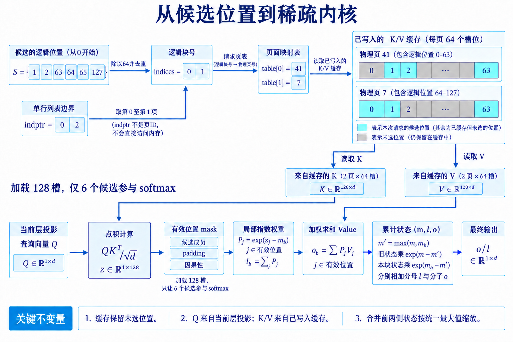

# 从索引到 Kernel

动态稀疏 attention 经常被画成 `gather → attention`。实际执行包含一条小型编译流水线：候选索引经过合并、去重与排序，逻辑位置映射到物理页，调度器按行长生成任务，kernel 逐 tile 装载 K/V 并维护 online softmax，必要时归并 split-KV 的部分输出。任一环节失去规则性，理论省下的乘加都会在访存或调度里还回去。

*图 1：六个候选位置映射到两个逻辑块，再由请求页表找到物理页41与7。加载128个槽位后，成员mask只让六个候选参与计算；K用于点积，V用于加权求和，分块状态按统一最大值缩放后合并。教学例子采用64槽位页，K与V的向量维度均为d。索引与块内mask定义参考[FlashInfer官方文档](https://docs.flashinfer.ai/api/sparse.html)，online softmax参考[FlashAttention Algorithm 2](https://arxiv.org/html/2205.14135v2)。*

[放大查看内核数据流图](../images/index-to-kernel-flow-v7.png)

## 1. 候选索引的规范化

### 1.1. 合并、去重、排序

设动态选择集合为 $D_i$，局部窗口为 $W_i$，固定 sink 为 $A_i$，真正的候选是

$$
S_i=\operatorname{unique}(D_i\cup W_i\cup A_i). \tag{1}
$$

去重关系到数值正确性。同一个 key 若出现两次，softmax 分母会把它计算两遍，输出也获得双倍路径。简单覆盖、保留最大路由分数和累加分支 gate 的语义不同，必须在 attention 前确定。 按物理地址排序通常改善读取，但会改变浮点归约顺序。高精度参照允许微小误差，不能允许候选丢失。索引还要验证范围、因果性与 batch 所属；错误页号比普通数值误差危险，因为它可能读取另一请求的缓存。

### 1.2. 从 token 到 block table

元素索引可以直接 gather，也可以扩张到块：

$$
b_j=\left\lfloor j/B_k\right\rfloor. \tag{2}
$$

这里区分两个集合：selector 指定的逻辑候选 $S_i$，以及包含这些候选的块并集 $U_i$。读取整块只改变加载布局。要保持 token 选择的原定义，进入 softmax 的仍须是 $S_i$ 中的有效位置，$U_i\setminus S_i$ 的 logits 要被屏蔽。如果直接让整块都参与归一化，候选已从 $S_i$ 改为 $U_i$，输出一般也会变化。

**行偏移、逻辑块号和物理页号各管一件事。** 用单条 query 的六个候选 $(1,2,63,64,65,127)$ 举例，编号从 0 开始。令块长与页长都为 64，页表前两项为 $(41,7)$：

| 对象 | 本例取值 | 用途 |
|---|---|---|
| token 候选 | $(1,2,63,64,65,127)$ | 保留因果与位置身份 |
| 去重逻辑块号 `indices` | $(0,1)$ | 指定读取哪两个逻辑块 |
| 单行边界 `indptr` | $(0,2)$ | 从扁平 `indices` 的第 0 项读到第 2 项之前 |
| 请求页表 | `table[0]=41, table[1]=7` | 将逻辑块映射到物理缓存页 |
| 页内有效 offset | 页 0：$(1,2,63)$；页 1：$(0,1,63)$ | 在加载块里保留原来的六个候选 |

`indptr` 的 2 表示这一行到列表第 2 项之前结束，共读取两条块索引。块号存于 `indices`，物理页号由请求页表提供：逻辑块 $(0,1)$ 对应物理页 $(41,7)$。K/V 从这两页读取，query 来自当前层的投影；两路数据在点积时汇合。

扩张后再次去重，生成每个 query block 的 `indptr` 与 `indices`。例如 token 候选 $(1,2,63,64,65,127)$，$B_k=64$，对应块 $(0,1)$；6 个逻辑候选变成最多 128 个物理 token。聚集候选非常划算，分散候选则可能放大读取。 Paged KV 再做一次映射。逻辑块号查请求的 block table 得到物理页，页内 offset 保留。页长与 kernel KV tile 不相等时，一个页可能拆成多个 tile，或多个小页组合成一次工作。FlashInfer 用 BSR 抽象统一页表与 block-sparse attention，`indptr` 表示行边界，`indices` 表示非零列块。

一次具体的索引转换。
假设 batch 中第 2 条请求有 10 个逻辑页，页长 16，物理页表为 $(41,7,83,19,\ldots)$。selector 返回 token $(18,23,70,71,72)$，先除以 16 得到逻辑页 $(1,4)$，页内位置分别是 $(2,7)$ 与 $(6,7,8)$；查表后物理页是 7 与 `pageTable[4]`。若 kernel 使用 64-token KV tile，还要按逻辑顺序组合四个页，不能把物理页号直接整除，因为逻辑相邻页在物理内存中可能完全分散。 这说明索引至少包含三套坐标：token 位置负责因果与位置编码，逻辑页表示请求内顺序，物理页用于取地址。按物理地址排序能改善访存，却不能拿物理顺序计算 RoPE 或 causal mask。实现常把物理地址和逻辑位置成对打包，避免热循环反复查表。 索引规范化应独立测试。随机生成 page table、重复 token、跨页候选和未写满尾页，用 CPU 参考构造最终位置集合；GPU 结果逐项比较。attention 输出偶尔会掩盖索引错误，例如两个 value 恰好相似，单独比较索引更容易定位。

## 2. gather 还是直接稀疏读取

### 2.1. gather 的双重流量

先把随机候选 gather 到连续 scratch buffer，随后运行 dense tile，优点是矩阵计算规则。代价是 K/V 先从原 cache 读一次、写入 scratch，再被 attention 读一次。若每 token 的 K/V 共 $B_{kv}$ 字节，候选 $k$，gather 路径额外流量近似

$$
T_{gather}\approx 2kB_{kv}, \tag{3}
$$

其中一次写、一次再读，尚未计原始读取。低 batch decode 本就受带宽限制，这份复制可能抵消稀疏收益。 直接 sparse-load 避免中间缓冲区，但地址离散会降低事务利用率。选择取决于候选是否能在多个 heads、多个 query 或多层复用。只用一次的候选通常偏向直接读；一个 GQA 组共同使用、相邻 query 共享的候选更可能值得 gather。

### 2.2. coalescing 的实际含义

假设一次内存事务取 128 字节，warp 需要 32 个 BF16 标量共 64 字节。连续地址可能由一次事务覆盖；32 个线程若落在 32 个随机 cache line，理论有效字节仍是 64，实际搬运却可接近 4096 字节，利用率只有 $64/4096=1.5625\%$。cache 命中会改善结果，但不能假定长 KV 全在 cache 中。 块索引把同一页内 K/V 连续交给 warp 或 TMA。候选排序后，相邻块还能复用页表和 L2 line。profile 中应同时看请求字节、DRAM 实际字节与 L2 hit rate；只按张量尺寸估算，会遗漏事务放大。

gather 的盈亏平衡。
设候选 K/V 数据量为 $T$，独立直接读取的有效带宽为 $B_s$，gather 的源缓存读取带宽为 $B_g$，scratch 写入与后续读取带宽分别为 $B_w,B_c$。先采用各阶段串行、每次消费者都重新读取的简化模型。$r$ 次消费的直接路径与一次 gather 后复用的时间分别为

$$
t_{direct}\approx\frac{rT}{B_s},\qquad
t_{gather}\approx\frac{T}{B_g}+\frac{T}{B_w}+\frac{rT}{B_c}+t_{launch}.
$$

首次源读取仍可能是不规则访问，不能因为目标 scratch 连续就按 $B_c$ 计算。若 $B_g=B_s$，单次消费时 gather 额外增加写入、再次读取与启动成本；多次消费才可能摊销首次整理。例如 $B_g=B_s=100$ GB/s、$B_w=B_c=1000$ GB/s，忽略启动，$r=8$ 时两条路径的时间系数分别为 $0.08T$ 与 $0.019T$；$r=1$ 时则为 $0.01T$ 与 $0.012T$，复制更慢。

这组系数以 $T$ 的 GB 数和秒为单位。真实直接内核也可能在寄存器、共享内存或 L2 中复用同一 K/V，此时不能按 $r$ 次独立源读取计价。复用要求消费者使用同一候选顺序、dtype 与位置变换；每个 head 各做一遍 gather 没有摊销。scratch 还占 workspace，并引入生产者—消费者同步。小 batch 下，单独 gather kernel 的启动时间明显，可以把地址读取和 K/V 搬运融合进 attention。是否融合应由实际字节和计时决定。

## 3. 稀疏 tile 与 online softmax

### 3.1. 一个 query tile 的循环

kernel 为 $B_q$ 个 query 分配一个 CTA，读取其候选 KV blocks。每轮计算局部 logits

$$
Z_b=Q_{tile}K_b^\top/\sqrt d+M_b, \tag{4}
$$

对每个 query 行独立计算。令该行在 tile $b$ 中的有效位置为 $J_b$，定义

$$
m_b=\max_{j\in J_b} Z_{b,j},\qquad
P_{b,j}=e^{Z_{b,j}-m_b},\qquad
l_b=\sum_{j\in J_b}P_{b,j}.
$$

$P_b$ 是减去局部最大值后的指数权重，还没有除以分母；$P_bV_b$ 是该行的局部加权分子。$m_b,l_b$ 各为每 query 一个标量，分子为每 query 一个 $d_v$ 维向量。累计状态 $(m,l,o)$ 用

$$
m'=\max(m,m_b),\quad
l'=e^{m-m'}l+e^{m_b-m'}l_b, \tag{5}
$$

$$
o'=e^{m-m'}o+e^{m_b-m'}P_bV_b. \tag{6}
$$

首次遇到非空 tile 时直接初始化为 $(m_b,l_b,P_bV_b)$。此前没有有效候选，或某个 tile 对这一 query 行完全被屏蔽时，跳过空状态，避免计算 $e^{-\infty-(-\infty)}$。累计分子与分母始终使用同一个运行最大值作为指数基准；式 (5)(6) 的缩放正是在更换基准，因而不会改变两者的比值。所有候选处理完再输出 $o/l$。这与 FlashAttention 的 IO-aware tiling 一脉相承，区别在于 KV tile 列表来自稀疏索引。

### 3.2. mask 必须在指数之前生效

尾页含无效槽位，prefill tile 还可能穿过 causal 对角线。它们的 logits 必须设为负无穷，再参与局部最大值与指数和。softmax完成后再把输出清零会污染分母。候选为空时不能得到 $0/0$；系统应保证 local/sink fallback，或显式返回定义好的零输出并记录异常。 重复 block 若未清理，也会改变分母。跨分支需要不同 gate 时，更稳妥的方式是各分支独立 softmax 后门控合并；把重复 token 塞进同一个 softmax 再乘 gate，通常不等价。

split-KV 怎样严格归并。
设两个 split 的状态为 $(m_1,l_1,o_1)$ 与 $(m_2,l_2,o_2)$，取 $m=\max(m_1,m_2)$：

$$
l=e^{m_1-m}l_1+e^{m_2-m}l_2,\qquad
o=e^{m_1-m}o_1+e^{m_2-m}o_2. \tag{7}
$$

最终输出为 $o/l$。$o_s$ 必须是未除以 $l_s$ 的累积量；若各 split 先归一化，再直接求和，会给不同分母相同权重。 手算两个 split：$(m_1,l_1,o_1)=(2,3,6)$，$(m_2,l_2,o_2)=(1,4,8)$。取 $m=2$，得到 $l=3+4/e\approx4.472$，$o=6+8/e\approx8.943$，输出约 2.0。分别归一化后相加会得到 $6/3+8/4=4$，显然不对。接口返回 log-sum-exp，既能支持归并，也供 backward 重建概率。

## 4. tile 利用率与 roofline 手算

### 4.1. 逻辑 FLOPs 和物理 FLOPs

单个 query head 对 $k$ 个 token 的 QK 与 PV 约需 $4kd$ FLOPs。若 $k=2048,d=128$，约为 $1{,}048{,}576$ FLOPs。块长 64，逻辑候选扩张后实际读取 2560 token，物理 FLOPs 变成约 $1{,}310{,}720$，tile 填充效率为 $2048/2560=80\%$。 tensor core 利用率还受 $B_q$ 影响。prefill 的 $B_q=64$ 可形成大矩阵，decode 的 $B_q=1$ 很难独自填满设备；continuous batching 会把不同请求的 query/head 组合起来。若候选数差异很大，一个 CTA 处理长行，其余 CTA 提前结束，SM active 时间仍被最长行决定。

### 4.2. 带宽上限

假设 BF16、一个 KV head 的 $d=128$，每 token 的 K+V 为 $128\times2\times2=512$ 字节。读取 2048 token 约 1 MiB。GPU 可持续带宽若为 3 TB/s，理想下限约

$$
t_{mem}=\frac{1\ \mathrm{MiB}}{3\times10^{12}}\approx0.35\ \mu s. \tag{8}
$$

这是单 head 单 query 的纯搬运下限，没有页表、索引、启动、softmax、cache miss 和并发竞争。若随机事务让有效带宽只有峰值的 20%，下限变成约 $1.75\ \mu s$。因此少读 4 倍 KV，并不自动得到 4 倍加速。 算术强度可粗写为

$$
I\approx\frac{4kd}{2kd\,s}=\frac{2}{s}, \tag{9}
$$

$s$ 是每元素字节数，BF16 时约 1 FLOP/byte。decode 明显偏带宽侧；prefill 中同一 K/V tile 被多个 query 复用，强度随 $B_q$ 上升，更可能进入计算受限区。稀疏 kernel 必须分别测两个阶段。

固定成本要放回总时间。
端到端时间可写成

$$
t_{total}=t_{route}+t_{topk}+t_{index}+t_{attn}+t_{reduce}+t_{launch}. \tag{10}
$$

假设 dense attention 为 100 微秒，稀疏 attention kernel 降到 25 微秒，但路由 12、top-k 10、索引 8、归并 5、额外启动 6 微秒，总计 66 微秒，加速只有 $100/66\approx1.52$ 倍，不是 kernel 的 4 倍。若排序在 CPU 引入同步，代价还会更高。 长度扫描可以找到交叉点。短上下文中路由与启动近似固定，dense FMHA 更快；长度增长后 KV 读取占主导，稀疏路径才拉开差距。benchmark 至少覆盖多个 batch、query 长度、KV 长度、候选率与候选聚集度，并在同一计时边界内包含索引。 roofline 还要使用实测可持续带宽与算力，不用厂商峰值代替。ECC、功耗、并发 kernel 与显存频率都会改变上限。先用简单 memcpy 和 GEMM 在同一进程测基线，再判断 sparse kernel 离机器屋顶有多远。

## 5. ragged batch、调度与 workspace

### 5.1. 为什么需要 plan/run

服务 batch 每步变化，但同一步的所有层通常共享请求长度与页表形状。Inspector-executor 模式先 `plan()`：读取长度、`indptr` 和容量上限，决定 CTA 任务、split 大小与部分输出地址；各层再 `run()`。规划成本跨层摊销，也让运行 kernel 保持简单。 FlashInfer 的 wrapper 要求调用方提供浮点与整数 workspace。CUDA Graph 捕获时地址必须稳定，路由索引仍由调用方维护生命周期。容量按最大 batch、最大 row blocks 与 split 数预留；超限时应拒绝、重新规划或进入明确 fallback，不能越界写入。

split-KV 与归并。
一条超长候选行可以拆给多个 CTA，每个 CTA 输出局部 $(m_s,l_s,o_s)$，再用式 (5)(6)相同的重标定规则归并。这样提升并行度，却增加 workspace、第二个 kernel 和输出读写。短行无需 split，强行拆分只会增加固定成本。 ragged batch 的调度目标是减少 wave quantization。可按候选块数分桶，或让 persistent CTA 从全局队列领取下一项。分桶需要排序与恢复原顺序；队列方式带来原子竞争。profile 要看每 CTA 工作量分布，而非只看总 blocks。

workspace 不是免费内存。
若 batch 有 1024 行，每行最多 128 个候选块，32 位 indices 约占 512 KiB；`indptr` 很小，split-KV 部分输出更大。假设每行拆 8 份、32 heads、head dimension 128，以 FP32 保存 $o_s$，仅部分输出就是 $1024\times8\times32\times128\times4=128$ MiB，尚未加入 $m,l$ 和调度表。 实现会按形状减少 split，或让多个阶段复用缓冲区。容量规划应给出上界与常态用量，不能把预留 workspace 排除在显存占用之外。多模型共卡时，过大的常驻 workspace 会挤压 KV cache，间接降低并发。 CUDA Graph 中，计划状态与调用方路由存储的生命周期不同。异步 `run()` 未结束就覆写 indices，会出现偶发错读。双缓冲或事件同步能解决，代价是更多内存或等待。压力测试要在高并发下反复更新索引，单步正确性不足以发现生命周期错误。

### 5.2. 反向、fallback 与诊断

训练 backward。
前向保存 log-sum-exp 与候选索引，backward 可重算局部 logits，无需保存 attention 矩阵。$dQ$ 由一个 query tile 独占较容易；$dK,dV$ 会被多个 query tiles 累加。原子加实现简单但顺序不确定，反排为 KV-centric 任务可减少冲突，却要构造转置索引。 候选若来自 hard top-k，attention backward 只覆盖选中边，selector 的梯度由蒸馏、代理梯度或其他目标负责。反向重新 top-k 可能因浮点并列得到另一集合，所以应保存 forward indices，或保证完全确定性重算。

$dK,dV$ 的归约策略可以用一个小例子理解。四个 query tiles 都选中同一 KV block，query-centric backward 会让四个 CTA 同时写这块梯度；使用原子加无需额外索引，但热点严重。KV-centric backward 先构造反向邻接表，让一个或少量 CTA 收齐四份贡献，写入更规则，却增加一次稀疏转置和列表读取。候选复用越高，后者越可能值得。 activation checkpointing 会重新执行前向局部计算。保存 `indices`、每行 log-sum-exp 与随机状态，便可重算 QK 和概率；若连索引也重算，top-k 并列、FP8 舍入或 selector dropout 都可能换边。梯度检查要覆盖候选边界接近、重复索引以及一个 KV block 被大量 query 共享的情况。 训练速度还受参数梯度同步影响。稀疏 attention 减少本层计算后，all-reduce、MLP 与优化器占比上升，kernel 的局部加速会被 Amdahl 定律压缩。报告 forward/backward kernel、完整层和完整训练 step 三个层级，才知道优化落到了哪里。

fallback 是正式路径。
候选块占比接近 100% 时，dense FlashAttention 往往更快；FlashInfer 文档也建议已知稠密模式直接选择 dense FMHA。其他 fallback 条件包括 head dimension 不支持、block size 未编译、workspace 不足、空候选和设备架构不匹配。 每种 fallback 都记录原因、长度、batch 与耗时。线上只有总吞吐时，少数回退会被平均值遮住，却主导 P99。正确性测试还要强制触发每条回退，确认输出、mask 和 cache layout 与稀疏路径一致。 fallback 切换也有状态问题。sparse path 使用排序后的页表，dense path 可能使用原请求页表；二者必须共享相同的有效长度、RoPE 位置和 prefix 映射。若回退前已经 gather 出临时 KV，dense kernel 不应误把 scratch 当完整缓存。最安全的接口让两条路径都从同一逻辑 cache 描述开始，各自生成执行计划。

接近交叉点时可以引入迟滞：进入 sparse 的阈值与退回 dense 的阈值略有差别，避免 batch 形状轻微波动导致每步重编计划。计划缓存的 key 至少包含 GPU 架构、dtype、head dimension、块长、GQA 比例和容量档位，少一个维度都可能复用到不兼容 kernel。

profile 从哪里下手。
第一组指标看访存：DRAM bytes、实际带宽、L2 hit rate、load efficiency。字节远高于理论值，通常是随机事务、重复候选或 gather scratch。第二组看计算：tensor core active、achieved FLOPs、tile 有效比例。带宽不高、tensor core 也低，常见原因是形状太小或控制流碎片。 第三组看调度：SM occupancy、active warps、CTA duration 分布与尾部 wave。少数 CTA 极慢说明 ragged 行不均；大量短 kernel 则说明融合不足或 plan 被重复执行。第四组看固定成本：top-k、排序、去重、页表构造和 workspace 清零。attention kernel 很快而端到端不快，问题通常藏在这里。 profile 前先稳定测量环境。GPU 锁定时钟或至少记录频率，预热 JIT 与 autotune，排除首次分配，把 H2D 数据准备移出计时边界；随后用 GPU event 测设备时间，用服务端时钟测端到端延迟。两组数字不同很正常，差值正好暴露 CPU 调度、同步和队列等待。

候选分布也要固定保存。随机生成同一稀疏率的 mask，无法复现真实 selector 的局部聚集、热门页与长尾行。可匿名保存每行块数、块间距、页复用次数和 GQA 并集大小，再生成具有相同统计量的合成索引。这样不保留正文，也能把线上布局带回 microbenchmark。 比较实现时统一输出精度、mask 语义与 workspace。一个内核用 FP8 KV、另一个用 BF16，或者一个包含 top-k、另一个接收现成 indices，吞吐数字没有可比性。warm-up、迭代次数、同步位置和统计量用 median 还是 P99 也应固定。 一次完整诊断应在同一批输入上依次记录 dense FMHA、只运行索引、固定候选 sparse kernel 和端到端路由。固定候选正确而动态路径慢，优化索引；固定候选也慢，再看块长、地址与调度；数值错误则先缩到单 batch、单 head、少量 blocks，与朴素 gather attention 比较每轮 $m,l,o$。

## 6. 从性能剖析走到生产 Kernel

### 6.1. profile 决策树与正确性矩阵

一棵 profile 决策树。
先比较理论 K/V 字节与 DRAM 实测字节。实测高很多，检查重复索引、页扩张、事务利用率和 scratch copy；两者接近而带宽低，查看并发度、行长分布和 cache/TLB stall。带宽接近硬件上限，说明处在 roofline 的内存侧，继续优化 tensor core 收益有限。 DRAM 字节不高、耗时仍长时，看 kernel 构成。top-k 或 index 占比高，考虑跨 head/层复用、融合或更粗粒度；归并占比高，减少 split；主 kernel tensor core active 低，检查 $B_q,B_k,d$ 对齐和块内有效比例。 端到端比 kernel 慢很多时，检查 CPU—GPU 同步、动态分配、plan 次数、CUDA Graph miss 与 fallback。P50 正常、P99 突增时，按候选块数、物理页数、最长行和回退原因切片。稀疏率相同的请求可以有完全不同的物理分散度，候选页数往往更能解释尾延迟。

数值对照固定同一候选，以 CPU FP64 或 dense mask 为参考；分别比较 logits、每 tile 最大值、log-sum-exp、输出和梯度。候选不同时停在索引层，不把路由误差归咎于 softmax。算法、布局与数值三类问题由此分开。

正确性用例矩阵。
最小张量用例覆盖 $N=1$、候选为空、仅一个候选、候选等于全长和重复索引；边界长度覆盖 page size 前后各一项，如 15、16、17；块边界覆盖 query tile 与 KV tile 的非整倍数。数值用例加入极大正负 logits、全部相等 logits、FP8 scale 边界与全 mask 行。 布局用例覆盖连续 KV、随机物理页、共享 prefix、同逻辑页映射到高编号物理页，以及 batch 中一长多短。GQA 用例分别检查每个 query head 独立候选和 KV-head 组共享候选。split-KV 从 1、2、8 份变化，归并结果与不 split 参考比较。 训练用例除输出外还比较 $dQ,dK,dV$，并重复运行检查非确定性范围。多个 query 指向同一 KV block 能压测原子归约；forward 保存索引后修改 selector 参数，可以验证 backward 没有错误重算另一集合。fallback 用例强制触发每个原因，并确认回退计数准确。

性能回归与正确性回归分开设阈值。输出误差通过，不代表没有偷偷 dense fallback；速度通过，也可能来自漏读候选。CI 可以在小 GPU 上跑形状和数值，目标 GPU 定期跑带宽、TFLOPs、workspace 与 P99。每次修改索引格式、tile 或调度器，都同时更新两组基线。

### 6.2. 从 Triton 原型到长上下文核算

从 Triton 原型走到生产 kernel。
Triton 很适合先验证数据流。program id 映射到 query row 或 query tile，从 `indptr[row]` 到 `indptr[row+1]` 遍历 block IDs；`tl.load` 根据物理页和 lane offset 读取 K/V，逐块更新 $m,l,o$。原型先保证任意 ragged 索引都正确，再逐步加入固定块长、`tl.multiple_of`、向量化载入和 autotune 配置。过早假定对齐，错误通常只在尾页或特定物理地址出现。 编译期常量包括 head dimension、$B_q,B_k$、dtype 和是否 causal。候选数与页表属于运行时。若把最大候选数编进 kernel，会为每个容量档位生成不同版本，减少循环分支，也增加编译缓存和分发复杂度。版本数量过多时，JIT 首次延迟和二进制体积都会成为服务问题。

生产实现还会利用异步搬运、warp specialization、TMA 与 tensor core pipeline。FlashAttention-3 在 Hopper 上把数据搬运、矩阵乘与 softmax 交错；稀疏索引使下一 tile 地址不再是简单递增，预取必须提前解析 block ID。索引依赖链太长时，tensor core 等待地址，理论流水线无法填满。可在一个 warp 预取索引和页表，另一些 warp 计算当前 tile，但寄存器与 shared memory 分配要重新平衡。 FlashInfer 的 inspector-executor 把动态调度移到 plan 阶段，运行 kernel 消费已经整理好的任务。Triton 原型若每个 program 自己扫描长 `indptr` 决定工作，会重复解析并造成负载不均。两者比较时，Triton 的索引准备时间也要计入；反过来，FlashInfer 的 plan 若能跨几十层复用，应按实际复用次数摊销。

从原型升级可以按依赖逐项推进：固定候选验证 online softmax，加入随机物理页，随后加入 ragged batch 和 split-KV，再接动态 selector 与 CUDA Graph。每一步都保存上一版作为正确性参照。一次把页表、量化、路由和异步流水全部接入，出现错误时几乎无法判断是哪一层坐标或状态出了问题。 最终接口应把语义参数与性能提示分开。因果 mask、有效长度、候选集合和位置属于语义，后端不能静默修改；tile、split 数、workspace 档位和调度策略属于性能选择，可以 autotune。这样更换 Triton、CUDA/CUTLASS 或其他后端时，模型看到的邻接图保持不变。

autotune 的缓存也要绑定输入分布。只用平均行长选出的配置，可能在长尾 batch 上造成 workspace 暴涨或尾波空转。候选数的均值、P95、最大值和物理页分散度都可进入配置键；配置数量失控时，再按少数容量档位合并。线上发现新形状时落到安全配置，后台测完再更新缓存，不能让用户请求承担长时间编译。 跨 GPU 架构搬运配置尤其危险。相同 tile 在 Ampere、Hopper 与 Blackwell 上面对不同的 shared memory、异步复制和 tensor core 比例，旧机器的最优值可能让新机器寄存器溢出。发布产物应保留架构标识、编译器版本和关键生成参数，profile 才能与实际二进制对应。

## 7. 完整案例与实现细节

### 7.1. 64K 上下文的完整核算

**从页级候选到 tile 任务。**

设单条请求已有 65536 个 token，page size 为 16，因此页表含 $65536/16=4096$ 页。模型采用 8 个 KV heads、32 个 query heads，head dimension 为 128，KV 保存为 BF16。selector 为每个 KV head 选择 256 页，并额外保留最近 16 页；去重后假设平均 264 页，其中 8 页同时被动态选择与窗口命中。 每个 KV head 的物理候选 token 为 $264\times16=4224$。若 kernel 的 KV tile 为 64 token，需要按 64-token 逻辑边界把最多 4 个相邻页编成一项；随机远程页无法合并，只能各自形成带 mask 的 64-token tile。假设 16 个窗口页与 tile 边界对齐，合成 4 个完整 tiles，剩余 248 个动态页按这些边界分组后有 32 个满 tile、40 个各含两页的 tile、40 个各含单页的 tile；各组占据不同逻辑 tile。对应任务数为

$$
4+32+40+40=116\ \text{KV tiles}. \tag{11}
$$

这些 tile 的物理计算容量是 $116\times64=7424$ token，而真实候选只有 4224 token，tile 有效率仅 $56.90\%$。这组数字说明 page size 16 与 $B_k=64$ 的组合对分散候选很不友好。若后端支持 $B_k=16$，任务数升到 264，索引与启动循环更多，物理 token 却降到 4224；究竟哪边快，要看小 tile 的 tensor core 利用率与地址开销。

**HBM 字节与计算量。**

每个 token、每个 KV head 的 K+V 字节为

$$
B_{kv}=2\times128\times2=512\ \text{bytes}. \tag{12}
$$

理想页级读取为 $4224\times512=2{,}162{,}688$ 字节，约 2.063 MiB。8 个 KV heads 合计约 16.5 MiB。若 $B_k=64$ 路径真的把掩掉槽位也从 HBM 读入，物理读取变成 $7424\times512\times8/2^{20}=29$ MiB；若 kernel 按页内 mask 只发射有效载入，DRAM 可以接近 16.5 MiB，但矩阵 tile 仍可能为无效槽位发射乘加。 稠密 decode 读取量为 $65536\times512\times8=256$ MiB。于是逻辑压缩率为 $256/16.5\approx15.5$ 倍，粗 tile 全读后的物理压缩率只有 $256/29\approx8.83$ 倍。索引表每个候选页用 4 字节，$264\times8\times4=8448$ 字节，`indptr` 与页内 mask 也只有几十 KiB；索引容量很小，随机索引造成的事务效率才是主要问题。 32 个 query heads 共享 8 个 KV heads，即每组 4 个 query heads。对 4224 token 做 QK 与 PV，每 query head 约 $4\times4224\times128=2{,}162{,}688$ FLOPs，32 heads 共约 69.2 MFLOPs。若物理 tile 全算 7424 token，则升到约 121.6 MFLOPs。decode 的算术量仍不大，读取模式和 batch 并发决定时间。

**workspace 与 split-KV。**

假设每个 KV head 的 116 个 tiles 拆成 4 个 splits，每个 split 处理约 29 tiles。32 个 query heads 分别输出局部状态，$o_s$ 用 FP32 保存，部分输出占

$$
4\times32\times128\times4=65536\ \text{bytes}. \tag{13}
$$

每个 split/head 还保存 $m_s,l_s$ 两个 FP32，总计 $4\times32\times2\times4=1024$ 字节。单请求约 65 KiB；batch 64 时约 4.06 MiB。再加入索引、任务描述和双缓冲，预留 6–8 MiB 比只按部分输出计算更稳妥。 四个 splits 的归并以式 (7)逐项重标定。举一组 head 的局部最大值 $(8,7,9,6)$ 与指数和 $(12,18,10,20)$，全局最大值为 9，合并分母为

$$
l=e^{-1}12+e^{-2}18+10+e^{-3}20\approx17.85. \tag{14}
$$

每份 $o_s$ 按同样系数缩放后求和，再除以 17.85。若某个 split 没有有效页，它的 $l_s=0$，不能让未初始化的 $m_s$ 参与最大值；任务规划阶段可以省掉空 split。

**block size 与候选率的交叉点。**

用一组示例数值演示决策方法。时间单位为微秒，包含索引规范化与 attention，不代表任何固定 GPU 的通用结论：

| 候选率 | $B_k=16$ | $B_k=32$ | $B_k=64$ | Dense FMHA | 选择 |
|---:|---:|---:|---:|---:|---|
| 3.1% | 42 | 35 | 38 | 118 | 32-token block |
| 6.25% | 55 | 46 | 44 | 118 | 64-token block |
| 12.5% | 78 | 66 | 59 | 118 | 64-token block |
| 25% | 126 | 101 | 88 | 118 | 64-token block |
| 50% | 214 | 162 | 133 | 118 | Dense |

小候选率下，$B_k=16$ 少做无效乘加，却受索引循环和小 tile 限制；候选率上升后，$B_k=64$ 更容易利用 tensor core；到 50% 时，稠密内核的连续访问胜过稀疏路径。若真实候选高度分散，64-token 列可能整体上移，交叉点更早出现。调度表要以实测的候选率和聚集度查找，不能只抄表中数字。

**CUDA Graph 的地址稳定条件。**

图捕获期间，Q/O、KV cache 池、workspace、`indptr`、`indices` 和任务计数器的设备地址都要保持稳定；内容和有效长度可以在 replay 前原地更新。grid shape 若固定为容量上限，kernel 读取有效任务数跳过多余 CTA。重新分配 indices、扩容 workspace 或换到另一份页表数组，都会破坏捕获时记录的地址。

双缓冲路由表时，可预先捕获两张图，分别绑定 buffer A 与 B；第 $t$ 步运行 A 时，另一个 stream 准备 B，第 $t+1$ 步交换。事件必须保证写 B 完成后才 replay，且 A 的 attention 完成后才能覆写。只交换 Python tensor 引用没有用，图中保存的是底层设备指针。 容量越界需要退出图模式，扩容并重新捕获。为了避免某条超长请求频繁破图，可按候选容量设置 128、256、512 页等档位，每档拥有固定 workspace 与图。请求进入最小可容纳档位，实际 `nnz` 仍由计数器决定。

**基准协议与三类故障。**

基准固定 GPU 型号、驱动、编译器、时钟策略、dtype、head 数、page/block size 与候选分布。JIT、autotune 和 cache 预热后，先运行不少于 100 次 warm-up，再记录至少 1000 次 GPU events；同时保存 median、P95、P99。端到端计时包括 selector、top-k、索引、plan、kernel 与归并，kernel-only 结果另列。dense 与 sparse 使用相同输入、mask、KV 布局和输出精度。

故障一表现为 DRAM bytes 比式 (11)高三倍、tensor core active 尚可。进一步发现候选先 gather 到 scratch，随后又被 attention 读取，且每个 query head 各复制一次。修复方向是让 GQA 组共享 scratch 或直接 sparse-load；继续调 tile 无法消掉复制流量。 故障二表现为 DRAM 带宽与 tensor core 都低，CTA duration 的 P99 是中位数十倍。候选统计显示多数行 32 blocks，少数行 800 blocks，静态一行一 CTA 让尾波只剩几个 SM 工作。应拆长行、使用 persistent queue 或按行长分桶。提高 occupancy 参数可能增加更多空闲 warps，解决不了任务粒度不均。 故障三表现为 kernel-only 稳定在 45 微秒，端到端 P99 却偶发超过 2 毫秒。trace 显示候选数越过 workspace 档位后触发同步分配，并退出 CUDA Graph；偶发 dense fallback 又重建另一份 plan。修复方式是扩大常用档位、异步准备下一档 workspace，并把回退原因纳入调度。单看 kernel profile 完全看不到这类服务故障。

三类故障对应三条证据链：字节异常查数据路径，CTA 长尾查调度，端到端尖峰查图捕获、分配与 fallback。先用计数器确认类别，再进入源码，比看到「稀疏 kernel 慢」便重写矩阵乘更有效。

**同一案例中的 backward 冲突开销。**

把上述 64K 案例扩成训练 prefill。假设 query tile 为 64 token，一个训练 chunk 有 4096 个 query，因此每个 head 有 64 个 query tiles。若每个 query tile 都选择 264 页，热门的 16 个局部页会被多数相邻 query 重复访问，远程页则较分散。$dQ$ 的归属清楚：一个 CTA 处理一个 query tile 的全部候选，累积后写回自己的 64 行，不与其他 CTA 冲突。 $dV$ 与 $dK$ 的方向相反。同一个热门 KV page 可能收到 64 个 query tiles 的贡献；若每个 tile 直接对 BF16/FP32 梯度做原子加，单页包含 $16\times128=2048$ 个元素，64 份贡献意味着最多 $131072$ 次热点原子更新，K 与 V 各发生一次。远程冷页只被少数 tiles 选中，原子冲突小，统一采用一种策略会让热门页决定尾部时间。

两阶段归约可以先让每个 query CTA 把局部 $dK,dV$ 写入 workspace，再按 KV page 分组求和。若所有候选都保存局部梯度，容量非常大：64 query tiles、264 pages、16 tokens、128 维、K/V 两份 FP32，约

$$
64\times264\times16\times128\times2\times4\approx264\ \text{MiB/head}. \tag{15}
$$

显然不能照此物化。实用做法是按 KV block 分片，让一组 CTA 在片上或小型 partial buffer 中归约；或者只对高复用热门页走 KV-centric 路径，冷页继续原子加。前向统计的 page reuse count 正好可用于选择路径。 混合方案设阈值 $r_0$：复用次数 $r_b<r_0$ 的 block 直接原子累积，$r_b\ge r_0$ 的 block 写入按固定 split 数组织的 partial buffer。阈值太低会扩大 workspace 与归并开销，太高则热点原子仍然串行。对候选复用分布做扫描，可以画出 atomic time、reduce time 与 workspace 的三条曲线，再选交叉点。 $dQ$ 虽无写冲突，也可能因候选行长不同而负载不均；$dK,dV$ 的反向邻接表则会改变不均衡方向，热门页行很长。forward 与 backward 不应共用一套静态分桶。基准分别记录 $dQ$ kernel、$dK/dV$ kernel、稀疏转置、归并和 workspace 清零，才能看清训练反向究竟卡在矩阵乘、原子还是元数据。

数值上，原子加的顺序随调度变化，重复运行会出现末位差异；分段归约若固定树形顺序，可以提高确定性。验收同时给相对误差与重复运行方差。为了逐 bit 一致而把所有贡献串行，会牺牲大量性能；完全不约束顺序，又可能让低精度累积在长序列上漂移。常用折中是局部 FP32 累积、固定 split 内顺序，split 之间再做少量归并。 反向开销还应随 block size 一起重算。较大的 block 减少反向索引项，却让热门区域带入更多无效梯度乘加；较小的 block 降低填充，又扩大转置表和调度任务数。前向最优块长未必也是训练总步的最优块长。

### 7.2. 量化 KV 与内核特化

量化 KV 与 kernel 特化。

**反量化放在读取路径的哪一层。**

KV以INT8、FP8或更低bit保存时, 稀疏kernel读取候选块后要恢复计算值. 若先gather量化码到scratch再单独反量化, 候选数据至少经过两次全局内存; 更合理的路径是在tile load后立刻应用scale, 将重构值留在寄存器或shared memory, 随后进入QK/AV. Scale粒度决定地址. 每tensor一个scale最省元数据, 精度有限; 每head、每page或每channel更精细, kernel要同步读取更多scale. 设page有 $P$ 个token、head维 $d_h$, 每page每channel scale需要 $d_h$ 个值, 主KV码只有 $Pd_h$ 个值. $P$ 很小时, scale占比会明显上升. 性能核算要把scale字节与转换指令加入, 不能只按bit宽缩放KV流量.

QK与AV对量化敏感性不同. K误差改变logits和softmax排序, V误差在线性加权后进入输出. 实现可为K、V使用不同格式或scale. 这会增加模板组合, 但比统一格式后靠扩大候选补质量更直接. 正确性基线也应使用同样的重构KV, 先隔离kernel误差, 再与高精度模型比较量化误差.

**索引有序性影响scale复用。**

候选按物理page排序后, 同一page的scale只需加载一次, 其内多个token或多个query head可以复用. 按分数顺序访问则可能重复切换page. GQA中多个query heads共享KV page与scale, kernel若按KV head组织工作, 能提高复用; 按query head各自启动, scale和K/V都会重复读取. 去重应发生在反量化前. 两条selector分支若给出同一page, 先各自反量化再在attention里屏蔽, 已经浪费主要带宽. 对token索引, 同页的离散offset可先聚合成小bitmap或排序列表; page只加载选中token还是整个tile, 取决于候选密度与硬件事务.

**编译特化不能覆盖无限形状。**

高性能kernel常对 $d_h$、block size、dtype、causal、GQA比例和候选容量特化. 组合过多会增加编译时间与二进制体积, 还会让线上shape落到未调优路径. 配置应把实际模型形状归入少量稳定档位, 例如固定 $d_h\in\{64,128\}$、page size与若干候选上限. Autotune需要使用代表性的索引分布. 只用连续候选调出的tile, 面对随机pages时可能寄存器设置过大、并发不足; 只用平均行长会忽略长尾. 可以按候选聚集度、行长档位和batch各保留一组测试形状, 选择在加权流量上表现稳定的配置, 而非单点最快参数.

运行时遇到未支持的head维或dtype, 应进入明确的参考/稠密路径并记录原因. 静默pad到下一个维度会增加FLOPs, 还可能让scale和RoPE布局出错. Fallback正确性先与参考实现核对, 性能告警则统计它占总请求比例; 一个很快的主kernel若大量流量回退, 整体收益仍会消失.

**Epilogue 融合的边界。**

Attention输出后常接输出投影、残差或量化写回. 将简单的cast、scale或门控融合进epilogue, 可以少写一次中间O; 直接融合完整输出投影会让稀疏attention kernel承担大矩阵乘, 编译与调度复杂度显著上升. 是否融合取决于O的字节与后续GEMM能否高效独立运行.

Split-KV 先产生多个局部状态。依赖最终输出的非线性 activation、门控和低 bit 截断，通常要等归并后执行；分别变换局部输出再求和一般不等价。

Attention 概率上的 dropout 可以在 tile 内作用于局部分子。设丢弃率为 $p<1$，每条边的保留标记为 $a_j\in\{0,1\}$，把局部指数权重乘以 $a_j/(1-p)$ 后与 Value 相乘，但分母仍累计未做 dropout 的指数和。随后按式 (7) 同步重标定并合并分子与分母，就与对完整 softmax 概率施加同一 dropout mask 一致。[FlashAttention v2 的 Algorithm 2](https://arxiv.org/html/2205.14135v2#alg2) 采用这条路径。若连分母一起丢弃再归一化，计算的就是另一种函数。

训练时 dropout mask 要与逻辑边和重计算一致。只保存随机种子时，还需保证随机数映射不因索引重排而改变；可以固定候选遍历规则，或用 `(batch,head,q_pos,k_pos)` 作为计数器坐标。前向和反向必须为同一逻辑边恢复同一保留标记。

**交付前的算子矩阵。**

最终测试矩阵至少覆盖 FP16/BF16主路径、启用的KV量化格式、MHA/GQA、causal/non-causal、连续与离散候选、短行与超长行、split-KV、CUDA Graph和fallback. 每格先比较reference输出与梯度, 再记录延迟、DRAM bytes、tensor core利用率和workspace.

测试矩阵不要求所有组合都有专用kernel. 明确标记支持、回退和禁止, 比让未知组合自动落到错误模板安全. 模型接入时用配置生成实际会触发的子集, CI运行小shape正确性, 发布前在目标GPU运行长shape性能与内存压力. 这样索引协议、数值定义和硬件实现才能在同一版本下验收.

### 7.3. 索引格式与算子语义

**集合、序列与多重集给出三种不同结果。**

若候选只表达集合，索引顺序不影响实数域中的attention结果，重复元素应被删除。若索引表达序列，顺序可能参与位置编码或随机数生成。若允许多重集，同一key出现两次会在softmax中获得两份指数质量，等价于给该logit增加 $\log 2$，已经改变模型函数。 因此接口必须声明输入究竟是哪一种。常见动态稀疏attention需要的是逻辑位置集合，排序只为执行服务，重复属于错误。多个路由分支若想给同一位置不同权重，应先合并分支分数或在分支输出层做门控，不能靠重复索引暗示权重。 规范化可定义为映射

$$
\mathcal N:(D,W,A,T)\mapsto
\{(t,\ell(t),p(t))\mid t\in D\cup W\cup A,0\le t<T\}, \tag{16}
$$

t是逻辑token位置，$\ell(t)$是逻辑页及页内偏移，p(t)是物理地址。集合成员资格由t决定，物理排序只重排三元组。这个定义把越界、重复与坐标混淆变成可测试条件。

**逻辑坐标必须贯穿位置相关计算。**

物理页可以被回收、迁移和重排，同一请求的相邻逻辑页未必相邻存放。RoPE、ALiBi、因果mask与相对位置桶都使用逻辑位置。若kernel为改善coalescing按物理地址排序，仍需携带每个tile的逻辑起点或逐token位置。 共享prefix进一步说明两套坐标不能混用。两个请求可指向同一物理页，该页在两条序列中的逻辑位置可能相同，也可能因拼接策略不同而偏移。物理复用只说明K/V字节相同，位置语义是否可复用取决于K中是否已经编码绝对或旋转位置。 地址映射可拆成

$$
\operatorname{addr}(n,t,h)=
\operatorname{base}[\operatorname{table}_n(\lfloor t/P\rfloor),h]
+(t\bmod P)\operatorname{stride}_{tok}. \tag{17}
$$

任何物理排序都只能改变访问次序，n、t、h仍决定读到哪个元素。随机页表测试应让物理页号与逻辑顺序完全无关，以免错误实现碰巧在连续分配下通过。

**Token候选扩张成块会改变预算语义。**

selector返回k个token，kernel按块长B读取时，真实读取集合为覆盖这些token的块并集。若候选均匀散落，最多触及k个块并读kB个token；若候选高度聚集，读取量接近k。于是相同逻辑recall和k会对应完全不同的物理成本。 设被选token数为k，触及块数为u，块利用率定义为

$$
\eta_{blk}=\frac{k}{uB}. \tag{18}
$$

$\eta_{blk}$既受selector影响，也受block size影响。只惩罚 token 数无法区分聚集与分散布局，部署成本却按u计价。更合适的预算目标直接使用触及块数，或让selector输出块级分数。 块扩张还可能引入因果边界后的token。prefill中query tile跨越对角线时，同一KV块对不同query行具有不同有效前缀。索引可保留整块，但 logit 阶段要同时屏蔽未被 selector 选中的位置、padding 与未来位置；不能因为块被某一行合法选中，就让同tile内较早query读取未来位置。

**去重键要选择逻辑身份。**

共享页、copy-on-write与prefix cache会让多个逻辑引用指向同一物理页。按物理页去重可能错误合并两个具有不同逻辑位置语义的引用；按逻辑token去重则保留模型邻接图。只有能够证明K/V和位置偏置完全相同，物理别名才可合并。

GQA组内合并候选也使用逻辑块ID。各query head的路由分数可取最大、求和或保留私有预算，合并规则在进入kernel前完成。kernel接收最终集合后不应再次根据物理地址猜测组级语义。 去重算法本身有成本。短定长索引可排序后线性去重，长ragged行可用位图、哈希或分层块标记。位图大小随全上下文增长，哈希存在随机访问，排序为 $O(k\log k)$。选择取决于k与总块数，复杂度要计入索引路径。

**空集合和非法集合必须有唯一含义。**

全mask行的softmax在数学上没有有限分母。系统可以禁止空候选、强制加入当前token或sink，也可以定义输出为零并跳过归一化。三种选择都会影响残差路径，必须在接口中固定。静默读第0页填空会把安全问题伪装成数值结果。

非法索引包括负数、越界页、跨请求物理页和指向尚未提交的尾块。验证可在plan阶段完成范围与所有权检查，热kernel仍保留容量边界。高性能模式省略逐项检查时，调用方必须提供已经验证的对象，不能接受任意用户数组。 错误处理也属于可观测语义。回退dense只适用于完整KV仍可访问的情况；索引指向错误请求时，回退无法修复潜在数据泄漏，应终止该批并记录原因。将所有异常都归成“fallback”会掩盖严重程度。

### 7.4. Ragged 与定长结构的转换

**CSR式行表示保留真实工作量。**

对每个query行i保存 `indptr[i:i+2]`，候选块位于扁平 `indices`。总索引数为nnz，容量与真实候选和成正比。行长

$$
k_i=\operatorname{indptr}_{i+1}-\operatorname{indptr}_i \tag{19}
$$

直接决定该行工作量。结构适合高度变化的预算，也给split和分桶提供统计量。 代价是每行起点不同，kernel需要读indptr并处理变长循环。若一个CTA负责一行，长尾产生wave不均；若一行拆成多任务，plan需生成任务到行、split与块区间的映射。CSR节省padding，却把规则性转移到调度阶段。

**定长K用padding换取静态形状。**

固定每行K个块可存成二维矩阵，地址计算简单，CUDA Graph与编译特化也容易。真实候选不足K时需要哨兵或重复填充。哨兵必须在load前或logit处被mask，重复真实页则会改变softmax，不能充当无害padding。 若行长分布为 $k_i$，统一容量K的索引利用率为

$$
\eta_{idx}=\frac{\sum_i k_i}{NK}. \tag{20}
$$

平均候选很小但P99很大时，按最大值定长会浪费大量循环与存储。分档定长能折中：例如64、128、256三档，每行进入最小可容纳档位，档内保持规则。

**分档边界影响质量和调度。**

若自适应selector请求129块，容量档只有128和256，向下截断会损失质量，向上分配会浪费127槽。路由器可直接学习档位，在训练时感知阶梯成本；也可保持连续预算，部署向上取整并记录浪费。 同档行仍可能有不同有效长度，kernel用计数器屏蔽padding。按档位组batch会改善tile规则性，却可能延迟等待同类请求。离线吞吐最优分桶未必符合在线P99，调度成本要和kernel收益共同评估。 分档还决定workspace与图捕获数量。档位过密，计划缓存、二进制和常驻buffer膨胀；档位过疏，padding增加。可用真实 $k_i$ 分布最小化期望成本

$$
\min_{C_1<\cdots<C_m}
\mathbb E[T(C(k))]+\lambda m, \tag{21}
$$

其中 $C(k)$ 是覆盖k的最小档，$\lambda$给每个额外档位定价。

**Ragged到任务表是一次小型编译。**

plan读取每行长度，决定每个任务处理的块区间，写出 `(row,start,end,split)`。若目标每任务约R块，第i行任务数约为 $\lceil k_i/R\rceil$。任务表让执行kernel无需搜索前缀和，代价是生成与读取额外元数据。 前缀和计算把每行任务数转成全局任务ID。这个过程通常为线性复杂度，短batch时固定启动成本显著，长batch时可跨层复用。候选集合每层不同则无法复用完整任务表，只能复用行形状或容量规划。 任务划分还应考虑物理聚集度。相邻索引落在连续页时，一个任务可以形成长流水；完全随机时，过大的任务会拉长地址依赖链。仅按块数均分无法保证各任务时间相等，页跨度与预计事务数可作为第二个权重。

**转换必须保持稳定的行身份。**

分桶、排序任务与persistent queue会改变执行顺序，输出仍需写回原batch、head与query位置。每个任务携带稳定row ID，split归并以row ID分组。把排序后序号当输出位置，会在候选长度相同的测试中难以察觉，在ragged batch中直接串行。 请求取消或continuous batching换入新序列时，row ID还要绑定generation或slot版本。旧任务晚到后若写入已复用slot，会污染新请求。任务表生成、运行与slot回收之间需要事件或世代检查。 稳定身份也利于确定性。不同调度顺序可能改变浮点归并末位，但不能改变任务属于哪一行、包含哪些逻辑块。测试可随机打乱任务表顺序，验证集合与输出在容差内保持一致。
