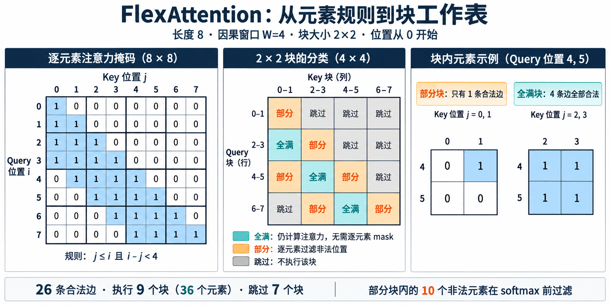

# FlexAttention：从规则到融合内核

注意力变体有一种很实际的“组合爆炸”。因果mask、滑动窗口、prefix LM、document mask、ALiBi、soft cap、GQA和分页KV分别都不难；任取几项组合后，现成融合kernel常常就用不上了。退回 `scores = QK^T` 再逐项修改最容易验证，却会物化平方级分数矩阵。为每个组合各写一套CUDA或Triton，研究代码很快被数据布局、反向和硬件细节淹没。

FlexAttention提供一个编译驱动的中间层。模型作者提交两个小函数：`mask_mod`定义允许的 $(q,k)$ 集合，`score_mod`定义分数变换。编译器分析这些函数，将它们融合进FlashAttention式tile循环；BlockMask再把逐元素集合提升到块级工作表，让完全无效的KV tile从主循环消失。论文将目标概括为「用普通PyTorch表达注意力变体，同时生成接近手写融合算子的代码」。

这套抽象的关键是三次转换：数学规则怎样变成可编译函数，逐元素mask怎样变成块稀疏元数据，块表怎样进入online softmax、反向和decode。API只是这些转换的入口。任何一次转换丢失语义，结果都会在边界位置出错；任何一次转换只做了逻辑稀疏而没有跳过物理工作，性能也不会兑现。

## 1. 从注意力定义到两个mod函数

### 1.1. mask_mod定义允许集合

设query、key位置分别为 $i,j$，批次和head索引为 $b,h$。mask函数

$$
m(b,h,i,j)\in\{0,1\}
$$

决定连接是否存在。因果注意力为 $m=i\ge j$；左侧窗口 $W$ 加入 $i-j<W$；document mask再要求 $d_b(i)=d_b(j)$。组合后的集合写成

$$
m_{local\_doc}(b,h,i,j)=[j\le i]\land[i-j<W]\land[d_b(i)=d_b(j)].
$$

对应的函数只接收索引和被捕获的document ID张量，不创建 $N\times N$ 布尔矩阵。编译器可以在一个tile内向量化这些比较，也可以在创建BlockMask时用同一规则判断整块是否为空。 集合定义必须和模型真实语义一致。padding token是否允许被看见、prefix区域能否双向连接、生成区域能否访问全部prefix、不同head是否使用不同窗口，都要落到返回值里。逻辑运算的一个括号就可能改变大量连接。最小参考测试应枚举小长度下所有 $(b,h,i,j)$，与人工列出的邻接矩阵逐项比较。

FlexAttention官方API还提供 `and_masks` 与 `or_masks`。它们解决函数组合的样板代码，不能判断组合是否合理。两个允许集合取交集会变得更稀疏，取并集会变得更稠密；把“因果或同文档”写成并集，可能让同一文档内部看到未来。组合前先写集合公式，比在函数里堆布尔表达式更容易审查。

### 1.2. score_mod修改分数

标准缩放点积为

$$
s_{bhij}=\frac{q_{bhi}^{\mathsf T}k_{bhj}}{\sqrt d}.
$$

`score_mod(score,b,h,q_idx,kv_idx)` 接收这个标量并返回修改后的分数。例如ALiBi加入与距离成比例的head特定偏置，soft cap可以写成

$$
\tilde s=C\tanh(s/C),
$$

相对位置表则读取 $r_h(i-j)$ 并相加。修改后的softmax为

$$
p_{bhij}=\frac{m_{bhij}\exp(\tilde s_{bhij})}
{\sum_{t:m_{bhit}=1}\exp(\tilde s_{bhit})}.
$$

mask与score承担不同语义。把无效位置的score设成一个有限负数并不能严格删除连接，长序列下大量微小概率仍可能积累；布尔mask会在softmax前将其排除。反过来，ALiBi只是改变偏好，不应该据此删除远距离token。两类规则分开后，BlockMask只需分析真正的结构稀疏。 score修改的顺序也要明确。设缩放、偏置、soft cap分别为 $a$、$r$、$c$，$c(as+r)$ 与 $ac(s)+r$ 通常不相等。实现若把若干函数合并为一个 `score_mod`，应让公式和代码保持同一顺序，并用高精度reference覆盖极大正负分数，防止低精度下饱和位置不同。

捕获张量与动态shape。
mod函数常要读取外部状态。document mask需要每个token的document ID，滑动窗口可能从每个head的窗口表取值，检索mask可能读取query对应的段边界。被捕获张量需要位于合适设备，dtype与索引范围也要稳定。若闭包依赖普通Python列表、随机数或会变化的对象属性，图捕获可能常量化旧值、触发graph break或反复编译。

动态长度带来两层变化。Q/K/V shape变化会影响kernel specialization，BlockMask的Q_LEN/KV_LEN也必须覆盖本次输入。官方源码会检查mask长度：小于实际输入无法提供完整索引，大于输入则不能盲目裁剪，因为某些规则的左上角裁剪不等价于重新生成。固定最大长度并切片只适用于能够证明前缀闭包的mask。 可执行的缓存键至少包含设备、dtype相关后端、batch/head广播方式、Q/KV长度、block size以及所有会改变mask结构的张量版本。score_mod只改数值而不改集合时可以复用BlockMask；document边界变化则必须重建。把“编译缓存”和“mask缓存”分开记录命中率，才能知道冷启动来自哪一层。

GQA与head广播。
GQA中query heads数量大于KV heads，映射关系通常为 $h_{kv}=\lfloor h_q/g\rfloor$。mask按query head定义还是按KV head共享，需要由模型规则决定。若所有heads使用同一因果或窗口结构，BlockMask的H维可以广播；head特定窗口、ALiBi斜率或路由模式则不能错误共享。 score_mod接收的是query head索引。读取KV侧参数时必须先做head映射；读取ALiBi斜率则直接用query head。这个区别在MHA里看不出来，因为两侧head一一对应。用一个小GQA样例让两个query heads共享同一KV head、却具有不同score偏置，可以发现错误广播。 `enable_gqa`一类开关只处理Q与K/V的head形状关系，不会自动修正自定义函数里的head语义。测试矩阵应同时包含MHA、MQA与GQA，比较展开KV后的稠密reference。展开只用于测试，生产路径仍应共享KV，避免复制cache。

## 2. BlockMask怎样把元素规则变成工作表

### 2.1. 块级压缩格式

设query block大小为 $B_q$、KV block大小为 $B_k$，则逻辑矩阵被切成

$$
N_q=\lceil Q/B_q\rceil,\qquad N_k=\lceil K/B_k\rceil
$$

个块。对每个query block，BlockMask保存有效KV block数量与索引。它类似BCSR：`kv_num_blocks`给出每行长度，`kv_indices`给出列号。官方文档把它称作块稀疏mask与非稀疏格式之间的折中，优先考虑实现简单和kernel效率，而非把元数据压到最小。 若每行平均保留 $r$ 个KV blocks，索引规模约为 $O(N_qr)$；逐元素布尔mask为 $O(QK)$。在64K序列、128×128块上，二维矩阵有262144个块，元素矩阵却有约42亿项。即使块表没有进行极致压缩，它仍比逐元素mask小多个数量级。 BlockMask通常还保存反向需要的query侧转置索引。前向从query block查KV blocks，dK/dV路径更适合从KV block查相关query blocks。运行时临时转置会增加排序和workspace，预先生成则增加元数据。只做推理与需要训练反向的mask，在构造选项上可以不同。

### 2.2. full blocks与partial blocks

用长度 8、因果窗口 $W=4$ 的小例子看块分类. 位置从 0 开始, 允许连接满足 $j\le i$ 且 $i-j<4$, query 与 KV 块均取 $2\times2$. 全满块中的四条连接都合法, 部分块至少有一条合法连接但未全满, 空块直接跳过.

> 图 1: 元素规则转换为块工作表的教学算例. 机制参考 [PyTorch 官方 FlexAttention 介绍的 Mask Mods 与 BlockMask 部分](https://pytorch.org/blog/flexattention/);矩阵与计数为本例复算结果, 非性能实验. [查看原尺寸](./images/flex-block-classification-v1.png).

左图每行表示一个 query 可读取的 key, 中图把每四个元素归为一个块. query 4–5 对 key 0–1 的块只有 $(4,1)$ 合法, kernel 仍执行这个块, 但在 softmax 前过滤另外三个位置. query 4–5 对 key 2–3 的四条边全部合法, 因而省去逐元素 mask 判断. **26 条合法边需要执行 9 个块, 覆盖 36 个元素**;块执行量与合法边数的差额正来自部分块. 空块共 7 个, 不进入注意力主循环.

一个块内所有 $(i,j)$ 都允许时，它是full block；全部禁止时可以删除；其余是partial block。full block进入主循环后无需调用逐元素mask，partial block仍要生成布尔谓词。因果对角线、窗口边缘和文档边界通常形成partial blocks，远离边缘的内部块则全满或全空。 设有效元素数为 $E$，被执行块覆盖的元素数为 $P$，块利用率

$$
u=E/P.
$$

逻辑稀疏率只看 $E/(QK)$，kernel成本更接近 $P$。如果每个有效token都散落在不同块里，$E$很小而$P$接近全矩阵，BlockMask无法带来相同比例的计算节省。选择block size时要同时报告被跳过块比例与partial blocks内部利用率。 官方API的 `separate_full_blocks` 允许构造器区分full与partial列表。关闭分流可能减少元数据准备，却让全满块重复执行mask逻辑。规则简单、partial比例很高时差异有限；长滑窗或大文档块中full区域占多数时，分流价值更大。

为什么不能只用score_mod统一处理，可以用因果mask算一遍。对角线以下的大多数blocks全部有效，只有对角线blocks需要逐元素比较 $i\ge j$。如果每个score都执行 `where(valid,score,-inf)`，全满区域也承担分支与索引计算。PyTorch官方博客在其基准里观察到约15%到20%的性能下降。BlockMask把全满块单独列出后，这些块只保留真正的score修改，因果判断只落在对角边缘。

元数据内存同样能手算。默认128块时，百万长度每轴约7813个块；官方实现的表还会受到batch/head广播、full/partial列表与反向索引影响。官方博客给出的典型额外内存约60MB，而block size提升到1024后可压到1MB以下。数字说明BlockMask不是零成本，但相较百万长度的KV与平方mask仍很小。决定块大小时，要把常驻内存和执行浪费一起放进曲线。

从mask_mod生成块表。
最直接的构造方法是在每个块内评估 `mask_mod`，归约出any/all，再生成压缩索引。若逐元素扫描整个 $QK$ 空间，构造成本仍是平方级，只是运行attention时省下工作。固定mask可以摊销一次构造；每步变化的动态mask则可能被准备阶段卡住。 结构已知时，可以直接从区间或候选块生成BlockMask。例如滑动窗口中query block $r$ 只接触附近若干KV blocks，不必遍历远处空块；检索系统已经输出块ID时，也可规范化、排序后进入表。无论怎样生成，都应保留 `mask_mod` 作为partial block的精确判定，否则块边缘会多算非法连接。 构造器本身也能编译。收益取决于shape与复用次数：长固定序列的初始化成本可以忽略，短请求逐个创建则可能比attention更慢。基准应分别记录BlockMask build、编译、kernel和端到端时间；把预计算排除在外时，应明确部署确实能缓存。

长度裁剪与mask复用。
decode常在最大长度上预建方形BlockMask，然后取当前query对应的行。因果与固定滑窗具有稳定前缀结构，可以这样复用。依赖总长度的规则未必成立：若某个token只连接序列末端块，最大长度mask裁到短序列后，末端位置已经改变；环形或对称中心规则同样不能简单裁剪。 复用验证可以对多个目标长度分别重新构建mask，与缓存裁剪结果比较块索引和逐元素邻接。只有全部相等，才把规则加入可裁剪白名单。官方源码对过大BlockMask给出显式警告与调整入口，正是因为左上角裁剪没有普遍正确性。

batch内变长序列还要处理每个样本的有效长度。把B维设为 `None` 表示结构广播，只适合同一规则；每个样本document边界不同，就需要B维索引或在partial规则中读取长度。为了省元数据而广播错误mask，会造成跨样本padding访问或信息泄漏。

## 3. 融合kernel里的softmax语义

### 3.1. tile循环与online softmax

对一个query行，softmax可以分块归并。处理第 $t$ 个KV tile时，局部最大值为 $m_t$，局部指数和为 $l_t$。累计状态 $(m,l,o)$ 更新为

$$
m'=\max(m,m_t),
$$

$$
l'=e^{m-m'}l+e^{m_t-m'}l_t,
$$

$$
o'=e^{m-m'}o+e^{m_t-m'}o_t.
$$

遍历完允许的tiles后输出 $o/l$。这就是FlashAttention不物化完整概率矩阵的关键。FlexAttention把score_mod与partial mask放进每个tile的分数阶段，随后仍用相同归并式维护数值稳定性。 跳过全空块不会改变分母，因为这些位置本就应被mask排除。full块直接计算QK、score修改和softmax；partial块在指数前把无效项置为负无穷。若mask在局部归并之后才应用，非法位置已经污染局部最大值与指数和，之后再清零无法恢复正确分母。 一行没有任何有效key时，softmax没有普通定义。模型规则通常应保证至少自连接、prefix连接或一个sink token。确实允许空行时，需要约定输出为零还是抛错，并让reference与kernel一致。随机稀疏测试必须覆盖空行，否则NaN可能只在极端路由结果出现。

### 3.2. score_mod的融合成本

简单比较、加法和乘法通常能以少量逐元素指令融合。复杂的查表、分支、指数或大量捕获张量读取会增加寄存器和内存压力。一个函数能被编译不代表代价可以忽略；相同BlockMask下，分别测no-op、实际score_mod与手写等价kernel，才能量出规则本身的成本。 分支发散取决于同一warp内索引是否走不同路径。按head选择不同偏置通常较规则，按每个token类别执行多路Python式条件可能生成大量predication。可以把静态分支提前特化为不同编译图，也可以把小表加载到合适缓存层。选择要看编译数量与运行效率的交换。

soft cap等非线性还会改变数值误差。在线softmax一般以fp32维护最大值与归一化统计，即使Q/K/V为bf16；score_mod若在低精度提前饱和，reference要使用相同cast位置。只比较最终生成文本很难发现小偏差，单层测试应对输出与log-sum-exp同时设容差。 编译模板的优势在这里很清楚：它没有要求通用编译器识别“两次矩阵乘之间夹着安全softmax”的代数结构，而是把QK、online softmax、PV和反向重算固定为手写骨架，只为score_mod生成一小段代码块。论文指出，传统算子级编译器即使能生成attention前向，也容易漏掉安全softmax、反向或块稀疏。模板化lowering缩小了搜索空间，代价是可表达变化必须落在接口允许的位置。

这也给出功能边界。若变体需要在softmax之后跨行归一化、让一个query的规则依赖另一query的动态输出，或改变V聚合为完全不同的算子，单个score_mod不一定能表达。强行把额外大张量访问塞进逐元素函数，虽然可能编译，数据流却已偏离模板最擅长的区域。此时先画清算子图，再决定扩展模板还是写专用kernel。

split-KV严格归并。
decode中Q_LEN很小，单个query block不足以占满GPU。可把KV blocks分给多个program，分别产生局部 $(m_s,l_s,o_s)$，再按online softmax公式归并。不能先对每片做完整softmax再平均输出，因为各片分母不同。 设分片结果为 $m_s,l_s,o_s$，全局最大值 $m=\max_s m_s$，则

$$
l=\sum_s e^{m_s-m}l_s,\qquad
o=\sum_s e^{m_s-m}o_s,\qquad y=o/l.
$$

BlockMask让各分片拥有的有效块数不均衡。按连续KV范围平分可能让一个program拿到多数命中，其他program几乎空闲。更好的调度依据是有效块计数，同时保留稳定顺序与可合并的地址访问。 split数量过大会增加中间buffer与第二阶段归并，过小又没有足够并行度。FlexDecoding路径会根据shape选择策略，手动kernel选项只适合经过基准确认的稳定服务shape。训练prefill的最优参数不能直接复制到decode。

块大小与roofline。
块变大能提高矩阵乘tile效率、减少索引条目，却扩大partial block浪费；块变小提高稀疏精度，却增加调度、地址计算和kernel启动开销。对平均每行保留 $r$ 个块的情形，逻辑QK FLOPs近似

$$
F_{logic}\approx2BH N_q r B_qB_kd,
$$

实际FLOPs还要加上partial块内被mask掉的位置。元数据读取约与 $BH N_qr$ 成正比。随着 $B_q,B_k$ 变小，计算下降可能没有索引与launch增长快。 算术强度还受V维度、GQA共享和cache命中影响。prefill的大tile容易进入Tensor Core友好区域；decode读取长KV通常更偏带宽受限。roofline估算至少列出Q/K/V字节、索引字节、实际tile FLOPs和输出写回，不能只用逻辑有效边计算强度。 自动调优会尝试BLOCK_M、BLOCK_N、warps和stages等组合。候选集合受寄存器与共享内存上限约束。一个规则在A100上的最佳tile未必适合Hopper或其他后端。保留硬件、驱动、PyTorch/Triton版本与编译选项，性能数字才可复现。

## 4. 编译、自动调优与反向

### 4.1. 图捕获与specialization

FlexAttention通过高阶算子把mod函数带入编译图。编译器需要看到函数代码、捕获张量和shape关系，才能生成融合实现。Graph break会退回慢路径或直接报错；数据依赖的Python控制流、运行时修改全局变量、在函数中分配不受支持对象都应避免。 specialization能把常量窗口、block size和head规则折叠进代码，提高内核质量，却会产生多个编译版本。在线服务若长度和规则组合很多，编译缓存会膨胀并引入尾延迟。把连续变化值留作张量输入、把少量稳定类别作为specialization，是更可控的划分。 冷启动基准应单独测第一次编译、首次自动调优、缓存命中执行。只报告热态kernel时间适合比较稳态吞吐，不能代表短任务或弹性实例的用户体验。部署可在已知shape集合上预热，但预热清单必须与路由到该实例的请求约束一致。

论文的实现链条可以分成四步：TorchDynamo捕获包含高阶FlexAttention算子的图；score_mod与mask_mod各自形成可分析子图；TorchInductor把子图lower到attention模板中的插槽；Triton生成目标GPU代码。自动微分为mod函数建立反向图，模板负责Q/K/V主循环和保存必要中间量。理解这条链后，故障位置更容易划分：graph break属于前端捕获，错误融合属于lowering，寄存器或tile问题属于后端代码生成。

闭包中的张量不一定要显式作为Python参数传给mod函数，Dynamo可以把它提升为图输入。官方示例用可变化的二维bias表说明这一点。便利之外还要管理生命周期：bias内容改变可以复用已编译代码，shape或stride变化可能需要新specialization；设备迁移后继续引用旧闭包张量则会报错或触发复制。

### 4.2. kernel选项怎样理解

官方API暴露诸如 `BLOCK_M`、`BLOCK_N`、`num_warps`、`num_stages`、是否预缩放QK以及前后向独立选项。这些属于性能控制面，并非稳定模型语义。版本升级后默认启发式和可用后端会变化，生产配置要通过回归基准，而不是长期依赖内部标志名字。 更多warps可能增加并行与隐藏延迟，也会提高寄存器压力；更多pipeline stages可重叠加载与计算，也占用共享内存。BLOCK_N增大有利于矩阵乘，却可能放大稀疏边缘浪费。调优记录应同时保存占用率、寄存器、共享内存、spill和有效带宽，避免只盯最短一次测量。 当前源码还允许选择不同backend或decode路径。强制某一后端适合做差异诊断，默认AUTO更能随版本利用新实现。正确性测试要跨后端运行同一reference；性能回归则允许默认选择改变，但必须标注实际落到哪条kernel。

论文给出的整体性能范围比单点峰值更有参考价值：在七类attention变体中，相对FA2约为0.68×到1.43×；decode相对FAKV约为0.93×到1.45×。同一个系统既可能慢于专用基线，也可能因更好的块跳过而更快。端到端案例还报告16K上下文gpt-fast推理约2.04×、torchtune训练约2.4×的提升，这些收益包含具体模型、mask与系统集成，不能外推成固定倍数。 官方早期博客的A100因果案例更接近通用性开销：前向约为FA2性能的90%，反向约85%。当目标模式本来就有成熟专用kernel时，这部分差距可能值得保留专用路径；当模式是多种规则组合、dense fallback会物化分数矩阵时，FlexAttention即使没有追平最快专用实现，也可能远胜组合算子。

backward的两种聚合方向。
前向按query block遍历KV blocks，dQ沿相同方向自然累积。dK与dV会接收多个query blocks的贡献。如果每个query program直接原子写入dK/dV，竞争可能严重；转置BlockMask后按KV block收集query blocks，可让一个program拥有更连续的写入区域。 score_mod对score的导数也进入反向。加性偏置导数简单，soft cap需要乘上 $1-\tanh^2(s/C)$，捕获的可训练张量还可能需要梯度。mask是离散集合，通常不对布尔决策求导；若路由器需要学习选择，应在FlexAttention外定义代理梯度或连续权重，不能假设BlockMask索引自动可导。 反向正确性可用double或fp32小shape做gradcheck，再和显式dense实现比较dQ/dK/dV以及可训练score参数。覆盖full blocks、partial blocks、重复结构、空候选防护和GQA。只比前向会漏掉转置索引、写回排序与原子累积问题。

activation checkpointing与确定性。
checkpointing在backward重新执行前向片段。mod函数若读取会变化的全局step、随机采样或原地更新的张量，重算图可能与原前向不同。BlockMask应作为确定输入保存或通过相同状态重建，随机路由则要保存种子与采样结果。 浮点归并顺序变化会产生非bitwise差异。确定性验收需要区分“数学索引一致”与“位级输出一致”：前者必须满足，后者可能因split-KV、原子写入和调度顺序而变化。质量回归使用数值容差，调试索引时则比较离散块表和逐元素mask的精确相等。 官方论文和博客强调生成kernel的数值准确性可与FlashAttention比较，但这不是所有自定义score函数都天然安全。极端偏置、全空行、低精度饱和与超长归并仍需要自己的测试范围。

## 5. 推理、分页KV与动态稀疏

### 5.1. Prefill与decode分开看

prefill中Q与KV都较长，二维query tiles提供足够并行度，BlockMask能跳过大量二维区域。decode通常 $Q=1$ 或很小，只有KV轴可切。相同逻辑mask在两阶段形成不同shape：滑窗prefill是一条对角带，decode则是一行尾部区间。 基准矩阵要把TTFT与TPOT分开。prefill优化主要影响首token延迟和长prompt吞吐，decode优化影响逐token时延。把两者平均成tokens/s会掩盖某一阶段退化。长上下文服务还应按prompt长度与并发分桶。 训练时的BlockMask往往按固定batch/长度生成，decode要随当前位置移动query offset。官方推理博客特别提醒：切出BlockMask行后，mask_mod也要带上全局offset。若仍把局部query索引当0，因果或窗口判断会访问错误位置。

### 5.2. 预建最大mask与切片

固定最大上下文 $L_{max}$ 时，可以初始化一张 $L_{max}\times L_{max}$ BlockMask。第 $i$ 个decode位置取对应query block，并让mod函数看到全局 $i$。块内还包含多个query行，因此切片粒度和实际Q长度必须匹配，partial块继续执行精确mask。 预建的优点是避免每token重建与重新编译，代价是元数据按最大长度分配。结构随请求内容变化的document mask或检索候选无法完全共享，可以把稳定因果/窗口部分预建，再与请求特定候选求交；组合成本仍要测量。 当当前位置超过预建长度，静默裁剪会丢连接。服务层应在接收请求时校验最大上下文，并为扩容创建新缓存版本。多个长度档位比为每个长度单独建表更易控制内存，同时减少过大表的浪费。

逻辑BlockMask转成物理页。
Paged KV把逻辑block $j$ 通过页表 $P_b(j)$ 映射到物理cache block。注意力规则在逻辑空间成立：因果、窗口和位置偏置都使用原token位置。执行层把BlockMask中的KV索引gather为物理页号，Q加载和score_mod仍保留逻辑索引。 若多个请求共享prefix，逻辑块可能指向相同物理页。转换不能原地破坏可复用的逻辑mask，也要正确处理每个batch的页表。物理页未按逻辑顺序排列时，cache读取会更离散；BlockMask索引可按物理地址重排以改善局部性，但online softmax和位置参数必须随条目保留。 直接先gather整段逻辑KV会产生额外复制，抵消分页收益。官方FlexAttention推理方案把间接地址访问融合进内核，并提供逻辑到物理BlockMask的转换。验证时用随机页表和碎片化分配，与先物化逻辑KV的慢reference比较输出。

动态selector何时接入。
DSA、NSA或其他selector可能为每个query输出top-k token/block。若输出粒度与kernel block一致，排序、去重后可直接形成每行KV block列表；若输出token很零散，向上取整到block会增加假阳性计算。此时要在selector粒度、BlockMask块大小和kernel tile间联合设计。 动态候选每步变化，BlockMask build进入关键路径。设selector时间为 $T_s$，规范化与建表为 $T_b$，attention为 $T_a$，总时延是三者之和，还可能包含同步：

$$
T_{total}=T_s+T_b+T_a+T_{sync}.
$$

只比较 $T_a$ 与full attention会高估收益。可以让selector提前一层产生下一层候选、批量构表或缓存重复模式，但这些改动会影响模型语义与流水依赖，需要单独验证。 FlexAttention适合快速验证新的结构规则，也可承担规则较稳定的生产路径。候选高度不规则、极稀疏且服务shape固定时，专用kernel可能进一步压缩索引和调度。迁移前用FlexAttention结果作为reference，能减少手写kernel正确性风险。

selector输出还要区分“排序用于语义”与“排序只为访存”。标准softmax对key遍历顺序数学上不敏感，有限精度归并会有细小差异，因此可以按block ID排序改善coalescing；若模型在候选上额外施加rank偏置，重排必须携带原rank。去重也一样：重复key若原定义会在softmax中出现两次，直接去重会改变概率；大多数top-k路由期望集合语义，应在进入BlockMask前明确规范。

每个query的候选数变化会造成负载不均。BlockMask行长已经提供了可观测信号，可以按有效blocks对query tiles分桶或使用持久化调度。调度重排不能改变输出落点，反向还要使用同一映射。基准除平均稀疏率外，至少报告行长均值、P95与最大值；同样平均值下，长尾集中的工作表更容易让少数program拖慢整个wave。

## 6. 复现、基准与故障诊断

### 6.1. 正确性测试矩阵

第一层测试直接枚举mask。长度取1、3、block size前后各一、非整除尾部和最大测试长度；模式包含因果、窗口、prefix、document以及两两组合；head形态包含MHA、GQA、MQA。逐项比较 `mask_mod`、BlockMask展开结果和dense reference。 第二层比较数值。用fp32运行显式attention与FlexAttention，检查输出、log-sum-exp、dQ/dK/dV和score参数梯度。输入覆盖大正负分数、空行防护、全满行、只有一个key、partial block边缘与padding。bf16/fp16另设符合累计精度的容差。 第三层检查模型回归。固定checkpoint、tokenizer与输入，比较短文本、长检索、多文档、长生成的logits或任务指标。kernel级误差可能很小，却在自回归多步生成中累积；任务回归能发现单层测试未覆盖的cache offset和页表状态。

### 6.2. 性能测量

每个case记录编译时间、BlockMask创建时间、热态前向、热态反向、峰值显存、workspace、有效blocks、partial比例与tile利用率。训练再记录samples/s、有效tokens/s和端到端step time；推理记录TTFT、TPOT与不同batch并发。 基线至少包含PyTorch SDPA/FlashAttention的等价稠密实现、显式dense mask，以及可用时的专用kernel。所有实现保持相同dtype、causal语义、GQA方式和位置偏置。稀疏实现跳过padding时，吞吐分母用有效token，同时另报物理处理token。 预热必须覆盖编译和自动调优；正式计时同步设备并取足够重复，报告中位数与尾部而非最佳一次。动态shape场景还要计数重新编译。一个热shape快两倍但每隔几十个请求重编译，并不适合延迟敏感服务。

BlockMask构造是否计入，按实际复用方式决定。固定因果窗口可在模型加载时建立，稳态服务表里可以分列而非摊到每token；document mask每batch变化，构造一次后跨所有layers复用，成本应除以层数但仍进入step；数据依赖mask每层变化，则每层都要计入。官方博客把构造描述为数百微秒量级、编译为秒级量级，这两个数量级会随硬件与shape变化，但足以说明它们必须分开观测。 显存也拆成Q/K/V与输出、编译kernel workspace、BlockMask元数据、反向保存量和分页KV。只看框架的峰值差可能混入allocator缓存。用相同进程顺序交换case，并记录分配量与保留量；必要时各case独立进程复测。性能提升若来自更少OOM重试或更大batch，也应在端到端结果中明确展示。

四类常见故障。
输出只在block边缘错误，优先检查partial block、全局query offset、尾部padding与full-block误判。所有位置都有小偏差，检查score_mod顺序、缩放位置、累计精度与soft cap。前向正确而梯度错误，查看反向转置索引、可训练闭包张量和dK/dV写回。单请求正确、batch或分页错误，检查B维广播与逻辑/物理索引映射。 性能没有随稀疏率提升时，先区分逻辑有效边与实际执行blocks。执行blocks确实减少而时间不降，再看BlockMask build、索引读取、partial分支、寄存器spill和小shape启动开销。prefill快而decode慢并不矛盾，后者需要split-KV或专门decode backend。 偶发长尾通常来自新shape编译、自动调优、mask缓存miss或workspace扩容。为每项打点比反复调整BLOCK_SIZE更有效。服务中还应记录实际backend；AUTO启发式随版本改变时，延迟分布变化才有可追踪依据。

一次端到端验收。
以32K、窗口4K、因果、document隔离的训练为例，先在小长度展开邻接矩阵，确认跨document连接为零。然后生成128×128 BlockMask，报告每个query block的KV block数、full/partial比例和末尾padding。对相同batch运行dense reference与FlexAttention，比较输出、LSE与梯度。 性能阶段固定有效token数，分别测mask预建复用与每步重建。再改变document边界但保持长度，确认缓存键会失效；改变score偏置但不改变结构，确认BlockMask能够复用。加入GQA后检查head广播，开启checkpointing后核对重算输出。 推理阶段把同一规则放进prefill和逐token decode，query offset随cache长度推进；随后随机打乱物理页表，比较分页融合路径与物化KV reference。实验记录TTFT、TPOT、峰值cache、build时间和重编译次数。语义、物理跳过和端到端收益同时成立，新的可编程mask才真正进入系统。

验收记录还要锁定软件栈。PyTorch中的FlexAttention仍在持续演进，源码所支持的backend、动态shape、GQA、辅助输出和kernel选项会随版本变化。至少保存PyTorch与Triton版本、GPU型号、驱动、编译缓存状态、实际backend和完整kernel options。旧博客中的限制只能解释对应版本，不能直接当作当前API边界；复现实验以安装版本的官方文档与源码为准。 语义降级测试依次关闭BlockMask、仅保留相同mask_mod运行，再改用显式dense实现。三条路径在容差内一致。第一条与第二条差异定位块表或full/partial分类，第二条与dense差异定位mod融合或softmax；性能变化而数值一致才属于调优问题。这组三角对照比单独拿输出追kernel bug更快。

若准备从FlexAttention迁移到专用kernel，把小shape邻接、输出/LSE、梯度、分页页表和性能case全部保留为契约测试。专用实现可以改变布局、调度与量化方式，不能改变允许集合、score顺序和online softmax归并。FlexAttention由此不仅是原型工具，也是一份可执行的语义参考。 发布前再用真实长度分布做一次加权汇总。实验室常选32K或64K整齐shape，线上请求却可能集中在短prompt并带长尾；大shape上的块跳过收益无法抵消短shape的编译与索引固定成本。按请求占比计算TTFT、TPOT和GPU时间，才能决定AUTO后端、dense fallback与FlexAttention各自覆盖哪段区间。这个分界应来自测量，并随模型head维度、batch策略和硬件更新而重新校准。

验收结果最好保留原始profile与BlockMask统计，而不只留下汇总表。后续版本若出现回归，可以判断变化来自编译选择、块表密度、kernel本身还是请求分布。相同平均时延背后可能是冷启动下降、热态变慢，也可能恰好相反；原始分项让升级决策有可复查的依据。

### 6.3. 语义边界、块表证明与 GPU 映射

可编程注意力的语义边界。
**两个 mod 函数为何足以覆盖大量变体。**

标准attention可以拆成四步: 计算点积, 修改分数, 删除非法连接, 对剩余分数做行softmax并聚合value. FlexAttention把可变部分限制在第二、三步, 其余部分交给固定模板. 对任意逐元素分数变换 $f$ 和允许集合 $M$, 输出为

$$
y_i=\sum_{j\in M_i}
\frac{\exp f(s_{ij},b,h,i,j)}
{\sum_{t\in M_i}\exp f(s_{it},b,h,i,t)}v_j.
$$

ALiBi、相对位置偏置、soft cap、因果、窗口、prefix LM和文档隔离都能写进这个形式. 它们改变某一对query-key的分数或存在性, 不要求跨行归约. 固定模板因此仍能掌握矩阵乘、online softmax、反向重算与tile调度. 表达力边界也由公式直接给出. 若一个变体需要根据整行top-k结果决定集合, `mask_mod`只拿到单个索引时无法独立完成排序; 若分数修正依赖同一行的均值或方差, `score_mod`也缺少跨key归约. 可以在FlexAttention外先算selector或统计量, 再作为捕获张量传入, 但这会增加一个算子阶段与中间状态. 若修改发生在softmax之后, 例如对attention概率再做跨query归一化, 固定模板的数学结构已经改变.

这套限制让编译器无需理解任意Python程序. mod子图描述局部标量运算, attention模板知道数据流和稳定归约, BlockMask提供块级工作表. 通用性来自局部规则组合, 不是把任意算子塞进一个接口. 判断新变体能否使用FlexAttention时, 先问它是否保持“逐分数修改、逐连接判定、行softmax、value加权”这条骨架.

**mask与有限负偏置有不同的数学含义。**

若无效位置通过布尔mask删除, 它完全不进入softmax分母. 若改成有限常数 $-C$, 每个无效位置仍贡献 $e^{-C}$. 假设有 $m$ 个无效位置, 有效分母为 $Z$, 则无效总质量为

$$
P_{invalid}=\frac{me^{-C}}{Z+me^{-C}}.
$$

固定 $C$ 时, $m$ 随上下文增长会放大泄漏. fp16或bf16中的下溢可能让某些配置看似严格为零, 换精度、缩放或score偏置后又重新出现. 因果、padding和文档边界因此应放进 `mask_mod`, 不能依赖一个经验负数. 反过来, 距离惩罚和soft cap属于偏好, 保留远端位置的非零概率正是语义的一部分. 把ALiBi小于阈值的连接预先删掉会改变模型, 即使数值上多数权重很小. 只有在给出误差界或重新训练后, 才能把数值偏置近似为结构稀疏. BlockMask负责跳过确实无效的块, score_mod负责仍参与竞争的分数. 极端负无穷也要考虑算子顺序. 若先执行soft cap再加 $-\infty$, 连接严格删除; 若先把score设成 $-\infty$ 再送入某些非线性, 未定义运算可能产生NaN. FlexAttention把mask与score通道分开, 可以在模板中确保partial块的非法项在softmax统计前排除. 自定义reference也应遵循同一顺序.

**组合规则可以先做集合代数。**

把每个mask看作集合 $M_a,M_b$, `and_masks`对应交集, `or_masks`对应并集. 交集满足交换、结合与幂等, 可以先合并重复约束; 并集同样如此. 但mask与score不能随意交换: 删除连接后再谈其偏置没有意义, 两个非线性score函数的复合通常也不交换. 例如prefix LM可写成

$$
M(i,j)=[j<P]\ \lor\ [j\le i],
$$

其中 $P$ 是prefix长度. 再加入文档隔离 $D(i,j)=[d_i=d_j]$ 后, 正确集合通常为 $M\cap D$. 写成 $[j<P]\lor([j\le i]\cap D)$ 会让所有query读取其他文档的prefix. 两个括号只差一个位置, 语义却完全不同. 集合公式还能指导BlockMask构造. 若两个规则都具有区间结构, 交集仍可直接求区间端点; 若把规则写成不透明逐元素函数, 通用构造器只能扫描候选块. 在保持API语义的同时提供结构化生成器, 可以把平方级准备成本降到与有效块数同阶. 生成器输出仍应由原始mask函数抽样核验, 防止优化实现和语义实现分叉.

**纯函数约束决定可缓存性。**

给定同样的索引与捕获张量, mod函数应返回同样结果. 读取当前时间、全局step、可变Python容器或内部随机采样会破坏这项约束. 编译器可能把某个值常量化, checkpoint重算也可能得到另一张图, 于是前向、反向和下一次调用互不一致. 动态规则可以通过显式张量表达. 例如每个batch的有效长度、每个head的窗口、每个query的路由块ID都作为输入张量, 缓存键记录其shape、stride与会改变结构的版本. 数值内容变化是否需要重编译取决于子图能否把它保留为运行时加载; BlockMask内容变化则一定需要重建或更新工作表.

纯函数还让reference可复用. 小shape下逐元素枚举同一个 `mask_mod`, 直接得到邻接矩阵; 稠密实现逐元素运行同一个 `score_mod`, 得到数值基线. 如果生产代码另写一套规则, 两者同时犯错时测试无法发现. “一份语义, 多种lowering”是可编程内核可靠性的基础.

BlockMask的正确性可以怎样证明。
**三态分类必须覆盖每个块。**

对query块 $Q_r$ 与KV块 $K_c$, 定义其中的允许边集合

$$
E_{rc}=\{(i,j):i\in Q_r,j\in K_c,m(i,j)=1\}.
$$

若 $E_{rc}=\varnothing$, 该块可跳过; 若 $E_{rc}=Q_r\times K_c$, 它是full block; 其余为partial block. 正确BlockMask需要满足完备性: 每个含有效边的块都在full或partial列表中; 互斥性: 同一块不能同时属于两类; 精确性: partial块内部仍由原mask逐元素过滤. 漏掉有效块会永久删除概率质量, 多列一个空块通常不改变语义却浪费计算. 把partial误判成full最危险, 因为非法边直接进入softmax. 因此分类器的优化宁可保守: 无法证明全满时归入partial, 无法证明全空时保留候选. 性能会稍差, 语义仍正确. 验证时可以把BlockMask展开成布尔矩阵 $\hat M$, 检查 $\hat M=M$. 若full/partial列表单独可见, 再验证full块中的原始mask全真、被删除块全假. 随机测试要偏向块边界、非整除尾部和文档切换, 均匀随机位置很难命中这些少数错误.

**区间规则可以避免平方构造。**

因果滑窗的允许区间为

$$
\max(0,i-W+1)\le j\le i.
$$

对 query 块中的有效位置 $i\in[a,b]$, 每行允许区间为 $[\max(0,i-W+1),i]$. 所有行的并集是 $[\max(0,a-W+1),b]$, 用它生成候选 KV 块;所有行的交集是 $[\max(0,b-W+1),a]$, 用它判断 full 块. **候选块覆盖并集, full 块必须完全落在交集内**, 其余命中块逐元素过滤. 若交集左端超过右端, 这一 query 块没有 full 块. 例如 $a=4,b=7,W=4$, 并集为 $[1,7]$, 交集只有位置 $4$: KV 块 $[2,3]$ 虽在并集内部, query $7$ 却不能读取它, 因而仍是 partial 块.

候选块数为 $O(1+(W+B_q)/B_k)$;按区间端点生成工作表时, 总构造规模约为 $O(N_q(1+(W+B_q)/B_k))$, 无需逐元素扫描整个 $QK$ 空间. Prefix 和 document mask 也能利用边界. Prefix 区域形成固定矩形, causal 区域形成下三角;document 边界把矩形切成若干段. 若数据预先提供每个文档的起止位置, 可以按段生成候选, 无需逐元素比较 document ID. 这种构造方式为 BlockMask 提供专用前端, attention 主 kernel 仍保持通用.

动态 selector 输出天然就是候选列表, 但需要检查范围、排序与重复. 每个 query 块的候选若来自其中多个 query token 的并集, token 级选择还必须在 partial mask 中保留. 直接把并集块当 full 会让一个 token 读到另一个 token 的候选, 扩大允许集合.

**元数据复杂度受行长分布支配.**

令第 $r$ 个query块有 $k_r$ 个有效KV块. 索引数量为 $K=\sum_r k_r$, 平均行长 $\bar k=K/N_q$. 前向主循环工作量近似与 $K B_qB_kd$ 成正比, 但执行时间还受最大行长和分布影响. GPU以wave并行执行多个query块, 极长行会成为尾部拖延. 只报告整体密度 $K/(N_qN_k)$ 会掩盖长尾. 两个mask都保留10%的块, 一个每行均匀, 另一个少数行接近full, 后者负载更难均衡. 应报告行长均值、P50、P95、最大值以及full/partial分解. decode中只有很少query行, 单行候选分布尤其关键. 元数据字节也能直接估算. 若索引用32位整数, 主列表约 $4K$ 字节, 每行计数约 $4N_q$ 字节; full/partial和反向转置会乘上若干份. 当block很小、每行块数很多时, 索引读取可能接近甚至超过某些低维attention的数据量. 这解释了稀疏率继续增加却不再加速的区域.

**Block size同时决定近似粒度和硬件形状。**

对严格partial过滤的FlexAttention, 增大block并不会改变允许集合, 但会让更多无效元素随partial tile进入QK计算. 定义执行放大率

$$
\gamma=\frac{\sum_{(r,c)\in\mathcal B}B_qB_k}
{|\{(i,j):m(i,j)=1\}|},
$$

其中 $\mathcal B$ 是被执行块集合. $\gamma=1$表示每个计算元素都有效; 边界破碎时会远大于1. 逻辑稀疏率相同的两个规则, $\gamma$可能完全不同. 小块降低 $\gamma$, 却让矩阵乘维度、索引数量和调度开销变差. 大块提高Tensor Core利用率与连续读取, 但浪费partial计算. 最优点由head维度、规则几何、硬件和prefill/decode阶段共同决定, 不能只按mask密度选择. 还要区分构造block size与kernel tile. BlockMask描述逻辑工作表, 后端可能进一步组合或切分块以适配寄存器和共享内存. 若两者不一致, 性能模型要以实际执行tile为准. profile中的QK FLOPs、有效块与kernel配置应一起记录, 否则无法知道浪费发生在逻辑表还是后端lowering.
