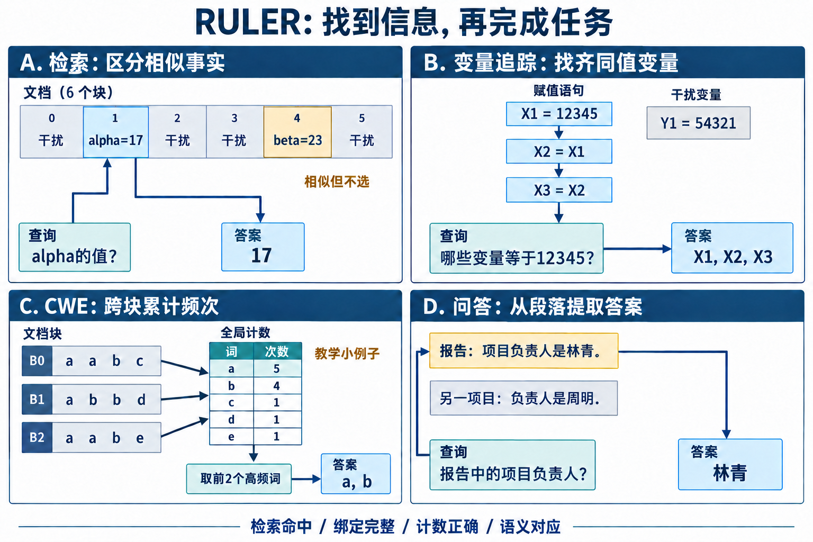

# RULER：量出真正可用的上下文

上下文窗口是系统接受输入的上限，有效上下文是模型在明确任务与阈值下仍能使用的长度。两者常被一个数字代替：模型卡写128K，服务确实能跑128K，于是读者自然以为128K范围内的信息都可可靠调用。RULER论文用17个长上下文模型、13项代表任务展示了这条推断的问题：一些模型在普通needle测试接近满分，长度增加或任务变复杂后仍会明显下降；论文评测时，宣称至少32K窗口的模型中只有约一半在32K维持作者设定的满意表现。

RULER提供的是可控生成器，重点在能力曲线而非静态排名。研究者可以固定模型，沿4K、8K、16K、32K、64K、128K扫长度；也可以固定长度，改变needle类型、数量、变量链或聚合规模。每个方向都对应Sparse Attention的一个风险：远距离证据是否被selector召回，多证据是否同时进入预算，跨块信息能否沿层传播，全局统计是否被局部候选截断。

官方仓库把配置、数据生成、推理和评估拆开，并保存不同长度与任务的结果。复现实验应沿用这种分层，同时增加稀疏模型特有的候选日志。最终答案只能告诉我们请求成功没有；候选集合、证据块、实际KV读取和full-attention对照才能解释为什么成功或失败。

## 1. 四类任务测到不同瓶颈

图1. 四类任务的教学例子, 任务分类参考RULER v3表2与第3节. A区从相似事实中选出alpha对应的值; B区沿赋值绑定确定三个同值变量; C区跨三块累计得到a=5、b=4, 再提取两个高频词; D区从问题对应的段落读取负责人. 箭头表示信息依赖, 不表示实际模型内部的串行执行. CWE小例子的词数与答案数量为教学设置, 图中没有实验成绩.

[放大查看RULER任务图](../images/ruler-tasks-v3.png)

### 1.1. 单needle与多needle检索

传统Needle-in-a-Haystack把一条目标事实插入长干扰文本，然后询问其中的值。它测到长距离定位，却可能被明显格式、唯一词和固定提问模板简化。RULER保留这一基线，并扩展needle的类型与数量。单key单value要求找到一项；多keys或多values要求区分若干相似目标，输出一个或多个对应值。 对Sparse Attention, 先把证据定义为完整事实所在的块集合 $E$, 候选 $C_k$ 也使用块编号. 单块事实的直接命中可写成:

$$
\operatorname{Hit@k}=\mathbf 1[E\cap C_k\ne\varnothing].
$$

多证据任务则需要联合覆盖：

$$
\operatorname{JointCover@k}=\mathbf 1[E\subseteq C_k].
$$

平均recall很高不代表联合覆盖高。每条样本有 $m$ 个证据，若各证据独立召回率为 $r$，联合覆盖的粗略量级是 $r^m$。$r=0.95$ 时，四证据联合覆盖只有约0.81。真实错误并不独立，但这个计算解释了多needle为何会迅速放大selector缺口。 结果要按needle数量、位置与相似干扰分桶。固定top-k时，needle增加会和干扰块争夺预算；只报告所有检索题平均分，会把预算饱和点抹平。位置分桶还可揭示稀疏图偏好最近token、sink或固定全局块。

### 1.2. Variable Tracking的链式依赖

变量追踪构造若干赋值关系, 给定一个值, 要求返回所有指向该值的变量名. 例如 $X_1=12345$, $X_2=X_1$, $X_3=X_2$, 问题要求找出值为12345的变量, 答案是 $X_1,X_2,X_3$. 其他值的绑定链构成干扰. 模型需要把分散的赋值组合起来, 还要完整输出各个别名. 可以把每条样本表示为有向图 $G=(V,A)$, 一条绑定链包含关系 $P=(a_1,\ldots,a_m)$. selector的直接路径覆盖为

$$
R_P=\frac{1}{m}\sum_{t=1}^{m}\mathbf 1[a_t\in C],
$$

直接路径覆盖为1表示所有绑定都进入所记录的候选, 任务成功还取决于信息组合与输出. 未直接命中的关系也可能通过其他位置的hidden state传来, 所以覆盖率本身不能充当成功的必要条件.记录首次缺失的路径位置，能看出路由偏向问题附近的末步，还是能均匀召回远处前提。

链长与上下文长度应分别控制。上下文变长主要增加干扰，链变长增加推理深度。两者同时扩大后掉分，无法判断是检索还是推理。实验矩阵至少包含短链/长上下文、长链/短上下文和两者都长三种格子。

Sparse图还可能让证据全在，却无法在有限层数内交换。把oracle证据强制加入每层候选后仍失败，可进一步比较周期性full层、全局token或跨层共享候选。RULER由此不只测selector，也能检查拓扑传播。

### 1.3. CWE与FWE的全局频次

**CWE要求提取一段词序列中的高频词.** 生成器设置一组出现频次较高的common words和一组低频词, 随长度增加主要扩充低频词的数量. 答案由全局计数决定, 模型需要在大量干扰词中区分两组. FWE也要求提取高频词, 但频次采用Zeta分布, 形成逐级下降的长尾. 两者都属于聚合任务.

集合交集可以作为额外的压力测试: 给定若干列表, 找出每个列表都包含的词. 每个列表贡献约束, 漏掉一个列表可能引入假阳性. 设列表集合为 $S_1,\ldots,S_m$, 答案为

$$
A=\bigcap_{t=1}^{m}S_t.
$$

稀疏候选只覆盖子集 $I\subset\{1,\ldots,m\}$ 时，理想化地只对已读列表求交集, 得到 $\hat A=\cap_{t\in I}S_t$, 此时有 $A\subseteq\hat A$。因此错误常表现为输出过多词，而非完全随机。把false positive与false negative分开统计，能验证是否符合漏读列表的机制。

固定候选预算对分散的列表约束尤其苛刻. 如果每个列表至少需要一个互不共享的候选块, 列表数超过预算后便无法直接覆盖全部列表; 多个列表位于同一块或已有摘要时, 这个下界随之变化.架构若有分层摘要或聚合token，可以先在局部块求集合摘要，再让全局层归约；纯token top-k则要付出更高预算。

任务生成还要避免词频或位置捷径。共同词若总出现在列表开头、字符形态特殊，模型可以绕开完整扫描。检查每个答案词和干扰词的位置、频次与长度分布，保持随机化并保存生成种子。

FWE的全局计数.
FWE要求返回频次最高的三个有效词, 生成器将排名第一的词设为噪声. 局部块里最常见的词未必进入全局答案, 模型需要累计跨块计数, 并遵守噪声排除规则. 稀疏attention若只看少量片段, 会得到有偏样本. 真实计数为 $c(w)=\sum_t c_t(w)$, 候选块集合 $C$ 只给出

$$
\hat c_C(w)=\sum_{t\in C}c_t(w).
$$

当selector依据query相似度选块时，某些词本身更容易被召回，$\hat c_C$ 不是均匀抽样估计。增加top-k可能改善，却没有保证排序在预算内稳定。报告答案词召回率之外，还可比较真实与估计频次排名的Spearman相关，以及第K个答案词与首个有效非答案词的频次差距。

聚合任务需要使用跨块统计, 单段检索的正确答案不能代替这项能力.RULER将这类任务放进同一长度网格，使模型无法靠一个强检索头拿到全部高分。Sparse Attention若目标应用包含日志统计、长表分析或多文档共性抽取，应单独看聚合类边界。

### 1.4. 长文档问答

RULER的第四类任务是QA. 它将短上下文问答数据中的答案段落插入同一数据集抽取的干扰段落, 再提出原问题. 问题与证据之间可能需要语义匹配, 比固定格式的key-value检索更接近自然文本. 答案段落命中后, 模型还要选择与问题对应的信息, 避免复制相似段落中的错误实体.

检索、变量追踪、聚合与问答构成四类互补任务. 单needle与多needle都属于检索类, 分别强调远距离读取、相似干扰区分和多项召回. 候选命中、信息组合与最终输出应分开观察: 找到证据后仍可能答错, 聚合也可能在不完整读取时碰巧答对. 任务定义和13项代表配置见[RULER论文v3的表2与第3节](https://arxiv.org/html/2404.06654v3#S3).

## 2. 数据生成决定测试难度

### 2.1. 长度是token长度

RULER按目标token长度生成样本。不同tokenizer会把相同字符串切成不同长度，因此数据需要用被测模型tokenizer准备，或至少记录实际输入token数。按字符数截断会让模型间的“32K”不在同一横轴。

生成器通常先构造任务内容，再填充干扰文本到目标长度。prompt模板、特殊token与答案指令也占上下文。最终送入模型的完整token数应保存；若超过模型上限发生二次截断，needle可能被直接裁掉，此时测到的是数据管线错误，无法反映长上下文能力。

长度档位宜用2倍递增，便于看拐点；边界附近再加密。Sparse模型还应加入块大小相关长度，例如 $B-1,B,B+1$ 和候选分页边界，检测尾块与索引错误。这些小shape用于正确性，不和RULER主榜平均。

### 2.2. 证据位置与深度

needle位置可以用相对深度 $d=p/L$ 表示，$p$ 为插入位置、$L$ 为上下文长度。固定 $d$ 扫长度观察绝对距离变化，固定绝对位置扫长度则观察后续干扰增加。两种设计回答的问题不同。 位置热图至少覆盖开头、中部和末端，不能只随机平均。某些模型有明显lost-in-the-middle，稀疏路由又可能偏好近邻和开头sink。平均准确率相同的两个模型，热图形状可能完全不同。 多证据任务还要记录证据跨度

$$
D_E=\max_{e\in E}p(e)-\min_{e\in E}p(e).
$$

同样四个证据，集中在一个block和分散到整段上下文，对selector与跨层传播的要求不同。结果按跨度分桶，比只按最远位置更完整。

干扰分布与答案泄漏。
合成任务最大的风险是捷径。答案字符串可能在上下文只出现一次，问题中的key又与目标句字面完全匹配；模型只需检索，无需理解。评估检索本身时这可以接受，评估复杂使用时则要加入同型干扰、相似key和无答案样本。

模板泄漏还包括固定答案前缀、固定needle语法、数字长度和标点。将训练或提示示例中的模板与测试模板分离，随机化实体名称与表述，并检查模型在移除上下文后是否仍高于随机。无上下文基线异常高时，测试已经泄露。

Sparse selector可能直接利用模板词召回目标，这仍是端到端系统的一部分，但会高估面对真实改写的泛化。为同一语义生成若干表述变体，比较候选集合Jaccard与答案稳定性，可测路由是否过度依赖表面形式。

生成种子与样本身份。
每条样本保存任务名、长度、复杂度参数、生成种子、证据位置、答案和文本哈希。改变模型或attention实现时复用相同样本，才能做逐样本配对。重新随机生成两套数据会把样本难度混进模型差异。

官方仓库的配置与结果目录提供了基本骨架。扩展Sparse字段时不要改写原始答案或任务ID；另存候选日志、块映射和运行配置。这样既能用官方评分器，又能追踪路由。

数据生成版本也要固定。仓库更新可能调整模板、任务组合或默认长度，结果表应记录commit。若需要与论文数值对照，使用论文对应版本；若评当前模型，使用新版也可以，但不要把两套结果直接拼成趋势。

数据集还要做静态审计。对每个任务统计实际token长度、答案出现次数、证据到问题距离、证据跨块数、干扰项相似度和截断比例。任何一项在不同长度档位发生系统变化，长度曲线都会混入生成分布变化。保存这些统计，并对异常样本设验证门槛。 生成文本可在模型无关阶段检查答案唯一性。单needle保证目标值与干扰值不冲突；CWE验证高频词集合与标注一致, 扩展的列表交集题另行验证交集；Frequent Words检查最高频是否存在未约定的并列。程序生成并不天然正确，尤其扩展模板和词表以后，单元测试应先于大规模推理。

## 3. 有效上下文长度如何计算

### 3.1. 一条长度—性能曲线

对任务集合 $T$、长度 $L$，宏平均分为

$$
S(L)=\frac{1}{|T|}\sum_{t\in T}S_t(L).
$$

若不同任务样本数不同，micro平均会让大任务占更高权重；宏平均让每个任务等权。两者都可报告，主结论必须说明采用哪一种。RULER官方结果按长度展示任务聚合分，单项结果仍需保留。

曲线不一定单调。随机样本、解码波动或某档模板差异可能让32K略高于16K。不要只取第一次低于阈值就结束；给每点置信区间，必要时用单调回归估计总体趋势，同时保留原始值。

Sparse模型还要在每个预算 $k$ 下得到 $S(L,k)$。有效长度是一条随预算变化的前沿，而非一个数字。预算翻倍只带来很小质量改善时，瓶颈可能已经转到主干；质量随预算快速恢复则说明selector覆盖不足。

### 3.2. 阈值定义

一种定义是固定绝对门槛 $\tau$：

$$
L_{eff}(\tau)=\max\{L:S(L)\ge\tau\}.
$$

另一种以短长度得分 $S(L_0)$ 为基线，要求保留比例 $\rho$：

$$
L_{eff}(\rho)=\max\{L:S(L)\ge\rho S(L_0)\}.
$$

绝对门槛便于跨模型解释，相对门槛减少短上下文本体能力差异。一个弱模型可能在所有长度都低但曲线平，相对门槛会给出很长有效长度；因此应同时报告短基线和绝对分。 阈值附近的不确定性会影响 $L_{eff}$。如果32K置信区间跨过门槛, 可写明16K已通过、32K尚不能确认; 区间跨阈值本身不能证明边界恰好落在这两个长度之间.增加该档样本数，可缩小区间。

任务权重与最差项。
总分取决于任务权重。检索任务多、聚合任务少时，一个擅长检索的模型会被评得更长。可以按四类任务等权，再在类内平均；也可以根据目标业务加权。公开报告至少给出原始宏平均，业务权重另列。 最差类边界

$$
L_{robust}=\max\{L:\min_c S_c(L)\ge\tau_c\}
$$

更严格，却能防止某类能力完全崩溃仍被平均分遮住。对通用长上下文模型，宏平均与最差类一起看；对明确只做检索的系统，可以说明聚合不在目标范围，而不是悄悄从任务表删除。 还可计算退化斜率，例如相邻对数长度上的差

$$
g(L)=\frac{S(2L)-S(L)}{\log 2}.
$$

拐点和斜率有时比单一有效长度更能比较两种Sparse预算策略。

置信区间与配对比较。
准确率每格有 $n$ 条样本，可用二项区间描述单点不确定性；多任务宏平均更适合按样本或任务分层bootstrap。比较full和sparse时，两者运行同一批样本，bootstrap应重采样配对差值

$$
\Delta_i=y_i^{sparse}-y_i^{full},
$$

而非分别重采样两个均值。配对能消除样本固有难度的一部分方差。 生成任务若允许多个答案格式，评分器本身会产生噪声。保存原始输出与规范化后答案，抽样人工复核exact match失败。修改抽取规则后重跑评分即可，不必重新推理。 对多个长度、任务、预算同时寻找“最好配置”会引入选择偏差。开发集选择预算，独立测试集报告结果；或明确所有网格都是探索性结果，不把最高点当无偏估计。

曲线汇总还应保留运行失败。输入被服务拒绝、OOM、超时和成功但答错是四种状态。把前三种填成0会把系统可行性与模型质量混在一起；把它们直接删掉又会产生幸存者偏差。主质量分只在成功完成的请求上计算，同时另报完成率，并给端到端可用率 $A(L)=P(\text{完成})P(\text{正确}\mid\text{完成})$。 长度档位之间使用相同任务构成和相近样本难度。若128K为了成本只跑容易任务，平均曲线会虚高。确实需要子集时，从固定任务内抽样并在所有长度复用相同规则，结果标题明确标成子集。

## 4. Sparse Attention专用配对实验

### 4.1. Full、oracle与真实路由

同一checkpoint运行三条路径。Full attention给出完整合法连接下的参照；oracle sparse把标注证据块和必要局部块强制加入候选；真实sparse使用selector输出。三者的逐样本结果记为 $Y_F,Y_O,Y_R$。

若 $Y_F=0$，该题无法证明稀疏路由有问题。若 $Y_F=1,Y_O=0$，这一证据候选配置仍未完成任务，需要进一步比较候选规则、预算和传播；若 $Y_O=1,Y_R=0$, 候选替换恢复了这条样本, 可继续检查证据漏选、干扰竞争与预算差异；三者都成功则是可安全节省的样本。

用四格或八格计数比只报均值更有解释力。特别关注full成功、oracle成功、real失败的比例，它标出可继续检验候选替换能否恢复的样本；full成功、oracle失败还需通过候选替换与层组干预区分问题。

### 4.2. 候选覆盖指标

证据标注映射到token与block后，记录Evidence Recall

$$
R_E=\frac{|E\cap C|}{|E|},
$$

Joint Coverage、候选精度、候选块数和实际KV token数。不同块大小下，命中同一证据所带入的无关token不同，必须同时报token预算。

Variable Tracking用路径覆盖，CWE比较候选内计数与完整序列计数，Frequent Words更难定义有限证据，可把所有包含目标词及主要竞争词的块视为诊断集合，或者直接比较候选内频次估计与全上下文真实频次。指标要贴合任务结构。

selector分数还能画校准曲线：高分候选是否更常含证据。只看Recall@k无法判断扩大k以外的改进空间；良好校准可支持动态预算，在置信度低时多取块。

层级候选与传播。
动态Sparse Attention每层候选可能不同。只保存末层会漏掉证据已在早层进入、随后通过hidden state传播的情况。日志可按层或层组保存证据命中、候选Jaccard和首次命中层。 定义层联合覆盖

$$
R_{union}=\frac{|E\cap(\cup_l C_l)|}{|E|},
$$

以及持续覆盖，即证据在多少层保留。联合覆盖高而任务失败，可能是传播路径太长或信息被后续层稀释；持续覆盖低则可尝试跨层共享候选。 日志体量很大时，只保存证据相关布尔值、每层top-k摘要和固定抽样请求的完整索引。评测模式可以牺牲少量速度换诊断，正式性能跑再关闭详细日志，两次使用相同样本与配置。

预算—质量—成本前沿。
对每个 $(L,k)$ 记录分数、实际KV读取、attention FLOPs、TTFT/TPOT和峰值显存。有效候选数可能因去重、fallback和块向上取整不同于名义top-k，横轴优先用实际读取token或字节。

配置A若质量不低于B且成本更低，B被支配。保留Pareto前沿，避免用任意加权总分掩盖交换。业务SLO再从前沿选点，例如准确率至少90%、P99 TPOT不超过某值。

长度增加时重新画前沿。固定k的稀疏率越来越高，质量可能下降；固定保留比例则成本随长度增长。合理策略可能是局部窗口固定、检索候选缓慢增长、少数全局token固定，这些分量应分别记录。

候选覆盖之外，还要看无关内容注入。selector扩大预算时通常提高recall，也把更多相似干扰带进softmax。定义证据密度 $D_E=|E|/|C|$ 或按token计算的有效证据比例，和JointCover一起画。覆盖已饱和、质量却随预算继续变化，可能是干扰竞争或主干对更多上下文的适应问题。

full attention也不是永远更高的经验结果保证。稀疏图可能滤掉干扰，让某些样本反而答对。配对表保留 $Y_F=0,Y_R=1$ 的方向，分析它们是否稳定来自去噪，还是生成随机性。只统计Sparse相对Full的净下降会丢掉这一类机制。

## 5. 运行官方流程与避免偏差

### 5.1. 配置、生成、推理、评分分离

官方仓库将任务配置和不同模型运行脚本分开。先生成或准备指定长度数据，再运行模型推理，末尾用任务评分器汇总。分离让同一数据可用于full/sparse配对，也方便只重跑评分。

每次运行保存模型标识、checkpoint哈希、tokenizer、最大长度、rope配置、chat template、dtype、attention实现、解码参数和仓库commit。Sparse再加selector checkpoint、块大小、top-k、fallback、层配置与kernel版本。

不要用模型名猜chat template。指令包装会占token并改变模型理解，错误模板可能造成全长度低分。短长度基线先达到合理水平，再解释长长度退化；4K就失败通常不是长上下文问题。

### 5.2. 输出解析与评分

RULER论文使用目标答案在输出中出现的recall-based accuracy. 自定义回归可以另加exact match或集合precision, 防止冗余输出掩盖问题, 同时保留官方分数.模型可能加解释、改变分隔符或顺序，评分器需按任务语义规范化。多答案任务要明确顺序是否重要，集合输出可忽略顺序, 变量追踪则要求找出所有相关变量名。

限制最大生成长度，防止冗长输出拖慢系统并污染评分。温度设为0或确定性解码便于配对；若研究采样稳定性，固定多个种子并把方差单列。不同模型使用不同stop tokens时，记录实际停止原因。

解析失败要单独计数。它可能来自模型不会答，也可能来自模板/评分bug。抽查每类失败，修评分器后对所有系统同样重算，不能只修某个模型的格式。

公平比较attention实现。
Full与Sparse必须共享checkpoint、prompt、token序列和解码。位置编码、量化、batch、KV dtype或采样只要不同，就无法把差异归因给attention。Sparse所需selector若改变hidden states或训练权重，应标为不同模型比较，而非纯推理替换。

性能运行与质量运行可分开，但shape分布必须一致。质量用batch 1、性能用大batch时，候选和kernel路径可能变化；至少在一组共同shape上验证输出一致。动态batch还会改变padding与文档mask。

Full attention无法运行超长档时，不能把Sparse成功直接记为相对质量胜利。可以报告Sparse绝对分与资源可行性，同时把末尾可运行的full长度作为配对范围。OOM、超时和输入拒绝要分别记录。

污染、模板与版本。
RULER是程序生成任务，传统训练数据污染风险低于固定问答集，但模型可能见过任务模板或专门训练过类似合成数据。模板改写、实体词表替换和新随机种子能检查泛化。官方分数与自定义模板分数分栏，避免失去可比性。

仓库排行榜会随模型和配置更新。论文原始结论对应当时17个模型和版本，当前README可能包含更多新模型。引用结果时标注来源日期或commit，不把后续表格误写成论文实验。

“有效长度”还依赖任务阈值。若复刻官方定义，保持任务集合与阈值；若为Sparse Attention设计更严格的多证据权重，给新指标单独命名。二者都可用，不能混用同一列标题。

运行器要防止位置配置不一致。模型最大长度、RoPE scaling、推理框架的cache上限和数据目标长度四者必须同时检查。请求虽然没有报错，也可能被框架静默截断或使用错误position IDs。保存最终input IDs长度和首尾哈希，随机样本再核对needle仍在输入中。 并行推理时，sample ID与输出不能依赖完成顺序。长样本耗时不同，异步收集若按列表位置拼接，容易把答案错配。输出文件每行携带唯一ID，评分前检查缺失、重复与配置哈希；重试请求保留attempt字段，并约定采用哪一次。

## 6. 从曲线定位失败并形成回归

### 6.1. 四种典型曲线

所有任务随长度同步下降，先查位置外推、训练长度和总体注意力容量。检索保持、追踪与聚合下降，说明单点召回尚可，多证据或传播不足。Full稳定而Sparse下降，重点查selector预算与稀疏拓扑。两者都稳定但系统超时，则是kernel、cache或调度问题。

只有中部位置下降形成U形热图，检查lost-in-the-middle与候选偏置；只有块边界下降，检查token到block映射、partial block和尾部padding；多卡才下降，检查分片后的全局索引。

扩展集合交集题输出过多候选, 可检查是否漏读约束列表；输出总是局部最高频词，符合只见部分块。错误形态与任务代数结构对应，比一句“推理能力不足”更可操作。

### 6.2. 最小回归集

完整RULER运行昂贵，可从每类任务挑代表case，覆盖4K、目标长度、极限长度，证据放开头/中部/末端，并包含多证据与聚合。每次kernel或selector修改先跑最小集，发布前再跑全网格。 最小集固定样本ID和token化结果，保存full基线logits或答案、证据块与预期候选属性。kernel修改重点检查数值一致，selector修改允许候选变化但要过质量门槛。 回归门槛包含总体分、每类最低分、full-sparse差、JointCover与P99延迟。只设总分门槛可能让一个任务退化被另一任务提升抵消。

发布表怎样呈现。
主表按长度列出四类任务和宏平均，附有效长度定义。第二张表按候选预算列出质量、JointCover、实际KV比例、TTFT/TPOT。位置热图和失败四格放在附录或交互产物中。 每个数字链接到逐样本结果、配置和日志摘要。表中使用“未运行”“OOM”“超时”“低于阈值”不同标记，不能都填0。0分是模型完成评测却全错，语义完全不同。 结论写成条件句：在某checkpoint、某任务集合、某阈值、某预算下，有效长度落在哪个区间。上下文能力依赖这些条件，条件写全以后，数字才可复查。

一次64K Sparse验收。
选择4K、16K、32K、64K四档，每档运行13项代表任务和固定样本数。先用full attention取得可运行范围内基线，再运行oracle sparse与三个候选预算。保存证据token区间、block映射、每层命中和实际KV读取。

质量侧计算每任务准确率、四类宏平均、JointCover、路径覆盖与配对差值区间；系统侧记录数据准备外的TTFT、TPOT、峰值显存和selector/build/kernel分解。有效长度同时给绝对阈值与相对4K保留率。

失败样本按 $Y_F,Y_O,Y_R$ 分组抽查。selector漏选回到召回与预算，oracle也失败回到拓扑传播，full也失败则归入底座能力或prompt。完成这一步，RULER才从一张长上下文分数表变成Sparse Attention的诊断工具。

验收还可加入层组回退：每隔若干层替换为full attention，或只在失败样本上启用。若少量full层显著修复oracle sparse，说明候选已在但传播受阻；若没有改善，回看证据表示、位置外推和主干推理。回退实验只用于定位，性能结论仍使用正式部署配置。

同一批样本再进行一次提示改写和needle实体替换。候选覆盖与准确率若大幅波动，说明系统依赖模板词。把这组稳健性差异列入发布附件，可防止RULER主模板上的优化被误认为普遍长上下文能力。

最终产物包括数据manifest、逐请求结果、候选摘要、聚合脚本输出、硬件软件配置和失败样本包。任何聚合数字都能追到样本，任何失败都能在相同token序列上切换full/oracle/real复现，评测才真正形成回归资产。

还可以把64K验收拆成两天。第一天只跑数据静态检查、小shape语义、4K与16K，确保模板、tokenizer、评分和候选日志正确；第二天再运行32K与64K大档。长跑结束才发现答案抽取错误，是最昂贵也最常见的浪费之一。每一阶段输出manifest校验和，后续阶段只接受已验证数据。

对每种预算，抽取三组代表样本：full与sparse都成功、full成功但sparse失败、sparse成功但full失败。第一组检查节省是否真实，第二组定位损失，第三组研究去噪或随机波动。每组保留prompt、答案、候选块、层级命中和必要的attention统计，形成可阅读的casebook。

有效长度的发布门槛可写成机器可执行条件。例如：四类宏平均不低于80%，任何一类不低于65%，相对full下降的95%置信区间下界不低于-3个百分点，完成率至少99%，P99延迟满足SLO。门槛随业务调整，但必须在看测试集之前确定，避免结果出来后移动标准。

跨版本比较采用同一数据manifest和评分器镜像。新版本如果更换tokenizer或chat template，标记为新评测系列，不把曲线直接续在旧图上。attention实现升级而模型不变时，先通过logits与候选契约测试，再解释质量变化；理论上纯kernel替换不该带来显著任务提升。

RULER的合成结构使它适合自动回归，也限制了它能证明的范围。真实长文档包含指代、表格、章节结构和开放式生成，证据边界没有程序化任务那样清楚。通过RULER说明基础长程操作没有退化，再用真实任务验证外部有效性，二者构成更完整的发布证据。 多语言模型还需检查任务语言。英文模板上的有效长度不能自动外推到中文或低资源语言，tokenizer压缩率、指令理解和训练长度分布都会变化。可以翻译任务逻辑并由母语者检查模板，长度仍按各模型token计；不同语言分开报告，避免宏平均掩盖资源差异。

模型量化也应作为独立变量。权重量化、KV量化和低精度attention可能随长度累积误差，Sparse又改变softmax候选数。先在full attention下测量量化损失，再在Sparse下配对；若两者交互显著，增加高精度online softmax或关键层回退实验，不把全部差异归给selector。

部署中的prefix cache会改变系统成本，却不改变任务答案语义。质量运行可以禁用cache保证独立，性能运行按真实命中率混合，并分别报告cold与warm。否则重复RULER前缀带来的异常高命中会让吞吐失真，尤其在固定模板批量评测时。

超时阈值要按长度公开。统一短超时会让长档大量中断，形成看似质量下降；无限超时又无法代表服务。记录实际耗时和停止原因，在SLO内完成率与无时限质量两张表中分别呈现，模型能力和系统可用性都不会丢失。

如果selector本身使用问题token生成索引，问题放在上下文开头还是末尾也会影响候选。RULER模板通常有固定布局，扩展实验可以交换指令位置，并保持语义不变。候选覆盖随布局大幅变化，说明路由依赖query表示的构造位置，需要在真实服务prompt中重新验证。

经过这些控制，所谓“有效上下文”不再是模型卡上的第二个窗口数字，而是一组可复查曲线：哪类操作、多少证据、怎样的位置、哪档预算、什么完成率和成本。Sparse Attention的价值也能精确落点——它在哪些格子保住full质量，在哪些格子因候选或传播失败，又在哪些长度首次带来实际系统收益。

回归负责人可以从曲线异常格进入对应样本：依次检查请求是否完成、full是否会做、oracle是否修复、证据是否进入候选，随后检查层级传播与kernel。每一步都有明确观测量，定位无需依赖对一条生成文本反复猜测。RULER在这里是一把可配置的尺子，所有结论都附带任务条件。 这套记录还能复查边界移动的原因：样本不变而候选覆盖提高，归因到路由；覆盖不变而oracle质量提高，归因到主干或拓扑；质量不变而完成率、延迟改善，归因到系统实现。版本收益落到具体层级，后续优化才有连续依据。

### 6.3. 有效上下文的统计条件与长度混杂

有效上下文是一个带条件的统计量。

**能力、系统与评测过程共同决定曲线.**

一次RULER观测可以写成

$$
Y=f(M,A,D,P,L,Z),
$$

其中 $M$ 是模型与checkpoint, $A$ 是attention和路由配置, $D$ 是任务生成分布, $P$ 是prompt与解码协议, $L$ 是长度, $Z$ 包含随机种子和运行状态. 因此“有效上下文为32K”省去了大量条件. 它真正表示：在指定任务、阈值、prompt、解码和系统完成率下, 某个配置的曲线末次保持在门槛上方. 更严格的记法是

$$
L_{eff}(M,A;D,P,\tau)=\sup\{L:\mathbb E[Y\mid L]\ge\tau\}.
$$

更换任务分布或阈值后, 数字自然变化. 单needle上的128K与聚合任务上的32K可以同时成立, 没有逻辑矛盾. 报告必须把条件写在数字旁边, 才能避免把一条评测曲线升级成模型的固有常数. 系统失败也属于条件. 若服务在128K有20%请求超时, 剩余请求准确率90%, 只报成功样本准确率会给出90%, 端到端成功且正确的比例只有72%. 模型研究可以分开报告条件准确率和完成率, 产品决策则更关心二者乘积.

**离散长度网格与连续边界.**

RULER常在4K、8K、16K、32K等离散点运行. 若16K通过阈值而32K失败, 可报告两个档位的结果. 只有另加该区间总体单调的假设, 才能把连续长度边界估计在 $[16K,32K)$; 离散观测无法排除其他长度重新通过门槛. 把末尾通过档位写成16K是一种保守标签, 它受网格粗细影响.

若需要更精确边界, 可以在跨阈值区间二分增加长度点. 每次增加档位都要保持任务分布、样本数量与生成规则一致. 只在边界附近换成更容易的样本会让插值失真. 对运行昂贵的模型, 先用粗网格定位, 再在一两个区间加密最节省预算. 曲线可能非单调, 二分需要一个总体单调假设. 可以对各点均值做加权单调回归, 权重由样本量或方差决定, 得到平滑估计 $\hat S_{mono}(L)$. 原始点与平滑点都要保留; 单调化用于估计边界, 不能抹掉真实的模板或位置异常.

**阈值应绑定实际损失.**

论文中的满意阈值用于统一比较, 业务阈值则应来自错误成本. 如果长上下文用于候选检索, 漏掉一条关键法规的代价可能很高, 要求Joint Coverage接近1; 如果用于辅助摘要, 少量遗漏可能可接受. 相同80%平均分不代表相同可用性. 可将任务错误成本写成 $c_t(y,\hat y)$, 长度 $L$ 的风险为

$$
R(L)=\sum_t w_t\,\mathbb E[c_t(Y,\hat Y)\mid L].
$$

有效长度改为满足 $R(L)\le r_{max}$ 的最大长度. 这种定义能表达多证据漏一项与答案格式轻微偏差的不同代价. 公共榜单仍可使用统一准确率, 业务验收另列风险权重, 两者不要混成一个不可复现数字. 阈值还应预先确定. 看完所有模型曲线后选择刚好突出某模型的门槛, 会产生研究者自由度. 可以在开发集或旧模型上确定阈值, 锁定后评新checkpoint; 探索性图则展示完整曲线, 不必强行压成一个边界.

**多维有效区间比单数字更完整.**

RULER同时改变长度和任务复杂度. 设多needle数量为 $m$, 变量链长为 $d$, 聚合答案词数为 $a$, 稀疏预算为 $k$. 能力区域可以写成

$$
\mathcal C_\tau=\{(L,m,d,a,k):S(L,m,d,a,k)\ge\tau\}.
$$

单一 $L_{eff}$ 是在固定其他维度后对这个区域的一条切片. 两个模型可能在简单任务上的长度相同, 一个随复杂度增加迅速收缩, 另一个保持稳定. 只报长度会丢掉这项差异. 实际呈现可用二维切片. 横轴长度, 纵轴needle数或链长, 颜色表示得分; 对Sparse Attention再分别画几个预算. 等高线显示满足阈值的区域. 这比给每个模型一个“真实长度”更接近其可用边界, 也能看出增加预算是在扩展长度还是复杂度.

四类任务的误差可以继续分解。

**检索题包含定位、绑定与输出三个阶段.**

单needle表面上只需复制一个值, 实际至少含三步. 定位阶段从干扰中找到needle句; 绑定阶段把query key与对应value关联; 输出阶段遵循指定格式生成value. 失败答案可以按这三类归因: 完全无关内容多半未定位, 输出另一个needle的value属于绑定混淆, 找到正确值却带多余文本属于格式问题. Sparse候选日志只直接解释定位上限. 目标块未被当前查询直接读取时，还可能由其他位置的hidden state间接传来信息；只有相关信息的所有传播路径都被切断，才能断言它不可用; 目标块命中后答错, 还可能是绑定或输出. 可以加入oracle输出提示测试格式能力, 或把命中needle句直接放到query旁测试绑定. 这两个低成本对照能避免把所有exact match失败都归给selector.

多needle还有顺序问题. 任务要求按query key顺序输出时, 模型即使找齐所有值, 排序错误也会失分. 集合准确率、顺序准确率和exact match分开统计, 能区分覆盖与序列组织. 如果应用只关心集合, 评分规则也应与需求一致.

**Variable Tracking可以按第一处断链定位.**

路径 $v_0\leftarrow v_1\leftarrow\cdots\leftarrow v_d$ 中, 每条赋值都可视为一条有标签边. 对错误样本, 依次询问或探测每个中间变量, 找到模型首次给错的节点 $t^*$. $t^*=1$ 表明query附近绑定就失败, 较大 $t^*$ 表明前几跳成功后状态丢失. 候选日志则记录每条边首次进入哪一层. 若边$a_t$未直接命中，需要再检查是否已由其他位置或较早层传播，不能仅据候选日志确认断链; 全部命中而中间探针失败, 主干组合更可疑. 若较早边只在很浅层出现、后续边只在很深层出现, 两者可能没有足够层数相遇, 即便层联合覆盖为1也会失败.

可以在逐层一步传播的教学模型中检查时序可组合覆盖. 设 $\mathcal L_t$ 为第 $t$ 条关系可供相关计算节点读取的层集合, 前一步的状态必须在后一步读取之前产生. 相应的日志诊断量为

$$
C_{order}=\mathbf 1[\exists\ell_1<\ell_2<\cdots<\ell_d,\;\ell_t\in\mathcal L_t],
$$

这里检查的是一条特定传播路径是否具有可行的层序列. 首次命中层逆序时, 后面的重复命中仍可能提供有效组合机会; 同层的多个读取也不能直接当作串行多跳. 真实网络还有其他位置、head和残差中的传播路径, 日志判定需要结合它们, 并用中间状态探针验证信息是否真的组合成功.

**扩展集合交集题应区分漏列表与词项混淆.**

对真实交集 $A$ 和预测 $\hat A$, precision下降通常表示模型漏读某些排除该词的列表, recall下降则可能漏读答案词在某些列表中的出现或输出截断. Jaccard

$$
J(A,\hat A)=\frac{|A\cap\hat A|}{|A\cup\hat A|}
$$

比exact match提供连续误差, 但最终榜单是否接受部分分要保持官方协议. 对每个false positive词 $w$, 找出哪些列表不包含它. 如果这些列表的块未进入候选, 错误与路由一致; 如果已进入, 主干集合计算失败. 对false negative也检查包含该词的列表覆盖. 这种逐词反事实把候选召回与集合推理连接起来. 列表顺序随机化可以测位置偏差. 保持内容不变, 只置换列表顺序, 正确答案不变. 输出变化说明模型依赖位置或后近性. 对Sparse路由, 同时比较候选集合变化, 能判断偏差来自selector还是主干.

**Frequent Words要关注频差而非只有长度.**

对按频次排序的有效词, 第 $K$ 个答案词与第 $K+1$ 个词的计数差

$$
\Delta_c=c(w_{(K)})-c(w_{(K+1)})
$$

决定鲁棒性. 当 $\Delta_c$ 很小, 漏读少量块就会翻转排名; 差距大时, 不完整读取也可能答对. 不控制频差, 长度档位之间的难度会随随机生成波动. 可以按归一化间隔 $\Delta_c/N$ 或相对间隔 $\Delta_c/c(w_{(1)})$ 分桶. Sparse模型若在小间隔显著退化, 说明候选抽样带来的计数方差超过信号; 大间隔也失败, 覆盖或基本计数能力可能不足. 还可以构造保持全局计数相同、改变局部分布的配对样本. 一种让最高频词均匀分散到所有块, 另一种集中在少数块. 局部selector对集中版本更容易成功, 分层聚合应对两者更稳定. 这组对照直接检验模型是否真正做全局累计.

Tokenizer、位置和解码会怎样混入长度效应。

**同一个字符长度对不同模型并不公平.**

不同tokenizer对英文、数字、代码和随机字符串的切分比例不同. 若先生成固定字符数再让各模型tokenize, 实际token长度、证据位置和干扰数量都不同. RULER按token长度配置的意义就在于让每个模型面对相近计算长度, 但这也意味着模型看到的原始字符内容可能不同. 跨模型比较有两种公平目标. 固定token长度比较模型在相同上下文预算下的能力; 固定原始文本比较它们处理同一信息量的能力. 两者不能同时完全满足. 公共RULER通常选择前者, 应记录tokenizer和最终token数; 面向真实文档的业务评测可补充后者.

随机key或value的字符形式也会影响切分. 一个模型把标识符切成一个token, 另一个切成十个, 复制难度不同. 可选择各tokenizer都较稳定的词表, 或报告答案token长度分布并做分桶. 这比假设随机字符串天然模型无关更可靠.

**绝对位置与证据距离是两个变量.**

把needle放在相对深度50%并增加总长度时, 它的绝对位置和到末尾query的距离同时增长. 模型退化可能来自位置编码外推, 也可能来自远距离传播. 要拆开二者, 可以移动query位置或改变needle后的干扰长度. 固定needle与query距离 $d$, 同时把二者整体向后平移, 测绝对位置影响; 固定needle绝对位置, 向后移动query, 测距离影响; 固定两者再增加无关前缀或后缀, 测候选规模与干扰. 三个实验共同构成位置诊断.

对RoPE模型, 超出训练位置后的相位行为可能在某个绝对位置突然恶化; 对局部Sparse图, 误差更可能随图距离逐步增加; 对selector容量不足, 增加干扰块数会在固定距离下掉分. 曲线形状能帮助区分机制.

**Prompt与chat template会消耗窗口并改变注意力.**

系统提示、角色标记、few-shot示例和输出说明都占token. 服务报告的输入长度若只统计RULER正文, 实际模型序列可能更长. 当接近最大窗口时, 模板会导致截断; 证据位于开头时尤其容易被裁掉. Chat template还会改变query位置与特殊token. 某些模型依赖训练时模板保持指令遵循, 去掉模板虽节省长度却会降低短基线. 公平比较应使用各模型推荐模板, 同时记录最终序列长度. 若研究attention机制, 在同一模型内保持模板固定.

Prompt措辞可能改变selector. Query中的关键词更显著时, 内容路由更容易召回needle; 改写后候选集合变化可能很大. 每个任务保留多种等价措辞, 能测端到端鲁棒性. 模板版本应进入样本身份, 防止不同运行混用.

**解码配置会影响看似确定的准确率.**

RULER答案通常短且可确定, 适合greedy或温度0解码. 使用采样会增加不必要方差; 不同max tokens可能让长列表答案被截断; stop sequence过早命中会造成格式失败. 解码协议应固定并记录. Exact match对空格、大小写、标点和顺序敏感. 官方评分器通常含任务特定规范化, 自定义模型适配器要保留原始输出. 如果解析器只取第一行, 模型先输出解释再给答案会被判错; 修改prompt迫使短答与修改解析规则是两种不同干预.

比较full与sparse时最好使用确定性解码和相同logits处理. 若系统只能采样, 为每条样本使用相同随机种子仍不能保证配对路径一致, 因为早期logit微差会改变后续token. 可以改用目标答案对数似然或多次采样估计, 并明确指标变化.
